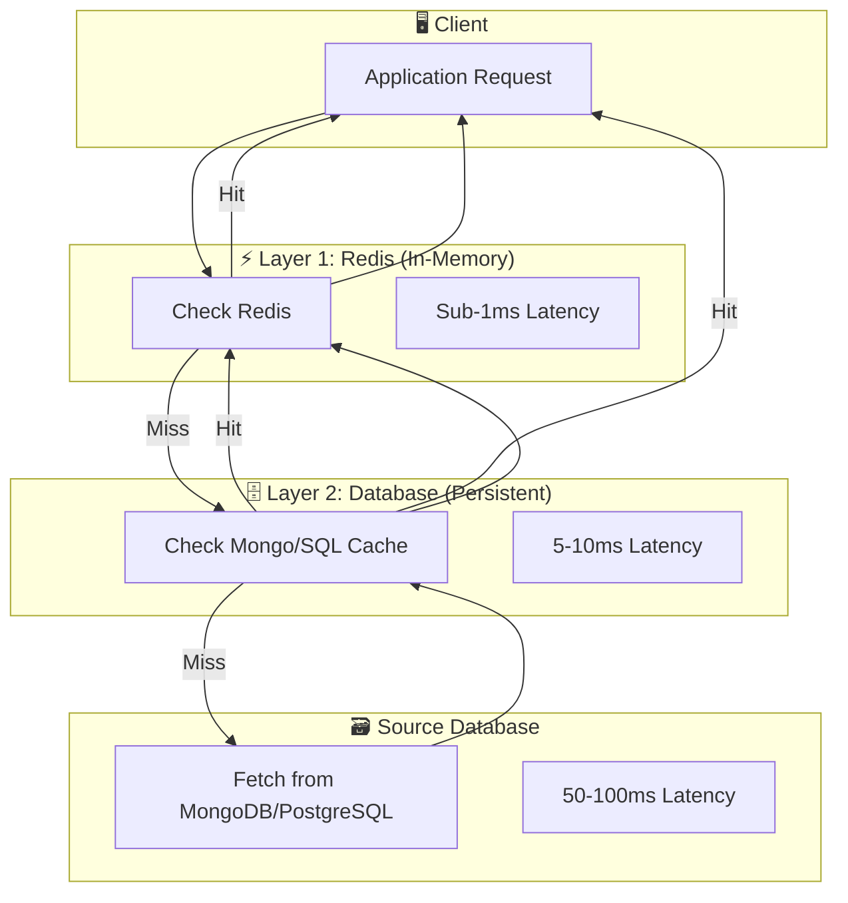

# Cache System

## Overview

SveltyCMS implements a **dual-layer caching system** combining **Redis** (L1: in-memory) and **Supported Databases** (L2: persistent storage) to deliver sub-millisecond data access. The system features sophisticated TTL (Time-To-Live) management, predictive prefetching, and real-time performance monitoring.

## Architecture

### Dual-Layer Strategy


```mermaid
graph TD
    subgraph Browser["🖥️ Client"]
        A["Application Request"]
    end

    subgraph L1["⚡ Layer 1: Redis (In-Memory)"]
        B["Check Redis"]
        B1["Sub-1ms Latency"]
    end

    subgraph L2["🗄️ Layer 2: Database (Persistent)"]
        C["Check Mongo/SQL Cache"]
        C1["5-10ms Latency"]
    end

    subgraph Source["🗃️ Source Database"]
        D["Fetch from MongoDB/PostgreSQL"]
        D1["50-100ms Latency"]
    end

    A --> B
    B -- Hit --> A
    B -- Miss --> C
    C -- Hit --> B
    C -- Hit --> A
    C -- Miss --> D
    D --> C
    C --> B
    B --> A
```

### Cache Hierarchy

1.  **L1: Redis (Volatile)**: Ultra-fast storage for session data and hot content. Automatic eviction via LRU.
2.  **L2: Database (Persistent)**: Cross-restart persistence using the system's primary database (MongoDB, MariaDB, etc.).
3.  **Source DB**: The authoritative source of truth, accessed only on full cache misses.

---

## 8 Cache Categories

The system categorizes cache entries to apply specialized TTL strategies:

| Category    | Default TTL | Description                                      |
| :---------- | :---------- | :----------------------------------------------- |
| **SCHEMA**  | 10 min      | Collection definitions and field schemas         |
| **WIDGET**  | 10 min      | Widget configurations and settings               |
| **THEME**   | 5 min       | Design system tokens and UI themes               |
| **CONTENT** | 3 min       | Frequently updated collection entries            |
| **MEDIA**   | 5 min       | File metadata and thumbnail paths                |
| **SESSION** | 24 hours    | User authentication and preferences              |
| **USER**    | 1 min       | User profile and permission data                 |
| **API**     | 5 min       | External service responses and expensive queries |

---

## Core Infrastructure

### CacheService (`cache-service.ts`)

The `CacheService` orchestrates the dual-layer logic and integrates with the system settings for dynamic TTL updates.

```typescript
export enum CacheCategory {
	SCHEMA = 'schema',
	WIDGET = 'widget',
	THEME = 'theme',
	CONTENT = 'content',
	MEDIA = 'media',
	SESSION = 'session',
	USER = 'user',
	API = 'api'
}

// Example usage
await cacheService.setWithCategory('user:123', userData, CacheCategory.USER, tenantId);
```

### Cache Metrics (`CacheMetrics.ts`)

Real-time monitoring tracks hit rates and latency across all categories and tenants.

- **Hits/Misses**: Tracked per category and tenant.
- **Hit Rate**: Overall efficiency target > 90%.
- **Response Time**: Continuous monitoring of L1/L2 overhead.
- **Prometheus Export**: Native support for Grafana dashboards.

### Predictive Warming (`CacheWarmingService.ts`)

Proactive caching reduces "cold start" latency:

- **Startup Warming**: Pre-loads schemas and system settings.
- **Predictive Prefetching**: When a `user` is fetched, the system automatically prefetches their `permissions` and `roles`.
- **Background Execution**: Warming tasks run in parallel without blocking user requests.

---

## Implementation Reference

### Cache Store Methods

```typescript
import { cacheService } from '@src/databases/cache-service';

// Set cache value with category (recommended)
await cacheService.setWithCategory('key', data, CacheCategory.API);

// Set with explicit TTL (seconds)
await cacheService.set('key', data, 3600);

// Pattern invalidation
await cacheService.deletePattern('query:collections:*');

// Category invalidation
await cacheService.invalidateCategory(CacheCategory.SCHEMA);
```

### Monitoring & Debugging

Admin users can monitor cache performance via **System Settings > Cache**:

1.  **Cache Stats**: View real-time hit/miss ratios.
2.  **TTL Settings**: Adjust category lifespans without restarting.
3.  **Clear Cache**: Manual flush for maintenance.

---

## Performance Benchmarks

Typical production metrics (Steady State):

| Operation            | L1/L2 Cache Latency | Status              |
| :------------------- | :------------------ | :------------------ |
| **Get User**         | < 10ms              | **High Perf**       |
| **List Collections** | 1.2ms               | **Sub-ms Response** |
| **Search Content**   | 2.5ms               | **Optimized**       |
| **Dashboard Load**   | 5ms                 | **Ultra-Fast**      |

---

## Related Documentation

- [Authentication System](./authentication-system.mdx) - Session caching details
- [Database Methods](../database/database-methods.mdx) - Low-level DB interactions
- [Multi-Tenancy](./multi-tenancy.mdx) - Tenant isolation in cache keys
