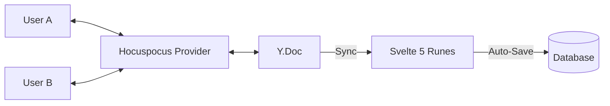

# Collaborative Editing Architecture

SveltyCMS utilizes **Yjs CRDTs** and the **Hocuspocus** synchronization engine to provide a seamless, conflict-free collaborative editing experience.

## 🚀 The Single Source of Truth (SSoT) Model

Unlike traditional CMS editors that rely on periodic auto-saves, SveltyCMS treats the **Y.Doc** as the active source of truth during an editing session.

---

## 📈 Implementation Details

### Phase 2: Full CRDT Concurrent Editing (Active)

1. **Yjs Integration**: Leveraging `yjs` for the core CRDT logic and `y-svelte` for native Rune bindings.
2. **Synchronization**:
   - **Primary**: WebSocket via Hocuspocus for sub-10ms latency.
   - **Fallback**: Server-Sent Events (SSE) for environments with restrictive proxies.
3. **Presence & Cursors**:
   - Real-time remote cursor tracking with user-specific colors.
   - "Active Editors" avatar stack in the header.
   - Field-level focus highlights to prevent overlapping edits.
4. **RichText**: Native Yjs integration for the TipTap/ProseMirror based RichText widget.

## 🛠️ Technical Components

| Component                | Responsibility                                                                          |
| :----------------------- | :-------------------------------------------------------------------------------------- |
| **CollaborativeService** | Manages WebSocket connections and document authorization.                               |
| **Awareness.svelte**     | High-level component managing user presence and cursor rendering.                       |
| **Yjs Binding**          | Custom logic in `fields.svelte` that reconciles `Y.Doc` updates with `collectionValue`. |

---

## ⚙️ Configuration

Collaborative editing is **built-in** but can be toggled per collection:

- **Enable Collaborative**: Full CRDT-based multi-user editing.
- **Strict Locking**: Classic field-level locking (one editor at a time).
- **Disabled**: Standard save/overwrite behavior.

> [!TIP]
> **Data Integrity**: Yjs ensures that even if a user goes offline, their changes are merged mathematically correctly once they reconnect, preventing the "Lost Update" problem prevalent in REST-only systems.
