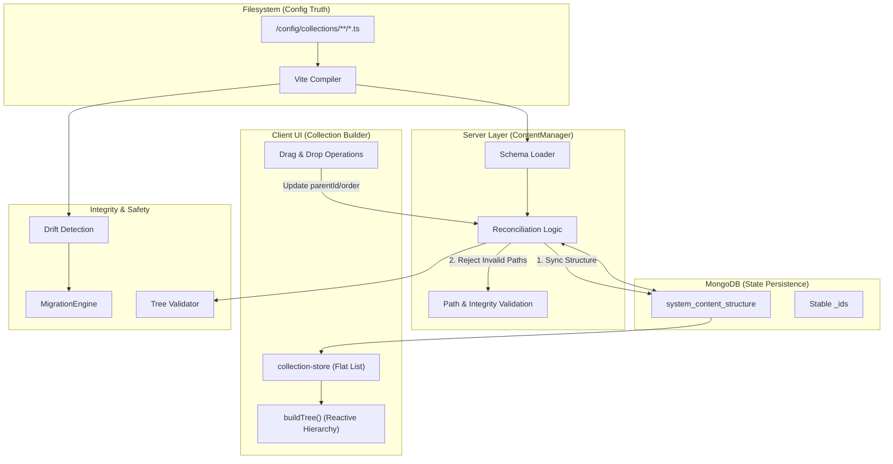

# Collection Builder Architecture

This document details the technical architecture of the SveltyCMS Collection Builder. It explains how the system maintains a "Single Source of Truth" by reconciling filesystem definitions with database state and presenting a consistent view to the user.

## System Overview

The Collection Builder operates on a **Canonical Flat List** architecture. Instead of storing complex nested trees, both the server and the UI operate on flat arrays of nodes that are linked via `parentId`.

### Core Data Flow

The following diagram illustrates the reconciliation flow:

## Key Components

### 1. Filesystem (The Configuration Truth)

The `config/collections` directory is the primary source of truth for **existence**.

- If a collection file exists on disk, it MUST exist in the system.
- If a file is deleted from disk, the corresponding collection is marked for deletion (or becomes a "ghost" if not cleaned up).

### 2. ContentManager (The Reconciliation Engine)

Located at `src/content/content-manager.ts`, this singleton is responsible for bridging the gap between static files and dynamic database state.

**Key responsibilities:**

- **Startup Sync**: On boot, it scans `compiledCollections` and compares them against the `system_content_structure` collection in MongoDB.
- **Defensive Import**: It actively filters out "garbage" nodes from the database (e.g., nodes where `path` is a UUID instead of a valid file path) to prevent database corruption from looping back into the application state.
- **ID Persistence**: It ensures that while the _structure_ comes from disk, the `_id` and relationship data (`parentId`, `order`) are preserved from the database.

### 3. Integrity & Safety Layer (New)

Located in `src/utils/schema/` and `src/services/MigrationEngine.ts`, this layer guards against data corruption:

- **Tree Validator**: Prevents cyclic dependencies (A->B->A) and path collisions during reordering.
- **Drift Detection**: Compares the _Code Definition_ (Target) vs _Database Schema_ (Current) to detect potentially destructive changes (e.g., removing a field, changing a widget type).
- **Migration Engine**: Orchestrates necessary DB updates **agnostically** via the `IDBAdapter` interface, ensuring compatibility across different database backends.

### 3. Database (State & Metadata)

MongoDB stores the _metadata_ that cannot live in static files, specifically:

- **`_id`**: The stable UUID for the collection.
- **`parentId`**: Which category or folder the collection currently resides in.
- **`order`**: The sort order within that parent.

### 4. Client UI (The View)

The Collection Builder UI (`src/components/Collections.svelte`) uses a **Reactive Tree Construction** pattern.

- **Input**: A flat array of `ContentNode` objects from the API.
- **Process**: A lightweight `buildTree` function groups nodes by `parentId`.
- **Render**: The UI renders the hierarchical tree based on this computed logical structure.
- **Interaction**: Drag-and-drop operations do **not** mutate the tree structure directly. Instead, they emit updates to the flat list (e.g., `updateNode(id, { parentId: newParent })`), which triggers a server save and a reactive re-render.

## Failure Scenarios & Recovery

| Scenario                    | Handling                                                                                                                                   |
| :-------------------------- | :----------------------------------------------------------------------------------------------------------------------------------------- |
| **Orphaned Database Nodes** | The `ContentManager` validation logic detects nodes with invalid paths (not starting with `/`) and prevents them from loading into memory. |
| **Disk/DB Mismatch**        | The Filesystem is treated as the "Definition of Done". If a collection is in DB but not Disk, it is flagged for removal.                   |
| **Circular Dependencies**   | The `buildTree` logic includes cycle detection to prevent infinite recursion loop crashing the UI.                                         |

## Related Architecture

- [Collection Store Data Flow](./collection-store-dataflow.mdx) - Explains how the _content_ within these collections is loaded, cached, and managed via SSR.
