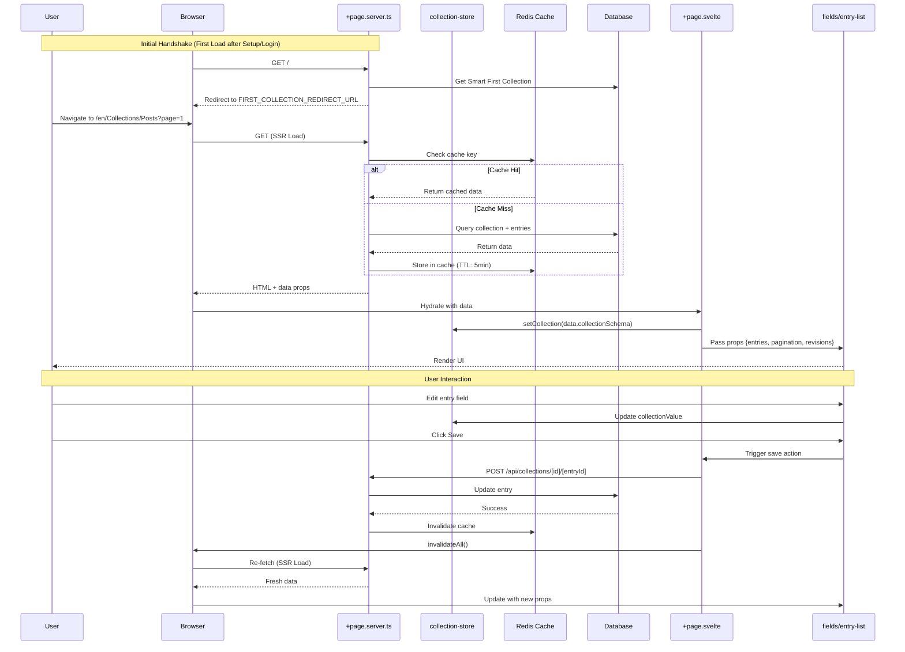

# Collection Store Data Flow (SSR Architecture)

This document describes the **canonical data flow** for loading, editing, and saving collection/entry data in SveltyCMS. It is essential for all developers working on content management, widgets, or UI components that interact with collections and entries.

## 🏗️ Store Architecture (Consolidated)

As of late 2025, the content state management has been consolidated into a single **`collection-store`** (`src/stores/collection-store.svelte.ts`). This unified store manages:

1.  **Content State**: The current collection schema, entry data, and content structure.
2.  **Status Logic**: Entry publication status (`publish`, `unpublish`, `schedule`, etc.) and toggling logic.
3.  **View Mode**: The current UI mode (`view`, `edit`, `create`, `media`) and valid transitions.

This consolidation replaces the previous fragmented approach (`status-store`, `modeStateMachine`) to provide a single source of truth and reduce circular dependencies. All consumers should import directly from `@stores/collection-store.svelte`.

## 🎯 Architecture: The "SvelteKit Way"

**SveltyCMS now follows a pure SSR (Server-Side Rendering) architecture.** This means:

- ✅ **All data fetching happens on the server** in `+page.server.ts` load functions
- ✅ **Components are "dumb" and receive data as props** (no client-side fetching)
- ✅ **Server-side caching** (Redis) with SvelteKit's built-in cache invalidation
- ✅ **URL-driven state** (pagination, sorting, filtering via search params)
- ✅ **Zero client-side data fetching** in entry-list.svelte and fields.svelte

This eliminates the "God Component" anti-pattern and provides enterprise-grade performance.

> **📖 Multilingual Content**: For details on how multilingual data is handled within this SSR architecture, including language projection and translation progress tracking, see [Multilingual Data Loading](./multilingual-data-loading.mdx).

## 🧩 Key Principles

- **Server-Side First:** All data is loaded via `+page.server.ts` load functions, never in components
- **Props Down, Events Up:** Components receive data as props and emit events for mutations
- **Store as Sync Layer:** The collection store is used for UI state synchronization, not data fetching
- **Cache on Server:** Redis caching handles performance, invalidated via `invalidateAll()`
- **URL as State:** Pagination, sorting, and filters are managed via URL search parameters

## 🔄 Data Flow Overview (SSR)



### Flow Steps

1. **SSR Page Load**
   - User navigates to a collection page with URL params (e.g., `?page=1&sort=createdAt&order=desc`)
   - `+page.server.ts` load function executes on the server
   - Checks Redis cache with a composite key (collection + filters + sort + pagination)
   - On cache miss: queries database, enriches data via `modifyRequest`, loads revisions if needed
   - Returns sanitized data as props to the page component

2. **Component Hydration**
   - `+page.svelte` receives data from the server as props
   - Sets the collection schema in the store via `setCollection(data.collectionSchema)`
   - Passes props down to "dumb" components (fields, entry-list)

3. **UI Consumption**
   - Components like `fields.svelte` and `entry-list.svelte` receive all data as props
   - No client-side data fetching - components are purely presentational
   - Store is used for form state synchronization, not data fetching

4. **User Interactions**
   - **Pagination/Sorting/Filtering**: Updates URL search params, triggers full SSR reload
   - **Form Edits**: Updates local component state and store for form binding
   - **Mutations (Save/Delete)**: Calls API endpoint, then uses `invalidateAll()` to trigger SSR reload

5. **Cache Invalidation**
   - After mutations, `invalidateAll()` is called
   - SvelteKit re-runs the `+page.server.ts` load function
   - Redis cache is invalidated by cache key pattern
   - Fresh data is loaded and passed as new props

## 📝 Example: Loading Collection Entries

### SSR Pattern (✅ Current Architecture)

```typescript
// +page.server.ts - Server-side load function
export const load: PageServerLoad = async ({ params, url, locals }) => {
  const { collection } = params;
  const page = Number(url.searchParams.get('page') ?? 1);

  // Check cache
  const cacheKey = `collection:${collection}:page:${page}`;
  const cached = await cacheService.get(cacheKey);
  if (cached) return cached;

  // Query database
  const entries = await dbAdapter.queryBuilder('collection_' + collectionId)
    .paginate({ page, pageSize: 10 })
    .execute();

  const result = { collectionSchema, entries, pagination };
  await cacheService.set(cacheKey, result, 300);
  return result;
};

// +page.svelte - Receive data as props
<script lang="ts">
  import entry-list from '@components/collectionDisplay/entry-list.svelte';

  let { data } = $props();
  let entries = $derived(data.entries);
  let pagination = $derived(data.pagination);
</script>

<entry-list {entries} {pagination} />
```

## 🎯 Component Responsibilities

### +page.server.ts (Server)

- ✅ Query database with filters/pagination
- ✅ Check/set Redis cache
- ✅ Enrich data via `modifyRequest`
- ✅ Load revisions for edit mode
- ✅ Return sanitized props

### +page.svelte (Router)

- ✅ Receive server data as props
- ✅ Sync collection schema to store
- ✅ Pass props to child components
- ❌ NO data fetching
- ❌ NO cache management

### fields.svelte / entry-list.svelte (Presentation)

- ✅ Receive all data as props
- ✅ Render UI based on props
- ✅ Bind form state to store
- ❌ NO data fetching
- ❌ NO API calls
- ❌ NO defaults or data transformation

## ⚡ Status Logic for Collections and Entries

- **Default Status:** By default, all new collection entries are initialized with `status: 'unpublish'`.
- **Collection-Defined Status:** If a collection schema defines a `status` value, this value is used as the default when creating a new entry for that collection.
- **UI Display:** The current status (from the store) is always shown in the header-edit and/or right-sidebar components. These components do not set or override the status themselves; they only display the value from the store.
- **Status Persistence:** The status is only saved to the database if it is changed by the user. Until then, the status remains in the store and is not persisted.
- **Best Practice:** Never set or override the status in UI components. Always rely on the store logic for status management.

### Example Flow

1. User creates a new entry.
2. The store checks if the collection has a `status` defined:
   - If yes, use that value.
   - If not, use `'unpublish'`.
3. The UI displays the current status from the store.
4. If the user changes the status, the new value is saved to the database on save.
5. If the status is not changed, the initial value is used and only saved when the entry is created.

## ✅ Best Practices

### Do ✅

- **Use SSR load functions** for all data fetching
- **Pass data as props** from page to components
- **Use URL search params** for pagination/filtering/sorting
- **Call `invalidateAll()`** after mutations to refresh data
- **Use server-side caching** (Redis) with proper TTL
- **Keep components "dumb"** - receive props, emit events
- **Use the store for form state** synchronization only

### Don't ❌

- **Don't fetch data in components** (onMount, useEffect, etc.)
- **Don't manage cache in components** - let the server handle it
- **Don't set defaults in UI components** - handle in load function
- **Don't use client-side state for server data** - use props
- **Don't bypass SSR** for "performance" - SSR + cache is faster

## 🚀 Performance Benefits

The SSR architecture combined with refined initialization provides:

1. **Faster Initial Load**: Server renders with data, no client-side fetch waterfall.
2. **Zero-Restart Setup Hydration**: The system transitions from SETUP to READY state without requiring a server restart, thanks to in-memory configuration passing.
3. **Pre-Seeded Database Models**: Database tables and collections are created during the setup seeding process, ensuring the CMS is ready for data entry immediately upon completion.
4. **Intelligent First Collection Redirect**: The `FIRST_COLLECTION_REDIRECT_URL` is provided to the client during the initial handshake, ensuring users land on the most relevant collection page immediately after setup or login.
5. **Better Caching**: Redis cache shared across all users, not per-browser.
6. **SEO Friendly**: Full HTML with content on first load.
7. **Reduced Bundle Size**: No client-side data fetching libraries needed.
8. **Type Safety**: Server-to-client data flow is fully typed.
9. **Simpler Debugging**: All data loading logic in one place (+page.server.ts).

## 📊 Cache Strategy

```typescript
// Cache key structure
const cacheKey = `collection:${collectionId}:page:${page}:size:${pageSize}:filter:${JSON.stringify(filters)}:sort:${sortField}:${sortOrder}:tenant:${tenantId}`;

// TTL: 5 minutes (300 seconds)
await cacheService.set(cacheKey, data, 300);

// Invalidation: After mutations (POST, PATCH, DELETE, batch operations)
// All mutation endpoints automatically clear cache using pattern matching
await cacheService.clearByPattern(`collection:${collectionId}:*`);
```

### Automatic Cache Invalidation

The following API endpoints automatically invalidate server-side page cache after successful mutations:

- `POST /api/collections/[collectionId]` - Create entry
- `PATCH /api/collections/[collectionId]/[entryId]` - Update entry
- `DELETE /api/collections/[collectionId]/[entryId]` - Delete entry
- `PATCH /api/collections/[collectionId]/[entryId]/status` - Update status
- `POST /api/collections/[collectionId]/batch` - Batch operations (delete, status, clone)

This ensures that the next SSR load will always fetch fresh data after any data modification.

---

## 📁 Key Files

**Server-Side:**

- `src/routes/(app)/[language]/[...collection]/+page.server.ts` - SSR load function
- `src/databases/cache-service.ts` - Redis caching layer
- `src/routes/api/collections/modifyRequest.ts` - Data enrichment

**Client-Side:**

- `src/routes/(app)/[language]/[...collection]/+page.svelte` - Props router
- `src/stores/collection-store.svelte.ts` - Unified store for Content, Status, and View Mode state
- `src/stores/ui-store.svelte.ts` - UI visibility and layout state
- `src/components/collectionDisplay/fields.svelte` - Dumb component (props)
- `src/components/collectionDisplay/entry-list.svelte` - Dumb component (props)

**API Endpoints:**

- `src/routes/api/collections/[collectionId]/[entryId]/revisions/+server.ts` - Revision history endpoint
- `src/utils/server/collection-utils.server.ts` - Server-side collection utilities

## Related Architecture

- [Collection Builder Architecture](./collection-builder-architecture.mdx) - Details how the collection _structure_ itself is defined, reconciled with the filesystem, and rendered in the admin UI.

This workflow ensures **enterprise-grade performance, type safety, and maintainability** for all SveltyCMS collection and entry operations.
