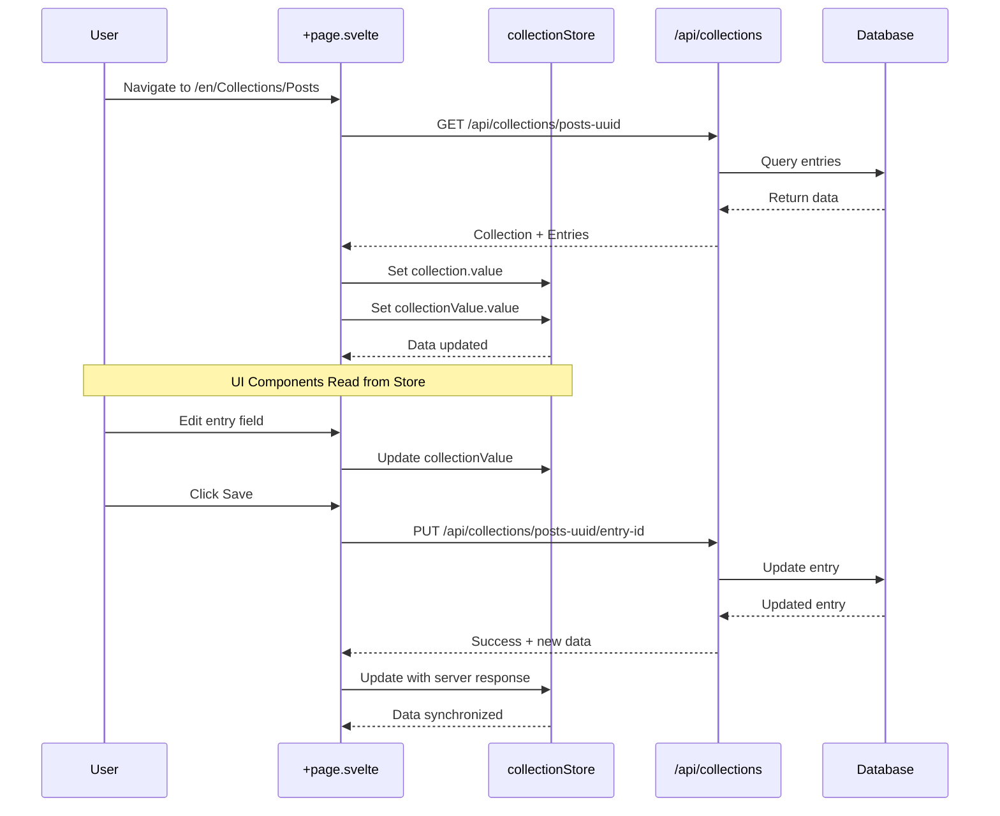

# Collection Store Data Flow

This document describes the **canonical data flow** for loading, editing, and saving collection/entry data in SveltyCMS. It is essential for all developers working on content management, widgets, or UI components that interact with collections and entries.

## 🧩 Key Principles

- **Single Source of Truth:** The collection store always holds the latest collection and entry data. All UI components must read from the store.
- **Server-Driven:** Data is always loaded from the server on navigation. The store is updated with the full collection and entry data.
- **Sensible Defaults:** Defaults (e.g., `status`, `createdAt`) are set only for new entries, and only if not present in the server response.
- **UI as Consumer:** UI components (HeaderEdit, RightSidebar, Fields, etc.) never set defaults or fetch data directly. They only consume the store.
- **Loader Overlay:** The global loader overlay is managed via the `globalLoadingStore` and is only shown during actual data loading or saving.

## 🔄 Data Flow Overview

### Flow Steps

1. **Page Load**
   - `[language]/[...collection]/+page.svelte` loads the collection and entry from the server.
   - The full data is set into the collection store (`collection`, `collectionValue`, etc.).
   - If creating a new entry, sensible defaults are set (e.g., `status: 'unpublish'`, `createdAt: now`).

2. **Store Update**
   - The store is the only source of truth for all collection/entry data.
   - Any changes (edits, status updates) are made via store actions.

3. **UI Consumption**
   - All UI components read from the store.
   - No component sets defaults or fetches data independently.
   - The Next/Save button logic is unified: only one action button is shown at a time, based on the current step and entry state.

4. **Loader Overlay**
   - The loader overlay is shown only during server operations (load, save).
   - It is hidden as soon as the operation completes.

5. **Saving/Updating**
   - On save, the store data is sent to the server.
   - On success, the store is updated with the latest server response.

## 📝 Example: New Menu Entry

- User navigates to create a new Menu entry.
- Page loads, sets empty entry data in the store, and applies defaults (`status: 'unpublish'`, `createdAt: now`).
- UI components (HeaderEdit, RightSidebar, Fields) read from the store and display the correct state.
- User fills out the form and clicks Next/Save.
- Loader overlay appears during save.
- On success, store is updated and loader is hidden.

## ⚡ Status Logic for Collections and Entries

- **Default Status:** By default, all new collection entries are initialized with `status: 'unpublish'`.
- **Collection-Defined Status:** If a collection schema defines a `status` value, this value is used as the default when creating a new entry for that collection.
- **UI Display:** The current status (from the store) is always shown in the HeaderEdit and/or RightSidebar components. These components do not set or override the status themselves; they only display the value from the store.
- **Status Persistence:** The status is only saved to the database if it is changed by the user. Until then, the status remains in the store and is not persisted.
- **Best Practice:** Never set or override the status in UI components. Always rely on the store logic for status management.

### Example Flow

1. User creates a new entry.
2. The store checks if the collection has a `status` defined:
   - If yes, use that value.
   - If not, use `'unpublish'`.
3. The UI displays the current status from the store.
4. If the user changes the status, the new value is saved to the database on save.
5. If the status is not changed, the initial value is used and only saved when the entry is created.

## ✅ Best Practices

- **Never set defaults in UI components.**
- **Always update the store from the server response.**
- **Use the store as the only source of truth.**
- **Show loader overlays only during real loading/saving.**

---

For implementation details, see the following files:

- `src/routes/(app)/[language]/[...collection]/+page.svelte`
- `src/stores/collectionStore.svelte.ts`
- `src/components/HeaderEdit.svelte`
- `src/components/RightSidebar.svelte`
- `src/components/collectionDisplay/Fields.svelte`

This workflow ensures robust, predictable, and maintainable data flow for all SveltyCMS collection and entry operations.
