# Compilation Pipeline

The SveltyCMS compilation system is an enterprise-grade utility that transforms TypeScript collection configurations into runtime-optimized JavaScript. It ensures data integrity, maintains stable content IDs (UUIDs) across edits, and validates widgets during the build process.

## Architecture

The system is modularized into three core components located in `src/utils/compilation/`:

1.  **`compile.ts`** (The Orchestrator)
    - Manages the build lifecycle: scanning, detection, compilation, and cleanup.
    - Implements concurrency control for performance.
    - Handles file persistence and UUID synchronization.
2.  **`transformers.ts`** (The AST Surgeon)
    - Contains pure functions that manipulating TypeScript ASTs.
    - Injects UUIDs, safely rewrites imports, and transforms widget calls.
3.  **`types.ts`** (The Contract)
    - Defines strict TypeScript interfaces for all system components.
    - Ensures type safety across the entire compilation flow.

## Key Features

### 1. Persistent UUID Synchronization

The compiler ensures that your content schemas maintain stable IDs, even when you rename files or change content.

- **Mechanism**: Before compiling, the system scans the `.compiledCollections` directory (hidden in root).
- **Logic**:
  1.  If a target file exists, its UUID is extracted and reused.
  2.  If the file is new but shares a content hash with a deleted file (detecting a move/rename), the old UUID is preserved.
  3.  Only if no history is found is a new Version 4 UUID generated.

### 2. AST-Based Validation

Instead of regex-based replacement, we use the TypeScript Compiler API to perform safe code transformations.

- **Schema Injection**: Safely injects the `_id` property into your `export const schema` object.
- **Widget Transformation**: Automatically wraps widget function calls (e.g., `widgets.Text(...)`) with necessary metadata like unique instance IDs.
- **Import Rewriting**: Converts developer-friendly imports (e.g., `@widgets`) into absolute or relative paths suitable for the runtime environment.

### 3. Concurrency & Performance

- **Parallel Processing**: Uses a worker-queue pattern to compile multiple files simultaneously, respecting a concurrency limit (default: 5) to prevent resource exhaustion.
- **Intelligent Caching**: Skips recompilation if the source file's content hash matches the existing compiled file.

## Integration

The compilation pipeline is integrated into both the development server and the production build:

### Vite Plugin (`apps/cms/vite.config.ts`)

In development mode, the `svelty-cms-watcher` plugin invokes the compiler on file changes and **synchronizes the database**:

```typescript
// apps/cms/vite.config.ts
import { compile } from '@shared/utils/compilation/compile';

// ... inside watcher
await compile({
	userCollections: paths.userCollections,
	compiledCollections: paths.compiledCollections,
	targetFile: file, // Incremental compilation
	logger: log
});

// Database Synchronization (Hot Reload)
if (dbAdapter && dbAdapter.collection) {
	const { scanCompiledCollections } = await server.ssrLoadModule('src/content/collectionScanner.ts');
	const collections = await scanCompiledCollections();

	// Register new models in MongoDB/MariaDB immediately
	for (const schema of collections) {
		await dbAdapter.collection.createModel(schema);
	}
}

// Regenerate Types
const { generateContentTypes } = await server.ssrLoadModule('src/content/vite.ts');
await generateContentTypes(server);
```

### Server Startup (`hooks.server.ts`)

To ensure production environments and fresh server restarts have all collections registered, the system scans and registers collections during the boot process:

```typescript
// apps/cms/src/hooks.server.ts
import { scanCompiledCollections } from '@content/collectionScanner';

// ... after DB initialization
const compiledCollections = await scanCompiledCollections();

for (const collection of compiledCollections) {
	// Registers Mongoose models (MongoDB) or Schema definitions (MariaDB)
	await dbAdapter.collection.createModel(collection);
}
```

### Server-Side Route (`+page.server.ts`)

The Collection Builder UI triggers compilation when you save a collection:

```typescript
// src/routes/(app)/config/collectionbuilder/.../+page.server.ts
import { compile } from '@src/utils/compilation/compile';

// ... inside save action
await compile({ logger }); // Trigger full or partial compile
```

## Database Synchronization

A critical part of the pipeline is ensuring that the running database adapter knows about the latest content schemas.

1.  **Compilation**: Transforms TypeScript config to JS.
2.  **Model Registration**: Calls `dbAdapter.collection.createModel(schema)`.
    - **MongoDB**: Creates/Updates Mongoose models, enabling immediate CRUD operations.
    - **MariaDB**: Registers the schema in memory for the generic `system_content_structure` table wrapper.
3.  **Type Generation**: Updates `types.ts` for IntelliSense.

This ensures that as soon as a file is saved, the API is ready to accept requests for that collection.

### Pipeline Visualization

```mermaid
sequenceDiagram
    participant Dev as Developer
    participant Watcher as Vite Watcher
    participant Compiler as Compiler (compile.ts)
    participant DB as Database Adapter
    participant Generator as Type Generator

    Dev->>Watcher: Save Collection File
    Watcher->>Compiler: Trigger Compilation
    Compiler->>Compiler: Transform TS -> JS
    Compiler-->>Watcher: Compilation Complete

    rect rgb(20, 20, 20)
        Note over Watcher, DB: Database Synchronization
        Watcher->>DB: Scan Compiled Collections
        loop Each Collection
            Watcher->>DB: dbAdapter.collection.createModel(schema)
            alt MongoDB
                DB->>DB: Register Mongoose Model
            else MariaDB
                DB->>DB: Register Schema in Memory
            end
        end
    end

    Watcher->>Generator: Generate Types
    Generator->>Dev: Update types.ts (IntelliSense)
```



## Logging

The system uses a unified `Logger` interface defined in `types.ts`. This allows it to adapt to different environments:

- **Build Time**: Uses Vite's colored console output.
- **Runtime**: Can use the server-side `logger` instance for persistent logs in `app.log`.

## Usage Guide

To manually trigger compilation or use it in a script:

```typescript
import { compile } from '@src/utils/compilation/compile';

await compile({
	userCollections: './config/collections',
	compiledCollections: './.compiledCollections',
	concurrency: 10 // Optional: speed up for large projects
});
```

## Related Documentation

- [Collection Builder Guide](/docs/guides/development/collection-builder) - Visual collection builder with data loss warnings
- [Initialization Workflow](/docs/architecture/initialization-workflow) - How compilation fits into system startup
- [Widget Architecture](/docs/widgets/widget-architecture) - Understanding widget transformation
