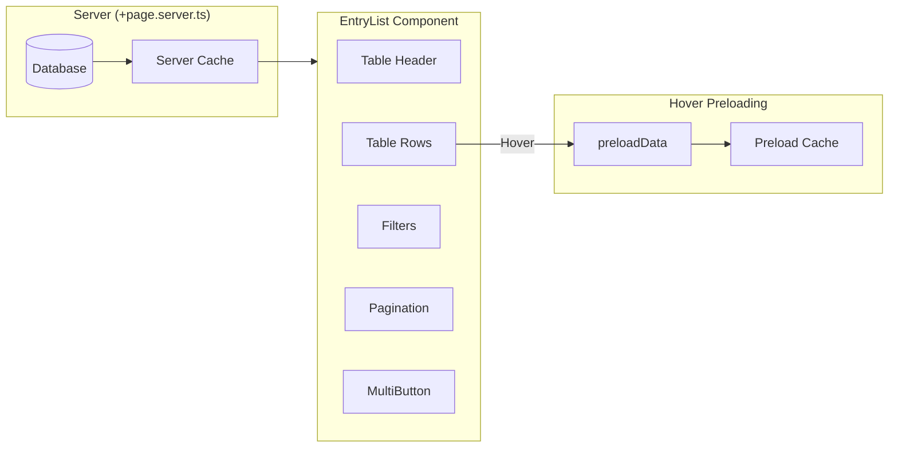
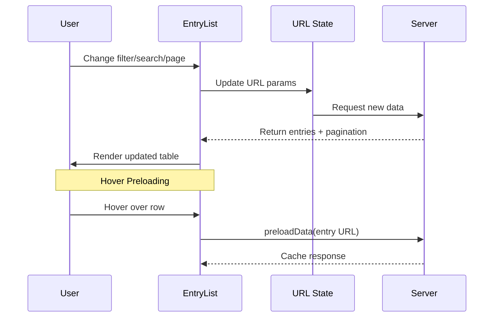

# EntryList Component

The `EntryList` is the primary component for displaying collection data in a tabular format with enterprise features like server-side search, filtering, and intelligent preloading.

---

## Architecture



---

## Features

| Feature                | Description                                   |
| ---------------------- | --------------------------------------------- |
| **Server-Side Search** | Real-time search with debounced queries       |
| **Field Filtering**    | Per-column filtering options                  |
| **Smart Pagination**   | Configurable page sizes (10, 25, 50, 100)     |
| **Hover Preloading**   | Connection-aware speculative loading          |
| **Bulk Selection**     | Multi-item selection with Shift+Click         |
| **Sortable Columns**   | Click-to-sort with ASC/DESC toggle            |
| **Status Display**     | Visual status badges (Published, Draft, etc.) |

---

## Data Flow



---

## Props

```typescript
interface EntryListProps {
	entries: Entry[];
	pagination: {
		currentPage: number;
		pageSize: number;
		totalItems: number;
		pagesCount: number;
	};
	contentLanguage: string;
	breadcrumb: BreadcrumbItem[];
	collectionStats: CollectionStats | null;
}
```

---

## Keyboard Shortcuts

| Shortcut  | Action             |
| --------- | ------------------ |
| `Alt+N`   | Create new entry   |
| `Alt+P`   | Publish selected   |
| `Alt+U`   | Unpublish selected |
| `Alt+D`   | Move to draft      |
| `Alt+Del` | Delete selected    |

---

## Related Documentation

- [MultiButton Component](./EntryList_MultiButton.mdx)
- [Fields Component](./Fields.mdx)
- [Hover Preloading Architecture](/docs/architecture/hover-preloading.mdx)
- [Collection Store Dataflow](/docs/architecture/collection-store-dataflow.mdx)
