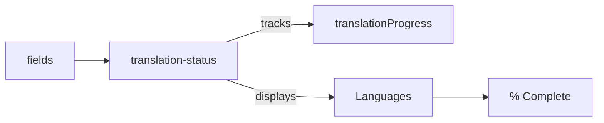
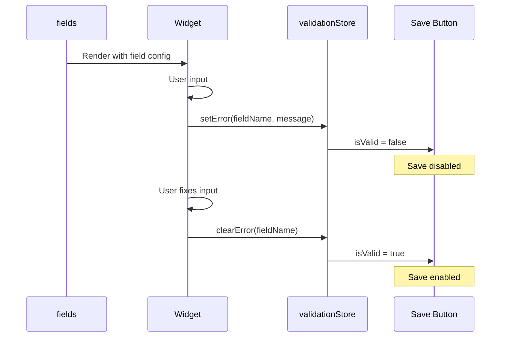
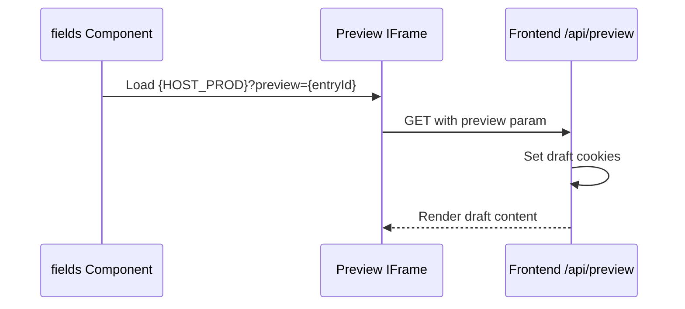

# fields Component

The `fields` component is responsible for rendering collection fields dynamically, loading appropriate widgets, handling validation, and managing revision history.

---

## Collection Entry Editing Ecosystem

The fields component is part of a larger system for editing collection entries. The following components work together:


### Component Roles

| Component              | Path                                                         | Role                                                 |
| ---------------------- | ------------------------------------------------------------ | ---------------------------------------------------- |
| **header-edit**        | `src/components/header-edit.svelte`                          | Mobile save/cancel/delete actions, validation gating |
| **right-sidebar**      | `src/components/right-sidebar.svelte`                        | Desktop save/status/scheduling actions               |
| **fields**             | `src/components/collectionDisplay/fields.svelte`             | Dynamic field rendering, validation                  |
| **widget-loader**      | `src/components/collectionDisplay/widget-loader.svelte`      | Async widget loading with error handling             |
| **translation-status** | `src/components/collectionDisplay/translation-status.svelte` | Translation progress per language                    |
| **TokenPicker**        | `src/components/TokenPicker.svelte`                          | Dynamic token insertion for fields                   |
| **Revisions**          | (within fields)                                              | Historical snapshots with revert capability          |

---

## Architecture


---

## Features

| Feature                          | Description                                                  |
| -------------------------------- | ------------------------------------------------------------ |
| **Dynamic Widget Loading**       | Lazy-loads widgets based on field type using `widget-loader` |
| **Validation Store Integration** | Real-time field validation with `validationStore`            |
| **Translation Progress**         | Visual indicators for multilingual content completion        |
| **Revision History**             | View and revert to previous versions                         |
| **Role-Based Filtering**         | Show/hide fields based on user permissions                   |
| **Two-Way Binding**              | Sync between local and global state                          |

---

## header-edit & right-sidebar (Save Actions)

The save functionality is split between mobile and desktop views:

### header-edit (Mobile)

Visible on screens < 1024px. Provides:

- **Save Button**: Disabled when `validationStore.isValid === false`
- **Cancel/Delete**: With confirmation modals
- **Clone**: Duplicate entry functionality
- **Scheduling**: Publish/unpublish scheduling

```typescript
// Save validation gating
const canSave = $derived(validationStore.isValid && dataChangeStore.hasChanges);
```

### right-sidebar (Desktop)

Visible on screens >= 1024px. Additionally provides:

- **Entry Status**: Draft/Published/Scheduled
- **Metadata Display**: Created/Updated timestamps
- **Scheduling Panel**: Date/time pickers for publish schedule

Both components integrate with `validationStore` to prevent saving invalid entries.

---

## translation-status

Displays translation completion progress for multilingual collections:



### Features

- **Per-Language Progress**: Shows completion % for each language
- **Field-Level Tracking**: Tracks individual translatable fields
- **Widget-Aware**: Handles complex widgets (e.g., SEO) with nested language data
- **Language Switcher**: Click to switch content language

### Progress Calculation

```typescript
// Translation progress per language
translationProgress[language] = {
	total: new SvelteSet<string>(), // All translatable fields
	translated: new SvelteSet<string>() // Completed translations
};

// Progress percentage
const progress = (translated.size / total.size) * 100;
```

---

## TokenPicker

A floating panel for inserting dynamic tokens into input fields:

### Features

- **Token Categories**: Entry, User, Site, System tokens
- **Modifier Support**: date, upper, lower, truncate, etc.
- **Live Preview**: Shows resolved token value
- **Smart Detection**: Detects existing tokens in active input
- **Draggable Window**: Repositionable UI

### Usage

Tokens are inserted with `{{ }}` syntax:

```typescript
{
	{
		entry: title;
	}
} // Simple token
{
	{
		entry: date | date(short);
	}
} // With modifier
{
	{
		user: displayName | upper;
	}
} // Uppercase modifier
```

---

## Validation Integration

The fields component integrates with the global `validationStore` for real-time validation feedback.

### Validation Flow



### Required Field Validation

The component automatically validates required fields:

```typescript
$effect(() => {
	const values = currentCollectionValue;

	filteredfields.forEach((field) => {
		if (field.required) {
			const fieldName = getFieldName(field, false);
			const value = values[fieldName];

			const isEmpty =
				value === null || value === undefined || (typeof value === 'string' && value.trim() === '') || (Array.isArray(value) && value.length === 0);

			if (isEmpty) {
				validationStore.setError(fieldName, `${field.label || fieldName} is required`);
			} else {
				validationStore.clearError(fieldName);
			}
		}
	});
});
```

### Widget-Level Validation

Individual widgets can implement their own validation using Valibot schemas:

```typescript
// In widget input.svelte
import { validationStore } from '@stores/store.svelte';
import { parse } from 'valibot';

function validateInput() {
	try {
		parse(validationSchema, currentValue);
		validationStore.clearError(fieldName);
	} catch (error) {
		const message = error.issues?.[0]?.message || 'Invalid input';
		validationStore.setError(fieldName, message);
	}
}
```

---

## Widget Loading Flow


### widget-loader Error Handling

The `widget-loader` component handles loading failures gracefully:

- **Loading State**: Shows skeleton UI while widget loads
- **Error State**: Displays error with retry button
- **Fallback State**: Shows warning for unavailable widgets

---

## Props

```typescript
interface fieldsProps {
	fields: FieldDefinition[];
	collection: Collection;
	entry: Entry;
	entryId: string;
	collectionValue: ValueStore;
	revisions?: Revision[];
	contentLanguage?: string;
}
```

---

## Tabs

The component uses a tabbed interface with up to 4 tabs (conditional based on settings):

### Tab 0: Edit

The primary editing interface with all field widgets.

### Tab 1: Revisions

Only visible if `collection.revision` is enabled. Shows historical snapshots with:

- Version timeline
- Compare functionality
- Revert capability

### Tab 2: Preview (Live Preview)

Only visible if `collection.livePreview` is configured. Displays an **iframe** with the frontend preview:



**Features:**

- **Live iframe preview** at `{HOST_PROD}?preview={entryId}`
- **Copy URL button** for sharing preview link
- **Open in new tab** link
- **Sandboxed iframe** with `allow-same-origin allow-scripts allow-forms allow-popups`

> [!NOTE]
> For the full handshake architecture (cookies, security, multi-tenancy), see [Live Preview Architecture](/docs/guides/live-preview-architecture.mdx).

### Tab 3: API (Admin Only)

Only visible for admin users. Shows:

- **API URL** for the current entry: `/api/collection/{collectionId}/{entryId}`
- **Copy button** for the URL
- **Raw JSON view** of the entry data

---

## Plugin Extensibility

The fields component supports plugin extensions through the **`entry_edit` injection zone**, allowing plugins to add custom tabs and functionality to the entry editing interface.

### Plugin Slots

Plugins can register components in the `entry_edit` zone to:

- **Add Custom Tabs**: SEO optimization, AI content generation, preview tools
- **Inject UI Elements**: Custom actions, metadata panels, workflow controls
- **Extend Functionality**: Third-party integrations, analytics, custom validators

### Example Plugin Integration

```typescript
// Plugin registering a custom SEO tab
import type { Plugin } from '@src/plugins/types';
import SEOTab from './SEOTab.svelte';

export const seoPlugin: Plugin = {
	metadata: {
		id: 'seo-optimizer',
		name: 'SEO Optimizer',
		version: '1.0.0',
		enabled: true
	},
	ui: {
		slots: [
			{
				zone: 'entry_edit',
				slot: 'tabs',
				component: SEOTab,
				order: 100
			}
		]
	}
};
```

### Available Slots in `entry_edit` Zone

| Slot Name          | Location                                     | Use Case                       |
| ------------------ | -------------------------------------------- | ------------------------------ |
| `tabs`             | Additional tabs after Edit/Revisions/Preview | Custom editing interfaces      |
| `header_actions`   | Header toolbar area                          | Quick actions, status controls |
| `field_extensions` | Below field groups                           | Field-level enhancements       |

> [!TIP]
> For complete plugin development guide, see [Plugin Architecture](/docs/guides/plugin-architecture.mdx).

---

## Best Practices

1. **Field Configuration**: Always set `db_fieldName` for consistent validation keys
2. **Required fields**: Use `required: true` for mandatory fields (handled automatically)
3. **Custom Validation**: Implement Valibot schemas in widget `index.ts` for type-specific validation
4. **Error Messages**: Provide clear, user-friendly validation messages
5. **Permissions**: Use `permissions` field config to control access per role
6. **Token Support**: Use `TokenPicker` for dynamic content like slugs, dates, metadata

---

## Related Documentation

- [widget-loader Component](/docs/architecture/components/widget-loader.mdx) - Async widget loading
- [Widget System Overview](/docs/widgets/widget-system-overview.mdx) - Widget architecture
- [Unified Error Handling](/docs/guides/development/error-handling.mdx) - Error handling patterns
- [Live Preview Architecture](/docs/guides/live-preview-architecture.mdx) - Preview system
- [Validation Instant Feedback](/docs/architecture/validation-instant-feedback.mdx) - Validation UX
- [Multilingual Data Loading](/docs/architecture/multilingual-data-loading.mdx) - Translation handling
