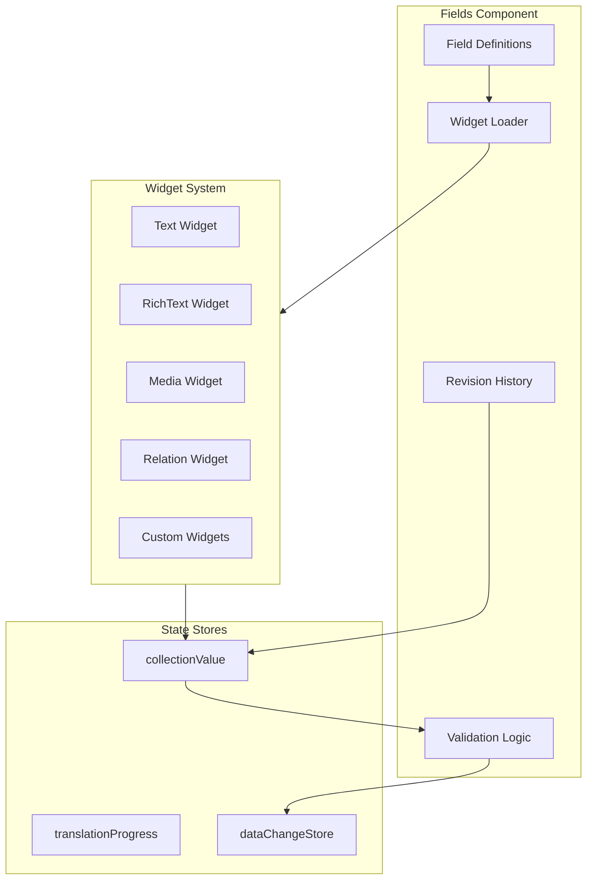
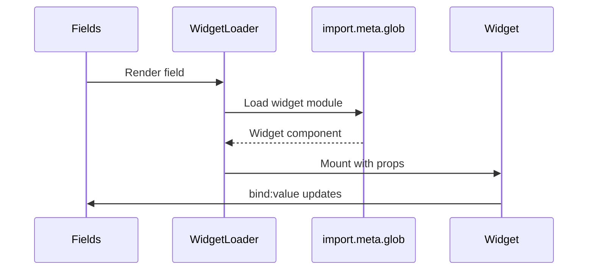

# Fields Component

The `Fields` component is responsible for rendering collection fields dynamically, loading appropriate widgets, handling validation, and managing revision history.

---

## Architecture



---

## Features

| Feature                    | Description                                  |
| -------------------------- | -------------------------------------------- |
| **Dynamic Widget Loading** | Lazy-loads widgets based on field type       |
| **Real-Time Validation**   | Field-level validation with instant feedback |
| **Revision History**       | View and revert to previous versions         |
| **Translation Progress**   | Visual indicators for multilingual content   |
| **Role-Based Filtering**   | Show/hide fields based on user permissions   |
| **Two-Way Binding**        | Sync between local and global state          |

---

## Widget Loading Flow



---

## Props

```typescript
interface FieldsProps {
	fields: FieldDefinition[];
	collection: Collection;
	entry: Entry;
	entryId: string;
	collectionValue: ValueStore;
	revisions?: Revision[];
	contentLanguage?: string;
}
```

---

## Tabs

The component uses a tabbed interface:

1. **Edit Tab** - Form fields for data entry
2. **Revisions Tab** - Historical snapshots with revert capability

---

## Related Documentation

- [EntryList Component](./EntryList.mdx)
- [Widget System Overview](/docs/widgets/widget-system-overview.mdx)
- [Validation Instant Feedback](/docs/architecture/validation-instant-feedback.mdx)
- [Multilingual Data Loading](/docs/architecture/multilingual-data-loading.mdx)
