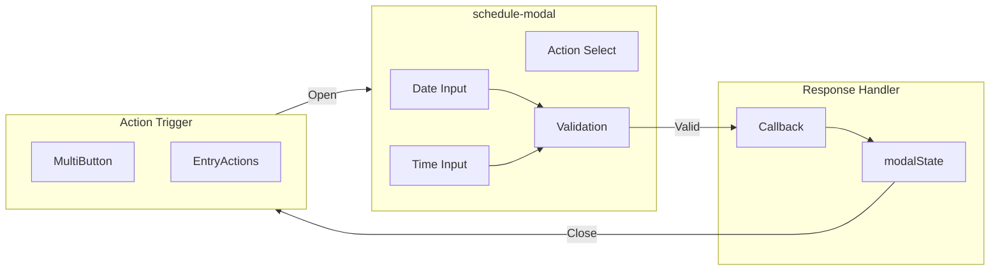
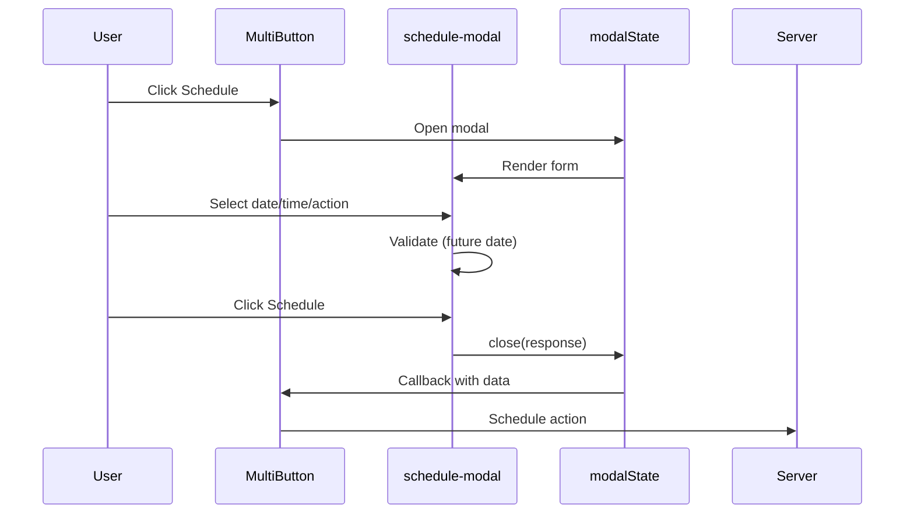

# schedule-modal Component

The `schedule-modal` component provides a user interface for scheduling future actions (publish, unpublish, delete) on collection entries.

---

## Architecture



---

## Features

| Feature                | Description                                  |
| ---------------------- | -------------------------------------------- |
| **DateTime Selection** | Separate date and time inputs for precision  |
| **Action Selection**   | Choose between publish, unpublish, or delete |
| **Future Validation**  | Enforces scheduling for future dates only    |
| **Modal Integration**  | Uses `modalState` for dialog management      |
| **Accessible**         | ARIA labels and keyboard navigation          |

---

## User Flow



---

## Response Format

```typescript
interface ScheduleResponse {
	confirmed: boolean;
	date: Date;
	action: 'publish' | 'unpublish' | 'delete';
}
```

---

## Usage

The modal is opened via `modalState` and returns a response object:

```typescript
// Opening the modal
modalState.open({
	component: schedule - modal,
	props: {
		meta: { initialAction: 'publish' }
	}
});

// Handling response (via modalState callback)
// { confirmed: true, date: Date, action: 'publish' }
```

---

## Related Documentation

- [MultiButton Component](./entry-list-multibutton.mdx)
- [entry-list Component](./entry-list.mdx)
