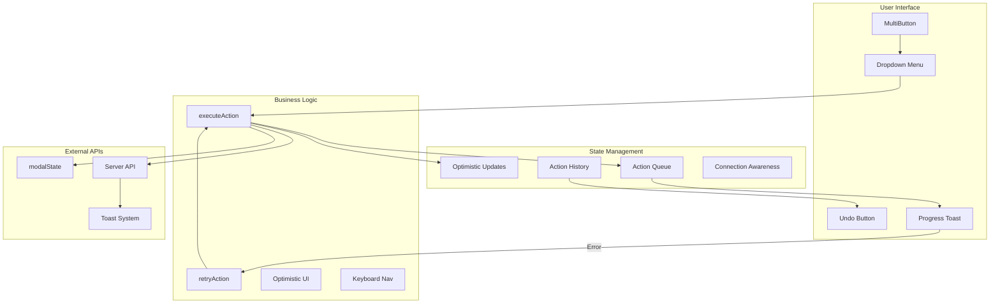
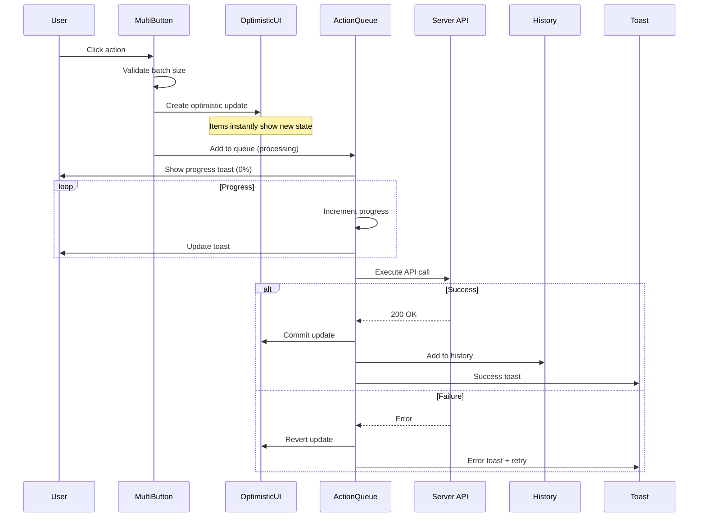

# Enterprise MultiButton Component

The `entry-list_MultiButton` is an enterprise-grade component for managing bulk actions on collection entries with advanced features like action queuing, optimistic UI, and keyboard navigation.

---

## Quick Start

```typescript
<entry-listMultiButton
  hasSelections={true}
  selectedCount={5}
  selectedItems={selectedEntries}
  bind:showDeleted
  create={onCreate}
  publish={onPublish}
  unpublish={onUnpublish}
  draft={onDraft}
  schedule={onSchedule}
  clone={onClone}
  delete={onDelete}
/>
```

---

## Architecture Overview



---

## Core Features

### 1. Action Queue System

Real-time progress tracking for batch operations with visual feedback.

```typescript
interface QueuedAction {
	id: string;
	type: ActionType;
	count: number;
	status: 'pending' | 'processing' | 'success' | 'error' | 'retrying';
	progress: number; // 0-100%
	error?: string;
	timestamp: number;
	retryCount?: number;
	maxRetries?: number; // Default: 3
	optimisticId?: string; // Links to optimistic update
}
```

**Benefits:**

- Visual progress bars (0-100%)
- Non-blocking UI (async processing)
- Auto-cleanup after 3 seconds (success) or manual dismiss (error)

---

### 2. Optimistic UI

Instant visual feedback before server confirmation.

```
1. User clicks action
2. Create optimistic update (instant UI change)
3. Add to action queue
4. Execute server API call
5. On success: commit optimistic update
6. On error: revert optimistic update + show retry
```

---

### 3. Retry Mechanism

Automatic retry with visual controls.

**Features:**

- 3 automatic retry attempts (configurable)
- Visual retry button in error toasts
- Retry counter: "Retry (2/3)"
- Preserves optimistic updates during retry

---

### 4. Undo Support

5-minute undo window with visual countdown timer.

| Action    | Undoable       |
| --------- | -------------- |
| Publish   | ✅             |
| Unpublish | ✅             |
| Draft     | ✅             |
| Clone     | ✅             |
| Delete    | ❌ (permanent) |

---

### 5. Connection Awareness

Adaptive batch sizing based on network speed.

| Connection Type | Batch Limit |
| --------------- | ----------- |
| 4G/WiFi         | 50 items    |
| 3G              | 10 items    |
| 2G/Save Data    | 10 items    |

---

### 6. Keyboard Navigation

#### Global Shortcuts (with Alt key)

| Shortcut  | Action             | Requires Selection |
| --------- | ------------------ | ------------------ |
| `Alt+N`   | Create new entry   | ❌                 |
| `Alt+P`   | Publish selected   | ✅                 |
| `Alt+U`   | Unpublish selected | ✅                 |
| `Alt+D`   | Move to draft      | ✅                 |
| `Alt+Del` | Delete selected    | ✅                 |
| `Alt+Z`   | Undo last action   | ❌                 |

#### Dropdown Navigation

| Key      | Action                 |
| -------- | ---------------------- |
| `↑/↓`    | Navigate menu items    |
| `Home`   | Jump to first item     |
| `End`    | Jump to last item      |
| `Enter`  | Execute focused action |
| `Escape` | Close dropdown         |

---

### 7. ARIA Accessibility

Full WCAG 2.1 Level AA compliance.

- `aria-label` on all interactive elements
- `aria-expanded` for dropdown state
- `role="menu"`, `role="menuitem"` for dropdown
- `aria-live="polite"` for progress updates
- `aria-valuenow/min/max` for progress bars

---

## Action Flow (Detailed)



---

## Props

```typescript
interface Props {
	isCollectionEmpty?: boolean; // Default: false
	hasSelections?: boolean; // Default: false
	selectedCount?: number; // Default: 0
	selectedItems?: any[]; // Default: []
	showDeleted?: boolean; // Default: false (bindable)
	create: () => void;
	publish: () => Promise<void> | void;
	unpublish: () => Promise<void> | void;
	draft: () => Promise<void> | void;
	schedule: (date: string, action: string) => void;
	clone: () => Promise<void> | void;
	delete: (permanent: boolean) => Promise<void> | void;
}
```

---

## Industry Comparison

| Feature           | SveltyCMS | Strapi | Contentful | Sanity |
| ----------------- | --------- | ------ | ---------- | ------ |
| Optimistic UI     | ✅        | ❌     | ⚠️         | ✅     |
| Action Queue      | ✅        | ❌     | ❌         | ❌     |
| Retry Mechanism   | ✅ 3x     | ❌     | ❌         | ❌     |
| Undo Support      | ✅ 5min   | ❌     | ❌         | ⚠️     |
| Keyboard Nav      | ✅ Full   | ⚠️     | ⚠️         | ✅     |
| Progress Tracking | ✅ 0-100% | ❌     | ❌         | ⚠️     |
| Connection Aware  | ✅        | ❌     | ❌         | ❌     |
| ARIA Complete     | ✅        | ⚠️     | ⚠️         | ✅     |

---

## Related Documentation

- [entry-list Component](./entry-list.mdx)
- [fields Component](./fields.mdx)
- [schedule-modal Component](./schedule-modal.mdx)
- [Collection Store Dataflow](/docs/architecture/collection-store-dataflow.mdx)
- [Hover Preloading](/docs/architecture/hover-preloading.mdx)
