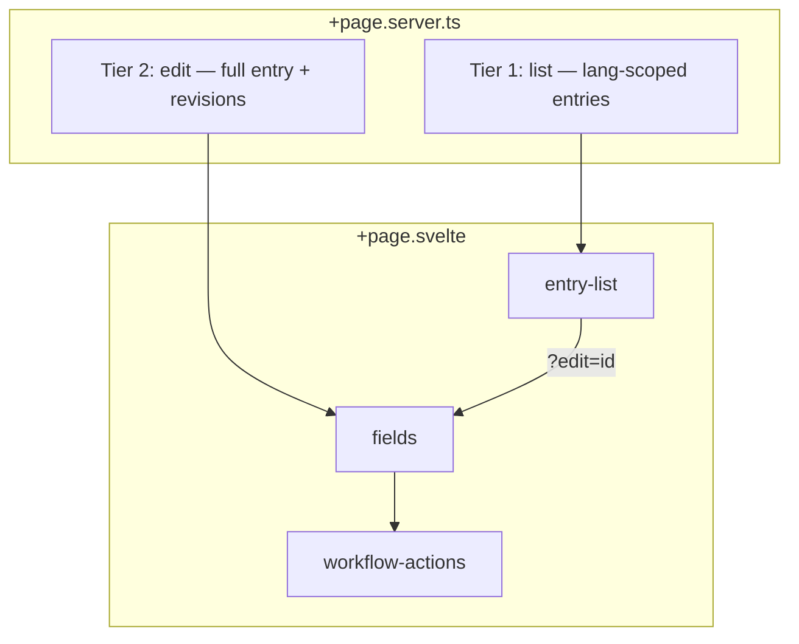

# Collection Display Components

Source: `src/components/collection-display/`

These components power the collection route at `src/routes/(app)/[language]/[...collection]/+page.svelte`, which switches between **view** (`entry-list`) and **edit/create** (`fields`) based on URL params (`?edit`, `?create`).

## Component Map

| Component                   | File                             | Role                                                                   |
| --------------------------- | -------------------------------- | ---------------------------------------------------------------------- |
| **entry-list**              | `entry-list.svelte`              | SSR-backed data table: search, filters, sort, pagination, bulk actions |
| **entry-list-multi-button** | `entry-list-multi-button.svelte` | Contextual bulk/create action bar + keyboard shortcuts                 |
| **fields**                  | `fields.svelte`                  | Tabbed entry editor: widgets, revisions, API tab, plugin slots         |
| **widget-loader**           | `widget-loader.svelte`           | Async mount wrapper for dynamically imported widget `input.svelte`     |
| **translation-status**      | `translation-status.svelte`      | Language switcher (view) / per-language progress (edit)                |
| **revision-diff-modal**     | `revision-diff-modal.svelte`     | Field-aware revision comparison modal                                  |
| **schedule-modal**          | `schedule-modal.svelte`          | Future publish/unpublish/delete scheduling (via `modalState`)          |
| **workflow-actions**        | `workflow-actions.svelte`        | Workflow state transitions on edit page                                |

| **generativecollectiondisplay** | `generativecollectiondisplay.svelte` | AI/json-render layout when `schema.displaySpec` is set |
| **table-controller** | `table-controller.svelte.ts` | Optional Svelte 5 runes class for table state (not used by `entry-list` today) |

## Data Flow (Actual)

**List mode** does not client-fetch: `entry-list` updates URL query params (`search`, `page`, `pageSize`, `filter_*`, `sort`) and SvelteKit reloads via `goto()`.

**Edit mode** loads multilingual entry data once; `translation-status` and per-field locale badges update UI without a full reload.

## Related Documentation

- [entry-list](./entry-list.mdx)
- [entry-list-multi-button](./entrylist-multibutton.mdx)
- [fields](./fields.mdx)
- [widget-loader](./widget-loader.mdx)
- [translation-status](./translation-status.mdx)
- [revision-diff-modal](./revision-diff-modal.mdx)
- [schedule-modal](./schedule-modal.mdx)
- [workflow-actions](./workflow-actions.mdx)
- [generative-collection-display](./generative-collection-display.mdx)
- [table-controller](./table-controller.mdx)
- [Collection store dataflow](/docs/architecture/collection-store-dataflow.mdx)
- [Widget development](/docs/guides/development/widgets/index.mdx)
