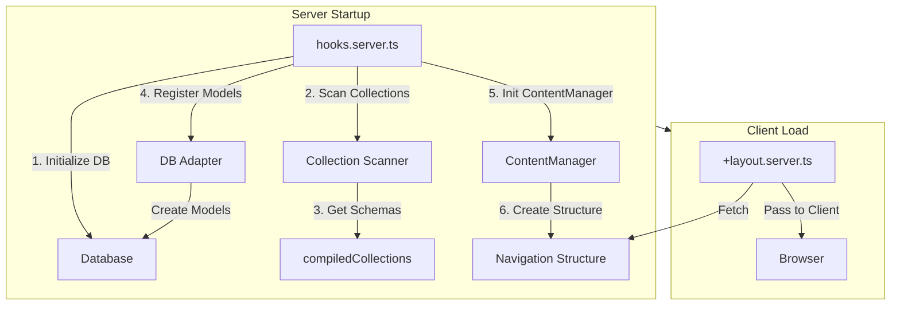

# Content System Architecture

The Content System is the core of SveltyCMS, responsible for managing, indexing, and serving content and collections. It is designed to be performant, reactive, and type-safe.

## Core Components

### 1. Content Manager (`src/content/ContentManager.ts`)

The `ContentManager` is a singleton class that orchestrates the entire content lifecycle. It serves as the central point of access for:

- **Initialization**: Bootstrapping the content system on server start.
- **Structure Management**: Maintaining the hierarchy of categories and collections.
- **Reactivity**: Tracking content versions and notifying clients of updates.
- **Access Control**: (Planned) Managing permissions for content access.

**Key Features:**

- **Singleton Pattern**: Ensures a single source of truth for content state.
- **Versioning**: Maintains a `contentVersion` number that increments on every content update. This allows clients to poll for changes and update their UI efficiently without full reloads.
- **Navigation Structure**: Generates a simplified navigation tree for the sidebar, optimizing payload size for initial hydration.

### 2. Content Index (`src/content/index.ts`)

This module handles the low-level details of content loading and processing.

- **Dynamic Imports**: Uses `import.meta.glob` (in dev) and filesystem scanning (in prod) to load collection definitions.
- **Batch Processing**: Processes collections in concurrent batches to improve startup time.
- **Stable ID Generation**: Uses deterministic hashing to generate stable numeric IDs for categories, preventing hydration mismatches.
- **Polling**: Implements a client-side polling mechanism to check for content updates via `api/content/version`.

### 3. Collection Scanner (`src/content/collectionScanner.ts`)

A utility specifically for production environments to scan the filesystem for compiled collection definitions. This bypasses the need for dynamic imports in the built application, ensuring robust loading in various deployment environments (Node.js, Bun, Docker).

## Reactivity Model

SveltyCMS uses a **Pull-based Reactivity Model** for content updates:

1.  **Server Update**: When content is modified (e.g., via the CMS interface), the `ContentManager` increments its `contentVersion`.
2.  **Client Polling**: The client (`src/content/index.ts`) polls the `/api/content/version` endpoint at regular intervals (default: 10s).
3.  **Version Check**: The client compares the server's version with its local version.
4.  **Update Trigger**: If the server version is newer, the client triggers `updateCollections(true)`, which re-fetches the latest content structure and updates the Svelte stores.
5.  **UI Update**: Svelte stores (`collections`, `contentStructure`) are updated, automatically triggering UI re-renders.

## Caching Strategy

- **Imports Cache**: `src/content/index.ts` caches imported collection definitions to avoid re-processing unchanged files.
- **Browser Cache**: API responses can be cached by the browser. The polling mechanism ensures that we only bust this cache when necessary.
- **Hydration**: Initial content state is passed from the server to the client during SSR (via `+layout.server.ts`), avoiding an immediate initial fetch.

## Data Flow

1.  **Server Start**: `hooks.server.ts` scans compiled collections -> Registers models via `dbAdapter.collection.createModel` -> `ContentManager` initializes -> `createCategories` builds structure.
2.  **Client Load**: `+layout.server.ts` fetches `navigationStructure` and `contentVersion` -> Passes to client.
3.  **Hydration**: `initializeContent` uses server data to populate stores.
4.  **Runtime**: Client polls version -> Updates on change.

## Future Improvements

- **WebSocket Integration**: Replace polling with WebSockets for true real-time updates.
- **Granular Updates**: Fetch only changed collections instead of reloading the entire structure.
- **Permission Integration**: Deeply integrate access control into the `ContentManager` to filter content based on user roles.
