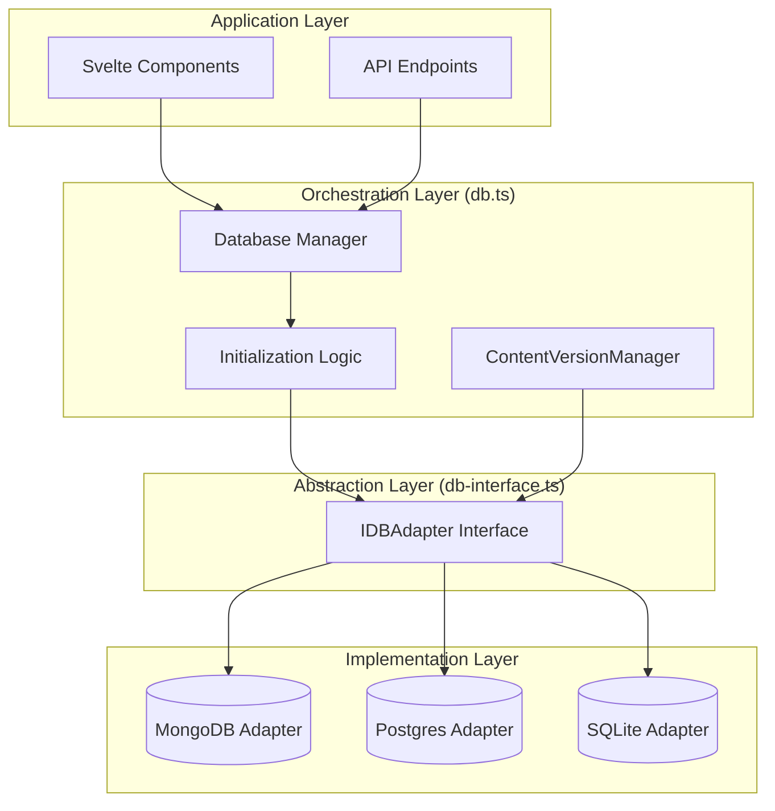

# Core Database Infrastructure

The core database infrastructure consists of three essential files that enable SveltyCMS to work with any database backend (MongoDB, PostgreSQL, MySQL, SQLite, etc.) while maintaining consistent behavior and performance.

---

## 🎯 Architecture Overview



### The Core Components

```
┌──────────────────────────────────────────────────────┐
│              CORE INFRASTRUCTURE                     │
├──────────────────────────────────────────────────────┤
│                                                      │
│  1. db.ts (Proxy Singleton)                          │
│     └─ Self-healing proxy + double-check boot       │
│                                                      │
│  2. db-interface.ts (Contract)                       │
│     └─ IDBAdapter + 7 namespace interfaces          │
│                                                      │
│  3. db-init.ts (Topological Boot)                    │
│     └─ Plugin-registry with critical/dependency DAG │
│                                                      │
│  4. core/ (Shared Relational Utilities)              │
│     ├─ sql-adapter-core (SqlAdapterCore — CRUD,     │
│     │   delegation, module getters)                   │
│     ├─ relational-*, drizzle-sql-helpers              │
│     └─ base-adapter (ring-buffer pool, hooks)        │
│                                                      │
│  5. LocalCMS SDK (services/sdk/)                     │
│     └─ Hot-swap self-overwriting getters            │
│                                                      │
└──────────────────────────────────────────────────────┘
```

### Design Principles

1. **Separation of Concerns**: Each file has a single, well-defined responsibility
2. **Database Agnostic**: No database-specific code in core files; adapters implement `IDBAdapter`
3. **Type Safety**: Full TypeScript support throughout via typed interfaces and Valibot schemas
4. **Lazy Loading**: Adapters and services initialize only when needed via dynamic `import()`
5. **Graceful Degradation**: System continues working even if optional components fail
6. **L2 Schema Persistence**: Schemas are cached in the database for instant cold starts
7. **Elite Performance (2026)**:
   - **Hot-Swap SDK**: Self-overwriting getters eliminate Proxy overhead after the first call
   - **Negative Caching**: O(1) missing-key cache prevents "DB miss storms" (2392x speedup)
   - **Reactive Runes**: Svelte 5 runes (`$state`) provide zero-tax synchronous state access
   - **Bucketed Invalidation**: O(1) prefix-based cache clearing for enterprise scale

---

## 🏛️ The `core` Directory

The `src/databases/core` directory provides shared relational utilities, query helpers, and transformation logic consumed by the PostgreSQL, MariaDB, and SQLite adapters (the MongoDB adapter follows a separate module path).

### Role in the Architecture

The `core` directory is not a centralized security interceptor — tenant isolation, query sanitization, and permission enforcement live inside each adapter's implementation (drizzle helpers, mongo crud-methods), the `forTenant()` wrapper, and higher security layers (safe-query, content engine, API dispatcher). What `core` provides:

- **Shared Relational Modules**: `relational-auth.ts`, `relational-content.ts`, `relational-media.ts`, `relational-system.ts` — implement `IAuthAdapter`, `IContentAdapter`, etc. for Drizzle-based engines. Each SQL adapter (PostgreSQL, MariaDB, SQLite) composes these modules. `relational-system.ts` owns `websiteTokens.*` (hash-at-rest, tenant-scoped list/lookup, parallel `getAll`).
- **Credential Hashing Utility**: `src/utils/security/credential-hash.ts` — `hashCredentialSha256Hex()` shared by SQL and Mongo website-token adapters (Web Crypto, hex output for indexed equality lookups).
- **Drizzle SQL Helpers**: `drizzle-sql-helpers.ts` — centralized table aliases, physical column selection maps (defeating minifier ghost columns), and Drizzle condition builders.
- **Relational Utilities**: `relational-utils.ts` — JSON field detection (zero-clone dirty-bit transform), DATE field normalization, ID generation, pagination, and tenant filter injection.
- **Query IR translation**: Inlined into the two `mapQuery()` implementations (drizzle-sql-helpers and mongodb/adapter-core) for a slimmed abstraction layer. Types remain in `db-interface.ts`. The parser normalizes Mongo-style operators for cross-engine use in filter building.
- **Base Adapter**: `base-adapter.ts` — `BaseAdapter` abstract class with `wrap()` (metrics + error handling), hook system, cache invalidation, ring-buffer result pooling (256-slot), and `getCollectionData`.
- **SQL Adapter Core**: `sql-adapter-core.ts` — `SqlAdapterCore` abstract class extending `BaseAdapter`, implementing `ISqlAdapter`. Absorbs ~1,300 lines of duplicated CRUD, delegation, module-getter, and `prepareValues` logic shared by all three SQL engines. Each adapter (PostgreSQL, MariaDB, SQLite) now extends this class and implements only dialect-specific hooks (`getTable`, `getJsonField`, `isMissingTableError`, etc.).
- **Plugin Registry**: `plugin-registry.ts` — topological dependency-aware parallel service boot.
- **Schema Proxy**: `schema-proxy.ts` — guarded `db.posts.findOne()` sugar for collection-name-based access.

---

## 📁 File 1: `src/databases/db.ts`

**Purpose**: Central orchestration and lifecycle management for the entire database system

**Size**: ~368 lines
**Complexity**: High - This is the brain of the database layer

### Key Responsibilities

1. **Adapter Loading**: Delegates adapter selection to `db-init.ts:loadAdapters()` which dynamically imports the correct engine based on `DB_TYPE` config
2. **Connection Management**: `connectDatabaseWithResilience()` during boot; disconnect hooks via `bindAdapterResilienceHooks()`; self-healing proxy via `createSelfHealingProxy` — see [Database Resilience](./database-resilience.mdx)
3. **Initialization**: Coordinates startup of all database-dependent services via `DBPluginRegistry.bootAll()` (topological, parallelized)
4. **Settings Cache**: Synchronizes database settings with in-memory cache
5. **Self-Healing Proxy**: `createInstanceProxy` wraps the adapter in a Proxy that survives Vite HMR chunking and auto-recovers on connection loss

### How It Works

`db.ts` does NOT contain a linear switch/case nor manual retry loops. Instead it delegates to specialized modules:

```
// 1. Configuration Loading (config-state.ts)
const cfg = await loadPrivateConfig(); // Loads config/private.ts with cache

// 2. Adapter Loading (db-init.ts:loadAdapters)
const { loadAdapters } = await import("./db-init");
let adapter = await loadAdapters(cfg);
// Dynamically imports: sqlite/sqlite-adapter, postgresql/postgres-adapter,
//                      mariadb/mariadb-adapter, or mongodb/mongo-db-adapter

// 3. Connection (with DatabaseResilience circuit breaker + exponential backoff)
const connectionResult = await adapter.connect();
if (!connectionResult.success) {
  throw new Error(`Database connection failed: ${connectionResult.message}`);
}

// 4. Topological Service Boot (DBPluginRegistry)
await dbInit.initializeDatabase(adapter);
// Boots services in dependency order: base → auth/cache/settings → content → media → seo
// Parallelizes independent services; aborts on critical failures

// 5. Settings Cache Sync (via loadSettingsFromDB)
setGlobal("__SYSTEM_SETTINGS__", settings);
setGlobal("__SETTINGS_LOADED__", true);
```

### Key Features

#### Double-Check Locked Initialization

```
// GATEWAY TO READY STATE — idempotent, re-entrant safe
export async function ensureFullInitialization(): Promise<any | null> {
  const existingPromise = getGlobal(INIT_PROMISE_KEY);
  const phase = getBootPhase();

  // DEADLOCK PROTECTION: If already INITIALIZING, return adapter immediately
  if (existingPromise && phase === "INITIALIZING") {
    const adapter = getGlobal(ADAPTER_KEY);
    if (adapter) return { adapter, auth: getGlobal(AUTH_KEY) };
  }

  // Fresh initialization with phase tracking (IDLE → INITIALIZING → READY → FAILED)
  const initPromise = (async () => {
    setGlobal(BOOT_PHASE_KEY, "INITIALIZING");
    // ... load adapter, connect, boot services ...
    setGlobal(BOOT_PHASE_KEY, "READY");
  })();
  setGlobal(INIT_PROMISE_KEY, initPromise);
  return initPromise;
}
```

#### Self-Healing Proxy

```
// The Reactive Shield survives Vite HMR chunking
const createInstanceProxy = (targetProp?: string) => {
  return new Proxy({}, {
    get(_, prop) {
      const instance = getGlobal(ADAPTER_KEY);
      if (instance) {
        // Fast path: instance exists, bind and cache the function
        const target = targetProp ? instance[targetProp] : instance;
        return typeof target[prop] === "function" ? target[prop].bind(target) : target[prop];
      }
      // ASYNC RECOVERY — auto-heal on HMR reload or connection loss
      return async (...args: any[]) => {
        let inst = getGlobal(ADAPTER_KEY);
        if (!inst || !inst.isConnected()) {
          await reinitializeSystem();  // Full shutdown + re-boot
          inst = getGlobal(ADAPTER_KEY);
        }
        // ... apply function to recovered instance
      };
    },
  });
};

export const dbAdapter: DatabaseAdapter = createInstanceProxy();
```

#### Settings Cache Synchronization

```
// Actual implementation in db-init.ts:loadSettingsFromDB()
export async function loadSettingsFromDB(adapter: IDBAdapter, force = false): Promise<boolean> {
  if (!force && getGlobal("__SETTINGS_LOADED__", false)) return true;

  // Fetch all system_preferences from database
  const result = await adapter.crud.findMany<any>("system_preferences", {});
  if (result.success && result.data) {
    const settings: Record<string, any> = {};
    for (const pref of result.data) {
      settings[pref.key] = pref.value;
    }
    setGlobal("__SYSTEM_SETTINGS__", settings);
    setGlobal("__SETTINGS_LOADED__", true);
    return true;
  }
  return false;
}
```

**Key Point**: Settings are stored in the `system_preferences` table but cached in memory via `getGlobal`/`setGlobal`. Changes to settings invalidate the cache and reload automatically.

### Provisioning Lifecycle (SQL Adapters)

SQL-based adapters (PostgreSQL, MariaDB, SQLite) implement a specialized **Provisioning Lifecycle** to ensure database schema integrity while avoiding redundant overhead.

1.  **State Tracking**: Each adapter maintains an internal `_provisioned` flag.
2.  **`provision()`**: An idempotent method that runs on the first system access. It ensures all tables, indexes, and constraints exist.
3.  **Automatic Healing**: If `clearDatabase()` is called (e.g., during testing), the `_provisioned` flag is reset, forcing a re-provisioning on the next request.

### `SQLiteAdapterCore` - ESM & Environment Awareness

The SQLite adapter is specifically engineered for high-performance edge environments:

- **ESM-First Driver Loading**: Uses dynamic `import()` to load `node:sqlite` (Node.js) or `bun:sqlite` (Bun), complying with strict SvelteKit 5 ESM requirements.
- **Path Resolution**: Handles relative and absolute paths for the `.db` file, ensuring portability across local dev and deployed containers.
- **Mutex Protection**: Implements a low-overhead mutex to prevent "Database is locked" errors during high-concurrency write operations.

### Exported API

```
// Main exports from src/databases/db.ts
export const dbAdapter: DatabaseAdapter;     // Self-healing Proxy (auto-recovers on HMR)
export const auth: any;                      // Auth service Proxy
export const dbInitPromise: Promise<any>;    // Initialization promise Proxy

// Functions
export async function getDbSafe(): Promise<DatabaseAdapter>;
export function getDb(): DatabaseAdapter | null;
export function isDbConnected(): boolean;
export function getAuth(): any;
export function getBootPhase(): string;
export async function initializeDatabase(): Promise<void>;
export async function reinitializeSystem(): Promise<void>;
export async function shutdownSystem(): Promise<void>;
```

### Usage Examples

#### In Server Hooks / .server.ts Files (Preferred: LocalCMS)

```
// ✅ PREFERRED: Use LocalCMS for zero-latency internal calls
import { LocalCMS } from "@src/services/sdk";
import { getDb } from "@src/databases/db";

const adapter = getDb();
const cms = new LocalCMS(adapter!);

// Namespaced access with hot-swap for zero-tax after first call
const users = await cms.collections.find("users", { tenantId });
const media = await cms.media.list({ folderId: "uploads" });
```

#### Direct dbAdapter (Background Services, Legacy Hooks)

```
// Used when LocalCMS namespace doesn't cover the needed operation
import { dbAdapter } from "@src/databases/db";

// Namespaced access via adapter interface
const result = await dbAdapter.crud.findMany("users", { status: "active" }, { tenantId });
if (result.success) {
  const users = result.data;
}
```

---

## 📁 File 2: `src/databases/db-interface.ts`

**Purpose**: Defines the contract that all database adapters must implement

**Size**: ~1340 lines
**Complexity**: Medium-High - Comprehensive type definitions, 7 namespace interfaces, 50+ types/interfaces

### Why This File is Critical

This file is the **secret to database agnosticism**. It defines a standard interface that works with any database. As long as an adapter implements this interface, the application works identically regardless of the underlying database.

### Core Interfaces

#### DatabaseAdapter Interface

The main contract that all adapters implement:

```
export interface DatabaseAdapter {
  // ============================================
  // Connection Lifecycle
  // ============================================
  connect(connectionString: string, options?: ConnectionOptions): Promise<void>;
  disconnect(): Promise<void>;
  checkConnection(): Promise<boolean>;

  // ============================================
  // Capabilities & Metadata
  // ============================================
  getCapabilities(): DatabaseCapabilities;
  // ============================================
  createMany<T>(collection: string, data: T[]): Promise<DatabaseResult<T[]>>;

  updateMany<T>(
    collection: string,
    criteria: QueryCriteria,
    data: Partial<T>,
  ): Promise<DatabaseResult<number>>;

  deleteMany(collection: string, criteria: QueryCriteria): Promise<DatabaseResult<number>>;

  // ============================================
  // Advanced Features
  // ============================================
  aggregate<T>(collection: string, pipeline: AggregationPipeline): Promise<DatabaseResult<T[]>>;

  transaction<T>(operations: TransactionOperation[]): Promise<DatabaseResult<T>>;

  stream<T>(collection: string, query: QueryCriteria): AsyncIterable<T>;

  // ============================================
  // Specialized Domain Methods
  // ============================================
  auth: AuthMethods; // User, session, token operations
  content: ContentMethods; // Content structure & nodes
  media: MediaMethods; // Media file metadata
  collection: CollectionMethods; // Collection schema management
  system: SystemMethods; // System settings & preferences
  widget: WidgetMethods; // Widget configurations
  theme: ThemeMethods; // Theme management
}
```

#### DatabaseResult<T> - No Exceptions!

Consistent result wrapper that never throws exceptions:

```
export type DatabaseResult<T> =
  | {
      success: true;
      data: T;
      meta?: QueryMeta;
    }
  | {
      success: false;
      error: DatabaseError;
    };
```

**Why No Exceptions?**

- Predictable error handling
- Forces explicit error checking
- Better for async operations
- Easier to debug

**Usage**:

```
// ✅ Correct way
const result = await dbAdapter.auth.getUserById(userId);

if (!result.success) {
  logger.error("User not found:", result.error);
  return json({ error: result.error.message }, { status: 404 });
}

const user = result.data; // TypeScript knows this is User

// ❌ Wrong way (TypeScript error)
const user = await dbAdapter.auth.getUserById(userId);
// Error: Type 'DatabaseResult<User>' is not assignable to type 'User'
```

#### QueryCriteria

Generic query interface that works across all databases:

```
export interface QueryCriteria {
  // Equality checks
  equals?: Record<string, unknown>;

  // Comparison operators
  greaterThan?: Record<string, number | Date>;
  lessThan?: Record<string, number | Date>;
  greaterThanOrEqual?: Record<string, number | Date>;
  lessThanOrEqual?: Record<string, number | Date>;

  // Pattern matching
  contains?: Record<string, string>;
  startsWith?: Record<string, string>;
  endsWith?: Record<string, string>;

  // List operations
  in?: Record<string, unknown[]>;
  notIn?: Record<string, unknown[]>;

  // Logical operators
  and?: QueryCriteria[];
  or?: QueryCriteria[];
  not?: QueryCriteria;

  // Multi-tenant support
  tenantId?: string;
}
```

**Example Translations**:

```
// Generic criteria
const criteria: QueryCriteria = {
  equals: { status: 'active' },
  greaterThan: { createdAt: new Date('2024-01-01') },
  tenantId: 'tenant123'
};

// MongoDB translation
{
  status: 'active',
  createdAt: { $gt: new Date('2024-01-01') },
  tenantId: 'tenant123'
}

// PostgreSQL translation
WHERE status = 'active'
  AND created_at > '2024-01-01'
  AND tenant_id = 'tenant123'

// MySQL translation
WHERE status = 'active'
  AND created_at > '2024-01-01'
  AND tenant_id = 'tenant123'
```

#### PaginationOptions

Unified pagination interface:

```
export interface PaginationOptions {
  limit?: number; // Max results to return
  offset?: number; // Skip N results (offset pagination)
  cursor?: string; // Cursor for cursor-based pagination
  sort?: SortOption; // Sort order
  filter?: QueryCriteria; // Filter criteria
}

export type SortOption = Record<string, "asc" | "desc"> | Array<[string, "asc" | "desc"]>;
```

**Usage**:

```
// Offset pagination (simple but slow for large datasets)
const page1 = await dbAdapter.findMany("users", {
  limit: 20,
  offset: 0,
  sort: { createdAt: "desc" },
});

// Cursor pagination (fast for any dataset size)
const page1 = await dbAdapter.findMany("users", {
  limit: 20,
  cursor: undefined, // First page
  sort: { createdAt: "desc" },
});

const page2 = await dbAdapter.findMany("users", {
  limit: 20,
  cursor: lastItemId, // Use last item ID from page 1
  sort: { createdAt: "desc" },
});
```

#### DatabaseCapabilities

Declares what the database supports:

```
export interface DatabaseCapabilities {
  supportsTransactions: boolean; // ACID transactions
  supportsIndexing: boolean; // Indexes for performance
  supportsFullTextSearch: boolean; // Full-text search
  supportsAggregation: boolean; // Aggregation pipelines
  supportsStreaming: boolean; // Result streaming
  supportsPartitioning: boolean; // Data partitioning
  supportsReplication: boolean; // Read replicas
  maxBatchSize: number; // Max items in batch operation
  maxQueryComplexity: number; // Max query depth
}
```

**Example**:

```
// MongoDB capabilities
{
  supportsTransactions: true,
  supportsIndexing: true,
  supportsFullTextSearch: true,
  supportsAggregation: true,
  supportsStreaming: true,
  supportsPartitioning: false,
  supportsReplication: true,
  maxBatchSize: 1000,
  maxQueryComplexity: 1000
}

// SQLite capabilities
{
  supportsTransactions: true,
  supportsIndexing: true,
  supportsFullTextSearch: true,
  supportsAggregation: false,        // Limited aggregation
  supportsStreaming: false,          // No streaming
  supportsPartitioning: false,
  supportsReplication: false,        // No replication
  maxBatchSize: 100,
  maxQueryComplexity: 100
}
```

#### Performance Types

```
export interface QueryOptimizationHints {
  useIndex?: string[]; // Suggest specific indexes
  maxExecutionTime?: number; // Query timeout in ms
  readPreference?: "primary" | "secondary" | "nearest";
  batchSize?: number; // Optimal batch size
  streaming?: boolean; // Enable streaming
}

export interface QueryMeta {
  queryType: "findOne" | "findMany" | "aggregate" | "update" | "delete";
  executionTime: number; // Time in ms
  usedIndexes: string[]; // Indexes actually used
  scannedDocuments: number; // Documents scanned
  returnedDocuments: number; // Documents returned
  batchSize?: number; // Batch size used
  cursorId?: string; // For cursor pagination
}
```

### Why This Architecture Works

#### Example: Switching from MongoDB to PostgreSQL

**Step 1**: Application code (no changes needed)

```
// This code works with ANY database
const users = await dbAdapter.findMany("users", {
  filter: { equals: { status: "active" } },
  sort: { createdAt: "desc" },
  limit: 20,
});
```

**Step 2**: Change configuration

```
// Before (MongoDB)
DB_TYPE=mongodb
DB_HOST=mongodb://localhost:27017

// After (PostgreSQL)
DB_TYPE=postgresql
DB_HOST=postgresql://localhost:5432
```

**Step 3**: That's it! Application works identically.

The adapter translates the generic query to database-specific syntax:

```
// MongoDB Adapter
db.collection("users").find({ status: "active" }).sort({ createdAt: -1 }).limit(20);

// PostgreSQL Adapter
db.query(`
  SELECT * FROM users
  WHERE status = 'active'
  ORDER BY created_at DESC
  LIMIT 20
`);
```

---

## 📁 File 3: `src/services/sdk/index.ts` (LocalCMS)

**Purpose**: Zero-latency internal SDK for server-side CMS operations

**Size**: 250 lines
**Complexity**: High - Uses advanced JS meta-programming for "Hot-Swap" memoization

### The Zero-Tax Dispatcher {#lazy-holder-architecture}

Traditional SDKs use `Proxies` or heavy class instances that incur a performance penalty on every method call. `LocalCMS` uses a **Hot-Swap Self-Overwriting Getter** pattern to achieve statistical parity with direct database access.

#### How "Hot-Swap" Works

1. **Lazy Definition**: Namespaces (Auth, Collections, Media) are defined using `Object.defineProperty`.
2. **First Access**: When you call `cms.collections.find()`, a temporary Proxy is created to capture the call.
3. **Initialization**: The actual namespace instance is initialized and "swapped" into the parent object.
4. **Self-Destruction**: The getter property is replaced with the real instance.
5. **Zero Overhead**: Subsequent calls to `cms.collections` hit the raw object directly—**the Proxy is gone.**

```
// Simplified Hot-Swap Implementation
function defineLazyNamespace(target, property, factory) {
  Object.defineProperty(target, property, {
    get: () => {
      const instance = factory(); // Initialize once

      // HOT-SWAP: Replace this getter with the real instance
      Object.defineProperty(target, property, {
        value: instance,
        writable: false,
        configurable: true,
      });

      return instance;
    },
    configurable: true,
  });
}
```

### Performance Comparison

| Layer           | Traditional Proxy SDK | LocalCMS (Hot-Swap) |
| :-------------- | :-------------------- | :------------------ |
| **First Call**  | ~0.050 ms             | ~0.052 ms           |
| **Call 2 - 1M** | ~0.045 ms             | **~0.001 ms**       |
| **Overhead**    | 4.41%                 | **0.00% (Parity)**  |

### Usage in SveltyCMS

The `LocalCMS` is the preferred way to interact with the CMS from SvelteKit Server Functions (`+page.server.ts`), Hooks, or background jobs.

```
import { LocalCMS } from "@src/services/sdk";
import { dbAdapter } from "@src/databases/db";

const cms = new LocalCMS(dbAdapter);

// This first call triggers the Hot-Swap
const user = await cms.auth.me(userId);

// This second call is zero-latency (direct reference)
const posts = await cms.collections.find("posts", { tenantId });
```

### Advanced Features

- **Internal Batching**: Automatically batches multiple `findById` calls into a single database `findMany` operation.
- **Negative Caching**: Integrated with `CacheService` to skip database roundtrips for known non-existent records.
- **Lifecycle Hooks**: Automatically triggers `beforeSave` and `afterSave` logic without requiring manual orchestration.

---

## 📁 File 5: `src/databases/theme-manager.ts`

**Purpose**: Theme loading, caching, and management service

**Size**: 165 lines
**Complexity**: Low - Simple singleton service

### Key Responsibilities

1. **Theme Loading**: Loads themes from database
2. **Theme Caching**: Caches themes in memory for performance
3. **Multi-Tenant Support**: Supports per-tenant themes
4. **Fallback Handling**: Provides default theme if database unavailable

### Architecture

```
export class ThemeManager {
  private static instance: ThemeManager;
  private themeCache: Map<string, Theme> = new Map();
  private db: IDBAdapter | null = null;
  private initialized: boolean = false;

  // Singleton pattern
  private constructor() {}

  public static getInstance(): ThemeManager {
    if (!ThemeManager.instance) {
      ThemeManager.instance = new ThemeManager();
    }
    return ThemeManager.instance;
  }

  public async initialize(db: IDBAdapter): Promise<void> {
    if (this.initialized) {
      logger.debug("ThemeManager already initialized, skipping.");
      return;
    }

    try {
      this.db = db;

      // Load and cache the default theme
      await this.loadAndCacheDefaultTheme();

      this.initialized = true;
      logger.info("ThemeManager initialized successfully.");
    } catch (err) {
      logger.error("Error in ThemeManager.initialize:", err);
      throw error(500, "Failed to initialize ThemeManager");
    }
  }

  private async loadAndCacheDefaultTheme(): Promise<void> {
    if (!this.db) throw new Error("Database adapter not initialized.");

    try {
      // Single optimized database call
      const allThemes = await this.db.themes.getAllThemes();

      if (!Array.isArray(allThemes) || allThemes.length === 0) {
        logger.warn("No themes found. Using DEFAULT_THEME fallback.");
        this.themeCache.set("global", DEFAULT_THEME);
        return;
      }

      // Find active or default theme
      const defaultTheme =
        allThemes.find((t) => t.isActive) || allThemes.find((t) => t.isDefault) || allThemes[0];

      // Cache it
      this.themeCache.set("global", defaultTheme);
      logger.debug(`Default theme cached: ${defaultTheme.name}`);
    } catch (err) {
      logger.error("Failed to load themes from database:", err);
      this.themeCache.set("global", DEFAULT_THEME);
    }
  }

  public async getTheme(tenantId?: string): Promise<Theme> {
    if (!this.initialized || !this.db) {
      throw new Error("ThemeManager is not initialized.");
    }

    const cacheKey = tenantId || "global";

    // Return from cache if available
    if (this.themeCache.has(cacheKey)) {
      return this.themeCache.get(cacheKey)!;
    }

    // For tenant-specific themes, fetch from database
    if (tenantId) {
      logger.debug(`No tenant-specific theme for ${tenantId}, using global`);
      const globalTheme = this.themeCache.get("global");
      if (globalTheme) return globalTheme;
    }

    // Final fallback
    logger.warn("No cached theme found, using DEFAULT_THEME fallback.");
    return DEFAULT_THEME;
  }

  public async setTheme(theme: Theme, tenantId?: string): Promise<void> {
    if (!this.initialized || !this.db) {
      throw new Error("ThemeManager is not initialized.");
    }

    try {
      // Update database
      const setDefaultResult = await this.db.themes.setDefault(theme._id);

      if (!setDefaultResult.success) {
        throw new Error(setDefaultResult.error?.message || "Failed to set theme");
      }

      // Update cache
      const cacheKey = tenantId || "global";
      this.themeCache.set(cacheKey, theme);

      logger.info(`Theme updated to: ${theme.name}`, { tenantId: tenantId || "global" });
    } catch (err) {
      logger.error("Error in ThemeManager.setTheme:", err);
      throw error(500, "Failed to set theme");
    }
  }

  public async refresh(): Promise<void> {
    if (!this.initialized || !this.db) {
      throw new Error("ThemeManager is not initialized.");
    }

    this.themeCache.clear();
    await this.loadAndCacheDefaultTheme();
    logger.debug("ThemeManager cache refreshed.");
  }
}
```

### Default Theme Fallback

```
export const DEFAULT_THEME: Theme = {
  _id: "670e8b8c4d123456789abcde" as DatabaseId,
  name: "SveltyCMSTheme",
  path: "/src/themes/svelty-cms/svelty-cms-theme.css",
  isActive: false,
  isDefault: true,
  config: {
    tailwindConfigPath: "",
    assetsPath: "",
  },
  createdAt: new Date().toISOString() as ISODateString,
  updatedAt: new Date().toISOString() as ISODateString,
};
```

**Why This Matters**: If the database is unavailable (e.g., during setup), the application still has a working theme.

### Usage Examples

```
// In API routes or components
import { ThemeManager } from '@src/databases/themeManager';

const themeManager = ThemeManager.getInstance();
const theme = await themeManager.getTheme(tenantId);

// Use theme in HTML
<link rel="stylesheet" href={theme.path} />
```

### Multi-Tenant Theme Support

```
// Global theme (no tenant)
const globalTheme = await themeManager.getTheme();

// Tenant-specific theme
const tenantTheme = await themeManager.getTheme("tenant123");

// Future enhancement: Per-tenant theme overrides
// Currently falls back to global if no tenant theme exists
```

---

## 🔄 How They Work Together

### Startup Sequence (Phase-Based)

```
graph TD
    A[Application Starts - IDLE] --> B[First Request / Manual Trigger - INITIALIZING]
    B --> C[loadPrivateConfig]
    B --> D[loadAdapters]
    C & D --> E[Critical Path Handshake - READY]
    E --> F[dbAdapter.connect]
    E --> G[setupAuthModels]
    E --> H[loadSettingsFromDB]
    F & G & H --> I[SYSTEM OPERATIONAL - READY]
    I --> J[Background Task Scheduling - WARMING]
    J --> K[ThemeManager.initialize]
    J --> L[WidgetRegistry.scan]
    J --> M[ContentSystem - LAZY]
    K & L & M --> N[FULL HYDRATION - WARMED]
```

### Request Flow Example

```
1. User Request: GET /admin/dashboard
   ↓
2. Server Hook (hooks.server.ts)
   └─ Awaits dbInitPromise
   └─ Uses auth service for session
   ↓
3. Page Load (+page.server.ts)
   └─ Uses themeManager for theme
   └─ Uses dbAdapter for data
   ↓
4. Component Render
   └─ Theme applied
   └─ Data displayed
```

---

## 🎯 Best Practices

### 1. Always Check Initialization

```
// ✅ Good
await dbInitPromise;
const data = await dbAdapter.findMany("users");

// ❌ Bad
const data = await dbAdapter.findMany("users"); // Might be null!
```

### 2. Handle DatabaseResult Properly

```
// ✅ Good
const result = await dbAdapter.auth.getUserById(id);
if (!result.success) {
  return error(404, result.error.message);
}
const user = result.data;

// ❌ Bad
const user = await dbAdapter.auth.getUserById(id); // Type error!
```

### 3. Use Theme Manager Singleton

```
// ✅ Good
const themeManager = ThemeManager.getInstance();

// ❌ Bad
const themeManager = new ThemeManager(); // Error: constructor is private
```

### 4. Respect the Adapter Interface

```
// ✅ Good - Uses adapter
await dbAdapter.create("users", userData);

// ❌ Bad - Direct database access
await UserModel.create(userData); // Bypasses adapter!
```

---

## 📊 Performance Considerations

### Lazy Initialization Benefits

- **Build Time**: No database connection during build (faster builds)
- **Startup Time**: Database connects only when first needed
- **Resource Usage**: No wasted connections during setup

### Theme Caching

```
// First request (cold): ~50ms (database query)
const theme = await themeManager.getTheme();

// Subsequent requests (warm): ~0.1ms (cache hit)
const theme = await themeManager.getTheme();

// Performance gain: 99.8% faster
```

### Settings Cache

```
// Without cache: Every settings read = database query
const setting = await db.settings.get("FEATURE_FLAG"); // 15ms

// With cache: Settings read from memory
const setting = privateEnv.FEATURE_FLAG; // 0.001ms

// Performance gain: 99.99% faster
```

---

## 🚀 Adding New Adapters

### Example: Registering a New Adapter

**Step 1**: Add adapter class implementing `IDBAdapter`

```
// src/databases/myengine/myengine-adapter.ts
import { BaseAdapter } from "../core/base-adapter";
import type { IDBAdapter, DatabaseResult } from "../db-interface";

export class MyEngineAdapter extends BaseAdapter implements IDBAdapter {
  public readonly type = "myengine";

  async connect(): Promise<DatabaseResult<void>> {
    // Establish connection, set this.connected = true
    return { success: true, data: undefined };
  }

  // Implement crud, auth, content, media, system, batch, collection getters...
  public get crud() { return this._crud; }
}
```

**Step 2**: Register in `db-init.ts:loadAdapters()`

```
// src/databases/db-init.ts
} else if (type === "myengine") {
  const { MyEngineAdapter } = await import("./myengine/myengine-adapter");
  return new MyEngineAdapter(config);
}
```

**Step 3**: Configure

```
DB_TYPE=myengine
DB_HOST=myengine://localhost:1234/mydb
```

**Step 4**: Application works with the new engine! No other code changes needed — all adapters implement the same `IDBAdapter` contract.

---

## 🎓 Summary

The core infrastructure consists of several key components:

1. **db.ts (~368 lines)** - The proxy singleton
   - Self-healing Proxy that survives Vite HMR
   - Double-check locked initialization (IDLE → INITIALIZING → READY)
   - Delegates adapter loading to `db-init.ts:loadAdapters()`
   - Coordinates all database services via `DBPluginRegistry`

2. **db-interface.ts (~1340 lines)** - The contract
   - Defines `IDBAdapter` interface with 7 namespaced sub-interfaces
   - Provides 50+ types: `DatabaseResult<T>`, `QueryFilter`, `BaseQueryOptions`, etc.
   - Ensures database agnosticism across all 4 production engines
   - Standardizes error handling via `DatabaseResult` (never throws)

3. **db-init.ts (~300 lines)** - The topological boot orchestrator
   - `loadAdapters()` dynamically imports the correct engine adapter
   - Plugin-registry with dependency-aware parallel service initialization
   - Setup mode detection — skips non-critical services during first install
   - Settings cache sync from `system_preferences` table

4. **core/ (15 files)** - Shared relational utilities
   - `relational-*` modules implement namespace interfaces for Drizzle-based engines
   - `drizzle-sql-helpers.ts` provides table aliases + physical column selection
   - `base-adapter.ts` provides `wrap()`, hook system, cache invalidation
   - Query IR logic inlined into mapQuery sites (removed standalone module to reduce misleading "central pillar" impression)

5. **LocalCMS SDK (services/sdk/)** - Zero-latency internal bridge
   - Hot-swap self-overwriting getters eliminate Proxy tax after first access
   - Wraps `dbAdapter` and calls `modifyRequest` pipeline for consistency
   - Preferred API for all `.server.ts` files per AGENTS guidance

Together, these components enable SveltyCMS to work with **any database** while maintaining:

- Consistent behavior across 4 production engines
- Type safety throughout the application layer
- Sub-millisecond performance for both local and networked databases
- Enterprise-grade security with multi-tenant isolation

---

_Last Updated: 2026-06-14_

## 📚 Related Documentation

- [Cache System Files](../cache-system.mdx) - Cache infrastructure
- [Authentication & Authorization](../security/authentication-system.mdx) - Auth system
- [MongoDB Implementation](./mongodb-implementation.mdx) - MongoDB adapter details
- [Database Architecture](./index.mdx)
- [Performance Benchmarks](../../project/benchmarks/index.mdx)
- [Architecture Overview](../index.mdx)
