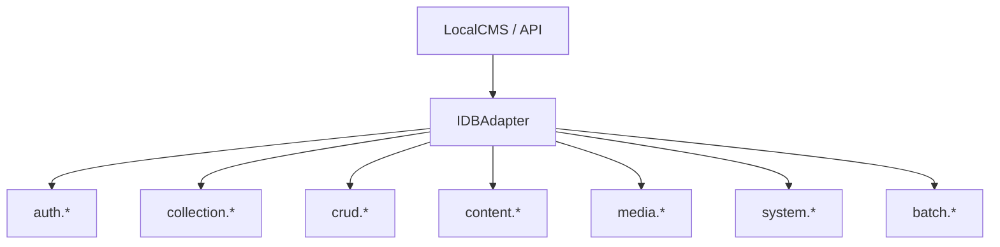

# Database Methods Interface

## 🎯 Architectural Vision

SveltyCMS leverages a **Modular Namespace** pattern to organize its database capabilities. Instead of a single monolithic adapter, functionality is divided into specialized domains. This ensures that as the system grows, the database layer remains maintainable, testable, and strictly type-safe.

**Core Principle:** Write once (in the application layer), deploy everywhere (MongoDB, SQL, etc.).



---

## 🛠️ Global Interface Contract

All methods in the SveltyCMS database layer follow the **`DatabaseResult<T>`** pattern. They MUST NOT throw exceptions for expected failures; instead, they return a structured object.

```typescript
export type DatabaseResult<T> =
  | { success: true; data: T; meta?: QueryMeta }
  | { success: false; error: DatabaseError };
```

---

## 🛡️ `auth.*` Namespace
**Responsibility:** Identity, Session Management, and RBAC.

| Method | Description |
| :--- | :--- |
| `createUser(data, options)` | Creates a new user with encrypted password. |
| `getUserById(id)` | Retrieves a user by their primary key. |
| `getUserByEmail(email)` | Retrieves a user for login flows. |
| `validatePassword(userId, password)` | Securely verifies password hashes. |
| `createSession(userId, data)` | Generates a persistent session. |
| `invalidateSession(sessionId)` | Revokes a specific session. |
| `listUsers(options)` | Paginated retrieval of system users. |

---

## 🗂️ `collection.*` Namespace
**Responsibility:** Dynamic Schema and Model Management.

| Method | Description |
| :--- | :--- |
| `createModel(schema)` | Provisions tables or collections for a new content type. |
| `listSchemas(tenantId)` | Retrieves all registered collection definitions. |
| `updateModel(schema)` | Handles bi-directional schema synchronization. |
| `deleteModel(id)` | Drops the physical storage and definition. |

---

## ⚡ `crud.*` Namespace
**Responsibility:** High-performance, standardized data operations.

| Method | Description |
| :--- | :--- |
| `find(collection, criteria, options)` | Advanced filtering with Query IR support. |
| `findOne(collection, criteria)` | Single record retrieval fast-path. |
| `insert(collection, data, options)` | Standard record creation. |
| `update(collection, criteria, data)` | Scoped updates with multi-tenant safety. |
| `delete(collection, criteria)` | Permanent or soft-deletion of records. |
| `upsert(collection, criteria, data)` | Atomic "Update or Insert" operation. |

---

## 📦 `content.*` Namespace
**Responsibility:** CMS Workflows (Nodes, Drafts, Revisions).

| Method | Description |
| :--- | :--- |
| `nodes.getStructure(tenantId)` | Retrieves the hierarchical content tree. |
| `nodes.upsertNode(node)` | Persists structural nodes (Menus, Categories). |
| `drafts.create(data)` | Manages work-in-progress content nodes. |
| `revisions.list(contentId)` | Retrieves historical audit trail and snapshots. |

---

## 🖼️ `media.*` Namespace
**Responsibility:** File Metadata and Organization.

| Method | Description |
| :--- | :--- |
| `saveMetadata(data)` | Persists file size, dimensions, and SHA-256 hash. |
| `getFilesByFolder(folderId)` | Paginated retrieval of media items. |
| `updateMetadata(id, data)` | Updates Alt text, tags, or focal points. |

---

## ⚙️ `system.*` Namespace
**Responsibility:** Preferences, Jobs, and Multi-Tenancy.

| Method | Description |
| :--- | :--- |
| `preferences.get(key, scope)` | Retrieves User or System settings. |
| `preferences.set(key, value)` | Persists settings with automatic cache invalidation. |
| `tenants.create(data)` | Provisions a new isolated workspace. |
| `themes.ensure(theme)` | Idempotent theme registration during setup. |

---

## 🚀 Implementation Matrix (Status 2026)

| Namespace | MongoDB | PostgreSQL | MariaDB | SQLite |
| :--- | :--- | :--- | :--- | :--- |
| **Auth** | ✅ Production | ✅ Production | ✅ Production | ✅ Production |
| **CRUD** | ✅ Production | ✅ Production | ✅ Production | ✅ Production |
| **Content** | ✅ Production | ✅ Production | ✅ Production | ✅ Production |
| **Media** | ✅ Production | ✅ Production | ✅ Production | ✅ Production |
| **System** | ✅ Production | ✅ Production | ✅ Production | ✅ Production |
| **Batch** | ✅ Production | ✅ Production | ✅ Production | ✅ Production |
| **SCIM** | ✅ Beta | ✅ Beta | ✅ Beta | ✅ Beta |

---

## 📓 Developer Best Practices

1. **Always use the Interface**: Never cast `IDBAdapter` to a concrete class like `SQLiteAdapter` unless performing emergency maintenance.
2. **Favor `LocalCMS`**: Use the SDK bridge in server files for 0ms internal latency.
3. **Respect `tenantId`**: Ensure every query includes a tenant scope to maintain data isolation.
4. **Error Checking**: Always check `result.success` before accessing `result.data`.

---

## Related Documentation

- [Core Infrastructure](./core-infrastructure.mdx) - The internal engine and `db.ts` lifecycle.
- [Database Resilience](./database-resilience.mdx) - Error handling and recovery patterns.
- [SQLite Implementation](./sqlite-implementation.mdx) - Specific optimizations for edge deployments.
- [PostgreSQL Implementation](./postgresql-implementation.mdx) - Enterprise scaling with JSONB.
