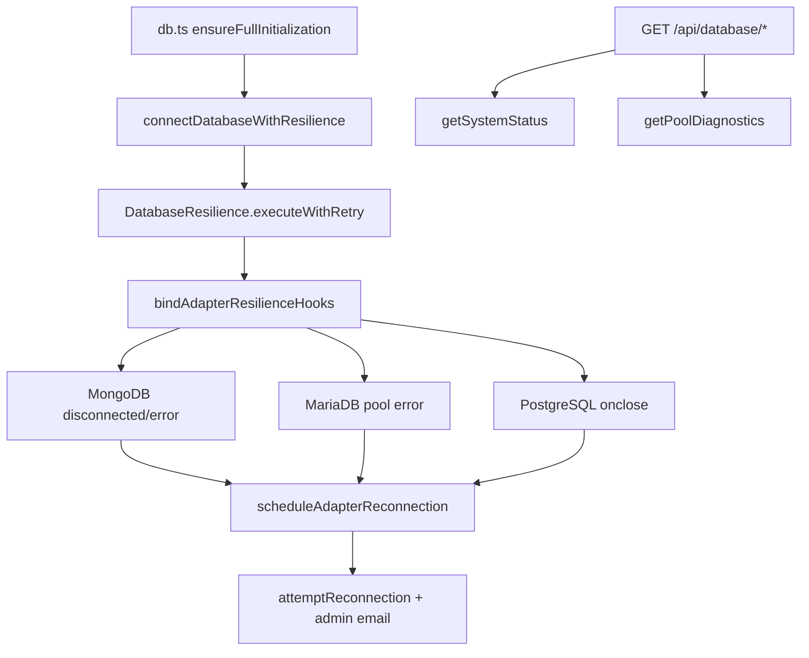

# Database Resilience

End-to-end database resilience is implemented across the engine, boot path, adapter disconnect hooks, REST APIs, and dashboard widgets.

---

## Architecture



---

## Implementation Status (Complete)

| Feature                                   | Status | Key Artifacts                                                    |
| ----------------------------------------- | ------ | ---------------------------------------------------------------- |
| Boot connect with retry + circuit breaker | ✅     | `resilience-integration.ts` → `db.ts`                            |
| Adapter disconnect hooks                  | ✅     | Mongo `disconnected`/`error`, MariaDB `pool error`, PG `onclose` |
| Debounced self-healing reconnect          | ✅     | `scheduleAdapterReconnection()` → `attemptReconnection()`        |
| Admin email on persistent failure         | ✅     | `notifyAdminsOfDatabaseFailure()` + `database-failure.svelte`    |
| Unified system status                     | ✅     | `getSystemStatus()`                                              |
| Pool diagnostics API                      | ✅     | `GET /api/database/pool-diagnostics`                             |
| Database status API                       | ✅     | `GET /api/database/status`                                       |
| Log export API                            | ✅     | `GET /api/logs/download` (redacted)                              |
| Health endpoint resilience metrics        | ✅     | `GET /api/system/health` includes `resilience` block             |
| Redis connection retries                  | ✅     | `redis-store.ts`                                                 |
| Self-healing adapter proxy                | ✅     | `createSelfHealingProxy` in `db.ts`                              |
| Init promise locking                      | ✅     | `INIT_PROMISE_KEY` double-check in `db.ts`                       |
| Capability guards                         | ✅     | `ensureAuth()`, `ensureSystem()`, …                              |
| SQL migrations                            | ✅     | `runMigrations()` per Drizzle adapter                            |
| Dashboard pool widget                     | ✅     | `database-pool-diagnostics.svelte`                               |

---

## APIs

### `GET /api/database/pool-diagnostics` (admin)

Returns connection pool stats, utilization, health level, and scaling recommendations.

### `GET /api/database/status` (admin)

Full `getSystemStatus()` payload: health latency ping, resilience metrics, pool diagnostics, system state machine, DB type.

### `GET /api/system/health` (public liveness)

Fast connectivity check plus lightweight `resilience` counters (`circuitState`, `totalRetries`, …).

### `GET /api/logs/download` (admin)

| Param    | Values                     | Description                |
| -------- | -------------------------- | -------------------------- |
| `type`   | `latest`, `all`, `archive` | Which log files to include |
| `format` | `text`, `gzip`             | Response format            |
| `since`  | ISO timestamp              | Filter lines after date    |
| `level`  | `error`, `warn`, …         | Filter by log level        |

Sensitive fields (`password`, `token`, `secret`, …) are redacted in exported lines.

---

## Developer Usage

```ts
import { getDatabaseResilience } from "@src/databases/database-resilience";
import {
  connectDatabaseWithResilience,
  getSystemStatus,
} from "@src/databases/resilience-integration";

// Boot (already wired in db.ts)
await connectDatabaseWithResilience(adapter, "Database Boot (postgresql)");

// Custom idempotent operation
const resilience = getDatabaseResilience();
await resilience.executeWithRetry(async () => {
  /* ... */
}, "My Operation");

// Dashboard / monitoring
const status = await getSystemStatus();
```

---

## Circuit Breaker & Adaptive Cooldown

- **Threshold**: 5 consecutive failures → `OPEN` for 60s (configurable)
- **Recovery**: `HALF_OPEN` probe → `CLOSED` on success
- **Adaptive**: Rapid recovery (&lt;5s) shrinks cooldown by 20% (floor 10s)

---

## Future Roadmap

| Item                                                  | Status     |
| ----------------------------------------------------- | ---------- |
| Adaptive per-retry delay from historical success rate | 🔲 Planned |
| Distributed breaker coordination across instances     | 🔲 Planned |
| Percentile latency trends (p50/p95/p99)               | 🔲 Planned |

---

## Testing

```bash
bun test tests/unit/databases/database-resilience.test.ts
bun test tests/unit/databases/resilience-integration.test.ts
bun test tests/integration/databases/resilience-load.test.ts
bun test tests/unit/hooks/defense-in-depth.test.ts
```

---

## Related

- [Core Infrastructure](./core-infrastructure.mdx)
- [Database Methods](./database-methods.mdx)
- Source: `src/databases/database-resilience.ts`, `src/databases/resilience-integration.ts`

---

**Last Updated**: 2026-06-22 — End-to-end implementation complete (boot, hooks, APIs, status).
