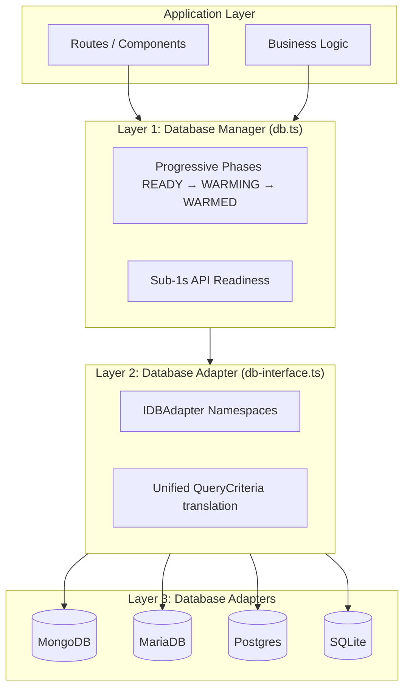

# Database Documentation Hub

Welcome to the SveltyCMS Database Engine documentation. Our architecture is built on the principle of **Strict Agnosticism**, allowing you to swap between NoSQL and Relational engines without changing a single line of application logic.

---

## 📚 Documentation Structure

### 1. Database-Agnostic Architecture

These documents explain the core infrastructure and the contract that enables engine portability.

- **[Core Infrastructure](./core-infrastructure.mdx)**
  - `db.ts` - The lifecycle manager and boot sequence (IDLE → READY → WARMED).
  - **Provisioning Lifecycle** - How SQL engines handle idempotent schema creation.
  - **LocalCMS SDK** - Zero-latency internal bridge for server-side logic.
- **[Database Methods Interface](./database-methods.mdx)**
  - Comprehensive reference of the `IDBAdapter` namespaces: `auth`, `crud`, `content`, `media`, `system`.
  - The implementation matrix across all 4 production-ready engines.
- **[Database Resilience](./database-resilience.mdx)**
  - Error handling, retry logic, and connection health monitoring.

### 2. High-Performance Services

Agnostic services that rely on the database layer but provide high-level features.

- **[Cache System](../cache-system.mdx)**
  - Dual-layer caching (Redis + In-Memory) with pattern-based predictive prefetching.
- **[Authentication System](../authentication-system.mdx)**
  - Secure identity management, RBAC, session isolation, and 2FA.

### 3. Engine Implementations

Deep-dives into how specific adapters implement the `IDBAdapter` contract.

- **[SQLite Implementation](./sqlite-implementation.mdx)** ✅ **Platinum Status**
  - Default for local development and edge. Zero-config with 7 performance PRAGMAs.
- **[PostgreSQL Implementation](./postgresql-implementation.mdx)** ✅ **Production Ready**
  - Enterprise scaling with native JSONB, GIN indexing, and trigram search.
- **[MariaDB Implementation](./mariadb-implementation.mdx)** ✅ **Production Ready**
  - High-concurrency pooling via `mysql2` and optimized relational schemas.
- **[MongoDB Implementation](./mongodb-implementation.mdx)** ✅ **Production Ready**
  - Original NoSQL engine. Optimized for high-volume unstructured data.

---

## 🏗️ Architecture Overview

---

## 🔧 Key Performance Features (2026)

- **Sub-Millisecond Persistence**: Our SQL adapters achieve <1ms writes through atomic batching and write-ahead logging.
- **Zero-Allocation Transformation**: The `RelationalUtils` engine uses a dirty-bit check to avoid object cloning during date/JSON conversion.
- **ESM-First Loading**: Dynamic `import()` ensures that binary database drivers never bloat your client-side bundle or break SvelteKit 5 strict isolation.
- **Tamper-Evident Logs**: Relational structure with transactional integrity for cryptographic audit log chaining.

---

## 📈 Performance Benchmarks

SveltyCMS delivers consistent, sub-millisecond performance across all supported database adapters thanks to our **Unified Caching Layer**. For the full breakdown of response times, cold-start latencies, and scalability metrics, please refer to the [Performance Benchmarks](/docs/project/benchmarks) document.

---

**Last Updated**: 2026-05-11  
**Maintained by**: SveltyCMS Team
