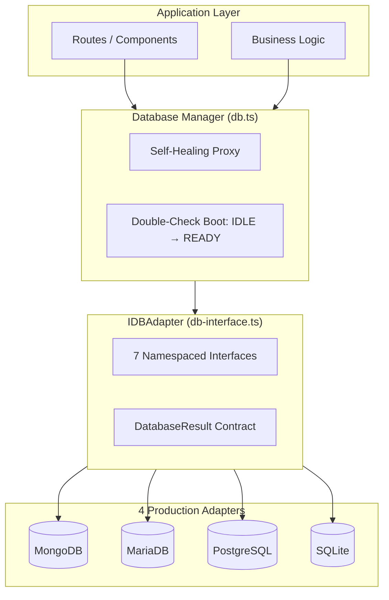

# Database Documentation Hub

Welcome to the SveltyCMS Database Engine documentation. Our architecture is built on the principle of **Strict Agnosticism**, allowing you to swap between NoSQL and Relational engines without changing a single line of application logic.

---

## 📚 Documentation Structure

### 1. Database-Agnostic Architecture

- **[Core Infrastructure](./core-infrastructure.mdx)** — `db.ts` lifecycle, self-healing proxy, plugin-registry topological boot, LocalCMS SDK
- **[Database Methods Interface](./database-methods.mdx)** — `IDBAdapter` namespaces: `auth`, `crud`, `content`, `media`, `system`, `batch`, `collection`
- **[Database Resilience](./database-resilience.mdx)** — Error handling, retry logic, circuit breaker, connection health monitoring
- **[Performance Architecture](./performance-architecture.mdx)** — 2027 allocation-floor optimizations, schema-aware conversion, ring-buffer pools, cross-database impact

### 2. Engine Implementations

- **[SQLite Implementation](./sqlite-implementation.mdx)** ✅ **Platinum** — Default for local/edge. Sub-ms CRUD, WAL mode, zero network overhead.
- **[PostgreSQL Implementation](./postgresql-implementation.mdx)** ✅ **Production** — Enterprise scaling, native JSONB, GIN indexing, PgBouncer support.
- **[MariaDB Implementation](./mariadb-implementation.mdx)** ✅ **Production** — High-concurrency pooling via `mysql2`, optimized relational schemas.
- **[MongoDB Implementation](./mongodb-implementation.mdx)** ✅ **Production** — NoSQL engine, safeQuery security, wire compression.

---

## 🏗️ Architecture Overview

---

## 🛡️ Shared Security Principles (All Adapters)

- **4-Layer Defense-in-Depth**: Middleware → Dispatcher → Handler → Page Action
- **Tenant Isolation**: Every query scoped by `tenantId` at adapter level — architecturally impossible to bypass
- **Credential Hashing**: Website tokens and API keys are stored as SHA-256 digests only; plaintext is returned once on creation. See [`system.websiteTokens`](./database-methods.mdx#-credential-storage-website-tokens--api-keys).
- **Tenant-Scoped Bearer Lookup**: Auth passes `locals.tenantId` into credential lookups (aligned with `auth.getApiKey`) to narrow multi-tenant queries.

- **MongoDB Soft-Delete Safety**: `safeQuery()` applies `isDeleted: { $ne: true }` so legacy documents without the field remain visible to active queries.
- **SSRF Prevention**: Cloud storage adapters validate endpoints before connection
- **NoSQL Injection Protection**: `sanitizeMongoQuery` blocks `$where`, `$function`, `$expr`
- **CSPRNG-Only Tokens**: `globalThis.crypto.getRandomValues()`, no `Math.random()` fallback
- **Fail-Closed API**: Unmapped namespaces return 403 by default

## 🔄 Shared Resilience Patterns (All Adapters)

- **Circuit Breaker**: 5 consecutive failures → 60s open → probe recovery
- **Self-Healing Reconnection**: Auto-recovery on connection loss + HMR reload
- **Exponential Backoff with Jitter**: 1s→2s→4s→8s→16s, ±500ms
- **Connection Pool Diagnostics**: `GET /api/database/pool-diagnostics` + dashboard widget — see [Database Resilience](./database-resilience.mdx)
- **Migration Safety**: `CREATE TABLE IF NOT EXISTS` — idempotent

## ⚡ 2027 Allocation-Floor Optimizations

| Optimization                       | SQLite | PostgreSQL | MariaDB | MongoDB |
| ---------------------------------- | ------ | ---------- | ------- | ------- |
| Schema-aware row conversion        | ✅     | ✅         | ✅      | N/A     |
| Ring-buffer result pool (64 slots) | ✅     | ✅         | ✅      | ✅      |
| Conditions array pool (32 slots)   | ✅     | ✅         | ✅      | N/A     |
| Fused mapQuery (no IR objects)     | ✅     | ✅         | ✅      | ✅      |
| for...in (zero Object.entries)     | ✅     | ✅         | ✅      | ✅      |
| Pre-allocated meta object          | ✅     | ✅         | ✅      | ✅      |
| MariaDB double-parse isolated      | N/A    | ✅         | ✅      | N/A     |

> **SQL family**: ~5-8 fewer allocations per filtered query. **MongoDB**: ~2-3 fewer (result pool + fused mapQuery). **All 4**: benefit from shared BaseAdapter optimizations.

## 📈 Performance Benchmarks (SQLite, Latest)

| Operation             | Latency      | RPS              |
| --------------------- | ------------ | ---------------- |
| FIND ONE              | **0.090 ms** | 10,386           |
| DELETE                | **0.051 ms** | 14,447           |
| Peak Throughput       | —            | **15,617 req/s** |
| LocalCMS SDK Overhead | —            | **0.00%**        |

Full cross-database benchmarks: [Performance Benchmarks](/docs/project/benchmarks/index).

## Adapter Selection Guide

| Scale                  | Recommended DB                     | Why                                       |
| ---------------------- | ---------------------------------- | ----------------------------------------- |
| Dev, edge, small teams | **SQLite** (default)               | In-process, zero network, sub-ms CRUD     |
| Production single node | **PostgreSQL**                     | JSONB, FTS, replication ready             |
| Enterprise / K8s       | **PostgreSQL** + PgBouncer + Redis | Horizontal scale, cross-node invalidation |
| Global / multi-region  | **PostgreSQL** + replicas + CDN    | Read replicas, geo-distribution           |

MongoDB for unstructured/high-volume. MariaDB for MySQL-compatible setups. All 4 are production-ready.

---

**Last Updated**: 2026-06-22 (website-token credential hardening, safeQuery soft-delete fix, parallel SQL list+count)
**Maintained by**: SveltyCMS Team
