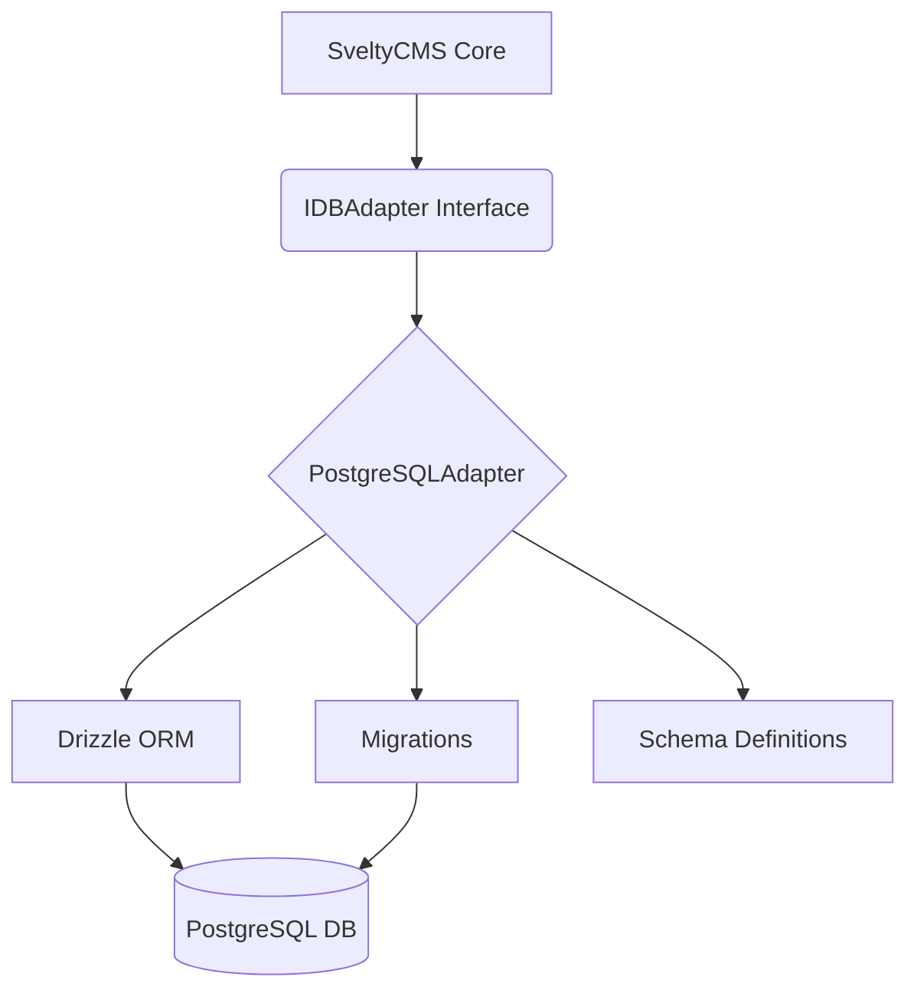
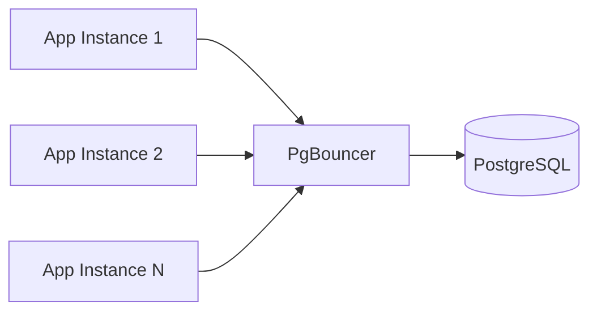

# PostgreSQL Implementation

> [!NOTE]
> PostgreSQL support is **production-ready**. All adapter modules (Auth, CRUD, Content, Media, System, Widgets, Themes, Batch, Transactions, Performance, Cache, Collections, Multi-Tenancy) are fully implemented with Drizzle ORM.

## Overview

SveltyCMS supports PostgreSQL as an alternative to MongoDB and MariaDB through the database adapter pattern. The PostgreSQL adapter uses **Drizzle ORM** with the `postgres.js` driver for optimal performance and type safety.

## Architecture

The PostgreSQL adapter follows a modular pattern, leveraging Drizzle ORM for schema-agnostic operations and raw SQL for initial schema setup.



### File Structure

```
src/databases/postgresql/
├── postgresAdapter.ts      # Entry point (re-exports adapter)
├── migrations.ts           # Automatic "CREATE TABLE IF NOT EXISTS" logic
├── utils.ts               # Error handling and data transformation
├── adapter/
│   ├── index.ts           # Main adapter class with feature modules
│   └── adapterCore.ts     # Core functionality (connect, disconnect, health)
└── schema/
    └── index.ts           # Drizzle ORM schema definitions
```

## Schema Initialization (Migrations)

Unlike MongoDB which is schema-less, PostgreSQL requires table definitions. SveltyCMS implements an automatic migration system that runs during the initial setup or the first system access.

```
sequenceDiagram
    participant S as Setup Wizard / System Init
    participant A as PostgreSQLAdapter
    participant M as Migrations
    participant D as PostgreSQL DB

    S->>A: ensureSystem()
    A->>M: runMigrations(sql)
    M->>D: CREATE TABLE IF NOT EXISTS ...
    D-->>M: Tables Created/Verified
    M-->>A: { success: true }
    A-->>S: Ready
```

## Connection Configuration

PostgreSQL connections are configured in `config/private.ts` or during the setup wizard:

```
// Configuration Object
{
    type: 'postgresql',
    host: 'localhost',
    port: '5432',
    name: 'sveltycms',
    user: 'postgres',
    password: 'your_password'
}
```

## Drizzle Schema

The PostgreSQL schema mirrors the CMS data model but is optimized for relational performance.

### Key Implementation Details

| Feature           | Implementation                              |
| ----------------- | ------------------------------------------- |
| **Primary Key**   | `varchar(36)` (UUID compatible strings)     |
| **Timestamps**    | `timestamp()` with ISODateString conversion |
| **JSON fields**   | `jsonb()` for binary JSON with GIN indexing |
| **Multi-Tenancy** | `tenantId` indexed columns on all tables    |

## Current Implementation Status

### ✅ All Modules Implemented

| Module           | Status      | Notes                                                |
| ---------------- | ----------- | ---------------------------------------------------- |
| `auth.*`         | ✅ Complete | Users, sessions, tokens, roles with compound indexes |
| `crud.*`         | ✅ Complete | Full CRUD with query builder and batch operations    |
| `content.*`      | ✅ Complete | Nodes, drafts, revisions with JSONB data storage     |
| `media.*`        | ✅ Complete | File metadata, folders, thumbnails                   |
| `batch.*`        | ✅ Complete | Transactional batch operations                       |
| `performance.*`  | ✅ Complete | Latency tracking and health monitoring               |
| `tenants.*`      | ✅ Complete | Full CRUD (create, getById, update, delete, list)    |
| `cleanupExpired` | ✅ Complete | TTL-equivalent cleanup for sessions/tokens           |
| `versioning`     | ✅ Complete | Atomic `getVersion` and `incrementVersion`           |

### PostgreSQL-Specific Optimizations

- **JSONB** (not JSON): All 20 metadata columns use binary JSONB with efficient containment operators (`@>`, `?`, `?|`)
- **GIN Indexes**: 5 GIN indexes on high-query JSONB columns (`content_nodes.data`, `content_nodes.metadata`, `media_items.metadata`, `roles.permissions`, `auth_users.roleIds`)
- **Trigram Search**: High-performance `ilike` searching for media filenames using `pg_trgm` GIN indexes (`media_items_filename_trgm_idx`).
- **`gen_random_uuid()`**: Native UUID generation via pgcrypto extension
- **Tenants Table**: Full multi-tenancy with quota, usage, and settings JSONB columns
- **Website Tokens**: `website_tokens` via shared `relational-system.ts` — SHA-256 hash at rest, unique index on `token`, compound `{ tenantId, name }`, parallel list+count. See [Credential Storage](./database-methods.mdx#-credential-storage-website-tokens--api-keys).

## Development Guide

To extend the PostgreSQL adapter:

### 1. Schema Updates

Modify `src/databases/postgresql/schema/index.ts`. Remember to also update `src/databases/postgresql/migrations.ts` to ensure tables are created correctly for new users.

### 2. Implementing Methods

Implement methods in `src/databases/postgresql/adapter/index.ts`. Use the `wrap()` helper for consistent error handling and logging.

```
public readonly crud = {
  findOne: async (collection: string, query: Record<string, unknown>) => {
    return this.wrap(async () => {
      const table = this.getTable(collection);
      const where = this.mapQuery(table, query);
      const result = await this.db!.select().from(table).where(where).limit(1);
      return result[0] || null;
    }, 'CRUD_FIND_ONE_FAILED');
  }
};
```

## Performance Benchmarks

The PostgreSQL adapter is optimized for relational efficiency and JSONB search performance. For detailed performance metrics and comparisons, please refer to the [Performance Benchmarks](/docs/project/benchmarks/index) document.

Key PostgreSQL highlights:

- **JSONB with GIN Indexing**: 0.063 ms NATIVE UPSERT, 0.083 ms FIND MANY, 1.201 ms FIND ONE.
- **Partial Indexes**: Optimized performance for active sessions and tokens.
- **Connection Health**: Robust pooling via `postgres.js` with integrated health checks.

### Key Optimizations

- **JSONB with GIN Indexing**: All 20 metadata columns use PostgreSQL's binary `jsonb` type with 5 GIN indexes for sub-10ms search on complex containment queries.
- **Partial Indexes**: Only index active sessions and unconsumed tokens — reduces index size and speeds up common auth queries.
- **Connection Health**: Optimized pooling via `postgres.js` with health checks and reconnection.
- **TTL-Equivalent Cleanup**: `cleanupExpiredData()` method purges expired sessions and consumed tokens (equivalent to MongoDB's TTL indexes).
- **Tamper-Evident Logs**: Relational structure with transactional integrity for cryptographic audit log chaining.

---

- [Drizzle ORM Documentation](https://orm.drizzle.team/)
- [postgres.js GitHub](https://github.com/porsager/postgres)
- [MariaDB Implementation](./mariadb-implementation.mdx)

---

## 🚀 Production Scaling with PgBouncer (Enterprise)

For high-concurrency Postgres deployments or managed databases with connection limits (RDS, Azure, Cloud SQL), SveltyCMS recommends deploying **PgBouncer** as a connection proxy layer. This follows the same pattern used at scale by Instagram, OpenAI, and other Postgres-heavy platforms.

### Why PgBouncer

- **Connection Multiplexing**: PgBouncer sits between your app instances and Postgres, pooling hundreds of lightweight client connections onto a small pool of real Postgres backend connections. This prevents "too many clients" errors on managed DBs (often limited to 50-200 connections).
- **Lower Latency**: App connections to PgBouncer are cheap (Unix socket or localhost). Real Postgres connection setup (~50ms) is avoided on every request — PgBouncer reuses existing backend connections.
- **Reduced Postgres CPU**: Fewer Postgres backend processes mean fewer context switches and less memory pressure in Postgres's multi-process model.
- **Horizontal Scaling**: Adding more app instances doesn't require increasing Postgres `max_connections` — they all share PgBouncer's pool.

### Deployment Pattern



Deploy PgBouncer as a **sidecar** on each app instance (localhost:6432) or as a **central proxy** behind a lightweight load balancer. The sidecar pattern minimizes network latency.

### Recommended Configuration

Create `/etc/pgbouncer/pgbouncer.ini`:

```ini
[databases]
sveltycms = host=127.0.0.1 port=5432 dbname=sveltycms

[pgbouncer]
listen_addr = 127.0.0.1
listen_port = 6432
auth_type = md5
auth_file = /etc/pgbouncer/userlist.txt

;; Transaction pooling — best efficiency for web workloads.
;; Connections are returned to the pool immediately after each transaction.
pool_mode = transaction

;; Conservative defaults. Tune based on CPU cores and workload.
default_pool_size = 25
max_client_conn = 500

;; Cleanup between client uses (prevents session state leakage)
server_reset_query = DISCARD ALL

;; Logging for observability
log_connections = 1
log_disconnections = 1
stats_period = 60
```

### SveltyCMS Integration

When using PgBouncer in **transaction mode**, set the following in your environment or `config/private.ts`:

```bash
# Point the app to PgBouncer instead of direct Postgres
DB_HOST=127.0.0.1
DB_PORT=6432

# Required: Disable server-side prepared statements when behind PgBouncer
# (PgBouncer tx mode cannot guarantee the same backend connection between
# prepare and execute, causing "prepared statement does not exist" errors)
DATABASE_PREPARE=false
```

The adapter automatically detects `DATABASE_PREPARE=false` and sets `prepare: false` in the `postgres.js` driver. This trades the ~40% parse/plan win from server-side prepared statements for seamless PgBouncer compatibility. The query planner cache in Postgres still provides significant optimization.

> [!WARNING]
> **Session State Limitations**: Transaction pooling does NOT preserve session-level state (`SET` statements, temporary tables, `LISTEN`/`NOTIFY`, certain cursor types, advisory locks). SveltyCMS does not depend on any of these — all state is managed at the application layer via our cache, auth sessions, and LocalCMS SDK.

### Monitoring

Check PgBouncer health via its admin console:

```bash
psql -h 127.0.0.1 -p 6432 -U pgbouncer pgbouncer
> SHOW POOLS;
> SHOW STATS;
> SHOW CLIENTS;
```

SveltyCMS's built-in `ConnectionPoolOptions` and `getConnectionPoolStats()` work transparently whether connecting directly or through PgBouncer. For production, monitor:

- `cl_waiting` (should stay near 0 — increase `default_pool_size` if growing)
- `avg_wait_time` (should be < 1ms)
- Postgres `active` connections (should be stable, not climbing)

---

## Related

- [Database Architecture](./index.mdx)
- [Performance Benchmarks](../../project/benchmarks/index.mdx)
- [Architecture Overview](../index.mdx)
