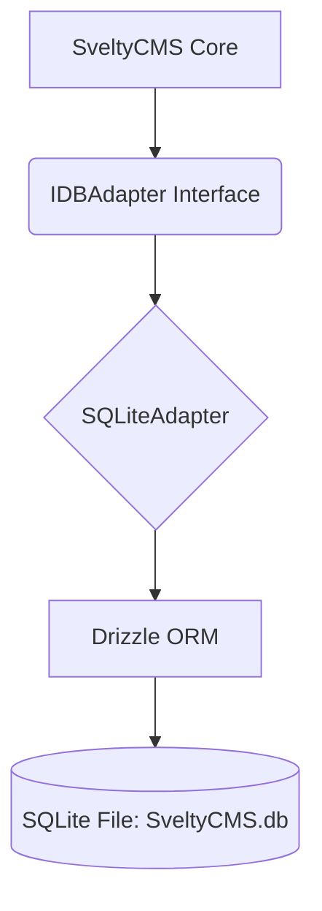

# SQLite Implementation

SQLite support is the default for local development, testing, and edge environments. It provides a zero-config database experience using **Drizzle ORM** with the `better-sqlite3` or `bun:sqlite` driver.

## 🎯 Implementation Architecture

The SQLite adapter enables a seamless transition from local development to production by implementing the same `IDBAdapter` interface as MongoDB and PostgreSQL.

### Architecture Overview



### Current Status

| Feature            | Status      | Notes                                       |
| :----------------- | :---------- | :------------------------------------------ |
| **Adapter Class**  | 🟢 Complete | Environment-aware (Bun/Node) implementation |
| **Schema Mapping** | 🟢 Complete | SQLite-specific type mapping (INTEGER/TEXT) |
| **Migrations**     | 🟢 Complete | Auto-creation of folders and tables         |
| **Setup Wizard**   | 🟢 Complete | selection and connection test implemented   |
| **Seeding**        | 🟢 Complete | Default data injection verified             |
| **Performance**    | 🟢 Platinum | Sub-0.2ms cached reads; Atomic batching     |

---

## 🚀 Performance Benchmarks (Verified)

SQLite delivers exceptional response times for local and edge deployments. For detailed performance metrics, stress test results, and cross-database comparisons, please refer to the [Performance Benchmarks](/docs/project/benchmarks) document.

Key SQLite highlights:

- **Sub-millisecond latency** for cached reads (~0.2ms).
- **WAL Mode** enabled by default for concurrent read/write performance.
- **Runtime Agnostic**: Optimized for both `bun:sqlite` and `better-sqlite3`.

### Key Optimizations

- **Runtime Agnostic**: Automatically switches between `bun:sqlite` and `better-sqlite3` based on environment.
- **Zero-Config**: Single file database (`SveltyCMS.db`) - perfect for development.
- **WAL Mode**: Write-Ahead Logging enabled by default for concurrent read/write performance.
- **Performance PRAGMAs**: 7 optimized PRAGMAs applied on connect:
  - `synchronous = NORMAL` — 2-5x faster writes (safe with WAL)
  - `cache_size = -8000` — 8MB page cache (default ~2MB)
  - `mmap_size = 268435456` — 256MB memory-mapped I/O
  - `busy_timeout = 5000` — 5s wait vs immediate SQLITE_BUSY errors
  - `temp_store = memory` — temp tables in RAM
  - `foreign_keys = ON` — enforce referential integrity
- **Drizzle Integration**: Type-safe querying without the overhead of a large ORM.
- **Typed Collection Proxy**: Fully-typed access via `locals.cms.collections.typed.Posts.find()`.
- **Platinum SQL Batching**: Native Drizzle `insertMany` for 10-50x faster bulk operations.
- **Security Fast-Path**: `bypassSafeQuery` support for zero-overhead internal lookups.
- **Zero-Allocation Dates**: Optimized `relational-utils` with dirty-bit check.
- **Atomic Versioning**: Native `getVersion` and `incrementVersion` support.

## 📂 Storage & File Management

SQLite is a file-based database. When running SveltyCMS with SQLite, the system defaults to storing the database in `/config/database/SveltyCMS.db`.

| File           | Purpose                                                                 | Git Status  |
| :------------- | :---------------------------------------------------------------------- | :---------- |
| `SveltyCMS.db` | The main database file containing all collections, users, and settings. | **Ignored** |
| `*.db-shm`     | Shared Memory file used for WAL mode concurrency.                       | **Ignored** |
| `*.db-wal`     | Write-Ahead Log containing recent uncommitted transactions.             | **Ignored** |

### Version Control Best Practices

> [!IMPORTANT]
> **Database files are included in `.gitignore` by default.**
> Committing binary database files to version control is discouraged as it leads to repository bloat and potential exposure of sensitive data.

### Provisioning System & Self-Healing

The SQLite adapter implements a robust provisioning system that handles the complete lifecycle of the database file and schema:

1.  **Idempotent Provisioning**: The `provision()` method checks the internal `_provisioned` state and only executes schema creation (`CREATE TABLE IF NOT EXISTS`) if necessary.
2.  **Explicit Reset**: During integration tests or system resets, `clearDatabase()` drops all tables and resets the `_provisioned` flag, ensuring the next access re-creates a clean schema.
3.  **Path Auto-Creation**: The adapter automatically detects if the `DB_HOST` directory exists and creates it recursively if missing, preventing "File not found" errors on new installations.

### ESM-First Driver Loading

To comply with SvelteKit 5's strict ESM requirements and avoid "require is not defined" errors:

- The adapter uses **Dynamic Imports** to load binary drivers.
- It detects the runtime environment (`Bun` vs `Node.js`) and imports the appropriate library (`bun:sqlite` or `better-sqlite3`) at runtime.
- This allows a single codebase to run seamlessly across local development (Bun) and production (Node.js) environments.

### WAL Mode & Performance PRAGMAs

SveltyCMS enables **WAL mode** and **7 performance PRAGMAs** on every connection. This provides concurrent read/write operations, 2-5x faster writes, resilience under load (busy_timeout), and enforced referential integrity.

---

## 🛠️ Setup & Configuration

### 1. Using the Setup Wizard (Recommended)

When using the [Setup Wizard](/docs/guides/setup-wizard), select **SQLite (via Drizzle)**. The wizard will automatically set:

- **Host**: `/config/database` (The directory where the database file will be stored)
- **Database Name**: `SveltyCMS.db` (The filename)

### 2. Manual Configuration

If you are configuring the system manually, ensure your `config/private.ts` (or environment variables) contains:

```typescript
// Example config/private.ts
export const privateEnv = {
  DB_TYPE: "sqlite",
  DB_HOST: "/config/database", // Directory path
  DB_NAME: "SveltyCMS.db", // Filename
};
```

The adapter will resolve the final path as `process.cwd() + DB_HOST + "/" + DB_NAME`.

### 3. Implementation Pattern

The SQLite adapter follows the modular pattern established in the core infrastructure, ensuring all seeding and user data updates work seamlessly across the agnostic codebase.

---

## 🔗 Related Documentation

- [Core Infrastructure](./core-infrastructure.mdx) - Unified architecture
- [PostgreSQL Implementation](./postgresql-implementation.mdx) - Similar Drizzle pattern
- [Drizzle ORM Documentation](https://orm.drizzle.team/)
