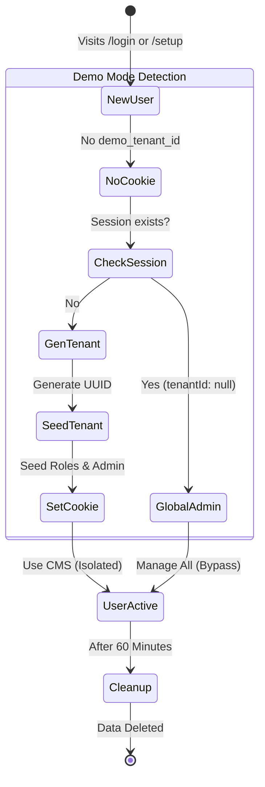

# Demo Mode Architecture

Demo Mode is a specialized configuration of the Multi-Tenancy system designed to provide instant, ephemeral, and isolated environments for users to evaluate SveltyCMS.

## Features

- **Instant Provisioning**: Users are assigned a unique tenant ID upon their first visit.
- **Automatic Seeding**: The system automatically seeds the new tenant with default settings, themes, roles, and a demo admin user.
- **Ephemeral Sessions**: Tenants and their data are automatically deleted after a configurable expiration time (default: 60 minutes).
- **Isolation**: Each demo user sees only their own data.

### 1. Project Setup (Clone & Link)

- Clone your `next` branch: `git clone -b next <repo>`
- Run setup: `bun install && bun run dev`
- Setup Wizard: Connect to your **existing Demo Database**.
- **Important**: Manually set `MULTI_TENANT: true` and `DEMO: true` in `config/private.ts` (requires restart).

### Bypassing Host Validation (March 2026)

In March 2026, the `handleSystemState` hook was optimized to allow bootstrap routes (like `/setup`) from any host when `DEMO: true` is active. This ensures that live demo environments on dynamic URLs (e.g., Vercel, Netlify) do not trigger 403 Forbidden errors before the system is fully initialized.

### Enabling Demo Mode

Demo mode is strictly controlled via `config/private.ts` to prevent accidental disabling in production.

> [!IMPORTANT]
> **Both `MULTI_TENANT` and `DEMO` must be set to `true`** for demo mode to function correctly. Demo mode leverages the multi-tenancy architecture to isolate ephemeral user data.

1.  **Strict Configuration**:
    - Edit `config/private.ts`:

    ```typescript
    export const privateEnv = {
      // ...
      MULTI_TENANT: true,
      DEMO: true,
    };
    ```

    - Restart the server.

2.  **Environment Variable** (Dev only):
    - `SVELTYCMS_DEMO=true bun run dev`

### Tenant Lifecycle



1.  **Creation**:
    - **Method A (No Token)**: User visits `/login` -> Click "Sign Up".
      - If `MULTI_TENANT=true` AND `DEMO=true`, they can register _without_ a token.
      - The registration UI automatically hides the "Registration Token" field in Demo Mode to simplify the experience.
      - A new Tenant is created for them automatically.
    - **Method B (Automatic)**: `handleAuthentication` hook detects missing `demo_tenant_id` cookie.
      - Generates a new `tenantId` using `crypto.randomUUID()`.
      - Sets `demo_tenant_id` cookie with a **60-minute** expiration (Session TTL), matching the cleanup cycle.
      - Calls `seedDemoTenant(tenantId)` to populate the database with default roles, settings, and a demo admin.

2.  **Usage**:
    - User interacts with the CMS as a normal tenant.
    - `tenantId` is preserved in the cookie and session.

3.  **Expiration & Cleanup**:
    - A background job (initialized in `src/databases/db.ts`) runs every 5 minutes.
    - It identifies tenanted users created past the cleanup TTL (**60 minutes**) or those with expired sessions.
    - **Global Administrator Protection**: The primary administrator (created during setup with `tenantId: null`) is explicitly excluded from cleanup to ensure the system remains manageable.
    - **Security**: The cleanup process queries the central tenant registry and then iterates through each expired tenant, using its specific `tenantId` to safely delete associated data (collections, media, settings) without violating tenant isolation.

### Seeding Strategy

The `seedDemoTenant` function (`src/routes/setup/seed.ts`) performs:

1.  **Settings**: Sets `DEMO=true`, `SEASONS=true`, `SEASON_REGION='Western_Europe'`.
2.  **Theme**: Seeds the default SveltyCMS theme.
3.  **Roles**: Seeds default roles.
4.  **User**: Creates a `demo-{shortId}@sveltycms.com` admin user.

## Security

- Demo tenants are strictly isolated.
- Rate limiting is applied to tenant creation to prevent abuse.
- File upload limits are enforced.
