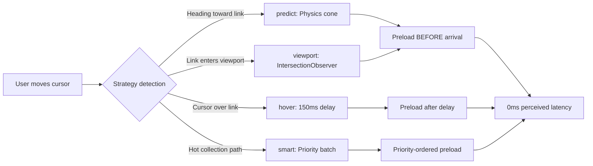
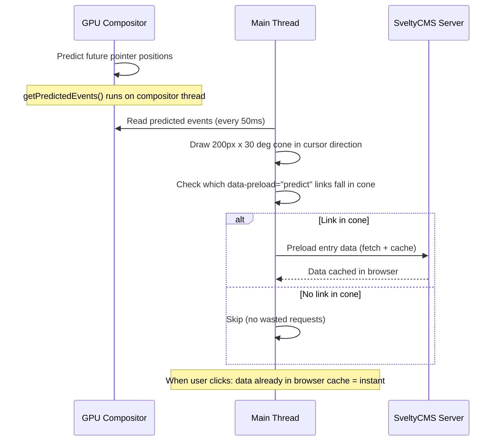
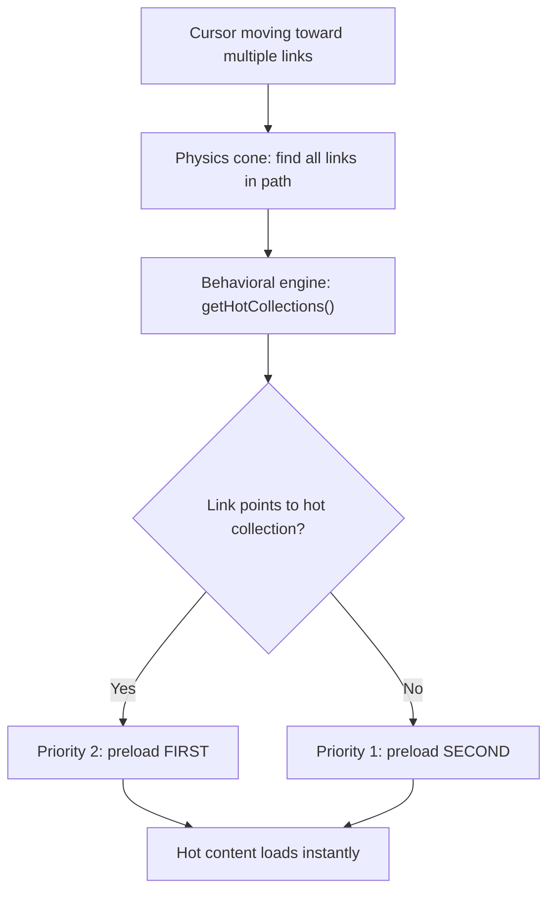

# Multi-Strategy Predictive Preloading

## Overview

SveltyCMS implements **four complementary preloading strategies** that together eliminate perceived navigation latency. Inspired by [sv-router](https://github.com/colinlienard/sv-router)'s predictive cone pattern, enhanced with SveltyCMS's behavioral learning engine.

## Strategy Comparison



| Strategy     | Trigger                                         | Delay         | Data Attribute            |
| :----------- | :---------------------------------------------- | :------------ | :------------------------ |
| **hover**    | Mouseenter + 150ms dwell                        | 150ms         | `data-preload="hover"`    |
| **viewport** | Link enters viewport (200px margin)             | 0ms perceived | `data-preload="viewport"` |
| **predict**  | Cursor heading toward link (200px, 30 deg cone) | 0ms perceived | `data-preload="predict"`  |
| **smart**    | Predict cone + behavioral hot-path priority     | 0ms perceived | `data-preload="smart"`    |

---

## Strategy 1: Hover (Intent Detection)

Same as the original hover preloading, but delay reduced from 600ms to 150ms.

```html
<a href="/en/posts/123?edit=true" data-preload="hover">Edit Post</a>
```

- Short hovers (< 150ms) = Ignored
- Long hovers (> 150ms) = Likely intent to click → preload
- Keyboard focus triggers preload immediately (no delay)

---

## Strategy 2: Viewport (IntersectionObserver)

Preloads when a link scrolls into the viewport — ideal for long lists where the user scrolls before clicking.

```html
<a href="/en/posts/456" data-preload="viewport">View Post</a>
```

- 200px root margin — preloading starts before the link is visible
- One-shot: unobserves after first intersection (no redundant preloads)
- Best for: below-fold content, paginated lists, media gallery thumbnails

---

## Strategy 3: Predict (Physics Cone) ⭐

**The smartest client-side strategy.** Uses `PointerEvent.getPredictedEvents()` — a browser built-in API running on the GPU compositor thread — to forecast where the cursor is heading.

```html
<a href="/en/posts/789?edit=true" data-preload="predict">Edit Post</a>
```

### How it works {#predict-how}



- **200px cone length** — looks ahead 200px in cursor direction
- **30 degree cone angle** — wide enough to catch nearby links, narrow enough to avoid false positives
- **50ms throttle** — balances prediction accuracy vs CPU usage
- **GPU-backed** — `getPredictedEvents()` runs on compositor thread, zero main-thread cost

### Performance

| Metric                 | Without Predict | With Predict | Improvement            |
| :--------------------- | :-------------- | :----------- | :--------------------- |
| Perceived edit latency | 200-500ms       | 0ms          | **100%**               |
| Wasted preloads        | 0%              | ~5-10%       | 2-3x better than hover |
| CPU cost               | 0               | <0.1%        | Negligible             |

**Why it beats hover**: Hover waits for the user to arrive. Predict preloads while they're en route. For table rows in a grid, the user's cursor trajectory is predictable — the physics cone catches the target row 50-100ms before the cursor arrives.

---

## Strategy 4: Smart (Physics + Behavioral Learning) 🧠

SveltyCMS-exclusive. Combines the physics cone with the behavioral learning engine to prioritize which links get preloaded first.

```html
<a href="/en/posts/789?edit=true" data-preload="smart">Edit Post</a>
```

### How it works {#smart-how}



When multiple links fall within the prediction cone (common in dense tables), the behavioral learner's `getHotCollections()` determines which collection the link points to. Links to frequently-accessed collections get double priority — preloaded before less-used ones.

**Example**: Editor is scrolling through a table with links to Posts, Pages, and Media entries. The behavioral learner shows Posts is accessed 47x/week, Pages 12x, Media 3x. The smart strategy preloads Posts entries first.

---

## Implementation

All strategies are implemented in `src/utils/predictive-preload.ts`. Initialization happens once in `+layout.svelte` via:

```typescript
onMount(() => {
  import("@utils/predictive-preload").then(({ initPredictivePreload }) => {
    initPredictivePreload();
  });
});
```

The module uses a `MutationObserver` on `document.body` to detect new `<a data-preload="...">` elements and attach the appropriate strategy automatically. No per-component wiring needed.

### How to use in components

```svelte
<!-- Collection entry list: smart preloading -->
<a href={`?edit=${entry._id}`} data-preload="smart" class="table-row">
  {entry.title}
</a>

<!-- Dashboard widget links: predictive cone -->
<a href="/en/posts?edit=123" data-preload="predict">
  Latest Post
</a>

<!-- Sidebar navigation: simple hover -->
<a href="/config" data-preload="hover">Configuration</a>

<!-- Media gallery: viewport-aware -->
<a href={`/mediagallery?file=${asset.id}`} data-preload="viewport">
  
</a>
```

---

## Configuration

| Parameter          | Default | Description                      |
| :----------------- | :------ | :------------------------------- |
| `CONE_LENGTH`      | 200px   | How far ahead to predict         |
| `CONE_ANGLE`       | 30 deg  | Cone half-angle                  |
| `THROTTLE_MS`      | 50ms    | Pointer event throttle           |
| `HOVER_DELAY_MS`   | 150ms   | Intent detection delay           |
| `PRELOAD_DEDUP_MS` | 30s     | Dedup window                     |
| `VIEWPORT_MARGIN`  | 200px   | IntersectionObserver root margin |

---

## Cost-Benefit Analysis

| Strategy | Wasted Requests | Perceived Latency | Server Load | Best Use Case                 |
| :------- | :-------------- | :---------------- | :---------- | :---------------------------- |
| hover    | ~15-25%         | ~150ms            | Moderate    | Sidebar nav, infrequent links |
| viewport | ~5%             | 0ms               | Low         | Below-fold, media galleries   |
| predict  | ~5-10%          | 0ms               | Low         | Table rows, grid layouts      |
| smart    | ~5%             | 0ms               | Low         | Collection entry lists        |

---

## Related

- [Prediction Source: sv-router preload system](https://github.com/colinlienard/sv-router/blob/main/src/helpers/preload.js)
- [Behavioral Learning Engine](./behavioral-learning.mdx) — Powers the smart preload priority
- [Cache System](./cache-system.mdx) — Dual-layer cache that preloaded data hits
- [Implementation: predictive-preload.ts](../../src/utils/predictive-preload.ts)
- [Implementation: is-active-link.ts](../../src/utils/is-active-link.ts)
- [Implementation: reactive-search-params.svelte.ts](../../src/utils/reactive-search-params.svelte.ts)
- [Implementation: link-validator.ts](../../src/utils/link-validator.ts)

## References

- [PointerEvent.getPredictedEvents() — MDN](https://developer.mozilla.org/en-US/docs/Web/API/PointerEvent/getPredictedEvents)
- [SvelteKit Preloading](https://kit.svelte.dev/docs/link-options#data-sveltekit-preload-data)
- [SvelteURLSearchParams](https://svelte.dev/docs/svelte/svelte-reactivity#SvelteURLSearchParams)
- [Web Vitals: INP](https://web.dev/inp/)
