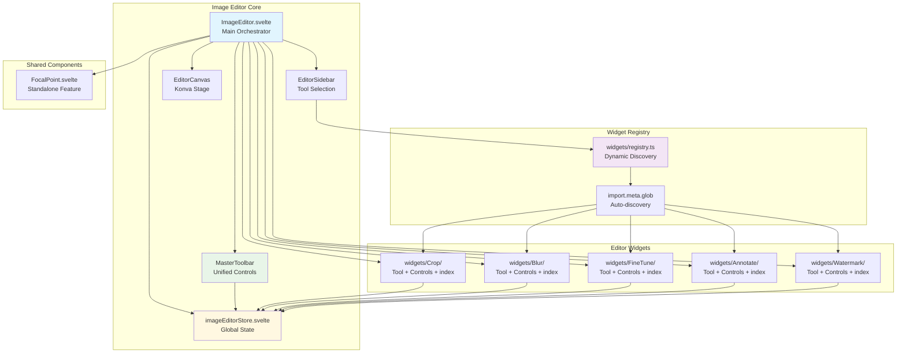
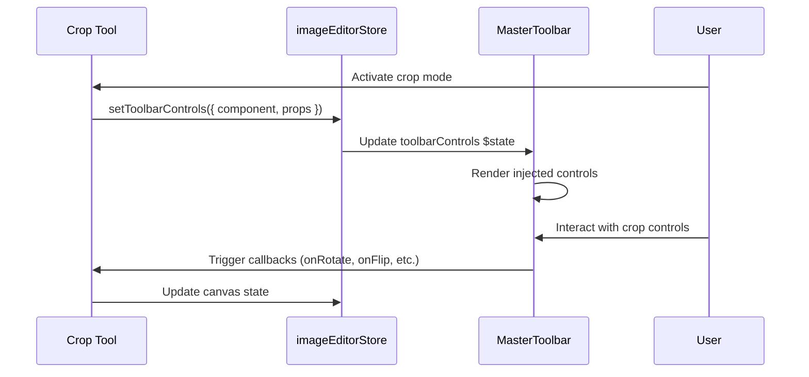

# Image Editor Architecture

This document covers the technical architecture and implementation details of the SveltyCMS Image Editor system.

## 🏗️ System Overview

The Image Editor is built on a dynamic widget-based architecture where each editing tool (Crop, Blur, FineTune, etc.) is a self-contained widget that registers itself with the system.

### Component Architecture



## 📦 Widget System

### Dynamic Widget Discovery

Widgets are automatically discovered using Vite's `import.meta.glob`:

```typescript
// src/routes/(app)/imageEditor/widgets/registry.ts
import type { Component } from 'svelte';

export interface EditorWidget {
	key: string;
	title: string;
	icon?: string;
	tool: Component<Record<string, unknown>>;
	controls: Component<Record<string, unknown>>;
}

// Auto-discover all PascalCase widget folders
const modules = import.meta.glob('./[A-Z]*/index.ts', { eager: true }) as Record<string, unknown>;

export const editorWidgets: EditorWidget[] = Object.values(modules)
	.map((m) => {
		const mod = m as { default?: EditorWidget; editorWidget?: EditorWidget };
		return mod.default ?? mod.editorWidget;
	})
	.filter((w): w is EditorWidget => !!w);
```

### Widget Structure

Each widget follows a consistent folder structure:

```
widgets/
├── Crop/
│   ├── Tool.svelte          # Konva canvas logic & tool behavior
│   ├── Controls.svelte      # Toolbar controls UI
│   └── index.ts            # Widget metadata export
├── Blur/
│   ├── Tool.svelte
│   ├── Controls.svelte
│   └── index.ts
└── registry.ts             # Dynamic discovery & export
```

### Widget Metadata Export

Each widget exports metadata via `index.ts`:

```typescript
// widgets/Crop/index.ts
import type { Component } from 'svelte';
import Tool from './Tool.svelte';
import Controls from './Controls.svelte';

export default {
	key: 'crop',
	title: 'Crop',
	icon: 'mdi:crop',
	tool: Tool as unknown as Component<Record<string, unknown>>,
	controls: Controls as unknown as Component<Record<string, unknown>>
};
```

## 🎛️ MasterToolbar Pattern

The MasterToolbar provides a unified control interface where tools inject their specific controls dynamically.

### Control Injection Flow



### Store-Based Control Registration

```typescript
// Tool.svelte registers its controls when activated
$effect(() => {
	const activeState = imageEditorStore.state.activeState;
	if (activeState === 'crop') {
		imageEditorStore.setToolbarControls({
			component: CropControls,
			props: {
				onRotateLeft: () => rotateLeft(),
				onFlipHorizontal: () => flipHorizontal(),
				cropShape,
				onCropShapeChange: (shape) => setCropShape(shape),
				onAspectRatio: (ratio) => setAspectRatio(ratio),
				onApply: () => apply()
			}
		});
	} else {
		imageEditorStore.setToolbarControls(null);
	}
});
```

## 🖼️ Konva Canvas Integration

### Layer Architecture

The editor uses Konva's layering system for efficient rendering:

```
Stage (Container)
└── Layer
    ├── imageGroup (transforms: scale, rotation, position)
    │   └── imageNode (crop, filters)
    ├── Tool-specific nodes (cropTool, blurRegion, etc.)
    └── UI overlays (transformers, highlights)
```

### State Management

```typescript
// imageEditorStore.svelte.ts
export const imageEditorStore = (() => {
	let state = $state({
		stage: null as Konva.Stage | null,
		layer: null as Konva.Layer | null,
		imageNode: null as Konva.Image | null,
		imageGroup: null as Konva.Group | null,
		activeState: '' as string,
		toolbarControls: null as ToolbarControls | null
		// ... history, snapshots, etc.
	});

	return {
		get state() {
			return state;
		},
		setActiveState(newState: string) {
			state.activeState = newState;
		},
		setToolbarControls(controls: ToolbarControls | null) {
			state.toolbarControls = controls;
		}
		// ... other methods
	};
})();
```

## 🧩 Widget Implementation Guide

### Creating a New Editor Widget

1. **Create widget folder** (PascalCase):

   ```
   widgets/MyTool/
   ```

2. **Implement Tool.svelte** (canvas logic):

   ```svelte
   <script lang="ts">
     import Konva from 'konva';
     import { imageEditorStore } from '@stores/imageEditorStore.svelte';
     import MyToolControls from './Controls.svelte';
   
     let { stage, layer, imageNode } = $props<{
       stage: Konva.Stage;
       layer: Konva.Layer;
       imageNode: Konva.Image;
     }>();
   
     // Tool-specific state
     let toolState = $state({ ... });
   
     // Register controls when active
     $effect(() => {
       if (imageEditorStore.state.activeState === 'mytool') {
         imageEditorStore.setToolbarControls({
           component: MyToolControls,
           props: {
             onAction: () => handleAction(),
             // ... other callbacks
           }
         });
       } else {
         imageEditorStore.setToolbarControls(null);
       }
     });
   
     // Tool logic...
   </script>
   ```

3. **Implement Controls.svelte** (toolbar UI):

   ```svelte
   <script lang="ts">
   	let { onAction, otherProp } = $props<{
   		onAction: () => void;
   		otherProp?: string;
   	}>();
   </script>

   <div class="tool-controls">
   	<button onclick={onAction}>Apply</button>
   	<!-- Other controls -->
   </div>
   ```

4. **Export widget metadata** (index.ts):

   ```typescript
   import type { Component } from 'svelte';
   import Tool from './Tool.svelte';
   import Controls from './Controls.svelte';

   export default {
   	key: 'mytool',
   	title: 'My Tool',
   	icon: 'mdi:tool-icon',
   	tool: Tool as unknown as Component<Record<string, unknown>>,
   	controls: Controls as unknown as Component<Record<string, unknown>>
   };
   ```

5. **Widget auto-discovery**: The registry automatically discovers and registers the new widget!

## 🎨 Sidebar Integration

The EditorSidebar reads directly from the dynamic registry:

```svelte
<script lang="ts">
	import { editorWidgets } from '../../widgets/registry';

	const tools = [
		...editorWidgets.map((w) => ({
			id: w.key,
			name: w.title,
			icon: w.icon ?? 'mdi:cog'
		})),
		// Additional non-widget tools
		{ id: 'focalpoint', name: 'Focal', icon: 'mdi:focus-field' }
	];
</script>

{#each tools as tool}
	<button class="tool-button" class:active={activeState === tool.id} onclick={() => onToolSelect(tool.id)}>
		<iconify-icon icon={tool.icon} />
		<span>{tool.name}</span>
	</button>
{/each}
```

## 🔄 Undo/Redo System

### Snapshot-Based History

The editor uses JSON-based snapshots for undo/redo:

```typescript
// Take snapshot
export function takeSnapshot() {
	const { stage, layer } = state;
	if (!stage || !layer) return;

	const json = stage.toJSON();

	// Truncate future history if we're not at the end
	if (historyIndex < historyStack.length - 1) {
		historyStack = historyStack.slice(0, historyIndex + 1);
	}

	historyStack.push(json);
	historyIndex++;

	// Limit history size
	if (historyStack.length > MAX_HISTORY) {
		historyStack.shift();
		historyIndex--;
	}
}

// Restore from snapshot
export function undoState() {
	if (historyIndex > 0) {
		historyIndex--;
		return historyStack[historyIndex];
	}
	return null;
}
```

## 📱 Responsive Design

The editor adapts to desktop, tablet, and mobile:

```svelte
{#if !isMobile}
	<div class="editor-layout">
		<EditorSidebar />
		<div class="editor-main">
			<EditorCanvas />
			<MasterToolbar />
		</div>
	</div>
{:else}
	<div class="editor-mobile">
		<EditorCanvas />
		<MasterToolbar isMobile />
	</div>
{/if}
```

## 🔧 Tool Lifecycle

Each tool follows a consistent lifecycle:

1. **Activation**: User clicks tool in sidebar
2. **Initialization**: Tool sets up Konva nodes
3. **Control Registration**: Tool injects controls into MasterToolbar
4. **Interaction**: User interacts via controls and canvas
5. **Apply/Cancel**: Tool finalizes changes or discards
6. **Cleanup**: Tool removes Konva nodes and deregisters controls
7. **Deactivation**: Editor returns to neutral state

### Cleanup Pattern

```typescript
$effect(() => {
	// Setup
	if (active) {
		initializeTool();
	}

	// Cleanup function
	return () => {
		if (cropTool) cropTool.destroy();
		if (transformer) transformer.destroy();
		if (overlay) overlay.destroy();
		layer?.batchDraw();
	};
});
```

## 🎯 Best Practices

### Tool Implementation

1. **Use $effect for lifecycle**: Initialize and cleanup in reactive effects
2. **Null-check Konva nodes**: Always validate before accessing
3. **Register controls conditionally**: Only when tool is active
4. **Clean up thoroughly**: Destroy all Konva nodes on deactivation
5. **Take snapshots**: Call `imageEditorStore.takeSnapshot()` before mutations

### Control Implementation

1. **Keep controls simple**: Pure UI, logic in Tool
2. **Use typed props**: Define clear prop interfaces
3. **Handle edge cases**: Disable buttons when not applicable
4. **Provide feedback**: Visual states for active/hover/disabled

### Performance

1. **Batch canvas updates**: Use `layer.batchDraw()` instead of `layer.draw()`
2. **Cache filtered images**: `imageNode.cache()` for filter performance
3. **Debounce rapid changes**: Especially for slider-based adjustments
4. **Lazy-load tools**: Tools only load when activated

## 🚀 Future Enhancements

### Planned Features

- [ ] Plugin system for third-party tools
- [ ] Tool presets and saved configurations
- [ ] Batch editing for multiple images
- [ ] Cloud storage integration for edited images
- [ ] AI-powered tools (background removal, enhancement)
- [ ] Collaborative editing (real-time multi-user)

### Architecture Improvements

- [ ] Worker-based image processing for large files
- [ ] Virtual canvas for memory-efficient large images
- [ ] Tool state persistence across sessions
- [ ] Keyboard shortcut customization
- [ ] Accessibility enhancements (ARIA, keyboard navigation)

## 📚 Related Documentation

- [Widget System Overview](/docs/widgets/widget-system-overview)
- [Widget Development Guide](/docs/widgets/widget-development-guide)
- [Store Management](/docs/architecture/store-management)
- [Konva Canvas Guide](https://konvajs.org/docs/)

---
