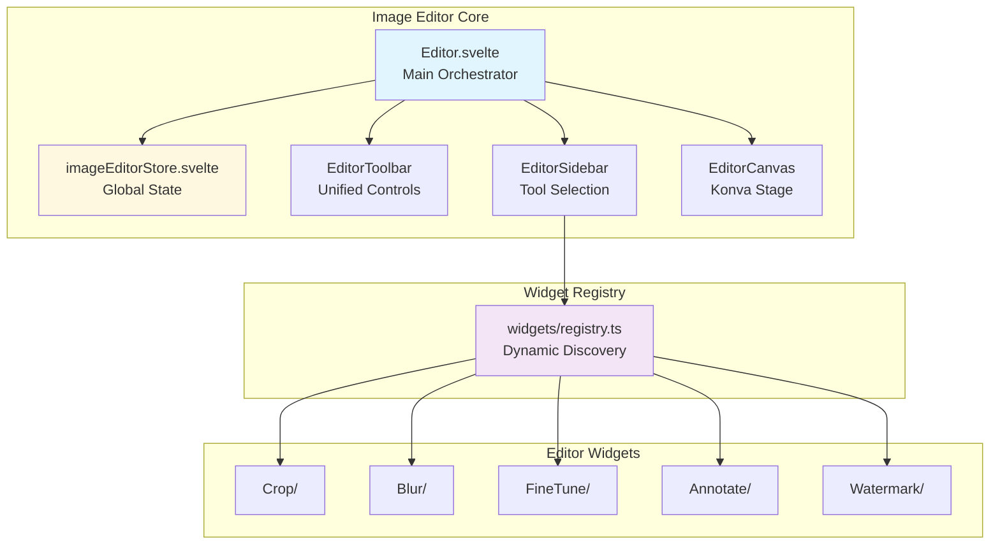
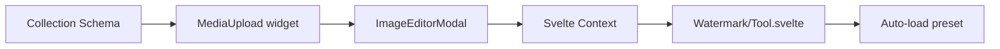

# Image Editor Architecture

This document provides a complete technical reference for the SveltyCMS Image Editor system, including the widget architecture, toolbar controls, and Konva.js canvas integration.

## 🏗️ System Overview

The Image Editor is built on a dynamic widget-based architecture where each editing tool (Crop, Blur, FineTune, etc.) is a self-contained widget.



---

## 📦 Widget System

### Widget Structure

Each widget follows a consistent folder structure:

```
widgets/[WidgetName]/
├── index.ts          # Widget metadata & registration
├── Tool.svelte       # Konva canvas logic & tool behavior
├── regions.ts        # Region/entity class (if applicable)
└── [utilities]       # Helper functions
```

### Widget Registration

Widgets self-register via their `index.ts`:

```typescript
// widgets/Crop/index.ts
import type { Component } from 'svelte';
import Tool from './Tool.svelte';

export default {
	key: 'crop',
	title: 'Crop',
	icon: 'mdi:crop',
	tool: Tool as unknown as Component<Record<string, unknown>>
};
```

The registry automatically discovers and loads all widgets:

```typescript
// widgets/registry.ts
const modules = import.meta.glob('./[A-Z]*/index.ts', { eager: true });
export const editorWidgets: EditorWidget[] = Object.values(modules)
	.map((m) => m.default ?? m.editorWidget)
	.filter((w): w is EditorWidget => !!w);
```

### Dynamic Toolbar Controls

Tools inject their controls dynamically via the store:

```typescript
$effect(() => {
	if (imageEditorStore.state.activeState === 'crop') {
		imageEditorStore.setToolbarControls({
			component: CropControls,
			props: {
				onRotateLeft: () => rotateLeft(),
				onApply: () => apply()
				// ... other callbacks
			}
		});
	} else {
		imageEditorStore.setToolbarControls(null);
	}
});
```

---

## 🎨 Widget Reference

### Crop

**Location**: `widgets/Crop/`

**Features**: Rectangle/square/circular crop, 90° rotation, horizontal flip, aspect ratio constraints

**Key Files**:

- `regions.ts` - CropRegion class with overlay and transformer
- `aspect.ts` - Aspect ratio parsing
- `cropMath.ts` - Coordinate transformations

### Blur

**Location**: `widgets/Blur/`

**Features**: Selective region blur, adjustable strength (0-100), rectangle/ellipse shapes, blur/pixelate patterns

**Key Files**:

- `regions.ts` - BlurRegion class with filter overlay and caching strategy

### FineTune

**Location**: `widgets/FineTune/`

**Features**: Brightness, contrast, saturation, temperature, exposure, highlights, shadows, clarity, vibrance

**Key Files**:

- `adjustments.ts` - Adjustment type definitions
- `baseFilters.ts` - Konva built-in filters
- `customFilters.ts` - Custom pixel-level filters

### Annotate

**Location**: `widgets/Annotate/`

**Features**: Text, rectangle, circle, arrow, line annotations with customizable colors and stroke

**Key Files**:

- `regions.ts` - AnnotationItem class
- `draw.ts` - Factory functions for Konva nodes
- `editText.ts` - Text editing overlay
- `transformer.ts` - Shared transformer utilities

### Watermark

**Location**: `widgets/Watermark/`

**Features**: Upload image (PNG/JPG/SVG) or add text watermarks, tiling support, opacity control, flexible positioning (9-point snap), and size presets.

**Key Files**:

- `regions.ts` - `WatermarkItem` class handling both image and text nodes
- `Controls.svelte` - Tabbed interface for adding layout, opacity, and tiling controls
- `Tool.svelte` - State management and transformer integration

---

## 🔧 Shared Components

### Transformer Config

All widgets use unified transformer styling from `transformerConfig.ts`:

```typescript
export const TRANSFORMER_STYLE = {
	anchorFill: '#3b82f6', // Blue-500
	anchorStroke: '#ffffff',
	anchorSize: 12,
	anchorCornerRadius: 6, // Circular handles
	borderStroke: '#3b82f6',
	borderStrokeWidth: 2
};
```

### Tool Lifecycle

Each tool follows a consistent lifecycle:

1. **Activation**: User clicks tool in sidebar
2. **Initialization**: Tool sets up Konva nodes
3. **Control Registration**: Tool injects controls into toolbar
4. **Interaction**: User interacts via controls and canvas
5. **Apply/Cancel**: Tool finalizes changes or discards
6. **Cleanup**: Tool removes Konva nodes and deregisters controls

---

## 📱 Responsive Design

```svelte
{#if !isMobile}
	<div class="editor-layout">
		<EditorSidebar />
		<div class="editor-main">
			<EditorCanvas />
			<EditorToolbar />
		</div>
	</div>
{:else}
	<div class="editor-mobile">
		<EditorCanvas />
		<EditorToolbar isMobile />
	</div>
{/if}
```

---

## 🎯 Best Practices

### Tool Implementation

1. Use `$effect` for lifecycle management
2. Null-check Konva nodes before accessing
3. Register controls only when tool is active
4. Clean up thoroughly on deactivation
5. Take snapshots before mutations: `imageEditorStore.takeSnapshot()`

### Performance

1. Use `layer.batchDraw()` instead of `layer.draw()`
2. Cache filtered images: `imageNode.cache()`
3. Debounce rapid changes (sliders)
4. Lazy-load tools (only when activated)

---

## 🎯 Focal Point System

The focal point system ensures important areas of images stay visible during responsive cropping.

### Metadata Storage

Focal points are stored in `MediaMetadata`:

```typescript
interface MediaMetadata {
	focalPoint?: { x: number; y: number }; // 0-100 for x and y
	watermarkApplied?: boolean;
	// ... other fields
}
```

### Quick Focal Modal

The `FocalQuickModal.svelte` component provides lightweight focal point adjustment without the full editor:

```svelte
<FocalQuickModal media={selectedImage} bind:show={showModal} onSave={handleFocalSave} />
```

### API Endpoint

Quick focal updates are handled via:

```http
PATCH /api/media/{id}/focal
Content-Type: application/json

{ "x": 60, "y": 30 }
```

### Transform API Integration

The Transform API respects focal points for smart cropping:

```http
GET /api/media/transform/path/to/image.jpg?w=400&h=400&focal=60,30
```

The `focal` parameter uses percentages (0-100) for x,y position. Sharp.js applies this as the attention point during cover cropping.

---

## 🎨 Watermark Preset System

Watermark presets allow collection-level watermark configuration that auto-loads in the editor.

### Configuration

Define watermark presets in collection schemas:

```typescript
widgets.MediaUpload({
	label: 'Product Image',
	watermark: {
		url: '/static/watermarks/logo.png',
		position: 'southeast', // bottom-right
		scale: 20 // 20% of image width
	}
});
```

### Context Flow



### Preset Loading

The Watermark tool automatically loads presets when activated:

```typescript
// Watermark/Tool.svelte
const getWatermarkPreset = getContext<() => WatermarkOptions | null>('watermarkPreset');

$effect(() => {
	if (activeState === 'watermark') {
		const preset = getWatermarkPreset?.();
		if (preset?.url && !_presetLoaded) {
			_presetLoaded = true;
			loadPresetWatermark(preset);
		}
	}
});
```

### Baking Watermarks

When saving, watermarks are baked into the image via Sharp.js in `MediaService.saveMedia()`:

```typescript
// MediaService.server.ts
async saveMedia(file, userId, access, basePath, watermarkOptions?) {
  // ... watermarkOptions passed to Sharp for compositing
}
```

---

## 📚 Related Documentation

- [Image Editor Guide](/docs/guides/development/image-editor-guide) - User/developer guide
- [Widget System Overview](/docs/widgets/widget-system-overview) - Widget development patterns
- [Konva Documentation](https://konvajs.org/docs/) - Canvas library reference
