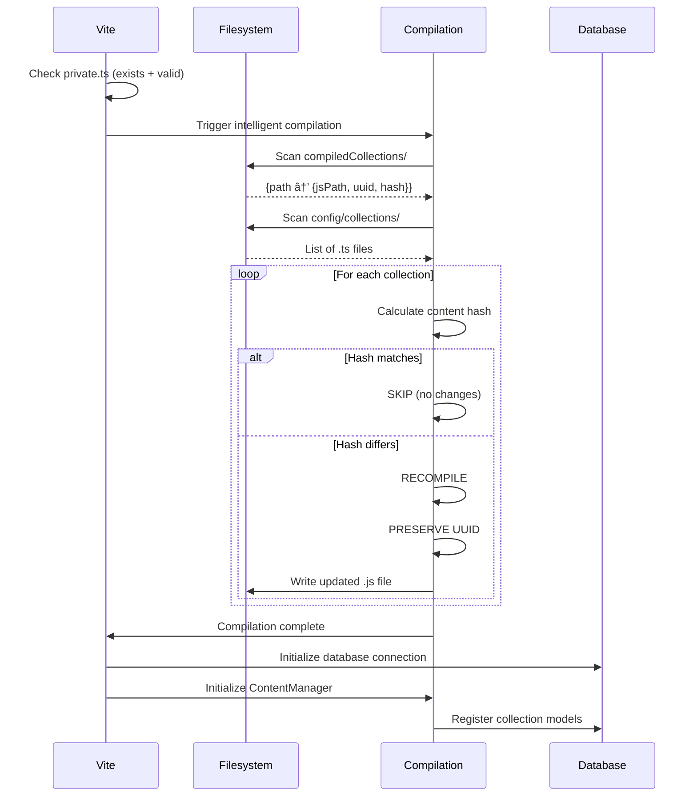

# SveltyCMS Initialization Workflow

This document explains the complete initialization workflow for SveltyCMS, covering both **first-time setup** and **server restart** scenarios. The system is designed to be intelligent, avoiding unnecessary recompilation and maintaining UUID consistency for collections.

---

## Table of Contents

1. [Visual Overview](#visual-overview)
2. [First-Time Setup Flow](#first-time-setup-flow)
3. [Server Restart Flow](#server-restart-flow)
4. [Collection UUID Management](#collection-uuid-management)
5. [Key Components](#key-components)
6. [State Machine](#state-machine)
7. [Known Issues](#known-issues)

---

## Visual Overview

### Complete System Lifecycle


### First-Time Setup Architecture


### Server Restart Architecture


---

## First-Time Setup Flow

### Phase 1: Vite Startup (Build Time)

**File: `vite.config.ts`**


**Created `config/private.ts`:**

```typescript
export const privateEnv = createPrivateConfig({
	DB_TYPE: 'mongodb',
	DB_HOST: '', // ← Empty values
	DB_PORT: 27017,
	DB_NAME: '', // ← Empty values
	DB_USER: '',
	DB_PASSWORD: '',
	JWT_SECRET_KEY: '', // ← Empty
	ENCRYPTION_KEY: '', // ← Empty
	MULTI_TENANT: false
});
```

### Phase 2: Server Hooks (Runtime)

**File: `src/hooks.server.ts`**

> **📚 For detailed middleware architecture, see [Server Hooks & Middleware](./server-hooks.mdx)**


### Phase 3: Setup GUI Interaction

**File: `src/routes/setup/+page.svelte`**


User completes setup wizard:

```
Step 1: Database Configuration
  ↓
Step 2: Database Test → /api/setup/test-database
  ↓
Step 3: System Language Selection
  ↓
Step 4: Seed Data → /api/setup/seed
  ↓
Step 5: Admin User Creation → /api/setup/complete
```

---

### Phase 4: Database Test

**Endpoint: `/api/setup/test-database/+server.ts`**


```typescript
POST /api/setup/test-database
Body: {
  type: "mongodb",
  host: "localhost",
  port: 27017,
  name: "sveltycms",
  user: "admin",
  password: "secret123"
}
```

**Process:**

1. Detects package manager (bun/npm/pnpm/yarn)
2. Installs MongoDB driver if missing (`mongoose`)
3. Builds connection string
4. Tests connection with 15s timeout
5. Returns detailed validation results

**Response:**

```json
{
	"success": true,
	"message": "Connection successful",
	"details": {
		"authenticated": true,
		"dbStats": { "collections": 0, "dataSize": 0 },
		"warnings": []
	}
}
```

---

### Phase 5: Seed Database

**Endpoint: `/api/setup/seed/+server.ts`**

Called when user clicks "Next" after successful DB test.

```
┌─────────────────────────────────────────────────────┐
│ 1. Write config/private.ts                         │
│    - Writes DB credentials from test step          │
│    - Generates JWT_SECRET_KEY (32 bytes base64)    │
│    - Generates ENCRYPTION_KEY (32 bytes base64)    │
└─────────────────────────────────────────────────────┘
                        ↓
┌─────────────────────────────────────────────────────┐
│ 2. Initialize database adapter (setup mode)        │
│    - getSetupDatabaseAdapter(dbConfig)             │
│    - Creates MongoDBAdapter                        │
│    - Connects to database                          │
│    - Calls setupAuthModels()                       │
└─────────────────────────────────────────────────────┘
                        ↓
┌─────────────────────────────────────────────────────┐
│ 3. Seed default data (seed.ts)                     │
│    A. seedSettings(adapter)                        │
│       - Creates system_settings collection         │
│       - Seeds defaultPublicSettings (53 keys)      │
│       - Seeds defaultPrivateSettings (23 keys)     │
│    B. seedDefaultTheme(adapter)                    │
│       - Creates system_themes collection           │
│       - Seeds SveltyCMSTheme                       │
│    C. seedCollectionsForSetup(adapter) ⚠️          │
│       - Scans compiledCollections folder           │
│       - Creates collection models in MongoDB       │
│       - Returns firstCollection info               │
└─────────────────────────────────────────────────────┘
```

**Key Function: `seedCollectionsForSetup()`**

```typescript
// File: src/routes/api/setup/seed.ts

export async function seedCollectionsForSetup(dbAdapter) {
	// 1. Scan filesystem for compiled collections
	const { scanCompiledCollections } = await import('@src/content/collectionScanner');
	const collections = await scanCompiledCollections();

	// 2. Register each collection as a model
	for (const schema of collections) {
		await dbAdapter.collection.createModel(schema);
		// ⚠️ Creates MongoDB collection: collection_<uuid>
	}

	// 3. Return first collection for fast redirect
	return { firstCollection: { name: 'Posts', path: '/Collections/Posts' } };
}
```

**Database Collections Created:**

```
system_settings          ← Public/private settings
system_themes            ← Theme configurations
system_content_structure ← Navigation/hierarchy (empty for now)
collection_<uuid_1>      ← First collection (e.g., Posts)
collection_<uuid_2>      ← Second collection (e.g., Names)
```

⚠️ **KNOWN ISSUE:** Only one `collection_<uuid>` table gets created instead of one per collection. This may be due to async race conditions in the `createModel()` method.

---

### Phase 6: Complete Setup

**Endpoint: `/api/setup/complete/+server.ts`**

Called when user submits admin user form.

```
┌─────────────────────────────────────────────────────┐
│ 1. Parse private.ts from filesystem                 │
│    - Bypasses Vite's import cache                  │
│    - Uses regex to extract config values           │
└─────────────────────────────────────────────────────┘
                        ↓
┌─────────────────────────────────────────────────────┐
│ 2. Create setup database adapter                   │
│    - getSetupDatabaseAdapter(dbConfig)             │
│    - Creates Auth instance                         │
└─────────────────────────────────────────────────────┘
                        ↓
┌─────────────────────────────────────────────────────┐
│ 3. Create admin user + session (single transaction)│
│    - setupAuth.createUserAndSession({              │
│        username, email, password,                  │
│        role: 'admin', isRegistered: true           │
│      })                                            │
│    - Inserts into auth_users collection           │
│    - Creates session in auth_sessions collection  │
└─────────────────────────────────────────────────────┘
                        ↓
┌─────────────────────────────────────────────────────┐
│ 4. Initialize global system (db.ts)               │
│    - initializeWithFreshConfig()                   │
│    - Reloads private.ts from filesystem            │
│    - Connects global dbAdapter                     │
│    - Loads settings from database                  │
│    - Initializes ThemeManager                      │
│    - Initializes MediaFolder                       │
│    - State: IDLE → INITIALIZING → READY           │
└─────────────────────────────────────────────────────┘
                        ↓
┌─────────────────────────────────────────────────────┐
│ 5. Initialize ContentManager                       │
│    - contentManager.initialize(undefined, true)    │
│    - Loads collections from database               │
│    - Builds content structure cache                │
└─────────────────────────────────────────────────────┘
                        ↓
┌─────────────────────────────────────────────────────┐
│ 6. Invalidate caches                               │
│    - invalidateSettingsCache()                     │
│    - invalidateSetupCache()                        │
└─────────────────────────────────────────────────────┘
                        ↓
┌─────────────────────────────────────────────────────┐
│ 7. Send welcome email (optional, non-fatal)       │
│    - POST /api/sendMail                            │
└─────────────────────────────────────────────────────┘
                        ↓
┌─────────────────────────────────────────────────────┐
│ 8. Set session cookie                              │
│    - Creates httpOnly session cookie               │
│    - Sets theme cookies                            │
└─────────────────────────────────────────────────────┘
                        ↓
┌─────────────────────────────────────────────────────┐
│ 9. Return redirect path                            │
│    - Uses firstCollection from seed step (fast!)  │
│    - Redirects to /{lang}/{firstCollection.path}  │
│    - NO SERVER RESTART REQUIRED! ✨                │
└─────────────────────────────────────────────────────┘
```

**Response:**

```json
{
	"success": true,
	"message": "Setup complete! Welcome to SveltyCMS! 🎉",
	"redirectPath": "/en/Collections/Posts",
	"loggedIn": true,
	"requiresHardReload": false,
	"requiresServerRestart": false
}
```

---

## Server Restart Flow

### Phase 1: Vite Startup (Build Time)

**File: `vite.config.ts`**

```
┌─────────────────────────────────────────────────────┐
│ 1. Vite starts                                      │
│    - Checks if config/private.ts exists            │
│    - isSetupComplete() → true (config exists +     │
│      has valid DB credentials)                     │
└─────────────────────────────────────────────────────┘
                        ↓
┌─────────────────────────────────────────────────────┐
│ 2. cmsWatcherPlugin() activates                     │
│    - Initializes collection structure              │
│    - Compiles collections intelligently            │
│    - Sets up file watchers                         │
└─────────────────────────────────────────────────────┘
```

### Phase 2: Intelligent Collection Compilation

**File: `src/utils/compilation/compile.ts`**

The compilation system uses **content hashing** and **UUID preservation** to avoid unnecessary recompilation:

```
┌─────────────────────────────────────────────────────┐
│ 1. Scan existing compiled collections              │
│    - Builds map: path → { jsPath, uuid, hash }    │
│    - Extracts UUID and hash from JS files          │
└─────────────────────────────────────────────────────┘
                        ↓
┌─────────────────────────────────────────────────────┐
│ 2. Scan source collections (config/collections)    │
│    - Gets list of .ts files                        │
│    - Calculates content hash for each              │
└─────────────────────────────────────────────────────┘
                        ↓
┌─────────────────────────────────────────────────────┐
│ 3. Smart recompilation decision                    │
│    For each collection:                            │
│    IF hash matches existing compiled file          │
│      → SKIP (no changes detected)                  │
│      → PRESERVE existing UUID                      │
│    ELSE                                            │
│      → RECOMPILE                                   │
│      → PRESERVE existing UUID (if found)           │
│      → GENERATE new UUID (if new file)             │
└─────────────────────────────────────────────────────┘
                        ↓
┌─────────────────────────────────────────────────────┐
│ 4. AST transformation                              │
│    - Converts TypeScript to JavaScript             │
│    - Adds .js extensions to imports                │
│    - Injects _id (UUID) into schema                │
│    - Injects __HASH__ comment                      │
└─────────────────────────────────────────────────────┘
                        ↓
┌─────────────────────────────────────────────────────┐
│ 5. Cleanup orphaned files                          │
│    - Removes .js files without .ts source          │
│    - Removes empty directories                     │
└─────────────────────────────────────────────────────┘
```

**Example Compiled Collection:**

```javascript
// compiledCollections/Collections/Posts.js
// __HASH__:a7f3e9c2d8b1f4a6e3c9d2b8f1a4e6c3

export const schema = {
	_id: '550e8400-e29b-41d4-a716-446655440000', // ← UUID preserved!
	name: 'Posts',
	icon: 'bi:file-text',
	fields: [
		{ label: 'Title', db_fieldName: 'title', widget: 'text' },
		{ label: 'Content', db_fieldName: 'content', widget: 'richtext' }
	]
};
```

### Phase 3: Server Initialization

**File: `src/hooks.server.ts` + `src/databases/db.ts`**

```
┌─────────────────────────────────────────────────────┐
│ handleSystemState                                   │
│  - System state: IDLE                              │
│  - First request triggers: await dbInitPromise     │
└─────────────────────────────────────────────────────┘
                        ↓
┌─────────────────────────────────────────────────────┐
│ initializeOnRequest() (db.ts)                       │
│  1. Load private config (privateEnv)               │
│  2. Connect to database                            │
│  3. Load adapters (MongoDBAdapter)                 │
│  4. Setup auth models                              │
│  5. Load settings from database                    │
│  6. Initialize default theme                       │
│  7. Initialize theme manager                       │
│  8. Initialize media folder                        │
│  9. Initialize virtual folders                     │
│  State: IDLE → INITIALIZING → READY               │
└─────────────────────────────────────────────────────┘
                        ↓
┌─────────────────────────────────────────────────────┐
│ ContentManager auto-initializes on first access    │
│  - Scans compiledCollections                       │
│  - Registers collection models in database         │
│  - Builds content structure cache                  │
└─────────────────────────────────────────────────────┘
```

---

## Collection UUID Management

### UUID Assignment Strategy

**The Problem:**
Collections need stable, persistent IDs for:

- Database table names (`collection_<uuid>`)
- Content references (foreign keys)
- API routes
- Permissions/roles

**The Solution:**
UUIDs are assigned **once** at compilation and **preserved** across restarts.

### UUID Lifecycle

```
┌─────────────────────────────────────────────────────┐
│ 1. New Collection Created                          │
│    config/collections/Posts.ts                     │
│    export const schema = { name: "Posts", ... }    │
└─────────────────────────────────────────────────────┘
                        ↓
┌─────────────────────────────────────────────────────┐
│ 2. First Compilation                               │
│    - Generates new UUID                            │
│    - Injects into schema._id                       │
│    - Saves to compiledCollections/Collections/     │
│      Posts.js                                      │
└─────────────────────────────────────────────────────┘
                        ↓
┌─────────────────────────────────────────────────────┐
│ 3. Collection Modified                             │
│    config/collections/Posts.ts changed             │
└─────────────────────────────────────────────────────┘
                        ↓
┌─────────────────────────────────────────────────────┐
│ 4. Smart Recompilation                             │
│    - Detects hash change                           │
│    - PRESERVES existing UUID from compiled file    │
│    - Recompiles with same UUID                     │
└─────────────────────────────────────────────────────┘
                        ↓
┌─────────────────────────────────────────────────────┐
│ 5. Server Restart                                  │
│    - Reads compiled collections                    │
│    - UUIDs remain stable                           │
│    - Database tables remain consistent             │
└─────────────────────────────────────────────────────┘
```

### UUID Extraction Logic

**File: `src/utils/compilation/compile.ts`**

```typescript
// Extract UUID from compiled JS file
function extractUUIDFromJs(content: string): string | null {
	const match = content.match(/_id:\s*["']([^"']+)["']/);
	return match ? match[1] : null;
}

// Extract hash from compiled JS file
function extractHashFromJs(content: string): string | null {
	const match = content.match(/__HASH__:(\w+)/);
	return match ? match[1] : null;
}
```

**AST Transformation:**

```typescript
// Injects UUID into schema during compilation
const schemaUuidTransformer =
	(uuid: string): ts.TransformerFactory<ts.SourceFile> =>
	(context) =>
	(sourceFile) => {
		// Finds: export const schema = { ... }
		// Injects: _id: "uuid-here"
		// Result: export const schema = { _id: "uuid-here", ... }
	};
```

---

## Key Components

### 1. Configuration Files

| File                          | Purpose                                  | Created When                                 |
| ----------------------------- | ---------------------------------------- | -------------------------------------------- |
| `config/private.ts`           | Database credentials, security keys      | Vite startup (empty) → Seed step (populated) |
| `config/collections/*.ts`     | Collection definitions (TypeScript)      | User-created                                 |
| `compiledCollections/**/*.js` | Compiled collections (JavaScript + UUID) | Build time                                   |

### 2. API Endpoints

| Endpoint                   | Purpose                                | Called When           |
| -------------------------- | -------------------------------------- | --------------------- |
| `/api/setup/test-database` | Validates DB connection                | Setup wizard (Step 2) |
| `/api/setup/seed`          | Seeds settings, themes, collections    | Setup wizard (Step 4) |
| `/api/setup/complete`      | Creates admin user, initializes system | Setup wizard (Step 5) |

### 3. Hooks & Middleware

| Hook                   | Purpose                            | Order |
| ---------------------- | ---------------------------------- | ----- |
| `handleSystemState`    | Blocks requests if system FAILED   | 1st   |
| `handleSetup`          | Redirects to /setup if incomplete  | 2nd   |
| `handleAuthentication` | Validates session, identifies user | 6th   |

### 4. Core Services

| Service           | Purpose                      | File                              |
| ----------------- | ---------------------------- | --------------------------------- |
| `dbAdapter`       | Database abstraction layer   | `src/databases/db.ts`             |
| `ContentManager`  | Collection management        | `src/content/ContentManager.ts`   |
| `Auth`            | Authentication/authorization | `src/databases/auth/index.ts`     |
| `SettingsService` | Settings cache management    | `src/services/settingsService.ts` |

---

## State Machine

### System States

```
IDLE → INITIALIZING → READY → DEGRADED → FAILED
  ↑                      ↓
  └──────────────────────┘
         (reinit)
```

| State            | Description                           | Allowed Routes                    |
| ---------------- | ------------------------------------- | --------------------------------- |
| **IDLE**         | No valid config or not initialized    | `/setup`, `/api/setup`, `/static` |
| **INITIALIZING** | Loading config, connecting to DB      | `/api/system/health`              |
| **READY**        | Fully operational                     | All routes                        |
| **DEGRADED**     | Some services failed, but operational | All routes (with warnings)        |
| **FAILED**       | Critical failure, unusable            | None (503 errors)                 |

### Transition Triggers

```typescript
// File: src/stores/system.ts

export function transitionTo(newState: SystemState, reason?: string) {
	const oldState = state.overallState;
	state.overallState = newState;
	state.performanceMetrics.stateTransitions.push({
		from: oldState,
		to: newState,
		timestamp: Date.now(),
		reason
	});
}
```

---

## Known Issues

### Issue #1: Collection UUID Tables

**Problem:**
During `seedCollectionsForSetup()`, only one `collection_<uuid>` table gets created in MongoDB instead of one per collection.

**Expected Behavior:**

```
collection_550e8400-e29b-41d4-a716-446655440000  (Posts)
collection_7c9e6679-7425-40de-944b-e07fc1f90ae7  (Names)
collection_a8098c1a-f86e-11da-bd1a-00112444be1e  (WidgetTest)
```

**Actual Behavior:**

```
collection_550e8400-e29b-41d4-a716-446655440000  (Only one table)
```

**Root Cause (Suspected):**

1. **Race Condition:** Multiple `createModel()` calls execute in parallel without proper locking
2. **Mongoose Model Registry:** Mongoose may be caching models by name, causing conflicts
3. **MongoDB Collection Creation:** MongoDB creates collections lazily on first insert, but the model registration may be conflicting

**Location:**

```typescript
// File: src/routes/api/setup/seed.ts

for (const schema of collections) {
	await dbAdapter.collection.createModel(schema);
	// ⚠️ Potential race condition here
}
```

**Suggested Fix:**

```typescript
// Add mutex or serial execution
const results = [];
for (const schema of collections) {
	const result = await dbAdapter.collection.createModel(schema);
	results.push(result);
	// Add small delay to avoid race conditions
	await new Promise((resolve) => setTimeout(resolve, 100));
}
```

**Alternative Fix (Better):**

```typescript
// Use batch operation with proper transaction
await dbAdapter.collection.createModels(collections);
// Implement atomic batch creation in MongoCollectionMethods
```

### Issue #2: Vite Cache Invalidation

**Problem:**
After `writePrivateConfig()` creates/updates `config/private.ts`, Vite's import cache may serve the old version.

**Current Workaround:**

- `/api/setup/complete` reads private.ts directly from filesystem using `fs.readFile()`
- Bypasses Vite's import cache with regex parsing
- `initializeWithFreshConfig()` forces fresh import with dynamic import

**Better Solution:**

- Implement proper Vite HMR invalidation for config files
- Use Vite's `server.moduleGraph.invalidateModule()` API

---

## Flow Diagrams

### First-Time Setup (Complete Flow)


### Server Restart (Smart Compilation)



---

## Best Practices

### For Developers

1. **Never manually edit compiled collections** (`compiledCollections/`)
   - Always edit source files (`config/collections/`)
   - Let the compilation system handle UUID preservation

2. **Don't delete compiled collections during development**
   - UUIDs would be regenerated, breaking database references
   - Use `git clean` carefully

3. **Use content hashing for change detection**
   - The system automatically detects changes via SHA-256 hash
   - No manual intervention needed

### For System Administrators

1. **Backup compiled collections before migrations**

   ```bash
   tar -czf compiledCollections.backup.tar.gz compiledCollections/
   ```

2. **Database migrations preserve UUIDs**
   - Collection IDs are stored in `_id` field
   - Never modify `_id` in database or compiled files

3. **Setup completion is atomic**
   - If setup fails, system reverts to setup mode
   - No partial state left behind

---

## Troubleshooting

### Setup wizard loops infinitely

**Cause:** `isSetupCompleteAsync()` returns false due to missing users

**Fix:**

```bash
# Check if admin users exist
mongo sveltycms --eval "db.auth_users.find().pretty()"

# If empty, complete setup wizard again
# or manually create admin user via MongoDB shell
```

### Collections not appearing after setup

**Cause:** `seedCollectionsForSetup()` failed silently

**Fix:**

```bash
# Check logs for collection seeding errors
tail -f logs/app.log | grep "seedCollections"

# Manually trigger collection initialization
# Restart server with DEBUG=true
```

### UUID changed after recompilation

**Cause:** Compiled collection was deleted or corrupted

**Fix:**

```bash
# Restore from backup
tar -xzf compiledCollections.backup.tar.gz

# Or manually restore UUID in MongoDB
mongo sveltycms --eval 'db.system_content_structure.find({name: "Posts"})'
# Copy _id, then update compiled file
```

---

## Summary

SveltyCMS uses a sophisticated initialization workflow that:

✅ **Avoids server restarts** after initial setup  
✅ **Preserves collection UUIDs** across restarts  
✅ **Intelligently recompiles** only changed collections  
✅ **Seeds database atomically** with all required data  
✅ **Provides fast redirects** using cached first collection  
✅ **Handles errors gracefully** with detailed logging

⚠️ **Known Issue:** Collection UUID table creation may have race conditions during `seedCollectionsForSetup()`

The system is production-ready but requires monitoring during the seeding phase to ensure all collection models are created correctly.

---

## Related Documentation

### Architecture

- [Collection Store Data Flow](/docs/architecture/collection-store-dataflow.mdx) - How data flows through the collection store
- [State Management](/docs/architecture/state-management.mdx) - System state machine details
- [Cache System](/docs/architecture/cache-system.mdx) - Caching strategy and TTLs

### API References

- [Setup API](/docs/api/Setup_API.mdx) - Complete setup API reference
- [Collection API](/docs/api/Collection_API.mdx) - Collection CRUD operations
- [Authentication API](/docs/api/Authentication_2FA_API.mdx) - User authentication

### Database

- [Core Infrastructure](/docs/database/Core_Infrastructure.mdx) - Database adapter system
- [MongoDB Methods](/docs/database/MongoDB_Methods.mdx) - MongoDB-specific implementation

### Guides

- [Installation Guide](/docs/installation.mdx) - Step-by-step installation
- [Troubleshooting](/docs/troubleshooting.mdx) - Common issues and solutions

---

## Quick Reference

### Key Files

| File                               | Purpose                    | When Modified                   |
| ---------------------------------- | -------------------------- | ------------------------------- |
| `vite.config.ts`                   | Build-time setup detection | Rarely                          |
| `src/hooks.server.ts`              | Runtime request gatekeeper | When adding middleware          |
| `src/databases/db.ts`              | Database initialization    | When adding adapters            |
| `src/content/ContentManager.ts`    | Collection management      | When changing collection logic  |
| `src/utils/compilation/compile.ts` | Smart compilation          | When changing collection format |

### Key Concepts

- **Setup Mode**: System state when no admin users exist
- **UUID Preservation**: Collections keep the same ID across restarts
- **Smart Compilation**: Only recompiles changed collections using content hashing
- **Zero-Restart Setup**: System becomes operational without server restart
- **State Machine**: IDLE → INITIALIZING → READY → DEGRADED → FAILED

### Performance Benchmarks

| Operation          | Expected Time     | Notes                           |
| ------------------ | ----------------- | ------------------------------- |
| Vite Startup       | 2-5 seconds       | Includes TypeScript compilation |
| Database Test      | 1-3 seconds       | May include driver installation |
| Seed Database      | 3-8 seconds       | Depends on collection count     |
| Complete Setup     | 4-6 seconds       | Includes full system init       |
| **Total Setup**    | **10-25 seconds** | Excluding user input            |
| Collection Compile | 50-200ms per file | With UUID preservation          |
| Server Restart     | 3-5 seconds       | To READY state                  |
