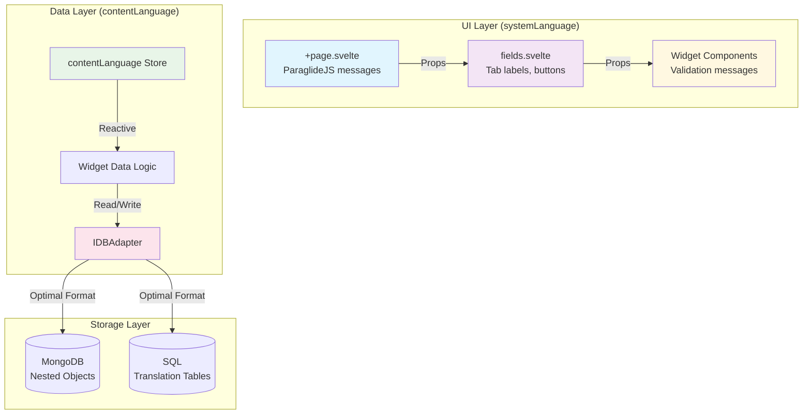
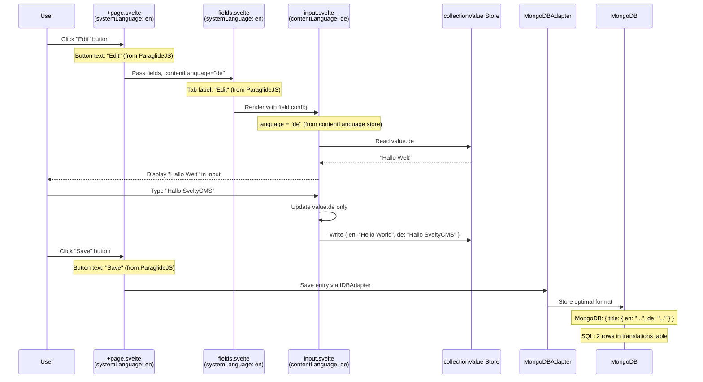

import { Callout } from 'nextra/components';

# Language & Internationalization Architecture

SveltyCMS implements a sophisticated dual-language system that separates **UI/Admin Interface language** from **Content language**, providing maximum flexibility for multilingual content management.

---

## Two-Language System Overview

```mermaid
graph TB
    subgraph "System Language (UI)"
        ParaglideJS[ParaglideJS]
        UIMessages[messages.js]
        SystemLang[app.systemLanguage]
        AdminInterface[Admin Interface]
    end

    subgraph "Content Language (Data)"
        DynamicSettings[System Settings]
        ContentLang[app.contentLanguage]
        WidgetSystem[Widget System]
        Database[(Database)]
    end

    ParaglideJS -->|Compile-time| UIMessages
    UIMessages -->|Runtime| SystemLang
    SystemLang -->|Displays| AdminInterface

    DynamicSettings -->|Configuration| ContentLang
    ContentLang -->|Drives| WidgetSystem
    WidgetSystem -->|Read/Write| Database

    style ParaglideJS fill:#4CAF50
    style DynamicSettings fill:#2196F3
    style SystemLang fill:#8BC34A
    style ContentLang fill:#03A9F4
```



### 1. System Language (`systemLanguage`)

**Purpose:** Controls the admin interface and UI language (menus, buttons, labels, messages)

**Technology:** ParaglideJS - compile-time i18n with type safety

**Configuration:** `project.inlang/settings.json`

**Characteristics:**

- ✅ Fixed at compile time (requires rebuild to add new languages)
- ✅ Type-safe translation keys
- ✅ Small bundle size (tree-shaking)
- ✅ Zero runtime overhead
- ✅ Perfect for admin UI that doesn't change often

**Available Languages:**

```json
// project.inlang/settings.json
{
	"languageTags": ["en", "de", "fr", "es"],
	"baseLanguageTag": "en"
}
```

### 2. Content Language (`contentLanguage`)

**Purpose:** Controls the language for viewing/editing content data

**Technology:** Dynamic system settings (stored in database)

**Configuration:** System Settings → Languages & Localization

**Characteristics:**

- ✅ Dynamic at runtime (no rebuild required)
- ✅ Configured by administrators
- ✅ Can support any language
- ✅ Per-field translation control
- ✅ Perfect for user-generated content

**Available Languages:**

```typescript
// Dynamic configuration in database
{
  DEFAULT_CONTENT_LANGUAGE: 'en',
  AVAILABLE_CONTENT_LANGUAGES: ['en', 'de', 'fr', 'es', 'ja', 'zh', ...]
}
```

---

## System Language (ParaglideJS)

### Architecture

```
Source Files → ParaglideJS Compiler → Type-Safe Messages → Runtime
   (*.json)           (Build Step)        (messages.js)      (Store)
```

### Message Files Structure

```
src/
├── paraglide/
│   ├── messages/
│   │   ├── en.json          # English (base)
│   │   ├── de.json          # German
│   │   ├── fr.json          # French
│   │   └── es.json          # Spanish
│   └── messages.js          # Generated type-safe exports
```

### Message File Example

```json
// src/paraglide/messages/en.json
{
	"dashboard_title": "Dashboard",
	"collections_menu": "Collections",
	"media_menu": "Media Library",
	"settings_menu": "Settings",
	"user_greeting": "Hello, {name}!",
	"save_button": "Save Changes",
	"cancel_button": "Cancel",
	"delete_confirm": "Are you sure you want to delete {itemName}?"
}
```

```json
// src/paraglide/messages/de.json
{
	"dashboard_title": "Übersicht",
	"collections_menu": "Sammlungen",
	"media_menu": "Medienbibliothek",
	"settings_menu": "Einstellungen",
	"user_greeting": "Hallo, {name}!",
	"save_button": "Änderungen speichern",
	"cancel_button": "Abbrechen",
	"delete_confirm": "Sind Sie sicher, dass Sie {itemName} löschen möchten?"
}
```

### Usage in Components

```svelte
<script lang="ts">
	import * as m from '@src/paraglide/messages';
	import { app } from '@stores/store.svelte';

	let userName = 'Alice';
</script>

<h1>{m.dashboard_title()}</h1>
<p>{m.user_greeting({ name: userName })}</p>

<nav>
	<a href="/collections">{m.collections_menu()}</a>
	<a href="/media">{m.media_menu()}</a>
	<a href="/settings">{m.settings_menu()}</a>
</nav>

<button>{m.save_button()}</button>
<button>{m.cancel_button()}</button>
```

### Benefits of ParaglideJS

1. **Type Safety:** TypeScript knows all available translation keys

   ```typescript
   m.dashboard_title(); // ✅ Valid
   m.nonexistent_key(); // ❌ TypeScript error
   ```

2. **Tree Shaking:** Only used messages are bundled

   ```typescript
   // If you never use m.old_unused_message(), it's not in the bundle
   ```

3. **Parameter Validation:** Type-checked parameters

   ```typescript
   m.user_greeting({ name: 'Alice' }); // ✅ Valid
   m.user_greeting({ wrongParam: 'Bob' }); // ❌ TypeScript error
   ```

4. **Build-Time Compilation:** No runtime parsing overhead

### Adding New System Language

1. **Add language to ParaglideJS config:**

   ```json
   // project.inlang/settings.json
   {
   	"languageTags": ["en", "de", "fr", "es", "it"], // Added 'it'
   	"baseLanguageTag": "en"
   }
   ```

2. **Create message file:**

   ```bash
   cp src/paraglide/messages/en.json src/paraglide/messages/it.json
   # Edit it.json with Italian translations
   ```

3. **Rebuild application:**

   ```bash
   npm run build
   # or
   npm run dev
   ```

4. **Update language switcher UI:**
   ```svelte
   <select bind:value={app.systemLanguage}>
   	<option value="en">English</option>
   	<option value="de">Deutsch</option>
   	<option value="fr">Français</option>
   	<option value="es">Español</option>
   	<option value="it">Italiano</option>
   </select>
   ```

---

## Content Language (Dynamic System)

### Architecture

```
System Settings → Database → Cache → contentLanguage Store → Widgets
   (Admin UI)      (MongoDB)   (TTL)      (Reactive)          (Display)
```

### Configuration Location

**Admin Interface:** `/config/systemsetting` → Languages & Localization tab

**System Settings Schema:**

```typescript
{
  DEFAULT_CONTENT_LANGUAGE: {
    type: 'string',
    default: 'en',
    validation: 'Must be in AVAILABLE_CONTENT_LANGUAGES',
    description: 'Primary language for content creation'
  },
  AVAILABLE_CONTENT_LANGUAGES: {
    type: 'array',
    default: ['en', 'de', 'fr', 'es'],
    validation: 'ISO 639-1 language codes',
    description: 'All languages available for content translation'
  }
}
```

### Runtime Behavior

**1. Initial Load:**

```typescript
// src/stores/store.svelte.ts
let initialContentLanguage =
	getCookie('contentLanguage') ?? // User's last selection
	publicEnv.DEFAULT_CONTENT_LANGUAGE ?? // System default
	'en'; // Fallback

let _contentLanguage = $state<Locale>(initialContentLanguage);
```

**2. Language Switching:**

```svelte
<!-- translation-status.svelte - Recommended: Anchor tag dropdown -->
<script lang="ts">
	import { app } from '@stores/store.svelte';

	function handleLanguageChange(newLang: string) {
		// Update singleton (syncs with server on navigation)
		app.contentLanguage = newLang;
	}
</script>

<!-- Dropdown with anchor tags for each language -->
{#each AVAILABLE_CONTENT_LANGUAGES as lang}
	<a
		href={`/${lang}/${collectionPath}`}
		data-sveltekit-preload-data="hover"
		data-sveltekit-reload
		onclick={() => handleLanguageChange(lang)}
		class:active={lang === app.contentLanguage}>
		{lang.toUpperCase()}
	</a>
{/each}

<!-- Alternative: Programmatic navigation for complex dropdowns -->
<script lang="ts">
	import { goto, invalidateAll } from '$app/navigation';
	import { app } from '@stores/store.svelte';

	async function switchLanguage(newLang: string) {
		app.contentLanguage = newLang;

		// Use goto() when you need special navigation options
		await goto(`/${newLang}/${collectionPath}`, { invalidateAll: true });
	}
</script>

<select onchange={(e) => switchLanguage(e.currentTarget.value)}>
	{#each AVAILABLE_CONTENT_LANGUAGES as lang}
		<option value={lang} selected={lang === app.contentLanguage}>
			{lang.toUpperCase()}
		</option>
	{/each}
</select>
```

**3. Server-Side Language Context:**

```typescript
// src/routes/(app)/[language]/[...collection]/+page.server.ts
export async function load({ params }) {
	const { language } = params;

	// Validate language
	if (!AVAILABLE_CONTENT_LANGUAGES.includes(language)) {
		throw error(404, `Language '${language}' not configured`);
	}

	// Language-specific cache key
	const cacheKey = `entries:${collectionId}:lang:${language}`;

	const entries = await db.crud.findMany('entries', { collectionId });

	return {
		entries,
		contentLanguage: language // Passed to client
	};
}
```

**4. Client-Server Synchronization:**

```svelte
<!-- +page.svelte -->
<script lang="ts">
	import { contentLanguage } from '@stores/store.svelte';

	let { data } = $props();
	let serverContentLanguage = $derived(data.contentLanguage);

	// Keep client store in sync with URL/server
	$effect(() => {
		if (serverContentLanguage !== app.contentLanguage) {
			app.contentLanguage = serverContentLanguage;
		}
	});
</script>
```

### Adding New Content Language

<Callout type="info">Unlike system languages, content languages can be added **without rebuilding** the application.</Callout>

**Step 1: Add to System Settings** (Admin UI)

1. Navigate to `/config/systemsetting`
2. Go to "Languages & Localization" tab
3. Add language code to `AVAILABLE_CONTENT_LANGUAGES` array
4. Example: Add Japanese `'ja'`
   ```json
   ["en", "de", "fr", "es", "ja"]
   ```
5. Click "Save Changes"

**Step 2: Existing Content Handling**

```typescript
// Existing entry before adding Japanese:
{
  title: { en: "Hello", de: "Hallo" },
  description: { en: "World", de: "Welt" }
}

// After adding Japanese:
// Same data - no automatic translation
{
  title: { en: "Hello", de: "Hallo" },  // ja: undefined
  description: { en: "World", de: "Welt" }  // ja: undefined
}

// User switches to Japanese → sees empty fields
// User enters translation → updates to:
{
  title: { en: "Hello", de: "Hallo", ja: "こんにちは" },
  description: { en: "World", de: "Welt", ja: "世界" }
}
```

**Step 3: Update translation-status Component**

The component automatically reads from `AVAILABLE_CONTENT_LANGUAGES`, so no code changes needed! 🎉

---

## Multilingual Data Model

### Field Schema Definition

```typescript
// config/collections/Posts/fields.ts
import type { FieldInstance } from '@src/content/types';

const fields: FieldInstance[] = [
	{
		widget: 'input',
		label: 'Title',
		db_fieldName: 'title',
		translated: true, // ← Multilingual field
		required: true
	},
	{
		widget: 'richText',
		label: 'Content',
		db_fieldName: 'content',
		translated: true, // ← Multilingual field
		required: true
	},
	{
		widget: 'input',
		label: 'Slug',
		db_fieldName: 'slug',
		translated: false, // ← Single value across all languages
		unique: true,
		required: true
	},
	{
		widget: 'select',
		label: 'Status',
		db_fieldName: 'status',
		translated: false, // ← Technical field, not translated
		options: ['draft', 'published', 'archived']
	}
];
```

### Data Storage Format

**Application Layer (Widgets & Components):**

```typescript
const blogPost = {
	_id: 'post_123',
	title: {
		en: 'Understanding Async/Await',
		de: 'Async/Await verstehen',
		fr: 'Comprendre Async/Await'
	},
	content: {
		en: '<p>Async/await makes asynchronous code...</p>',
		de: '<p>Async/await macht asynchronen Code...</p>',
		fr: '<p>Async/await rend le code asynchrone...</p>'
	},
	slug: 'understanding-async-await', // Not translated
	status: 'published', // Not translated
	createdAt: '2025-11-02T10:00:00Z',
	updatedAt: '2025-11-02T15:30:00Z'
};
```

**MongoDB Storage (Current):**

```javascript
// Stored directly as nested objects
db.collection('posts').insertOne(blogPost);

// MongoDB document:
{
  _id: ObjectId("post_123"),
  title: { en: "...", de: "...", fr: "..." },
  content: { en: "...", de: "...", fr: "..." },
  slug: "understanding-async-await",
  status: "published",
  createdAt: ISODate("2025-11-02T10:00:00Z"),
  updatedAt: ISODate("2025-11-02T15:30:00Z")
}
```

**SQL/Drizzle Storage (Future):**

```sql
-- posts table (main data)
CREATE TABLE posts (
  id VARCHAR(36) PRIMARY KEY,
  slug VARCHAR(255) UNIQUE NOT NULL,
  status VARCHAR(20) NOT NULL,
  created_at TIMESTAMP NOT NULL,
  updated_at TIMESTAMP NOT NULL
);

-- post_translations table (multilingual fields)
CREATE TABLE post_translations (
  id SERIAL PRIMARY KEY,
  post_id VARCHAR(36) REFERENCES posts(id) ON DELETE CASCADE,
  field_name VARCHAR(50) NOT NULL,
  language VARCHAR(5) NOT NULL,
  value TEXT,
  UNIQUE(post_id, field_name, language)
);

-- Sample data:
-- posts:
-- | id       | slug                      | status    | created_at | updated_at |
-- | post_123 | understanding-async-await | published | 2025-11-02 | 2025-11-02 |

-- post_translations:
-- | id | post_id  | field_name | language | value                                |
-- | 1  | post_123 | title      | en       | Understanding Async/Await            |
-- | 2  | post_123 | title      | de       | Async/Await verstehen                |
-- | 3  | post_123 | title      | fr       | Comprendre Async/Await               |
-- | 4  | post_123 | content    | en       | <p>Async/await makes asynchronous... |
-- | 5  | post_123 | content    | de       | <p>Async/await macht asynchronen...  |
-- | 6  | post_123 | content    | fr       | <p>Async/await rend le code...       |
```

**Drizzle Adapter (Reconstructs to Application Format):**

```typescript
// Drizzle adapter reads from SQL
async function findOne(collection: string, id: string) {
	// Query main table
	const mainRecord = await db.select().from(posts).where(eq(posts.id, id)).get();

	// Query translations
	const translations = await db.select().from(postTranslations).where(eq(postTranslations.post_id, id));

	// Reconstruct nested structure
	const reconstructed = { ...mainRecord };

	for (const trans of translations) {
		if (!reconstructed[trans.field_name]) {
			reconstructed[trans.field_name] = {};
		}
		reconstructed[trans.field_name][trans.language] = trans.value;
	}

	// Returns: { title: { en: "...", de: "...", fr: "..." }, ... }
	return reconstructed;
}
```

### Widget Data Access

Widgets always work with the normalized format, regardless of database:

```svelte
<!-- src/widgets/core/input/input.svelte -->
<script lang="ts">
	import { app } from '@stores/store.svelte';
	import { DEFAULT_CONTENT_LANGUAGE } from '@src/utils/constants';

	interface Props {
		field: FieldInstance;
		value: Record<string, string> | string;
	}

	let { field, value = $bindable() }: Props = $props();

	// Determine which language to display
	const _language = $derived(field.translated ? app.contentLanguage : DEFAULT_CONTENT_LANGUAGE);

	// Extract language-specific value
	const safeValue = $derived(
		field.translated && typeof value === 'object' && value !== null ? (value[_language] ?? '') : typeof value === 'string' ? value : ''
	);

	// Update language-specific value
	function updateValue(newValue: string) {
		if (field.translated) {
			// Merge with existing translations
			value = { ...(value as object), [_language]: newValue };
		} else {
			// Replace entire value
			value = newValue;
		}
	}
</script>

<input type="text" value={safeValue} oninput={(e) => updateValue(e.currentTarget.value)} placeholder={field.label} />
```

---

## Translation Workflow

### Creating Multilingual Content

**Step 1: Create in Default Language**

1. User navigates to collection: `/en/blog-posts`
2. Clicks "Create New"
3. `contentLanguage` = `'en'` (default)
4. Fills in fields:
   - Title: "My First Post"
   - Content: "This is amazing content..."
5. Clicks "Save"

**Database After Step 1:**

```json
{
	"_id": "post_456",
	"title": { "en": "My First Post" },
	"content": { "en": "This is amazing content..." },
	"slug": "my-first-post",
	"status": "draft"
}
```

**Step 2: Add German Translation**

1. User clicks language dropdown
2. Selects "DE" (German)
3. URL changes to `/de/blog-posts`
4. `app.contentLanguage = 'de'`
5. Server reloads with `contentLanguage: 'de'`
6. Same entry shows EMPTY fields (no German yet)
7. User enters German text:
   - Title: "Mein erster Beitrag"
   - Content: "Das ist toller Inhalt..."
8. Clicks "Save"

**Database After Step 2:**

```json
{
	"_id": "post_456",
	"title": {
		"en": "My First Post",
		"de": "Mein erster Beitrag"
	},
	"content": {
		"en": "This is amazing content...",
		"de": "Das ist toller Inhalt..."
	},
	"slug": "my-first-post",
	"status": "draft"
}
```

**Step 3: Add French Translation**

Same process:

1. Switch to "FR"
2. Enter French translations
3. Save

**Final Database:**

```json
{
	"_id": "post_456",
	"title": {
		"en": "My First Post",
		"de": "Mein erster Beitrag",
		"fr": "Mon premier article"
	},
	"content": {
		"en": "This is amazing content...",
		"de": "Das ist toller Inhalt...",
		"fr": "C'est un contenu incroyable..."
	},
	"slug": "my-first-post",
	"status": "draft"
}
```

### Translation Status Indicator

The `translation-status` component shows completion percentage:

```svelte
<translation-status entry={currentEntry} availableLanguages={['en', 'de', 'fr', 'es']} currentLanguage={app.contentLanguage} />

<!-- Displays:
  EN: 100% ✅ (3/3 translated fields filled)
  DE: 100% ✅ (3/3 translated fields filled)
  FR: 100% ✅ (3/3 translated fields filled)
  ES: 0%   ⚠️ (0/3 translated fields filled)
-->
```

**Calculation:**

```typescript
function calculateCompletionPercentage(entry: any, language: string): number {
	const translatedfields = schema.fields.filter((f) => f.translated);
	const filledfields = translatedfields.filter((f) => {
		const value = entry[f.db_fieldName];
		return value && typeof value === 'object' && value[language];
	});

	return (filledfields.length / translatedfields.length) * 100;
}
```

---

## Best Practices

### ✅ DO:

**1. Mark User-Facing Content as Translated:**

```typescript
{
	widget: 'input',
	db_fieldName: 'title',
	translated: true,   // ✅ Users see this
}
```

**2. Keep Technical fields Untranslated:**

```typescript
{
	widget: 'input',
	db_fieldName: 'slug',
	translated: false,  // ✅ URL path, same in all languages
}
```

**3. Include Language in Cache Keys:**

```typescript
const cacheKey = `entries:${id}:lang:${language}`; // ✅
```

**4. Validate contentLanguage from URL:**

```typescript
if (!AVAILABLE_CONTENT_LANGUAGES.includes(params.language)) {
	throw error(404, 'Language not available');
}
```

**5. Use Derived Values in Widgets:**

```typescript
const _language = $derived(field.translated ? app.contentLanguage : DEFAULT_CONTENT_LANGUAGE);
```

### ❌ DON'T:

**1. Don't Access Language Keys Directly:**

```typescript
const title = value.en; // ❌ Hardcoded language
const title = value[app.contentLanguage]; // ✅ Dynamic
```

**2. Don't Mix UI and Content Languages:**

```typescript
// ❌ WRONG: Using contentLanguage for UI text
<button>{app.contentLanguage === 'en' ? 'Save' : 'Speichern'}</button>

// ✅ CORRECT: Use ParaglideJS messages
<button>{m.save_button()}</button>
```

**3. Don't Cache Without Language:**

```typescript
const key = `entries:${id}`; // ❌ Missing language
```

**4. Don't Assume All fields Are Translated:**

```typescript
// ❌ WRONG
const displayValue = value[contentLanguage.value];

// ✅ CORRECT
const displayValue = field.translated ? value[contentLanguage.value] : value;
```

---

## Common Scenarios

### Scenario 1: User Wants Interface in German, Content in English

```typescript
// Set system language to German
systemLanguage.set('de');
// Admin UI now shows: "Übersicht", "Sammlungen", "Einstellungen"

// Set content language to English
contentLanguage.set('en');
// Navigate to: /en/blog-posts
// Editing fields shows English content

// Result: German UI + English content editing ✅
```

### Scenario 2: Multilingual Team

**Editor A (English Speaker):**

- System Language: `'en'`
- Content Language: `'en'`
- Creates blog post in English

**Editor B (German Speaker):**

- System Language: `'de'`
- Content Language: `'de'`
- Opens same blog post, adds German translation

**Editor C (French Speaker):**

- System Language: `'fr'`
- Content Language: `'fr'`
- Opens same blog post, adds French translation

**Result:** Each editor works in their preferred UI language while contributing translations to the same content. ✅

### Scenario 3: Removing a Content Language

<Callout type="error">⚠️ **WARNING:** Removing a language from `AVAILABLE_CONTENT_LANGUAGES` can cause **permanent data loss**!</Callout>

**Before Removal:**

```json
{
  "AVAILABLE_CONTENT_LANGUAGES": ["en", "de", "fr", "es"]
}

// Database entry:
{
  "title": {
    "en": "Hello",
    "de": "Hallo",
    "fr": "Bonjour",
    "es": "Hola"
  }
}
```

**After Removing Spanish:**

```json
{
  "AVAILABLE_CONTENT_LANGUAGES": ["en", "de", "fr"]
}

// Database entry unchanged:
{
  "title": {
    "en": "Hello",
    "de": "Hallo",
    "fr": "Bonjour",
    "es": "Hola"  // ⚠️ Still in DB but not accessible via UI
  }
}
```

**If Content is Re-saved:**

```json
// Widget only knows about ['en', 'de', 'fr']
// On save, it might replace entire object:
{
	"title": {
		"en": "Hello",
		"de": "Hallo",
		"fr": "Bonjour"
		// ❌ Spanish translation LOST forever!
	}
}
```

**Recommendation:** See [System Settings Architecture](./system-settings-architecture.mdx#language-configuration-warnings) for data preservation strategies.

---

## Migration Strategies

### From MongoDB to SQL/Drizzle

**1. Data Transformation Script:**

```typescript
import { db as mongoDb } from './databases/mongodb';
import { db as sqlDb } from './databases/drizzle';

async function migrateMultilingualData() {
	const collections = await mongoDb.content.nodes.getStructure('flat');

	for (const collection of collections) {
		const entries = await mongoDb.crud.findMany(collection.id, {});

		for (const entry of entries) {
			// Insert main record (untranslated fields)
			const mainData = Object.fromEntries(Object.entries(entry).filter(([key, value]) => typeof value !== 'object' || value === null));

			await sqlDb.insert(collection.id).values(mainData);

			// Insert translations (translated fields)
			const translatedfields = Object.entries(entry).filter(([key, value]) => typeof value === 'object' && value !== null);

			for (const [fieldName, translations] of translatedfields) {
				for (const [lang, value] of Object.entries(translations)) {
					await sqlDb.insert(`${collection.id}_translations`).values({
						entity_id: entry._id,
						field_name: fieldName,
						language: lang,
						value: value
					});
				}
			}
		}
	}
}
```

**2. Adapter Implementation:**

```typescript
// src/databases/drizzle/adapter.ts
export class DrizzleAdapter implements IDBAdapter {
	async findOne(collection: string, id: string) {
		// Fetch main record
		const main = await this.db
			.select()
			.from(getTable(collection))
			.where(eq(getTable(collection).id, id))
			.get();

		// Fetch translations
		const translations = await this.db
			.select()
			.from(getTranslationTable(collection))
			.where(eq(getTranslationTable(collection).entity_id, id));

		// Reconstruct nested structure
		const result = { ...main };

		for (const trans of translations) {
			if (!result[trans.field_name]) result[trans.field_name] = {};
			result[trans.field_name][trans.language] = trans.value;
		}

		return { success: true, data: result };
	}

	async update(collection: string, id: string, data: any) {
		// Split data into main and translations
		const mainfields = {};
		const translatedfields = {};

		for (const [key, value] of Object.entries(data)) {
			if (typeof value === 'object' && value !== null) {
				translatedfields[key] = value;
			} else {
				mainfields[key] = value;
			}
		}

		// Update main table
		if (Object.keys(mainfields).length > 0) {
			await this.db
				.update(getTable(collection))
				.set(mainfields)
				.where(eq(getTable(collection).id, id));
		}

		// Update translations
		for (const [fieldName, translations] of Object.entries(translatedfields)) {
			for (const [lang, value] of Object.entries(translations as any)) {
				await this.db
					.insert(getTranslationTable(collection))
					.values({
						entity_id: id,
						field_name: fieldName,
						language: lang,
						value
					})
					.onConflictDoUpdate({
						target: [getTranslationTable(collection).entity_id, getTranslationTable(collection).field_name, getTranslationTable(collection).language],
						set: { value }
					});
			}
		}

		return this.findOne(collection, id);
	}
}
```

**3. Zero Downtime Migration:**

1. Deploy Drizzle adapter alongside MongoDB adapter
2. Route reads to MongoDB, writes to both (dual-write)
3. Run background migration script
4. Verify data consistency
5. Switch reads to Drizzle
6. Remove MongoDB adapter

---

## Complete Component Stack Implementation

### Architecture Overview

SveltyCMS implements a clean separation of concerns where each layer respects the dual-language system:



### Component Responsibilities

#### 1. Page Component (`+page.svelte`)

**Responsibilities:**

- Route management and navigation
- Server-side data loading coordination
- Language sync (contentLanguage from server)
- UI navigation guards

**Language Usage:**

```svelte
<script lang="ts">
	import * as m from '@paraglide/messages'; // systemLanguage for UI
	import { contentLanguage } from '@stores/store.svelte'; // for sync only

	// Sync contentLanguage from server data
	$effect(() => {
		if (serverContentLanguage && contentLanguage.value !== serverContentLanguage) {
			contentLanguage.set(serverContentLanguage);
		}
	});
</script>

<!-- UI text uses systemLanguage -->
<h1>{m.collection_title()}</h1>

<!-- Pass contentLanguage to child components -->
<fields {fields} {revisions} contentLanguage={serverContentLanguage} />
```

#### 2. fields Component (`fields.svelte`)

**Responsibilities:**

- Field rendering orchestration
- Widget lifecycle management
- Revision history UI
- Form state synchronization

**Language Usage:**

```svelte
<script lang="ts">
	import * as m from '@paraglide/messages'; // systemLanguage for UI

	let {
		fields,
		revisions = [],
		contentLanguage // Received but not directly used (widgets access store)
	} = $props();
</script>

<!-- All UI elements use systemLanguage -->
<Tab name="edit">
	<iconify-icon icon="mdi:pen"></iconify-icon>
	{m.button_edit()}
	<!-- ParaglideJS -->
</Tab>

<Tab name="revisions">
	<iconify-icon icon="mdi:history"></iconify-icon>
	{m.applayout_version()}
	<!-- ParaglideJS -->
</Tab>

<!-- Required field indicator -->
<div class="text-error-500">{m.form_required()}</div>

<!-- Widgets handle their own contentLanguage for data -->
{#each filteredfields as field}
	<WidgetComponent {field} bind:value={currentCollectionValue[fieldName]} />
{/each}
```

#### 3. Widget Components (`input.svelte`, `display.svelte`)

**Responsibilities:**

- Data editing/display for specific field type
- Multilingual data handling
- Field-level validation
- User input processing

**Language Usage:**

```svelte
<script lang="ts">
	import { contentLanguage } from '@stores/store.svelte'; // For DATA
	import { publicEnv } from '@stores/global-settings.svelte';

	// Determine language for THIS field's data
	const _language = $derived(
		field.translated
			? contentLanguage.value // Use current content language
			: publicEnv.DEFAULT_CONTENT_LANGUAGE || 'en' // Use default
	);

	// Access data in the correct language
	let safeValue = $derived(value?.[_language] ?? '');

	// Update data for current language only
	function handleInput(newValue: string) {
		if (field.translated) {
			value = { ...value, [_language]: newValue }; // Update one language
		} else {
			value = newValue; // Update single value
		}
	}
</script>

<!-- Widget UI typically doesn't need translation -->
<!-- Field labels come from field.label configured in collection -->
<input value={safeValue} oninput={(e) => handleInput(e.currentTarget.value)} placeholder={field.placeholder} class="input" />

<!-- Character counter (no translation needed) -->
{#if field.count}
	<span class="badge">{count}/{field.maxLength}</span>
{/if}
```

### Data Flow Example

**Scenario:** User edits a blog post title in German



### Key Principles

1. **UI Language (systemLanguage) is Compile-Time**
   - Uses ParaglideJS messages
   - Zero runtime overhead
   - Type-safe message parameters
   - Loaded based on user's `systemLanguage` setting

2. **Content Language (contentLanguage) is Runtime**
   - Dynamic language switching
   - Per-field translation control
   - Database-agnostic storage
   - Reactive updates via Svelte stores

3. **Database Abstraction via IDBAdapter**
   - MongoDB: Stores as nested objects `{ en: "...", de: "..." }`
   - SQL: Stores in translation tables with foreign keys
   - Application code unchanged regardless of database
   - Optimal storage format for each database type

4. **Widget Autonomy**
   - Each widget determines if field is translated
   - Widgets handle language-specific data access
   - No language logic in parent components
   - Clean separation of concerns

### Example: Complete Blog Post Editing

**Field Configuration:**

```typescript
// config/collections/Posts.ts
{
  widget: 'input',
  label: 'Title',          // Static label (not translated)
  db_fieldName: 'title',
  translated: true,        // This field stores multilingual data
  required: true
}
```

**Runtime Execution:**

```typescript
// 1. User with systemLanguage="en" editing contentLanguage="de"

// Page UI (systemLanguage)
<Tab>{m.button_edit()}</Tab>
// → Displays: "Edit" (English UI)

// Widget Data (contentLanguage)
const _language = field.translated ? contentLanguage.value : 'en';
// → _language = "de"

const safeValue = value?.[_language];
// → value = { en: "Hello World", de: "Hallo Welt" }
// → safeValue = "Hallo Welt"

// User sees German content in English interface!
```

**Database Storage:**

```typescript
// IDBAdapter abstracts the storage format

// MongoDB (current implementation)
await mongoAdapter.crud.updateOne('posts', id, {
	title: {
		en: 'Hello World',
		de: 'Hallo Welt',
		fr: 'Bonjour le monde'
	}
});
// Stored as: { title: { en: "...", de: "...", fr: "..." } }

// DrizzleORM SQL (future implementation)
await drizzleAdapter.crud.updateOne('posts', id, {
	title: {
		en: 'Hello World',
		de: 'Hallo Welt',
		fr: 'Bonjour le monde'
	}
});
// Stored as:
// posts table: { id: "123", slug: "hello-world" }
// post_translations table:
//   { post_id: "123", field: "title", lang: "en", value: "Hello World" }
//   { post_id: "123", field: "title", lang: "de", value: "Hallo Welt" }
//   { post_id: "123", field: "title", lang: "fr", value: "Bonjour le monde" }

// Application receives SAME format from both adapters
const post = await db.crud.findOne('posts', id);
console.log(post.title); // { en: "...", de: "...", fr: "..." }
```

---

## Performance Optimization

### 1. Lazy Translation Loading

For large multilingual datasets, load translations on demand:

```typescript
// Only load current language
const entry = await db.crud.findOne('posts', id);
const currentTranslations = {
	title: entry.title[contentLanguage.value],
	content: entry.content[contentLanguage.value]
};

// Load other languages when user switches
async function loadLanguage(lang: string) {
	const translations = {
		title: entry.title[lang],
		content: entry.content[lang]
	};
	return translations;
}
```

### 2. Translation Caching

Cache frequently accessed translations:

```typescript
const cacheKey = `entry:${id}:lang:${lang}:field:${fieldName}`;
const translation = (await cache.get(cacheKey)) || (await db.getTranslation(id, fieldName, lang));
```

### 3. Bulk Translation Queries

For lists, fetch translations in bulk:

```typescript
// ❌ N+1 query problem
for (const entry of entries) {
	entry.title = await getTranslation(entry.id, 'title', lang);
}

// ✅ Single bulk query
const entryIds = entries.map((e) => e.id);
const translations = await getTranslationsBulk(entryIds, ['title', 'description'], lang);
```

---

## Related Documentation

- **[Code Structure](./code-structure.mdx)** - Overview of multilingual widget system
- **[Database Methods](./database-methods.mdx)** - Multilingual data handling
- **[System Settings](./system-settings-architecture.mdx)** - Dynamic language configuration
- **[Widget Development](../widgets/widget-development-guide.mdx)** - Creating multilingual widgets

---

_Last Updated: November 2, 2025_  
_Architecture Version: 3.0_
