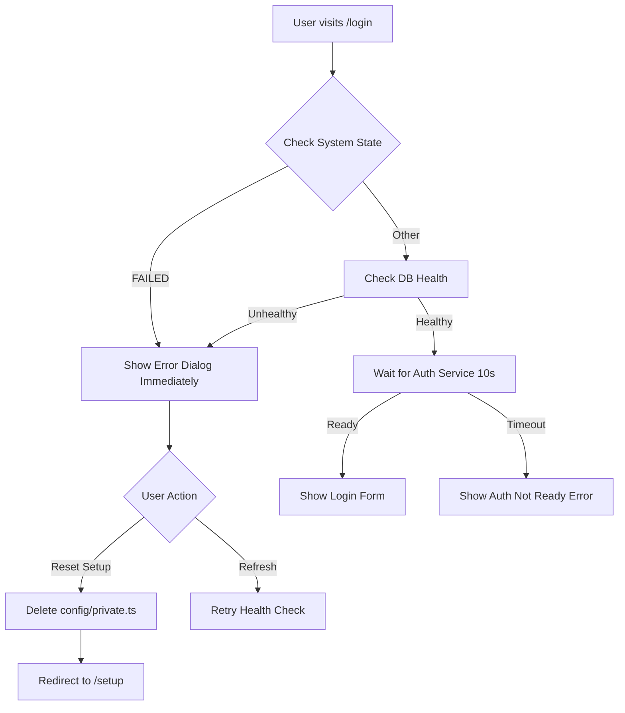

# Login Error Handling & Recovery

This document describes the improved error handling system for login failures, particularly when the database is unavailable or empty.

## Overview

The login system integrates with SveltyCMS's **centralized state management** (`@src/stores/system`) to provide fast, intelligent error detection and user-friendly recovery options.

## Architecture

### 1. State Management Integration

The login flow leverages the existing state management system for optimal performance:

```typescript
// Check system state first - avoid unnecessary DB queries
const { getSystemState, isServiceHealthy } = await import('@src/stores/system');
const systemState = getSystemState();

// Fast path: System already knows it's in FAILED state
if (systemState.overallState === 'FAILED') {
	// Return error immediately without waiting for timeout
	return showDatabaseError(lastFailure.reason);
}

// Fast path: Database service is marked unhealthy
if (!isServiceHealthy('database')) {
	return showDatabaseError(dbStatus.message);
}
```

**Benefits:**

- ⚡ **Instant error detection** - No 30s timeout waiting
- 🎯 **Precise error messages** - State management tracks exact failure reason
- 💾 **Resource efficient** - Reuses cached state instead of querying database

### 2. Database Health Check

After checking state management, a lightweight database verification confirms setup completion:

```typescript
async function checkDatabaseHealth(): Promise<{ healthy: boolean; reason?: string }> {
	// Step 1: Check state management (instant, cached)
	const systemState = getSystemState();
	if (!isServiceHealthy('database')) {
		return { healthy: false, reason: dbStatus.message };
	}

	// Step 2: Verify database has data (quick query)
	const rolesResult = await dbAdapter.roles.getAll();
	if (rolesResult.data.length === 0) {
		return {
			healthy: false,
			reason: 'Database is empty - setup may not have completed'
		};
	}

	return { healthy: true };
}
```

**Why this approach?**

- State management catches infrastructure failures (connection lost, MongoDB down)
- Database query catches configuration issues (empty DB after manual deletion)
- Together they provide complete coverage

### 3. Reduced Timeout for Auth Service

```typescript
// Before: 30 seconds timeout
async function waitForAuthService(maxWaitMs: number = 30000);

// After: 10 seconds timeout
async function waitForAuthService(maxWaitMs: number = 10000);
```

**Rationale:**

- If database is healthy, auth initializes in <1 second
- 10 seconds is 10x the normal initialization time
- Failing fast (10s vs 30s) improves user experience

## Error Flow



## User-Facing Error Dialog

When database issues are detected, users see a comprehensive error dialog:

```svelte
{#if data.showDatabaseError}
	<div class="error-dialog">
		<h2>Database Issue Detected</h2>
		<p>The system configuration exists, but the database is empty or unavailable.</p>

		<div class="error-reason">
			<p><strong>Reason:</strong></p>
			<p>{data.errorReason}</p>
		</div>

		<h3>Possible Solutions:</h3>
		<ul>
			<li>If MongoDB is not running, start it and refresh this page</li>
			<li>If the database was manually dropped, you need to reset the setup</li>
			<li>Check your database connection settings in config/private.ts</li>
			<li>Restore your database from a backup if available</li>
		</ul>

		<button onclick={resetSetup}>Reset Setup</button>
		<button onclick={refresh}>Refresh Page</button>
	</div>
{/if}
```

## Recovery Options

### Option 1: Refresh (Quick Fix)

Best for temporary issues:

- MongoDB was restarting
- Network hiccup resolved
- Database just came back online

**Action:** Click "Refresh Page" button

### Option 2: Reset Setup (Nuclear Option)

When configuration is corrupted or database was manually deleted:

**Security:** Only allowed when:

1. User is authenticated as admin, OR
2. System is in FAILED state

**Process:**

1. User clicks "Reset Setup"
2. Confirmation dialog appears
3. System deletes `config/private.ts`
4. Clears cached configuration
5. Redirects to `/setup` wizard

**Implementation:**

```typescript
// /api/setup/reset/+server.ts
export const POST: RequestHandler = async ({ locals }) => {
	// Security check
	const systemState = getSystemState();
	const isAdmin = locals.user?.role === 'admin';
	const isSystemFailed = systemState.overallState === 'FAILED';

	if (!isAdmin && !isSystemFailed) {
		return json({ error: 'Unauthorized' }, { status: 403 });
	}

	// Delete config and clear cache
	await unlink('config/private.ts');
	clearPrivateConfigCache();

	return json({ success: true });
};
```

## Performance Metrics

### Before Optimization

- **Error Detection Time:** 30-60 seconds (timeout-based)
- **Database Queries:** 3-5 redundant queries before timeout
- **User Experience:** Frustrating wait with no feedback

### After Optimization

- **Error Detection Time:** <100ms (state-based) or 10s max (timeout)
- **Database Queries:** 1 lightweight query (roles check)
- **User Experience:** Immediate feedback with actionable solutions

### Measurement

State management tracks these metrics automatically:

```typescript
const systemState = getSystemState();

// Check database service metrics
const dbMetrics = systemState.services.database.metrics;
console.log({
	failureCount: dbMetrics.failureCount,
	consecutiveFailures: dbMetrics.consecutiveFailures,
	lastFailureAt: dbMetrics.lastFailureAt,
	uptimePercentage: dbMetrics.uptimePercentage
});
```

## Testing

### Playwright Test Enhancement

```typescript
// Wait for page load before checking for database form
await page.waitForLoadState('networkidle');

// Extended timeout for database configuration to appear
await expect(page.getByRole('heading', { name: /database/i })).toBeVisible({ timeout: 30000 });
```

**Why `networkidle`?**

- Ensures all JavaScript has executed
- State management has initialized
- Error dialogs have rendered if needed

## Troubleshooting

### Scenario 1: "Database is empty" error but MongoDB is running

**Cause:** Database was manually dropped or setup didn't complete

**Solution:**

1. Check if roles collection exists: `db.roles.find()`
2. If empty, click "Reset Setup" to run wizard again
3. Or restore from backup

### Scenario 2: Error persists after refreshing

**Cause:** Persistent connection issue or corrupted config

**Solutions:**

1. Check MongoDB is running: `systemctl status mongod`
2. Verify connection in config: `config/private.ts`
3. Check logs: Look for database connection errors
4. Last resort: Reset setup

### Scenario 3: Can't reset setup (403 Forbidden)

**Cause:** Security restriction - not admin and system not failed

**Solutions:**

1. Wait for system to detect failure (happens automatically)
2. Or manually authenticate as admin first
3. Or manually delete `config/private.ts` via filesystem

## Related Documentation

- [State Management Architecture](./state-management.mdx)
- [Database Health Checks](./database-health.mdx)
- [Setup Wizard](../guides/setup-wizard.mdx)
- [Troubleshooting Guide](../troubleshooting.mdx)

## Future Enhancements

### Planned Features

- [ ] Automatic retry with exponential backoff
- [ ] Email notification to admins on database failure
- [ ] Database connection pooling diagnostics
- [ ] Self-healing database reconnection
- [ ] Detailed error logs download from UI
