# Marketplace System

SveltyCMS connects to the hosted marketplace at **marketplace.sveltycms.com** for plugin discovery, license verification, and one-click installation. Combined with the [AI Widget Scaffolder](../guides/development/ai-integration.mdx), this provides two complementary paths for extending the CMS.

## Architecture

```mermaid
flowchart TD
    subgraph Local["Local CMS"]
        CLI["CLI: bun marketplace"]
        ADMIN["Admin UI"]
        INSTALL["installPlugin()"]
        SCAFFOLD["AI Widget Scaffolder"]
    end

    subgraph Remote["marketplace.sveltycms.com"]
        AUTH["POST /api/login"]
        REGISTER["POST /api/register"]
        PACKAGES["GET /api/packages"]
        DETAIL["GET /api/packages/{slug}"]
        CREATE["POST /api/packages"]
        UPLOAD["POST /api/upload (50MB)"]
        DOWNLOAD["GET /api/download/{id}"]
        CHECKOUT["POST /api/checkout"]
        WEBHOOK["POST /api/webhooks/stripe"]
        LICENSE_V1["POST /api/v1/license/verify"]
        EXTENSIONS["GET /api/v1/extensions"]
        EXT_ACTION["POST /api/v1/extensions/{type}/{action}"]
    end

    CLI -->|"browse/search"| PACKAGES
    ADMIN -->|"discover"| PACKAGES
    CLI -->|"details"| DETAIL
    INSTALL -->|"purchase-verified"| DOWNLOAD
    ADMIN -->|"publish"| CREATE
    ADMIN -->|"upload package"| UPLOAD
    CLI -->|"verify license"| LICENSE_V1
    ADMIN -->|"checkout"| CHECKOUT
    STRIPE["Stripe"] -.->|"events"| WEBHOOK

    SCAFFOLD -->|"generate from config"| LOCAL_WIDGETS["src/widgets/core/"]
    INSTALL -->|"write files"| LOCAL_PLUGINS["src/plugins/"]

    AUTH --> STORE[(Marketplace DB)]
    REGISTER --> STORE
    PACKAGES --> STORE
    DOWNLOAD --> STORE
    LICENSE_V1 --> STORE
    EXT_ACTION --> STORE


```



## Marketplace API (marketplace.sveltycms.com)

| Method | Endpoint                             | Description                                        |
| :----- | :----------------------------------- | :------------------------------------------------- |
| `GET`  | `/api`                               | Health check + endpoint index                      |
| `POST` | `/api/login`                         | Authentication (bcrypt)                            |
| `POST` | `/api/logout`                        | Clear session                                      |
| `POST` | `/api/register`                      | User registration                                  |
| `GET`  | `/api/packages`                      | List packages (type, category, search, pagination) |
| `POST` | `/api/packages`                      | Create package (authenticated)                     |
| `GET`  | `/api/packages/{slug}`               | Package detail with versions                       |
| `POST` | `/api/checkout`                      | Create Stripe Checkout Session                     |
| `POST` | `/api/upload`                        | Upload package file (multipart, 50MB max)          |
| `GET`  | `/api/download/{id}`                 | Download package (purchase-verified)               |
| `POST` | `/api/webhooks/stripe`               | Stripe webhook handler                             |
| `POST` | `/api/v1/license/verify`             | Validate license key                               |
| `GET`  | `/api/v1/extensions`                 | List available extension types                     |
| `POST` | `/api/v1/extensions/{type}/{action}` | Premium extension logic                            |

## Two Paths to Extend

| Path                    | How                                                     | Best For                                 |
| ----------------------- | ------------------------------------------------------- | ---------------------------------------- |
| **Marketplace Install** | Browse → Download → `installPlugin()`                   | Ready-made plugins, themes, integrations |
| **AI Scaffolder**       | Describe → `scaffoldWidget(config)` → 3 files generated | Custom widgets unique to your project    |

The marketplace hosts community-built plugins. The scaffolder generates custom code on demand. Together they cover the full spectrum from "I need a Stripe integration" to "I need a very specific testimonial carousel."

## Marketplace Client API

### List plugins

```typescript
import { marketplace } from "@src/services/intelligence/marketplace-client";

// Browse all plugins
const { plugins, total } = await marketplace.list({ type: "widget", limit: 10 });

// Search
const results = await marketplace.search("seo");

// Filter by license tier
const freePlugins = await marketplace.list({ license: "free" });
```

### Install a plugin

```typescript
import { installPlugin } from "@src/services/intelligence/marketplace-client";

const plugin = await installPlugin("svelty-stripe");
// → Downloads files, creates src/plugins/stripe/, writes all files
```

### License management

```typescript
import { setLicenseKey } from "@src/services/intelligence/marketplace-client";

// Set your pro/enterprise license
setLicenseKey("svl_xxxxxxxxxxxxxxxxxxxxxxxx");

// Check if license allows a specific plugin
const { valid, tier } = await marketplace.checkLicense("enterprise-audit");
```

### Check for updates

```typescript
// Pass your installed plugins
const updates = await marketplace.checkUpdates([
  { id: "redirect-manager", version: "1.0.0" },
  { id: "sitemap", version: "1.0.0" },
]);

// → [{ id: "sitemap", version: "1.1.0", ... }]
```

## Plugin Types

| Type          | Install Path   | Example                           |
| ------------- | -------------- | --------------------------------- |
| `widget`      | `src/widgets/` | Star rating, testimonial carousel |
| `plugin`      | `src/plugins/` | Stripe, PageSpeed, Sitemap        |
| `theme`       | `src/themes/`  | Dark Corporate, Minimal Blog      |
| `integration` | Config-based   | Slack webhook, Google Analytics   |

## License Tiers

| Tier           | Price   | Features                                            |
| -------------- | ------- | --------------------------------------------------- |
| **Free**       | $0      | Community plugins, unlimited installs               |
| **Pro**        | Contact | Premium plugins, priority support                   |
| **Enterprise** | Contact | All plugins, custom SLA, on-prem marketplace mirror |

## Performance

| Operation             | Latency                      | Cached      |
| --------------------- | ---------------------------- | ----------- |
| `list()` (first call) | ~200ms (network)             | 30 min      |
| `list()` (cached)     | <0.1ms                       | In-memory   |
| `download()`          | ~500ms-2s (download + write) | N/A         |
| `checkUpdates()`      | ~150ms                       | Per-request |

The marketplace client is **offline-resilient**: if marketplace.sveltycms.com is unreachable, it serves cached listings and degrades gracefully.

## Related

- [AI Integration & Hosted Knowledge](../guides/development/ai-integration.mdx) — AI widget scaffolder and behavioral learning
- [Behavioral Learning Engine](./behavioral-learning.mdx) — Learns from usage patterns
- [Plugin Architecture](../guides/development/plugin/architecture.mdx) — Building plugins for SveltyCMS
- [Widget Development](../guides/development/widgets/index.mdx) — Building custom widgets
