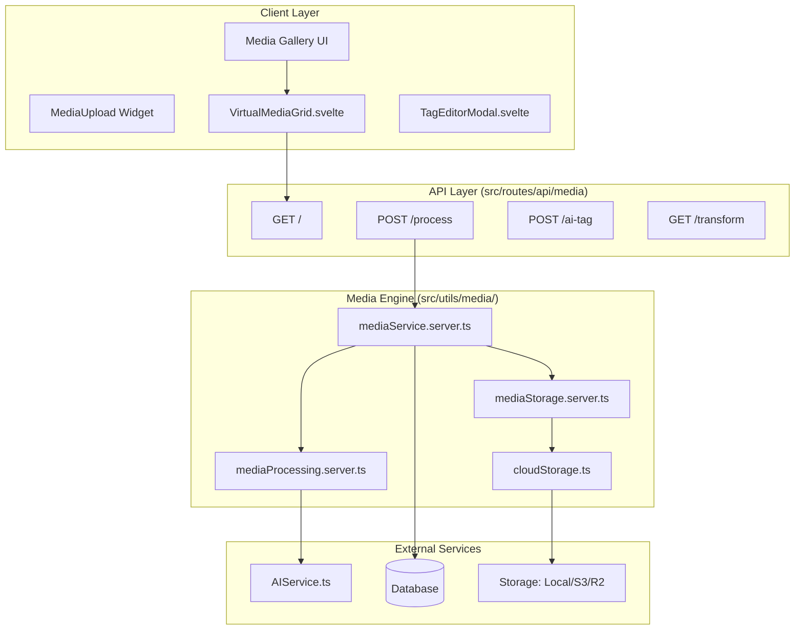

# Media System Architecture

The SveltyCMS Media system is designed as a high-performance, decoupled engine capable of handling enterprise-grade Digital Asset Management (DAM) needs. It separates storage concerns from processing logic and UI rendering.

---

## 🏗️ Layered Architecture

The system follows a strict 3-layer architecture to ensure database and storage agnosticism.

---

## 📁 Key Components & File Structure

The "Media Engine" is consolidated within `src/utils/media/` for maximum modularity.

### 1. Core Engine

- **`mediaService.server.ts`**: The main entry point for all media business logic. Orchestrates uploads, versions, and metadata persistence.
- **`mediaProcessing.server.ts`**: Handles technical analysis using Sharp.js. Extracts EXIF, IPTC, and XMP data and generates content hashes (SHA-256).
- **`mediaStorage.server.ts`**: Abstraction layer for filesystem and cloud storage operations. Handles image resizing and path sanitization.

### 2. Implementation Modules

- **`cloudStorage.ts`**: Adapter for S3, Cloudflare R2, and Cloudinary.
- **`mediaModels.ts`**: Centralized TypeScript interfaces for `MediaItem`, `MediaMetadata`, and `ResizedImage`.
- **`advancedSearch.ts`**: Specialized logic for filtering media by complex criteria (camera model, dominant color, size ranges).

---

## 📤 Processing Pipeline

When a file is uploaded (via `POST /api/media/process`), it follows this sequence:

1.  **Binary Validation**: Inspects the buffer using `file-type` to detect the true MIME type, bypassing extension-only spoofing.
2.  **Deduplication**: Generates a 20-character SHA-256 hash. If the hash exists in the database, the upload is cancelled to save storage.
3.  **Metadata Extraction**:
    - Full technical metadata (dimensions, format, color space).
    - Deep DAM metadata (EXIF/IPTC/XMP) for photography assets.
4.  **Transformation**:
    - Generates standard thumbnails (`sm`: 600px, `md`: 900px, `lg`: 1200px).
    - Converts to modern formats (WebP/AVIF) if configured in system settings.
5.  **Persistence**: Saves the `MediaItem` document to the primary database and caches the result for sub-millisecond retrieval.

---

## 🖼️ Document Processing

For non-image assets like PDFs, the system uses a hybrid approach:

- **ImageMagick/Ghostscript**: Used as a fallback to render a high-quality JPG preview of the first page.
- **Graceful Degradation**: If system tools are missing, the system automatically reverts to a lightweight SVG/Icon representation.

---

## 📡 Performance Optimizations

1.  **Virtual Grid**: UI renders only visible items using a virtual list, maintaining 60FPS even with galleries of 10,000+ assets.
2.  **Transform Proxy**: Image transformations are handled via a dedicated endpoint (`/api/media/transform`) which supports edge caching.
3.  **Lazy Service Loading**: Heavy processing dependencies (like `sharp` and `file-type`) are imported dynamically within the service to reduce initial server startup time.
