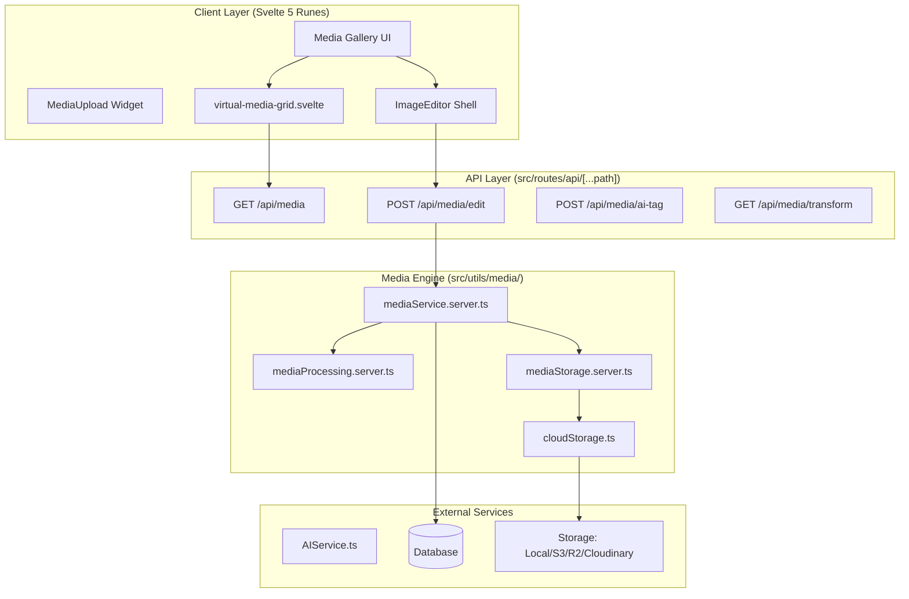
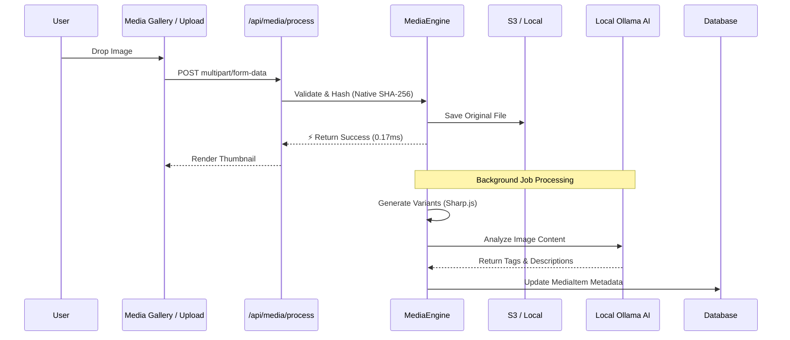

# Media System Architecture & Guide

The SveltyCMS Media system is a decoupled, performance-first engine. Built with Svelte 5 and Sharp.js, it prioritizes native Node/Bun utilities over heavy third-party dependencies to ensure sub-millisecond latency and reduced bundle size.

---

## 🏗️ Layered Architecture

The system follows a strict 3-layer architecture to ensure storage and framework portability.

```mermaid
graph TB
    subgraph "Client Layer (Svelte 5 Runes)"
        UI[Media Gallery UI]
        UW[MediaUpload Widget]
        VGRID[virtual-media-grid.svelte]
        EDITOR[ImageEditor Shell]
    end

    subgraph "API Layer (src/routes/api/[...path])"
        API1[GET /api/media]
        API2[POST /api/media/edit]
        API3[POST /api/media/ai-tag]
        API4[GET /api/media/transform]
    end

    subgraph "Media Engine (src/utils/media/)"
        MS[mediaService.server.ts]
        MPS[mediaProcessing.server.ts]
        MST[mediaStorage.server.ts]
        CS[cloudStorage.ts]
    end

    subgraph "External Services"
        AIS[AIService.ts]
        DB[(Database)]
        STORE[Storage: Local/S3/R2/Cloudinary]
    end

    UI --> VGRID
    VGRID --> API1
    UI --> EDITOR
    EDITOR --> API2
    API2 --> MS
    MS --> MPS
    MS --> MST
    MST --> CS
    MS --> DB
    CS --> STORE
```

---

## 📤 Media Upload & AI Processing Pipeline

The ingestion pipeline is designed to never block the user UI. Uploads execute critical persistence instantly, while heavy lifting (like AI tagging and image variants) runs asynchronously.

```mermaid
sequenceDiagram
    participant User
    participant Gallery as Media Gallery / Upload
    participant API as /api/media/process
    participant Engine as MediaEngine
    participant Storage as S3 / Local
    participant AI as Local Ollama AI

    User->>Gallery: Drop Image
    Gallery->>API: POST multipart/form-data
    API->>Engine: Validate & Hash (Native SHA-256)
    Engine->>Storage: Save Original File
    Engine-->>API: ⚡ Return Success (0.17ms)
    API-->>Gallery: Render Thumbnail

    note over Engine, AI: Background Job Processing
    Engine->>Engine: Generate Variants (Sharp.js)
    Engine->>AI: Analyze Image Content
    AI-->>Engine: Return Tags & Descriptions
    Engine->>Database: Update MediaItem Metadata
```

### 1. High-Performance Client Rendering

- **Virtual Scrolling**: `virtual-media-grid.svelte` handles 10,000+ files by rendering only visible items.
- **Lazy Loading**: Images load only when visible using Intersection Observer.
- **On-the-Fly Transforms**: Responsive images via `GET /api/media/transform` using Sharp.js.

### 2. AI-Native Tagging (Ollama Integration)

Unlike standard CMS platforms that use simple keyword matching, SveltyCMS features **native AI image analysis**.

- **Fully Automated**: Triggers automatically during background job processing (`MediaService.saveMedia`).
- **Privacy-First**: Uses local Ollama inference (`llava`), analyzing on your own infrastructure without exposing raw images to third-party APIs.

### 3. Enterprise DAM Capabilities

- **Batch Image Processor**: Apply Vivid, B&W, Sepia, and HDR filters to 100+ images simultaneously.
- **Deep Metadata Extraction**: Automatically parses **EXIF, IPTC, and XMP** data into searchable database fields.
- **Document Thumbnails**: Automated extraction of the first page of PDFs as a high-quality preview (Requires `imagemagick` and `ghostscript`).

### 4. Performance-First Philosophy

SveltyCMS has been optimized to remove legacy dependencies, replacing them with modern native counterparts:

- **Decentralized Media Tier (WebGPU)**: SveltyCMS 2026 utilizes the client's raw hardware via **WebGPU/WASM** directly in the browser. Large images are immediately compressed, focal-cropped, and converted to WebP/AVIF _before_ hitting the network.
- **Optimization Feedback**: The upload UI provides real-time "Optimization Score" metrics, showing exactly how much bandwidth was saved by client-side processing (often > 90%).
- **Hashing**: Powered by native `crypto` (SHA-256).
- **ID Generation**: Uses high-entropy `crypto.randomUUID()`.
- **MIME Detection**: Implemented via **SlimSniffer**, a lightweight native Magic Byte inspector that replaces `file-type`.
- **Type Safety**: Unified `CmsMediaMetadata` interface ensures strict database agnosticism across all adapters.

### 5. Performance & Search Optimization

SveltyCMS employs several advanced techniques to ensure the Media Hub scales to hundreds of thousands of assets:

- **Trigram GIN Indexes (PostgreSQL)**: The `media_items` table utilizes GIN-based trigram indexes on the `filename` and `originalFilename` fields. This enables high-performance, case-insensitive partial searches (e.g., searching for "logo" within a filename), achieving O(log n) complexity instead of full table scans.
- **Unified ETag Caching**: The `/files/[...path]` route implements a unified ETag strategy.
  - **Local Storage**: Generates stable ETags based on file `mtimeMs` and `size`.
  - **Cloud Storage**: Prefetches asset ETags (from S3/R2 metadata) to support **304 Not Modified** responses, avoiding redundant 307 redirects and saving client-side round-trips.
- **Incremental Settings Reload**: System-wide media settings changes (like switching from Local to S3) are applied instantly via optimized `reinitializeSystem` logic, which reloads specific database settings without a destructive system reset.

---

## 🎨 Image Editor Integration

The gallery is deeply integrated with the canvas-based Image Editor:

- **Non-Destructive Editing**: Originals are preserved; edits are saved as variants.
- **Interactive Focal Points**: Visual crosshair selection for art-directed cropping. This focal point is injected natively into our GraphQL API delivery.
- **Watermarking**: Automatic application of collection-level watermark presets.

---

## ⚡ Performance Benchmarks

For comprehensive performance details regarding media hashing, metadata extraction, and multi-scale resizing block times, please reference the central [Benchmarks Report](../project/benchmarks.mdx).

---

## ⌨️ Accessibility & Hotkeys

The Media System implements **WCAG 3.0 Functional Performance** principles via a centralized hotkey manager.

| Shortcut  | Action        | Scope              |
| :-------- | :------------ | :----------------- |
| `Mod + F` | Focus Search  | Gallery            |
| `Mod + A` | Select All    | Gallery / Widget   |
| `Mod + O` | Open Library  | MediaUpload Widget |
| `Delete`  | Bulk Delete   | Gallery (Selected) |
| `Escape`  | Clear Filters | Gallery / Editor   |
| `Mod + Z` | Undo Edit     | ImageEditor        |

---

## 📚 API Reference

For detailed developer endpoints (upload, transform, AI-tag, focal points), read the comprehensive [**Media Reference**](../api/media.mdx).
