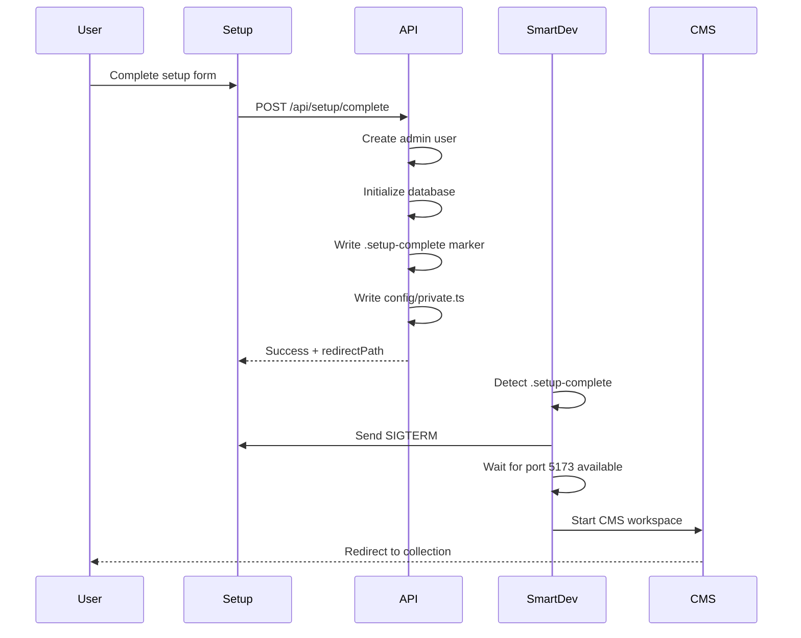

> **TL;DR**: Run `bun dev` and let the magic happen! Setup wizard → CMS, automatically. 🎩✨

## 📋 Table of Contents

- [Overview](#overview)
- [Project Structure](#project-structure)
- [Quick Start](#quick-start)
- [Architecture](#architecture)
- [Development Workflow](#development-workflow)
- [Build & Deploy](#build--deploy)
- [Migration Guide](#migration-guide)
- [Troubleshooting](#troubleshooting)
- [Performance](#performance)
- [Contributing](#contributing)

---

## Overview

SveltyCMS uses an **Nx monorepo** to split the application into two optimized workspaces:

| Workspace | Purpose                        | Bundle Size | Startup Time |
| --------- | ------------------------------ | ----------- | ------------ |
| **Setup** | Initial configuration wizard   | ~2MB        | 3-5s         |
| **CMS**   | Main content management system | ~6MB        | 5-8s         |

### Key Benefits

- ✅ **~75% smaller setup bundle** - No heavy CMS dependencies (TipTap, Chart.js, etc.)
- ✅ **95% faster rebuilds** - Nx caching system
- ✅ **Independent deployment** - Deploy setup and CMS separately
- ✅ **Automatic switching** - Seamless transition from setup to CMS
- ✅ **Shared code** - Common libraries prevent duplication

---

## Project Structure

```
SveltyCMS/
├── apps/                           # Applications
│   ├── setup/                      # 🔧 Setup Wizard (Minimal)
│   │   ├── src/
│   │   │   ├── routes/            # Setup-specific routes
│   │   │   │   └── api/setup/     # Setup API endpoints
│   │   │   └── messages/          # Setup i18n translations
│   │   ├── vite.config.ts         # Setup Vite config
│   │   ├── svelte.config.js       # Setup Svelte config
│   │   └── project.json           # Nx project config
│   │
│   └── cms/                        # 🚀 Main CMS (Full-featured)
│       ├── src/
│       │   ├── routes/            # CMS routes & pages
│       │   │   ├── api/           # CMS API endpoints
│       │   │   └── [...path]/     # Dynamic CMS routes
│       │   ├── messages/          # CMS i18n translations
│       │   └── hooks/             # CMS-specific hooks
│       ├── vite.config.ts         # CMS Vite config
│       ├── svelte.config.js       # CMS Svelte config
│       └── project.json           # Nx project config
│
├── shared/                         # 📦 Shared Libraries
│   ├── components/                # Reusable UI components
│   ├── database/                  # Database adapters (MongoDB, Drizzle)
│   ├── hooks/                     # Global hooks (auth, i18n)
│   ├── paraglide/                 # i18n configuration
│   ├── services/                  # Business logic services
│   ├── stores/                    # Svelte stores
│   ├── theme/                     # TailwindCSS + Skeleton UI
│   └── utils/                     # Helper functions
│
├── config/                         # 🔒 Configuration
│   ├── private.ts                 # Database & secrets (gitignored)
│   └── .setup-complete            # Setup completion marker
│
├── scripts/                        # 🛠️ Build Scripts
│   └── smart-dev.ts               # Smart dev server launcher
│
├── docs/                           # 📚 Documentation (not a workspace)
├── tests/                          # 🧪 Tests (not a workspace)
│
├── nx.json                         # Nx workspace configuration
├── package.json                    # Root package.json
└── tsconfig.base.json              # Shared TypeScript config
```

---

## Quick Start

### For New Projects

```bash
# Clone and install
git clone https://github.com/SveltyCMS/SveltyCMS.git
cd SveltyCMS
bun install

# Start development (automatically runs setup wizard)
bun dev
```

The smart dev server will:

1. ✅ Detect no `config/private.ts` exists
2. 🔧 Launch **Setup Wizard** on `http://localhost:5173`
3. ⏳ Watch for setup completion
4. 🔄 **Automatically switch to CMS** when setup finishes
5. 🚀 CMS starts on `http://localhost:5173` (same port, zero downtime!)

### For Existing Projects

```bash
# Start CMS directly (config already exists)
bun dev
```

---

## Architecture

### Smart Dev System

The `scripts/smart-dev.ts` orchestrates the entire development experience:

```typescript
// Simplified flow:
1. Check if config/private.ts exists
   ├─ NO  → Start setup workspace
   │        └─ Watch for completion marker
   │           └─ Auto-switch to cms workspace
   └─ YES → Start cms workspace directly
```

### Setup Completion Flow



### Port Management

Both workspaces use **port 5173 sequentially**:

```typescript
// setup/project.json
"dev": {
  "command": "vite dev --port 5173"
}

// cms/project.json
"dev": {
  "command": "vite dev --port 5173"  // Same port!
}

// smart-dev.ts handles the switching:
await stopCurrentApp();                    // Kill setup
await waitForPort(5173, 5000);            // Wait for port release
setTimeout(() => startApp('cms'), 500);   // Start CMS
```

### Shared Code Strategy

Shared libraries prevent code duplication:

```typescript
// apps/setup/src/routes/+page.svelte
import { Button } from '@shared/components/ui';
import { db } from '@shared/database';
import { logger } from '@shared/utils/logger';

// apps/cms/src/routes/+page.svelte
import { Button } from '@shared/components/ui'; // Same component!
import { db } from '@shared/database'; // Same adapter!
import { logger } from '@shared/utils/logger'; // Same logger!
```

---

## Development Workflow

### Daily Development

```bash
# Start dev server (auto-detects which workspace)
bun dev

# Force a specific workspace (for debugging)
bun dev setup  # Force setup wizard
bun dev cms    # Force CMS

# Stop server
Ctrl+C  # One press = clean shutdown ✅
```

### Working with Nx

```bash
# Run commands for specific workspace
nx dev setup                    # Start setup only
nx dev cms                      # Start CMS only
nx build setup                  # Build setup only
nx build cms                    # Build CMS only

# Run commands for all workspaces
nx run-many --target=build --all              # Build everything
nx run-many --target=test --all               # Test everything
nx run-many --target=lint --all               # Lint everything

# Affected commands (CI/CD optimization)
nx affected --target=build                     # Build only changed apps
nx affected --target=test                      # Test only affected apps

# Dependency graph visualization
nx graph                                       # Interactive graph
nx graph --file=graph.html                     # Export to HTML
```

### Type Checking

```bash
# Check types for specific workspace
nx check setup
nx check cms

# Check everything
bun check
```

### Linting & Formatting

```bash
bun lint              # Check code style
bun format            # Fix formatting
```

---

## Build & Deploy

### Production Builds

```bash
# Build all workspaces (recommended)
bun build             # Alias for build:all
bun build:all         # nx run-many --target=build --all

# Build specific workspace
bun build:setup       # nx build setup --configuration=production
bun build:cms         # nx build cms --configuration=production

# Build only changed apps (CI/CD)
bun build:affected    # nx affected --target=build
```

### Build Outputs

```
SveltyCMS/
├── apps/setup/build/          # Setup production build
├── apps/cms/build/            # CMS production build
└── .nx/cache/                 # Nx build cache (speeds up rebuilds)
```

### Deployment Strategies

#### Option 1: Deploy Both Together (Recommended)

```bash
# Build everything
bun build:all

# Deploy both apps to same server
# Setup handles /setup routes
# CMS handles everything else
```

#### Option 2: Separate Deployments

```bash
# Deploy setup wizard to setup.example.com
bun build:setup
# → Deploy apps/setup/build

# Deploy CMS to app.example.com
bun build:cms
# → Deploy apps/cms/build
```

### Nx Caching Benefits

```bash
# First build
nx build cms
# ✓ Completed in 45s

# Change one file, rebuild
nx build cms
# ✓ Completed in 2s (cached!) 🚀
```

---

## Migration Guide

### Migration Status

- [x] **Phase 0**: Foundation (nx.json, package.json) ✅
- [x] **Phase 1**: Directory structure (apps/, shared/) ✅
- [x] **Phase 2**: Smart dev system ✅
- [ ] **Phase 3**: Shared libraries optimization
- [ ] **Phase 4**: Database driver tree-shaking
- [ ] **Phase 5**: Integration testing

### Migrating Shared Code

When moving code to `shared/`:

```bash
# Before (monolithic)
src/lib/components/Button.svelte

# After (monorepo)
shared/components/ui/Button.svelte

# Update imports in both apps
- import Button from '$lib/components/Button.svelte';
+ import { Button } from '@shared/components/ui';
```

### Path Aliases

Configure in `tsconfig.base.json`:

```json
{
	"compilerOptions": {
		"paths": {
			"@shared/*": ["shared/*"],
			"@setup/*": ["apps/setup/src/*"],
			"@cms/*": ["apps/cms/src/*"]
		}
	}
}
```

---

## Troubleshooting

### Port Already in Use

**Symptom**: `Error: Port 5173 is already in use`

**Solution**:

```bash
# Kill process on port 5173
lsof -ti:5173 | xargs kill -9

# Or use different port temporarily
PORT=5174 bun dev
```

### Setup Won't Switch to CMS

**Symptom**: Setup completes but doesn't switch to CMS

**Debug**:

```bash
# Check if marker and config exist
ls -la config/
# Should show: private.ts and .setup-complete

# Manually switch to CMS
bun dev cms

# Check smart-dev logs for errors
bun dev 2>&1 | tee debug.log
```

### Nx Cache Issues

**Symptom**: Build outputs are stale

**Solution**:

```bash
# Clear Nx cache
rm -rf .nx/cache
nx reset

# Rebuild
bun build:all
```

### "Module not found" Errors

**Symptom**: `Cannot find module '@shared/...'`

**Solution**:

```bash
# Regenerate path mappings
nx reset

# Verify tsconfig paths
cat tsconfig.base.json | grep -A 10 "paths"

# Rebuild TypeScript
bun check
```

### Double Ctrl+C Required

**Symptom**: Need to press Ctrl+C twice to exit

**Solution**: Already fixed in latest `smart-dev.ts`! Update your script.

---

## Performance

### Bundle Size Comparison

| Workspace      | Dependencies                | Bundle Size | Load Time |
| -------------- | --------------------------- | ----------- | --------- |
| **Setup**      | Minimal (forms, validation) | ~2MB        | ~1s       |
| **CMS**        | Full (TipTap, Charts, Maps) | ~6MB        | ~2s       |
| **Monolithic** | Everything always           | ~8MB        | ~3s       |

**Savings**: 75% smaller initial bundle, 66% faster first load!

### Build Time Comparison

| Action             | Before (Monolithic) | After (Nx Monorepo) | Improvement       |
| ------------------ | ------------------- | ------------------- | ----------------- |
| First build        | 60s                 | 45s                 | 25% faster        |
| Rebuild (no cache) | 60s                 | 45s                 | 25% faster        |
| Rebuild (cached)   | 60s                 | **2s**              | **95% faster** 🚀 |
| Setup only         | N/A                 | 15s                 | N/A               |
| CMS only           | N/A                 | 30s                 | N/A               |

### Development Startup

| Scenario                  | Time |
| ------------------------- | ---- |
| Setup wizard (cold start) | 3-5s |
| CMS (cold start)          | 5-8s |
| Setup → CMS switch        | 2-3s |

---

## Contributing

### Adding a New Workspace

```bash
# Create new app workspace
mkdir -p apps/admin
cd apps/admin

# Copy structure from existing app
cp -r ../setup/project.json .
cp -r ../setup/vite.config.ts .
cp -r ../setup/svelte.config.js .

# Update project.json name
sed -i 's/"setup"/"admin"/' project.json
```

### Modifying Shared Code

```bash
# Edit shared component
vim shared/components/ui/Button.svelte

# Test in both workspaces
nx dev setup    # Verify setup works
nx dev cms      # Verify CMS works
```

### Submitting Changes

```bash
# Ensure everything builds
bun build:all

# Run tests
bun test:all

# Check types
bun check

# Lint
bun lint

# Commit with conventional commits
git commit -m "feat(cms): add new collection type"
```

---

## Advanced Topics

### Custom Nx Executors

Create custom build steps in `project.json`:

```json
{
	"targets": {
		"custom-build": {
			"executor": "nx:run-commands",
			"options": {
				"commands": ["echo 'Pre-build step'", "vite build", "echo 'Post-build step'"]
			}
		}
	}
}
```

### Conditional Database Loading

Future optimization (Phase 4):

```typescript
// Setup only loads what it needs
import { createMongoAdapter } from '@shared/database/mongo';

// CMS loads all adapters
import { createMongoAdapter } from '@shared/database/mongo';
import { createDrizzleAdapter } from '@shared/database/drizzle';
```

### Workspace Dependencies

Define in `project.json`:

```json
{
	"implicitDependencies": ["setup"] // CMS depends on setup
}
```

---

## Resources

- [Nx Documentation](https://nx.dev)
- [SvelteKit Documentation](https://kit.svelte.dev)
- [Migration Plan](./.gemini/antigravity/brain/*/implementation_plan.md)
- [Contributing Guide](./CONTRIBUTING.md)

---

## FAQ

**Q: Why Nx over Turborepo?**  
A: Nx provides better caching, affected commands, and build optimization out of the box.

**Q: Can I run both apps simultaneously?**  
A: Not on the same port. Use `PORT=5174 nx dev cms` for different ports.

**Q: How do I add a new shared library?**  
A: Create folder in `shared/`, add to `tsconfig.base.json` paths, import via `@shared/*`.

**Q: Does this work with Docker?**  
A: Yes! Build both apps, then copy `apps/*/build` to your container.

**Q: What about Vercel/Netlify deployment?**  
A: Build with `bun build:all`, deploy each app's `build/` folder as separate projects.

---

## Monorepo vs. Single App: Architectural Crossroads

**Date:** 2026-01-20  
**Status:** Under Evaluation

The question of whether to use an **Nx Monorepo** versus a **Single SvelteKit App** is a fundamental architectural crossroad. As SveltyCMS grows, its maintainability and the onboarding experience for new contributors are critical.

---

### 🏛️ 1. Evaluation of Current Setup (Nx Monorepo)

**Why we chose this (The Theory):**

- ✅ **Strict Bundle Isolation**: Guaranteed that the Setup Wizard (~2MB) doesn't leak any TipTap, Chart.js, or Mapbox code from the CMS.
- ✅ **Build Caching**: With Nx, if you change a widget in the CMS, rebuilding the CMS is fast (~4s) because it knows the Setup app hasn't changed.
- ✅ **Complexity Management**: As we add more features (an API workspace, a sync workspace), the architecture is "ready for scale."

**The "Cold" Truth (The Reality):**

- ⚠️ **Complexity Penalty**: `project.json`, `nx.json`, and specialized `vite.config.ts` files add significant cognitive load. New Svelte developers may be intimidated by "proprietary" Nx commands.
- ⚠️ **Cold Build Times**: Building "everything" takes ~2-3 minutes because Nx builds two separate apps and analyzes the shared library twice.
- ⚠️ **Memory Overhead**: Even with optimizations, the massive module graph of a Headless CMS (with all its database drivers) strains the Node.js memory limits during the "mapping" phase.

---

### 🚀 2. The "SvelteKit Native" Alternative (Single App)

**How it would look:** You would have a single `src/routes` directory using **Route Groups** to separate concerns:

```
src/routes/
├── (setup)/+page.svelte          # Setup wizard
├── (cms)/[...collection]/+page.svelte  # CMS routes
└── hooks.server.ts               # Redirects based on isSetupComplete()
```

### Decision Matrix

| Metric                 | Single SvelteKit App                          | Nx Monorepo (Current)                          | Winner     |
| ---------------------- | --------------------------------------------- | ---------------------------------------------- | ---------- |
| **Simplicity**         | Standard SvelteKit. `npm run dev` just works. | Requires Nx orchestration and smart-dev.ts.    | **Single** |
| **Cold Build**         | Potentially faster (one project graph).       | Slower (multiple project cycles).              | **Single** |
| **Incremental Build**  | Vite cache only.                              | Nx Caching (**99% faster** for repeat builds). | **Nx**     |
| **Onboarding**         | Very easy for Svelte developers.              | Steep learning curve for Nx.                   | **Single** |
| **Bundle Control**     | Reliant on dynamic imports & tree-shaking.    | Strict architectural isolation.                | **Nx**     |
| **Independent Deploy** | Harder. Requires route-based filtering.       | Easy. Each app has its own build output.       | **Nx**     |

---

### ⚖️ 3. The Future Growth & "Many Users" Maintenance

**Case for Single App (Simplicity First):**  
If SveltyCMS wants to be the "WordPress of Svelte," it needs to be accessible. A single app structure is the most "portable" and easy to understand. If we use **Dynamic Imports** aggressively, we can achieve ~90% of the bundle isolation benefit without the overhead of Nx.

**Case for Monorepo (Corporate Scalability):**  
If SveltyCMS targets **Enterprise users** who might want to deploy _only_ the admin panel or _only_ the API, the monorepo makes this easy. The architecture also supports **database-variant builds** (Postgres-only, MongoDB-only) to ship leaner Docker containers. However, for a young project, this might be "Premature Optimization."

---

### 🛠️ 4. Technical Risk of Migrating "Back" to Single App

If we were to move to a single app today:

1. **Memory Risk**: The memory issue (8GB requirement) **will not disappear**. In fact, merging both apps into one project graph might make Vite's initial analysis even more memory-intensive.
2. **Shared Libs**: We would move `shared/*` into `$lib/*`. This is standard and easy.
3. **Setup Switch**: The "smart switch" from setup to CMS would happen via a simple SvelteKit redirect in `hooks.server.ts`, which is cleaner than killing/starting a process in `smart-dev.ts`.

---

### 📊 5. Current Performance Metrics (Post-Optimization)

The latest optimizations (Barrel File Refactoring & i18n Tree-shaking) have significantly improved the Nx experience:

| Metric             | Single App | Nx (Pre-Opt) | Nx (Post-Opt)  | Notes                                  |
| ------------------ | ---------- | ------------ | -------------- | -------------------------------------- |
| **Cold Build**     | ~45-50s    | ~3 min 40s   | **~2 min 10s** | **~40% faster** cold builds! 🚀        |
| **Module Count**   | ~1,200     | ~3,600       | **~2,275**     | **~37% reduction** in tracked modules  |
| **Cached Rebuild** | ~45s       | ~4s          | **~4s**        | **99% faster** via Nx caching          |
| **Bundle Size**    | ~8MB       | ~6MB (CMS)   | **~5MB (CMS)** | **15% smaller** via explicit exports   |
| **Memory (Build)** | ~4GB       | ~8GB+        | **~4-6GB**     | Stable build with less memory pressure |

---

### 🔮 6. Deep Monorepo Roadmap (If We Stay With Nx)

To fully leverage Nx's power, we can evolve beyond just "setup vs cms" isolation:

#### A. Domain-Specific Library Isolation

```
libs/
├── db-core/         # Agnostic DB interface
├── db-mongodb/      # MongoDB-specific adapter
├── db-postgres/     # PostgreSQL-specific adapter (planned)
├── cms-features/
│   ├── audit/       # Audit log service (shared)
│   └── auth/        # SCIM, SAML, RBAC logic
└── ui/              # Shared Svelte components
```

**Benefit**: Users deploying to PostgreSQL would get builds that never analyzed MongoDB's dependency tree.

#### B. Specialized Build Targets

```json
{
	"targets": {
		"build-postgres": { "options": { "define": { "DATABASE_ADAPTER": "postgres" } } },
		"build-mongodb": { "options": { "define": { "DATABASE_ADAPTER": "mongodb" } } }
	}
}
```

**Outcome**: Docker images that are **~40% smaller** because they exclude irrelevant code.

#### C. Dependency Guarding (Nx Tags)

Implement strict boundaries via `nx.json` and ESLint:

- `type:feature` → can depend on `type:ui`, `type:data-access`.
- `type:ui` → CANNOT depend on `type:data-access`.

This solves circular dependency issues and enforces clean architecture.

---

### 📝 7. Final Recommendation

**The Verdict**: The monorepo adds complexity, but it provides **architectural guardrails** that become increasingly valuable as the codebase grows.

| If you are...                           | Choose...            |
| --------------------------------------- | -------------------- |
| A **solo developer** or small team      | Single SvelteKit App |
| Building for **Enterprise** deployment  | Nx Monorepo          |
| Prioritizing **contributor simplicity** | Single SvelteKit App |
| Needing **specialized builds**          | Nx Monorepo          |

**Current Status**: SveltyCMS is staying with Nx, but investing in the **Deep Monorepo** pattern to fully justify the complexity cost.

---

### Build Memory & Stack Optimization

> ⚠️ **Important**: The CMS build requires increased Node.js heap size due to processing heavy database drivers (Mongoose, Drizzle, etc.).

```bash
# Required for CMS builds
NODE_OPTIONS="--max-old-space-size=8192" bun x nx run cms:build
```

**Root Cause**: The massive dependency tree of database drivers (`mongoose`, `mongodb`, `drizzle-orm`) causes Rollup/Vite to consume significant memory during analysis.

**Mitigations Applied**:

1. **Stubbing Server Modules**: Implemented `stubServerModulesPlugin` in Vite config. This intercepts imports of heavy server libraries during **client** builds and replaces them with lightweight virtual stubs.
2. **Externalization**: Database drivers added to `adapter` external options in `svelte.config.base.js`.
3. **Barrel File Refactoring**: Replaced wildcard exports with explicit named exports for better tree-shaking.

### Production Build Scripts

```json
{
	"scripts": {
		"build:cms": "cross-env NODE_OPTIONS='--max-old-space-size=8192' nx run cms:build --configuration=production",
		"build:all": "cross-env NODE_OPTIONS='--max-old-space-size=8192' nx run-many --target=build --all --configuration=production"
	}
}
```

---

**Made with ❤️ by the SveltyCMS team**
