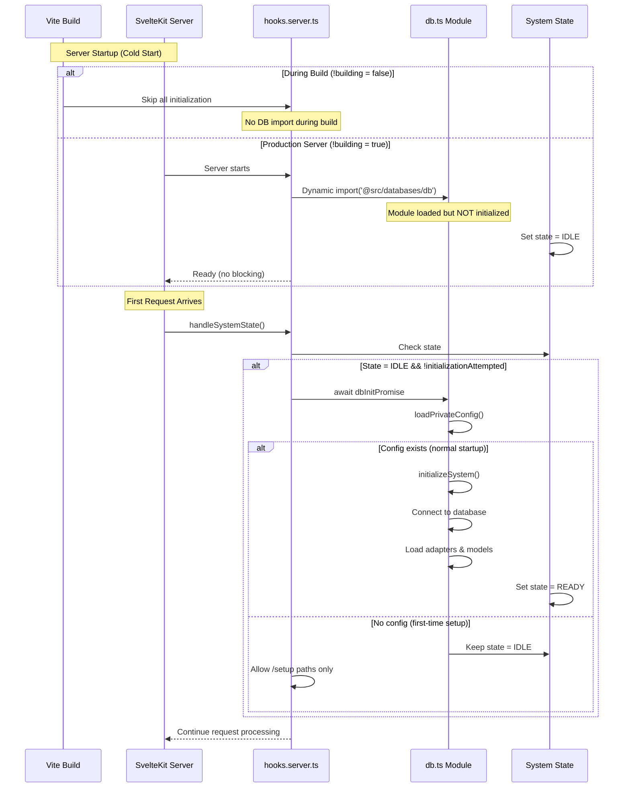
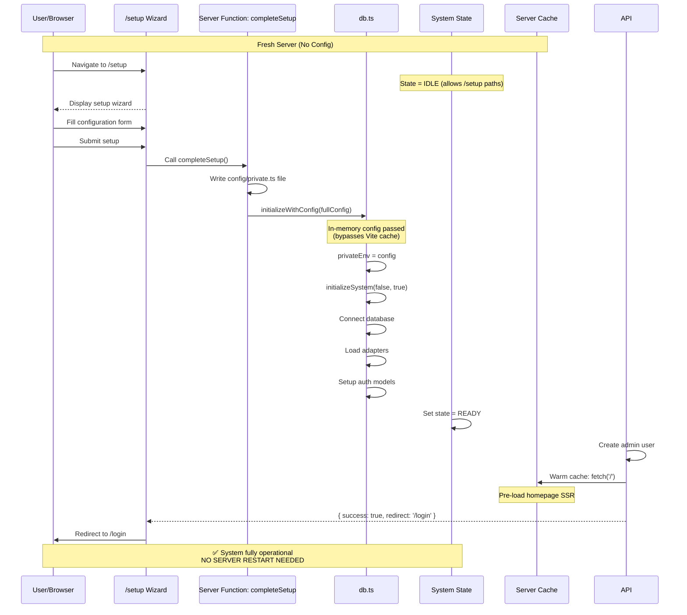
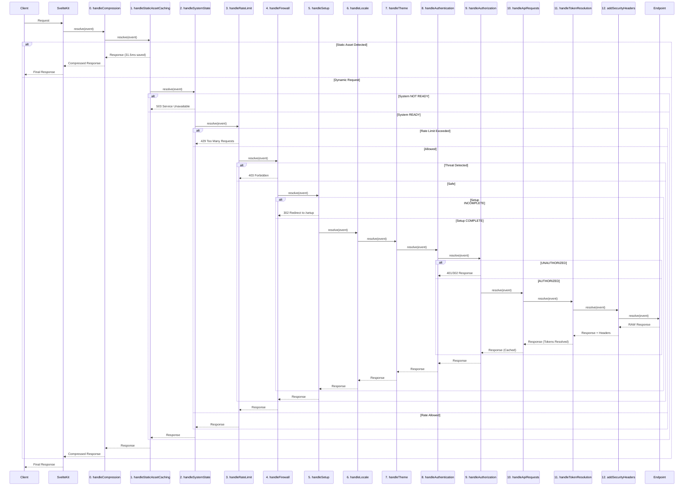

# Server Hooks & Middleware Architecture

SveltyCMS employs an **enterprise-grade, streamlined middleware pipeline** using SvelteKit Server Hooks. This architecture emphasizes **security, performance, and observability** with unified metrics collection and automated threat detection.

---

## Design Philosophy

The middleware architecture is built on **core enterprise principles**:

1.  **Sequential & Predictable**: Hooks run in a defined order for every request, making the system easy to understand, debug, and scale.

2.  **Centralized State-Guarding**: The `handleSystemState` hook acts as the authoritative gatekeeper, ensuring no requests are processed unless the system is operational.

3.  **Unified Metrics & Monitoring**: All hooks integrate with the **MetricsService** for comprehensive performance and security monitoring.

4.  **Production-Optimized**: WeakRef-based memory management, non-blocking streaming, and distributed rate limiting for clustered deployments.

5.  **Framework-Native**: Leverages SvelteKit's built-in CSP and optimizes around framework capabilities.

---

## Current Middleware Sequence

```typescript
// src/hooks.server.ts (simplified)
if (!building) {
	// Background Service: Telemetry
	// Runs independently of requests (Singleton pattern, 12h interval)
	import('@src/services/TelemetryService').then(({ telemetryService }) => {
		// ... startup initialization ...
	});
}

const middleware: Handle[] = [
	handleCompression, // 0. Compression (GZIP/Brotli)
	handleStaticAssetCaching, // 1. Static assets FIRST (skip all processing)
	handleSystemState, // 2. System readiness & state validation
	handleRateLimit, // 3. Rate limiting (abuse prevention)
	handleFirewall, // 4. Application firewall (threat detection)
	handleSetup, // 5. Setup completion enforcement
	handleLocale, // 6. Language preferences (i18n)
	handleTheme, // 7. Theme management (SSR)
	handleAuthentication, // 8. Session validation & multi-tenancy
	handleAuthorization, // 9. Role-based access control
	handleApiRequests, // 10. API Authorization & Caching
	handleTokenResolution, // 11. RBAC-Aware Token resolution
	addSecurityHeaders // 12. Security headers (defense in depth)
];

export const handle: Handle = sequence(...middleware);
```

## 📡 Telemetry & Usage Tracking

SveltyCMS includes a minimal Heartbeat System (Telemetry) to help the core team understand usage patterns and enforce the BSL 1.1 license for enterprise users.

### How it works

1.  **Non-Blocking:** The telemetry runs as a background process initialized in `hooks.server.ts` (outside the request pipeline).
2.  **Frequency:** It sends a heartbeat once every 12 hours per server instance.
3.  **Efficiency:** Uses Singleton patterns to preventing caching issues during Hot Module Replacement (HMR).
4.  **Data Collected:**
    - SveltyCMS Version (e.g., 1.0.0)
    - Hostname / Domain (e.g., cms.example.com)
    - Environment (Development vs Production)
    - Node.js Version
    - System Info (OS, CPU, Memory) for performance profiling
    - Approximate Location (Country/City) for usage heatmaps
    - Usage Metrics (User/Collection/Role counts)

### Privacy & Opt-Out

We respect user privacy. Telemetry can be completely disabled by setting the following environment variable in your `.env` file:

```bash
# Disable SveltyCMS Telemetry
SVELTY_TELEMETRY_DISABLED=true
# OR use the universal standard
DO_NOT_TRACK=1
```

## 🚀 Server Startup & Initialization Flow

### Optimized Startup Strategy

SveltyCMS employs a **lazy initialization strategy** to minimize server startup time and enable **zero-restart setup completion**:



### First-Time Installation Flow (Zero Restart Required)



### Key Implementation: hooks.server.ts

```typescript
// --- Server Startup Logic ---
if (!building) {
	/**
	 * Lazy initialization: DB module is loaded but NOT initialized
	 * until the first request arrives.
	 *
	 * This enables:
	 * 1. Fast server startup (no blocking I/O)
	 * 2. Zero-restart setup completion
	 * 3. Dynamic configuration reloading
	 *
	 * State transitions: IDLE -> INITIALIZING -> READY/DEGRADED/FAILED
	 */
	import('@src/databases/db')
		.then(() => {
			logger.info('✅ DB module loaded. Will initialize on first request.');
		})
		.catch((error) => {
			logger.error('Fatal: Failed to load DB module:', error);
		});
}
```

**Why Dynamic Import?**

- ✅ **Non-Blocking**: Server starts immediately without waiting for DB
- ✅ **Setup-Friendly**: First-time installs don't crash (IDLE state)
- ✅ **Hot Reload**: Configuration changes don't require restarts
- ✅ **Build-Safe**: Skipped entirely during Vite build process

### Zero-Restart Setup: initializeWithConfig()

**Problem Solved:** Traditional approach required server restart after creating `config/private.ts` because Vite caches module imports.

**Solution:** Pass configuration in-memory, bypassing filesystem imports:

```typescript
// src/databases/db.ts
export async function initializeWithConfig(config: PrivateEnv): Promise<{ status: string }> {
	try {
		logger.info('Initializing system with provided configuration (bypassing Vite cache)...');

		// CRITICAL: Set config in memory BEFORE initialization
		privateEnv = config;

		// Now initialize system (skipSetupCheck = true means use in-memory config)
		initializationPromise = initializeSystem(false, true);
		await initializationPromise;

		return { status: 'success' };
	} catch (error) {
		logger.error('Failed to initialize with config:', error);
		throw error;
	}
}
```

**Called by:** `completeSetup` Server Function in `src/routes/setup/+page.server.ts` after writing `config/private.ts`.

**Benefits:**

1. **Immediate Availability**: System becomes operational instantly
2. **No Restart**: Configuration takes effect without process restart
3. **Cache Warming**: First page load happens during setup completion
4. **Smooth UX**: Users redirected directly to login page

---

## Hook Implementations

### 0. handleCompression - Response Optimization

**File**: `src/hooks/handleCompression.ts`
**Purpose**: Efficiently compresses outgoing responses using GZIP or Brotli.

**Key Features**:

- Automatical detection of browser capability via `Accept-Encoding`.
- Prioritizes Brotli for modern browsers, falls back to GZIP.
- Outer-most layer to ensure the final response body is compressed before transmission.

---

### 1. handleStaticAssetCaching - Performance Optimization

**File**: `src/hooks/handleStaticAssetCaching.ts`
**Purpose**: Aggressive caching for static assets (runs FIRST for maximum performance)

**Strategy**: `max-age=31536000, public, immutable` (1 year cache)

```typescript
export const handleStaticAssetCaching: Handle = async ({ event, resolve }) => {
	// Regex-based detection for performance
	if (STATIC_ASSET_REGEX.test(event.url.pathname)) {
		const response = await resolve(event);
		response.headers.set('Cache-Control', 'public, max-age=31536000, immutable');
		return response;
	}
	return resolve(event);
};
```

**Assets Cached**:

- SvelteKit build artifacts (`/_app/`)
- Static files (`/static/`)
- JavaScript, CSS, source maps (`.js`, `.css`, `.map`)
- Images (`.svg`, `.png`, `.jpg`, `.webp`, `.avif`)
- Fonts (`.woff`, `.woff2`, `.ttf`, `.eot`)
- Manifests, favicons

**Performance Impact**: Skips ALL other middleware (~15-20ms saved per static request)

---

### 2. handleSystemState - System Gateway

**File**: `src/hooks/handleSystemState.ts`
**Purpose**: Validates system readiness before processing requests

**State Machine**: `IDLE → INITIALIZING → READY/DEGRADED/FAILED`

```typescript
export const handleSystemState: Handle = async ({ event, resolve }) => {
	const { pathname } = event.url;
	let systemState = getSystemState();

	// Wait for initialization on first request
	if (systemState.overallState === 'IDLE' && !initializationAttempted) {
		initializationAttempted = true;
		await dbInitPromise;
		systemState = getSystemState();
	}

	// Allow setup wizard and root redirect during IDLE state
	if (systemState.overallState === 'IDLE') {
		const allowedPaths = ['/setup', '/api/system/health', '/login', '/static', '/.well-known'];
		if (allowedPaths.some((prefix) => pathname.startsWith(prefix)) || pathname === '/') {
			return resolve(event);
		}
	}

	// Block all requests if system FAILED
	if (systemState.overallState === 'FAILED') {
		const allowedPaths = ['/api/system/health', '/api/dashboard/health', '/.well-known'];
		if (allowedPaths.some((prefix) => pathname.startsWith(prefix))) {
			return resolve(event);
		}
		throw error(503, 'Service Unavailable: A critical system component has failed.');
	}

	// During INITIALIZING, wait for initialization to complete
	if (systemState.overallState === 'INITIALIZING') {
		const allowedPaths = ['/api/system/health', '/api/dashboard/health', '/setup', '/login', '/.well-known'];
		if (allowedPaths.some((prefix) => pathname.startsWith(prefix)) || pathname === '/') {
			return resolve(event);
		}

		// Wait for initialization to complete
		await dbInitPromise;
		systemState = getSystemState();

		// If still not ready after initialization, block the request
		if (!isSystemReady()) {
			throw error(503, 'Service Unavailable: The system failed to initialize.');
		}
	}

	// Allow requests only when READY or DEGRADED
	const isReady = isSystemReady();
	if (!isReady) {
		const allowedPaths = ['/api/system/health', '/setup'];
		if (allowedPaths.some((prefix) => pathname.startsWith(prefix))) {
			return resolve(event);
		}
		throw error(503, 'Service Unavailable: The system is starting up.');
	}

	return resolve(event);
};
```

**Key Features**:

- **Smart Initialization**: Waits for initialization during INITIALIZING state instead of blocking
- **Root Path Handling**: Allows `/` during IDLE and INITIALIZING for proper redirects to /setup, /login, or first collection
- **State Machine Enforcement**: Blocks requests appropriately based on system state
- **Partial Functionality**: Allows essential routes in DEGRADED state
- **Always-On Health Checks**: Health check endpoints accessible in all states

---

### 3. handleRateLimit - Abuse Prevention

**File**: `src/hooks/handleRateLimit.ts`
**Purpose**: Distributed rate limiting with Redis support for clustered deployments

**Limits**:

- **General Routes**: 500 requests/minute per IP + IP+UA
- **API Routes**: 500/min per IP, 200/min per IP+UA (stricter)

```typescript
// Distributed store for Redis-backed rate limiting
const distributedStore = {
	async get(key: string): Promise<number | undefined> {
		const data = await cacheService.get<{ count: number; expires: number }>(`ratelimit:${key}`);
		return data && data.expires > Date.now() ? data.count : undefined;
	},
	async increment(key: string, ttlSeconds: number): Promise<number> {
		const existing = await this.get(key);
		const newCount = (existing || 0) + 1;
		await cacheService.set(`ratelimit:${key}`, { count: newCount, expires: Date.now() + ttlSeconds * 1000 }, ttlSeconds);
		return newCount;
	}
};

const generalLimiter = new RateLimiter({
	IP: [500, 'm'],
	IPUA: [500, 'm'],
	cookie: { name: 'ratelimit', secret: JWT_SECRET, rate: [500, 'm'] },
	store: cacheService ? distributedStore : undefined // Redis if available
});

export const handleRateLimit: Handle = async ({ event, resolve }) => {
	// Skip localhost in dev, static assets, build process
	if (building || (dev && isLocalhost(ip))) return resolve(event);
	if (isStaticAsset(url.pathname)) return resolve(event);

	const limiter = url.pathname.startsWith('/api/') ? apiLimiter : generalLimiter;

	if (await limiter.isLimited(event)) {
		metricsService.incrementRateLimitViolations();
		logger.warn(`Rate limit exceeded: IP=${ip}, Path=${url.pathname}`);
		throw new AppError('Too Many Requests. Please slow down and try again later.', 429, 'RATE_LIMIT_EXCEEDED');
	}

	return resolve(event);
};
```

**Key Features**:

- **Redis-backed**: Shared limits across all server instances in cluster
- **Automatic fallback**: In-memory if Redis unavailable
- **Static asset exemption**: CDN-cached content bypasses rate limiting
- **Multi-layer protection**: IP-based + IP+UA + signed cookie

---

### 4. handleFirewall - Application Threat Detection

**File**: `src/hooks/handleFirewall.ts`
**Purpose**: Detects application-specific threats that Nginx/CDN cannot catch

**What It Detects** ✅:

- Advanced bots (Selenium, Puppeteer, Playwright) while allowing legitimate crawlers
- Business logic abuse (bulk delete operations, admin enumeration)
- Suspicious parameters (credentials in URLs, tokens in query strings)
- Template injection attempts (`{{...}}`, `${...}`, `<%...%>`)
- Command injection patterns (`;ls`, `;wget`, `;curl`)
- Path depth enumeration (>10 levels)
- Encoded bypass attempts (`%2e%2e`, `%252e`)

**What It Does NOT Check** ❌ (handled elsewhere):

- SQL injection → Nginx + parameterized queries
- Path traversal → Nginx + static middleware
- Basic bot filtering → CDN
- Rate limiting → handleRateLimit

```typescript
export const handleFirewall: Handle = async ({ event, resolve }) => {
	const { request, url } = event;
	const userAgent = request.headers.get('user-agent') || '';
	const pathname = url.pathname.toLowerCase();

	// 1. Advanced bot detection (allow legitimate crawlers)
	if (isAdvancedBot(userAgent) && !isLegitimateBot(userAgent)) {
		metricsService.incrementSecurityViolations();
		logger.warn(`Advanced bot detected and blocked: UA=${userAgent.substring(0, 50)}, Path=${pathname}`);
		throw new AppError('Forbidden: Automated access detected', 403, 'BOT_DETECTED');
	}

	// 2. Application-Level Threat Detection
	// Check for patterns that Nginx can't detect (business logic abuse)
	if (hasApplicationThreat(pathname, search)) {
		metricsService.incrementSecurityViolations();
		logger.warn(`Application threat detected: IP=${event.getClientAddress()}, ` + `Path=${pathname}, ` + `UA=${userAgent.substring(0, 50)}`);
		throw new AppError('Forbidden: Request pattern not allowed', 403, 'THREAT_DETECTED');
	}

	// 3. Suspicious Pattern Detection
	// Check for indicators of enumeration or abuse attempts
	if (hasSuspiciousPattern(pathname)) {
		metricsService.incrementSecurityViolations();
		logger.warn(`Suspicious pattern detected: IP=${event.getClientAddress()}, Path=${pathname}`);
		throw new AppError('Forbidden: Invalid request pattern', 403, 'SUSPICIOUS_PATTERN');
	}

	// 4. Request Passed All Checks
	return await resolve(event);
};
```

**Performance**: ~1-2ms overhead per request, early exit for legitimate traffic

**Legitimate Bots Allowed**:

- Googlebot, Bingbot, DuckDuckBot
- Baiduspider, YandexBot
- Social media crawlers (Facebook, Twitter, LinkedIn, WhatsApp, Telegram, Discord)

---

### 5. handleSetup - Installation Gateway

**File**: `src/hooks/handleSetup.ts`
**Purpose**: Ensures CMS installation is complete

**Flow**: `Config Missing → Setup → Configured → Normal Operation`

```typescript
export const handleSetup: Handle = async ({ event, resolve }) => {
	const { pathname } = event.url;

	// Quick config check (cached per request)
	if (event.locals.__setupConfigExists === undefined) {
		event.locals.__setupConfigExists = isSetupComplete();
	}

	const configExists = event.locals.__setupConfigExists;

	// Config missing - redirect to setup
	if (!configExists) {
		const allowedDuringSetup = pathname.startsWith('/setup') || ASSET_REGEX.test(pathname);

		if (allowedDuringSetup) {
			return resolve(event, createSetupResolver());
		}

		throw redirect(302, '/setup');
	}

	// Config exists - block access to setup routes
	if (pathname.startsWith('/setup')) {
		throw redirect(302, '/login');
	}

	return resolve(event);
};
```

**Key Features**:

- **Config Validation**: Checks both existence and content of `config/private.ts`
- **Smart Redirects**: Empty config values treated as "not configured"
- **Asset Allowance**: Static assets allowed during setup for UI rendering
- **Special Response Filter**: Allows setup API to set cookies before redirect
- **One-Time Setup**: Blocks setup routes after completion

---

### Root Path (`/`) Redirect Flow

The root path has special handling to provide an optimal user experience across all system states:

**Redirect Logic Sequence**:

1.  **No `config/private.ts`** (or empty values)
    - `handleSetup` → Redirect to `/setup`
    - User completes installation wizard

2.  **Has `config/private.ts`, no valid session**
    - `handleSetup` → Passes through
    - `handleAuthentication` → Sets `locals.user = null`
    - Root `+page.server.ts` → Redirect to `/login`

3.  **Has `config/private.ts`, valid session**
    - `handleSetup` → Passes through
    - `handleAuthentication` → Sets `locals.user = User`
    - Root `+page.server.ts` → Redirect to first collection

**Implementation** (`src/routes/+page.server.ts`):

```typescript
export const load: PageServerLoad = async ({ locals, url }) => {
	const { user } = locals;

	// No session - redirect to login
	if (!user) {
		throw redirect(302, '/login');
	}

	// Only for root path
	if (url.pathname !== '/') {
		return { user, permissions: locals.permissions };
	}

	// Wait for system initialization
	await dbInitPromise;
	await contentManager.initialize(tenantId);

	// Get first collection and redirect
	const redirectUrl = await contentManager.getFirstCollectionRedirectUrl(redirectLanguage, tenantId);

	if (redirectUrl) {
		throw redirect(302, redirectUrl);
	}

	// No collections found - stay on root
	return { user, permissions: locals.permissions };
};
```

**Why Root Path is Always Allowed**:

The root path (`/`) must pass through `handleSystemState` during IDLE and INITIALIZING states to enable:

- Setup wizard detection and redirect
- Login page redirect for invalid sessions
- First collection redirect for authenticated users

Blocking `/` during initialization would prevent these essential flows from working.

---

### 6. handleLocale - Language Management

**File**: `src/hooks/handleLocale.ts`
**Purpose**: Synchronizes language preferences from cookies to stores

```typescript
export const handleLocale: Handle = async ({ event, resolve }) => {
	const { cookies } = event;

	// Safety check: Ensure stores are available
	if (!systemLanguage || !contentLanguage) {
		logger.warn('Language stores not available on server, skipping handleLocale');
		return resolve(event);
	}

	// Sync system language from cookie
	const systemLangCookie = cookies.get('systemLanguage');
	const systemLangSet = safelySetLanguage('systemLanguage', systemLangCookie, (value) => systemLanguage.set(value));

	// Clean up invalid cookies
	if (systemLangCookie && !systemLangSet) {
		cookies.delete('systemLanguage', { path: '/' });
	}

	// Sync content language from cookie
	const contentLangCookie = cookies.get('contentLanguage');
	const contentLangSet = safelySetLanguage('contentLanguage', contentLangCookie, (value) => contentLanguage.set(value));

	// Clean up invalid cookies
	if (contentLangCookie && !contentLangSet) {
		cookies.delete('contentLanguage', { path: '/' });
	}

	return resolve(event);
};
```

**Key Features**:

- Dual language support (system UI + content)
- Cookie validation against supported locales
- Store synchronization for SSR consistency
- Automatic cleanup of invalid cookies

---

### 7. handleTheme - SSR Theme Management

**File**: `src/hooks/handleTheme.ts`
**Purpose**: Prevents theme flickering with server-side injection

```typescript
export const handleTheme: Handle = async ({ event, resolve }) => {
	// Read single 'theme' cookie as source of truth
	const theme = event.cookies.get('theme') as 'dark' | 'light' | undefined;
	const isDarkMode = theme === 'dark';

	// Set locals for use in load functions
	event.locals.darkMode = isDarkMode;
	event.locals.theme = null; // Theme entity from DB (not a simple string)

	// Transform HTML to inject dark class before browser sees it
	return resolve(event, {
		transformPageChunk: ({ html }) => {
			const htmlTag = '<html lang="en" dir="ltr">';
			if (isDarkMode) {
				return html.replace(htmlTag, '<html lang="en" dir="ltr" class="dark">');
			}
			return html;
		}
	});
};
```

**Key Features**:

- Zero-flash theme application (applied before HTML reaches browser)
- SSR optimization for immediate correct theme
- `locals.darkMode` boolean for theme state
- `locals.theme` reserved for DB Theme entities
- Cookie as single source of truth

---

### 8. Authentication & Multi-Tenancy (`handleAuthentication`)

**File**: `src/hooks/handleAuthentication.ts`
**Purpose**: Manages user identity, session security, and tenant isolation.

**Key Responsibilities:**

- **Multi-Tenancy**:
  - **Standard Mode**: Resolves `tenantId` from the hostname (subdomain).
  - **Demo Mode**: Checks for `SVELTYCMS_DEMO` environment variable. If active, it looks for a `demo_tenant_id` cookie.
    - If missing, it generates a new UUID `tenantId`, sets the cookie (20 min TTL), and **automatically seeds** the new tenant with default data.
- **Session Validation**: Verifies the `session_id` cookie against the database/cache.
- **Tenant Isolation**: Ensures the authenticated user belongs to the resolved `tenantId`.
- **Session Rotation**: Rotates session tokens every 15 minutes for security.
- **WeakRef Caching**: Uses a memory-efficient cache to reduce database lookups for active sessions.

```typescript
// Simplified Logic
const isDemoMode = getPrivateSettingSync('DEMO');

if (multiTenant) {
    let tenantId: string | null = null;

    if (isDemoMode) {
        // Demo Mode: Tenant ID from cookie
        tenantId = cookies.get('demo_tenant_id');
        if (!tenantId) {
            tenantId = crypto.randomUUID();
            cookies.set('demo_tenant_id', tenantId, ...);
            await seedDemoTenant(dbAdapter, tenantId); // Auto-seed new tenant
        }
    } else {
        // Standard Mode: Tenant ID from hostname
        tenantId = getTenantIdFromHostname(url.hostname);
    }
    locals.tenantId = tenantId;
}
```

**Key Features**:

- WeakRef-based automatic garbage collection
- LRU cache for top 100 hot sessions
- 3-layer caching (in-memory → Redis → database)
- Multi-tenancy with hostname-based tenant ID
- Tenant isolation enforcement
- Automatic session rotation every 15 minutes for security
- Rate-limited rotation attempts to prevent abuse

---

### 9. handleAuthorization - Role-Based Access Control

**File**: `src/hooks/handleAuthorization.ts`
**Purpose**: Enforces granular permissions and protects routes based on user roles.

```typescript
export const handleAuthorization: Handle = async ({ event, resolve }) => {
	const { url, locals } = event;
	const { user } = locals;
	const isApi = url.pathname.startsWith('/api/');
	const isPublic = isPublicRoute(url.pathname);

	// 1. Skip internal/public routes
	if (url.pathname.startsWith('/.well-known/') || url.pathname.startsWith('/_')) {
		return resolve(event);
	}

	if (isPublic) {
		locals.isAdmin = false;
		locals.hasManageUsersPermission = false;
		return resolve(event);
	}

	// 2. Load roles and check admin status
	const rolesData = await getCachedRoles(locals.tenantId);
	locals.roles = rolesData;

	if (user) {
		const userRole = rolesData.find((r) => r._id === user.role);
		const isAdmin = !!userRole?.isAdmin;

		locals.isAdmin = isAdmin;
		locals.hasAdminPermission = isAdmin;
		locals.hasManageUsersPermission = isAdmin || hasPermissionByAction(user, 'manage', 'user', undefined, rolesData);

		// Redirect authenticated users away from public pages (login/register)
		if (isPublic && !isApi) {
			throw redirect(302, '/');
		}
	} else {
		// 3. Handle unauthenticated users
		if (!isPublic) {
			if (isApi) throw new AppError('Unauthorized', 401, 'UNAUTHORIZED');
			throw redirect(302, '/login');
		}
	}

	return resolve(event);
};
```

**Key Features**:

- **Granular RBAC**: Validates actions against user roles and permissions.
- **Tenant Isolation**: Uses `locals.tenantId` to ensure data boundaries.
- **Efficient Redirects**: Smartly moves unauthenticated users to login or root.

---

### 10. handleApiRequests - API Authorization & Caching

**File**: `src/hooks/handleApiRequests.ts`
**Purpose**: Middleware for API security, tenant-aware caching, and streaming optimization.

**Key Features**:

- **RBAC Enforcement**: Validates `apiEndpoint` permissions against `locals.user.role`.
- **Intelligent Caching**: Implements per-user, per-tenant caching for GET requests (except GraphQL).
- **Auto-Invalidation**: Automatically clears relevant cache patterns on `POST`, `PUT`, `DELETE`, or `PATCH` mutations.
- **Streaming Safe**: Uses `response.clone()` for background cache population without delaying the client.
- **Cache Bypass**: Supports `?refresh=true` or `?nocache=true` via query parameters.

---

### 11. handleTokenResolution - RBAC Token Replacement

**File**: `src/hooks/tokenResolution.ts`
**Purpose**: Processes JSON API responses to replace secure placeholders with actual data based on user permissions.

**Key Features**:

- **Identity-Aware**: Resolves tokens using the `locals.user` and `locals.roles` context.
- **Selective Processing**: Only processes JSON responses from the `/api` namespace.
- **High Performance**: Optimized transformation logic to minimize latency on large responses.

---

### 12. addSecurityHeaders - Defense in Depth

**File**: `src/hooks/addSecurityHeaders.ts`
**Purpose**: Hardens the application by injecting essential security headers.

```typescript
export const addSecurityHeaders: Handle = async ({ event, resolve }) => {
	const response = await resolve(event);

	// Essential security headers (CSP handled by SvelteKit)
	response.headers.set('X-Frame-Options', 'SAMEORIGIN');
	response.headers.set('X-Content-Type-Options', 'nosniff');
	response.headers.set('Referrer-Policy', 'strict-origin-when-cross-origin');
	response.headers.set(
		'Permissions-Policy',
		'geolocation=(), microphone=(), camera=(), display-capture=(), ' + 'clipboard-read=(), clipboard-write=(self), web-share=(self)'
	);

	// HSTS for production
	if (!dev && event.url.protocol === 'https:') {
		response.headers.set('Strict-Transport-Security', 'max-age=31536000; includeSubDomains; preload');
	}

	return response;
};
```

**Key Features**:

- **Clickjacking Protection**: Enforces `SAMEORIGIN` policy via `X-Frame-Options`.
- **MIME Sniffing Prevention**: Sets `X-Content-Type-Options: nosniff`.
- **Privacy Control**: Configures `Referrer-Policy` to balance privacy and analytics.
- **HSTS Enforcement**: Forces HTTPS in production for 1 year (including subdomains).

---

## Optional Middleware

### handleRateLimit - DDoS Protection

**File**: `src/hooks/handleRateLimit.ts`
**Use Case**: Add to pipeline when rate limiting is needed

```typescript
// Distributed store for clustered environments
const distributedStore = {
	async get(key: string): Promise<number | undefined> {
		const data = await cacheService.get<{ count: number; expires: number }>(`ratelimit:${key}`);
		return data && data.expires > Date.now() ? data.count : undefined;
	},
	async increment(key: string, ttlSeconds: number): Promise<number> {
		const existing = await this.get(key);
		const newCount = (existing || 0) + 1;
		await cacheService.set(`ratelimit:${key}`, { count: newCount, expires: Date.now() + ttlSeconds * 1000 }, ttlSeconds);
		return newCount;
	}
};

const generalLimiter = new RateLimiter({
	IP: [500, 'm'],
	IPUA: [500, 'm'],
	cookie: { name: 'ratelimit', secret: JWT_SECRET, rate: [500, 'm'] },
	store: cacheService ? distributedStore : undefined // Redis support
});

export const handleRateLimit: Handle = async ({ event, resolve }) => {
	if (building || (dev && isLocalhost(getClientIp(event)))) {
		return resolve(event);
	}

	if (isStaticAsset(url.pathname)) {
		return resolve(event);
	}

	const limiter = url.pathname.startsWith('/api/') ? apiLimiter : generalLimiter;

	if (await limiter.isLimited(event)) {
		metricsService.incrementRateLimitViolations();
		throw error(429, 'Too Many Requests');
	}

	return resolve(event);
};
```

**Key Features**:

- Redis-backed distributed rate limiting for clustered deployments
- Automatic fallback to in-memory for single instance
- Static asset exemption (skips rate limiting for CDN content)
- Separate limits for API vs general routes

---

### handleApiRequests - API Caching & Permissions (Optional)

**File**: `src/hooks/handleApiRequests.ts`
**Features**: Streaming optimization with non-blocking cache population

````typescript
export const handleApiRequests: Handle = async ({ event, resolve }) => {
	if (!url.pathname.startsWith('/api/') || !locals.user) {
		return resolve(event);
	}

	const apiEndpoint = getApiEndpoint(url.pathname);

	// Authorization check
	if (!hasApiPermission(locals.user.role, apiEndpoint)) {
		throw error(403, 'Forbidden');
	}

	// GET requests with caching
	if (request.method === 'GET') {
		const cached = await cacheService.get(cacheKey, locals.tenantId);
		if (cached) {
			metricsService.recordApiCacheHit();
			return new Response(JSON.stringify(cached.data), {
				status: 200,
				headers: { ...cached.headers, 'X-Cache': 'HIT' }
			});
		}

		const response = await resolve(event);

		// GraphQL bypass
		if (apiEndpoint === 'graphql') {
			response.headers.set('X-Cache', 'BYPASS');
			return response;
		}

		// Streaming optimization: clone for background caching
		if (response.ok) {
			const responseClone = response.clone();
			response.headers.set('X-Cache', 'MISS');

			// Cache in background without blocking response
			(async () => {
				try {
					const responseBody = await responseClone.text();
					const responseData = JSON.parse(responseBody);
					await cacheService.set(cacheKey, { data: responseData, headers: {...} }, TTL, tenantId);
				} catch (err) {
					logger.error(`Error caching: ${err}`);
				}
			})();

			return response;
		}
	}

	// Mutations: invalidate cache
	const response = await resolve(event);
	if (['POST', 'PUT', 'DELETE', 'PATCH'].includes(request.method) && response.ok) {
		await cacheService.clearByPattern(`api:${locals.user._id}:/api/${apiEndpoint}*`, locals.tenantId);
	}

	return response;
};

**Key Features**:
-   **Streaming Optimization**: Uses `response.clone()` for background cache population.
-   **GraphQL Bypass**: Efficiently handles complex queries without redundant caching.
-   **Automatic Invalidation**: Clears cache on data mutations (`POST`, `PUT`, `DELETE`).

---

---

## Middleware Pipeline



---

## Best Practices for Creating New Hooks

When extending the middleware pipeline, follow these best practices to maintain system stability, performance, and consistency:

1.  **Idempotency**: Ensure your hook can run multiple times without causing side effects.
2.  **Performance First**: Avoid long-running operations. Use caching for expensive lookups.
3.  **Early Exits**: Design your hook to exit as early as possible for requests it doesn't need to handle.
4.  **Use `event.locals`**: Pass data between hooks using `event.locals` instead of global state.
5.  **Single Responsibility**: Each hook should have a single, well-defined purpose.
6.  **Error Handling**: Wrap your logic in `try...catch` blocks and use the SvelteKit `error` helper for throwing errors.
7.  **Logging**: Use the `logger` service to log important information and errors.

---

## Testing Strategy

The server hooks middleware employs a **strategic testing approach** that balances direct unit testing with integration coverage:

### Direct Unit Tests (2 hooks, 53 tests total)

Complex hooks with intricate state machines and security logic receive dedicated unit tests:

#### 1. handleSystemState (26 tests)

**File:** `tests/bun/hooks/system-state.test.ts`

**Why dedicated tests?** Complex state machine with 5 states (IDLE, INITIALIZING, READY, DEGRADED, FAILED) and state-dependent route blocking logic.

**Test Coverage:**

- ✅ READY state: All routes allowed
- ✅ DEGRADED state: Routes allowed with service warnings in `event.locals`
- ✅ IDLE state: Only setup/health/static routes allowed
- ✅ INITIALIZING state: Essential routes only
- ✅ FAILED state: Only health checks allowed
- ✅ Route pattern matching for special paths
- ✅ State transition logging and metrics

```bash
bun test tests/bun/hooks/system-state.test.ts  # 26 tests
```

#### 2. handleFirewall (27 tests)

**File:** `tests/bun/hooks/firewall.test.ts`

**Why dedicated tests?** Security-critical pattern matching and bot detection requiring comprehensive validation.

**Test Coverage:**

- ✅ Suspicious parameter detection (password, token, secret in URLs)
- ✅ Bulk operation abuse patterns
- ✅ Administrative endpoint enumeration
- ✅ Advanced bot detection (HeadlessChrome, Selenium, Puppeteer, Playwright, PhantomJS)
- ✅ Legitimate bot allowlist (Googlebot, facebookexternalhit, Twitterbot, Bingbot)
- ✅ Normal traffic allowance
- ✅ Path traversal and injection pattern detection

```bash
bun test tests/bun/hooks/firewall.test.ts      # 27 tests
```

### Indirect Integration Coverage (9 hooks)

Simpler hooks with straightforward logic are tested through integration and API tests:

| Hook                       | Tested Via                       | Test Count | Reasoning                                             |
| -------------------------- | -------------------------------- | ---------- | ----------------------------------------------------- |
| `handleAuthentication`     | User API tests                   | 47         | Session validation tested via authenticated API calls |
| `handleAuthorization`      | Collections API tests            | 19         | RBAC tested via role-specific endpoints               |
| `handleRateLimit`          | Setup API & stress tests         | 20+        | Rate limiting validated under load                    |
| `handleSetup`              | Setup API tests                  | 20         | Installation flow tested end-to-end                   |
| `handleLocale`             | UI rendering & i18n tests        | 5+         | Language sync tested in component tests               |
| `handleTheme`              | UI rendering tests               | 5+         | Theme injection tested in SSR tests                   |
| `handleStaticAssetCaching` | Static asset integration tests   | Implicit   | Simple regex matching, validated via asset requests   |
| `addSecurityHeaders`       | Security & CSP integration tests | 8          | Header validation in security service tests           |
| `handleApiRequests`        | All API endpoint tests           | 80+        | API authorization/caching tested across APIs          |

### Testing Philosophy

**When to use direct unit tests:**

- Complex state machines with multiple branches
- Security-critical pattern matching
- Intricate business logic requiring edge case validation
- Performance-sensitive code needing microbenchmarks

**When to rely on integration tests:**

- Simple transformations (header setting, cookie reading)
- Middleware with straightforward pass-through logic
- Hooks that primarily compose other services
- Functionality already validated in downstream tests

### Running All Hook Tests

```bash
# Run all direct hook tests
bun test tests/bun/hooks/

# Run hook tests + related integration tests
bun test tests/bun/hooks/ tests/bun/api/ tests/bun/services/

# Full test suite
bun test
```

---

## Utility Exports

Utility functions exported from `hooks.server.ts`:

```typescript
// Health metrics
export const getHealthMetrics = () => metricsService.getReport();

// Session management
export {
	invalidateSessionCache,
	clearAllSessionCaches,
	clearSessionRefreshAttempt,
	forceSessionRotation,
	getSessionCacheStats
} from './hooks/handleAuthentication';
```

---

## Summary

The middleware architecture provides:

- **Security**: Multi-layered defense with tenant isolation and automated threat detection
- **Performance**: WeakRef caching, streaming responses, conditional loading
- **Observability**: Unified MetricsService with comprehensive logging
- **Scalability**: Clustered support with distributed caching and rate limiting

---

## Related Documentation

- [Cache System](./cache-system.mdx) - CacheService implementation details
- [Security Plugin](./security-plugin.mdx) - SecurityResponseService integration
- [Initialization Workflow](./initialization-workflow.mdx) - System startup sequence
````
