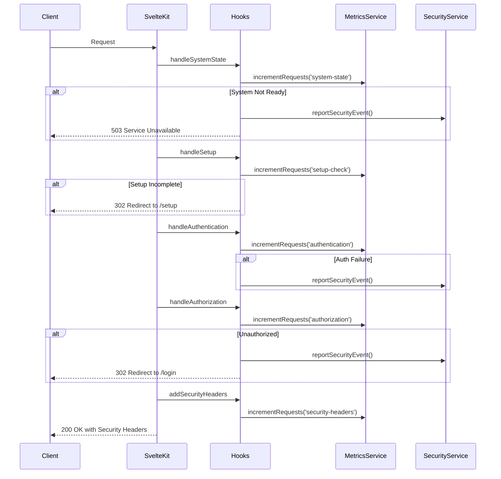

# Server Hooks & Middleware Architecture

SveltyCMS employs an **enterprise-grade, multi-stage middleware pipeline** using SvelteKit Server Hooks. This architecture is designed to be predictable, secure, and performant, with **unified metrics collection**, **automated threat detection**, and **real-time security response** capabilities. The entire middleware sequence is orchestrated in `src/hooks.server.ts`.

---

## Enterprise Design Philosophy

The middleware architecture is built on **five core enterprise principles**:

1.  **Sequential & Predictable**: Hooks run in a defined order for every request, making the system easy to understand, debug, and scale.

2.  **Centralized State-Guarding**: The `handleSystemState` hook acts as the authoritative gatekeeper, ensuring no requests are processed unless the system is operational.

3.  **Unified Metrics & Monitoring**: All hooks integrate with the **MetricsService** for comprehensive performance and security monitoring.

4.  **Automated Security Response**: The **SecurityResponseService** provides real-time threat detection with automated blocking and throttling.

5.  **Fail-Fast with Intelligence**: The pipeline terminates early when needed, but provides detailed analytics for optimization.

---

## Middleware Hook Sequence

The hook sequence is **strictly ordered** and **state-aware** to ensure enterprise-grade reliability:

```typescript
// hooks.server.ts - Orchestrated Pipeline
sequence(
	handleSystemState, // 🔐 System readiness & state validation
	handleSetup, // ⚙️  Setup completion enforcement
	handleAuthentication, // 🔑 User authentication & session management
	handleAuthorization, // 👮‍♂️ Role-based access control
	addSecurityHeaders // 🛡️  Security headers & complementary CSP protection
);
```

### Core Enterprise Services

**MetricsService** - Unified performance & security monitoring

- Request tracking, response time analysis, error rate monitoring
- Real-time performance metrics with atomic counters
- Security event correlation and trending analysis

**SecurityResponseService** - Automated threat detection & response

- Dynamic threat classification with severity scoring
- Automated rate limiting and IP blocking
- Real-time security violation reporting and alerts

---

## Detailed Hook Analysis

### 1. **handleSystemState** - Enterprise System Gateway

**Purpose**: Centralized system readiness validation with real-time monitoring
**File**: `src/hooks/handleSystemState.ts`

```typescript
export async function handleSystemState({ event, resolve }) {
	metricsService.incrementRequests('system-state');

	const systemState = get(systemStates);

	if (systemState === 'BOOTING' || systemState === 'ERROR') {
		securityResponseService.reportSecurityEvent({
			type: 'system_access_denied',
			severity: 'medium',
			details: { state: systemState, ip: getClientIP(event) }
		});

		return new Response('System Unavailable', { status: 503 });
	}

	return resolve(event);
}
```

**Key Features**:

- **State-Guarded Access**: Blocks all requests during system startup or error states
- **Metrics Integration**: Tracks system state access patterns and failure rates
- **Security Monitoring**: Logs suspicious access attempts during maintenance
- **Graceful Degradation**: Supports DEGRADED state for partial functionality

### 2. **handleSetup** - Installation Gateway

**Purpose**: Ensures CMS installation completion before allowing access
**File**: `src/hooks/handleSetup.ts`

```typescript
export async function handleSetup({ event, resolve }) {
	metricsService.incrementRequests('setup-check');

	if (!isSetupComplete && !event.url.pathname.startsWith('/setup')) {
		metricsService.incrementCounter('setup_redirects');

		return new Response(null, {
			status: 302,
			headers: { Location: '/setup' }
		});
	}

	return resolve(event);
}
```

**Key Features**:

- **Installation Enforcement**: Redirects to setup page if CMS not configured
- **Setup Bypass**: Allows access to setup routes during installation
- **Metrics Tracking**: Monitors setup completion and redirect patterns

### 3. **handleAuthentication** - User Identity Management

**Purpose**: Validates sessions and establishes user context
**File**: `src/hooks/handleAuthentication.ts`

```typescript
export async function handleAuthentication({ event, resolve }) {
	metricsService.incrementRequests('authentication');

	const sessionToken = event.cookies.get('session');

	if (sessionToken) {
		try {
			const user = await validateSession(sessionToken);
			event.locals.user = user;
			metricsService.incrementCounter('auth_success');
		} catch (error) {
			metricsService.incrementCounter('auth_failures');
			securityResponseService.reportSecurityEvent({
				type: 'auth_failure',
				severity: 'medium',
				details: { ip: getClientIP(event), error: error.message }
			});
		}
	}

	return resolve(event);
}
```

**Key Features**:

- **Session Validation**: Cryptographically validates session tokens
- **Security Monitoring**: Tracks authentication failures and suspicious patterns
- **User Context**: Establishes authenticated user in event.locals for downstream hooks

### 4. **handleAuthorization** - Access Control

**Purpose**: Role-based access control and route protection
**File**: `src/hooks/handleAuthorization.ts`

```typescript
export async function handleAuthorization({ event, resolve }) {
	metricsService.incrementRequests('authorization');

	const protectedRoutes = ['/admin', '/dashboard', '/api'];
	const isProtected = protectedRoutes.some((route) => event.url.pathname.startsWith(route));

	if (isProtected && !event.locals.user) {
		metricsService.incrementCounter('unauthorized_access');
		securityResponseService.reportSecurityEvent({
			type: 'unauthorized_access',
			severity: 'high',
			details: { path: event.url.pathname, ip: getClientIP(event) }
		});

		return new Response(null, {
			status: 302,
			headers: { Location: '/login' }
		});
	}

	return resolve(event);
}
```

**Key Features**:

- **Route Protection**: Enforces authentication requirements for protected paths
- **Threat Detection**: Monitors unauthorized access attempts
- **Graceful Redirects**: Redirects unauthenticated users to login

### 5. **addSecurityHeaders** - Defense in Depth

**Purpose**: Complementary security headers alongside SvelteKit's built-in CSP
**File**: `src/hooks/addSecurityHeaders.ts`

```typescript
export async function addSecurityHeaders({ event, resolve }) {
	metricsService.incrementRequests('security-headers');

	const response = await resolve(event);

	// Essential security headers (CSP handled by SvelteKit)
	response.headers.set('X-Frame-Options', 'SAMEORIGIN');
	response.headers.set('X-Content-Type-Options', 'nosniff');
	response.headers.set('Referrer-Policy', 'strict-origin-when-cross-origin');
	response.headers.set('Permissions-Policy', 'camera=(), microphone=(), geolocation=()');

	// HSTS for production
	if (event.url.protocol === 'https:') {
		response.headers.set('Strict-Transport-Security', 'max-age=31536000; includeSubDomains; preload');
	}

	// Record response time for performance monitoring
	metricsService.recordResponseTime('security-headers', Date.now() - (event.locals.__reqStart || Date.now()));

	return response;
}
```

**Key Features**:

- **Complementary Security**: Works alongside SvelteKit's built-in CSP management
- **Essential Headers**: X-Frame-Options, X-Content-Type-Options, Referrer-Policy, Permissions-Policy
- **HSTS**: Enforces HTTPS in production environments
- **Performance Monitoring**: Integrated response time tracking with MetricsService

---

## Enterprise Services Integration

### MetricsService Integration

Every hook integrates with the unified **MetricsService** for comprehensive monitoring:

```typescript
// Unified metrics across all hooks
metricsService.incrementRequests('hook-name');
metricsService.recordResponseTime('hook-name', duration);
metricsService.incrementCounter('specific-event');

// Real-time dashboard data
const metrics = metricsService.getReport();
```

### SecurityResponseService Integration

Automated threat detection and response across the pipeline:

```typescript
// Security event reporting
securityResponseService.reportSecurityEvent({
	type: 'threat_type',
	severity: 'high|medium|low',
	details: { ip, path, additional_context }
});

// Automated response execution
securityResponseService.executeResponse(threatLevel, clientIP);
```

---

## Request Flow Diagram



---

## Performance & Security Benefits

### Unified Architecture Benefits

- **Single Source of Truth**: MetricsService eliminates duplicate monitoring systems
- **Automated Response**: SecurityResponseService provides real-time threat mitigation
- **Enterprise Scalability**: Architecture designed for high-throughput environments
- **Comprehensive Monitoring**: Full-stack observability from request to response

### Security Enhancements

- **SvelteKit CSP**: Leverages framework's built-in Content Security Policy management
- **Threat Detection**: Real-time security event correlation and response
- **Access Control**: Multi-layered authentication and authorization
- **Comprehensive Headers**: Essential security headers for defense in depth

### Execution Order

The middleware array in `src/hooks.server.ts` defines the precise execution order:

1.  **`handlePerfStart`**: Marks the start time of the request for performance monitoring.
2.  **`handleSystemState`**: The gatekeeper. Blocks requests if the system is `FAILED` or still `INITIALIZING`.
3.  **`handleSetup`**: Checks if the CMS has been installed. If not, redirects all requests to the `/setup` page.
4.  **`handleStaticAssetCaching`**: A performance optimization that serves static assets (CSS, JS, images) with aggressive cache headers and bypasses all further processing.
5.  **`handleRateLimit`**: Applies IP-based rate limiting to prevent abuse and DoS attacks.
6.  **`handleAuthentication`**: Validates the session cookie, resolves the current tenant (if multi-tenancy is enabled), and attaches the `user` object to `event.locals`.
7.  **`handleAuthorization`**: Checks the user's role and permissions. Blocks access to protected routes for unauthenticated users.
8.  **`handleApiRequests`**: A specialized hook that handles caching and role-based permissions for all `/api/*` routes.
9.  **`handleLocale`**: Reads the user's language preferences from cookies and synchronizes them with the application's state.
10. **`handleTheme`**: Reads the user's theme preference from a cookie and injects the correct theme class (`dark` or `light`) for Server-Side Rendering (SSR) to prevent flickering.
11. **`addSecurityHeaders`**: Adds crucial security headers (like CSP, HSTS, etc.) to the final response.
12. **`handlePerfLog`**: Calculates the total request duration from the start time and logs it, providing valuable performance metrics.

---

## Summary of Individual Hooks

This table provides a quick reference for each hook's primary responsibility in the new sequential pipeline.

| Hook File                     | Description                                                                                           |
| ----------------------------- | ----------------------------------------------------------------------------------------------------- |
| `handlePerfStart.ts`          | Starts a timer to measure request duration.                                                           |
| `handleSystemState.ts`        | **Gatekeeper**: Blocks requests if the system is not in an operational state (`READY` or `DEGRADED`). |
| `handleSetup.ts`              | Redirects to the `/setup` page if the CMS is not yet installed.                                       |
| `handleStaticAssetCaching.ts` | Sets cache headers for static files and ends the request early.                                       |
| `handleRateLimit.ts`          | Applies IP-based rate limiting to prevent abuse.                                                      |
| `handleAuthentication.ts`     | Validates the session cookie, handles multi-tenancy, and identifies the user.                         |
| `handleAuthorization.ts`      | Loads user roles and permissions, and protects routes from unauthenticated access.                    |
| `handleApiRequests.ts`        | Manages caching and permissions for all `/api` routes.                                                |
| `handleLocale.ts`             | Reads language preferences from cookies.                                                              |
| `handleTheme.ts`              | Injects the correct theme class for SSR to prevent theme flickering.                                  |
| `addSecurityHeaders.ts`       | Adds important security headers like CSP and HSTS to the response.                                    |
| `handlePerfLog.ts`            | Calculates the total request time and logs it.                                                        |

This enterprise-grade middleware architecture ensures that SveltyCMS applications are secure, performant, and observable by default.
