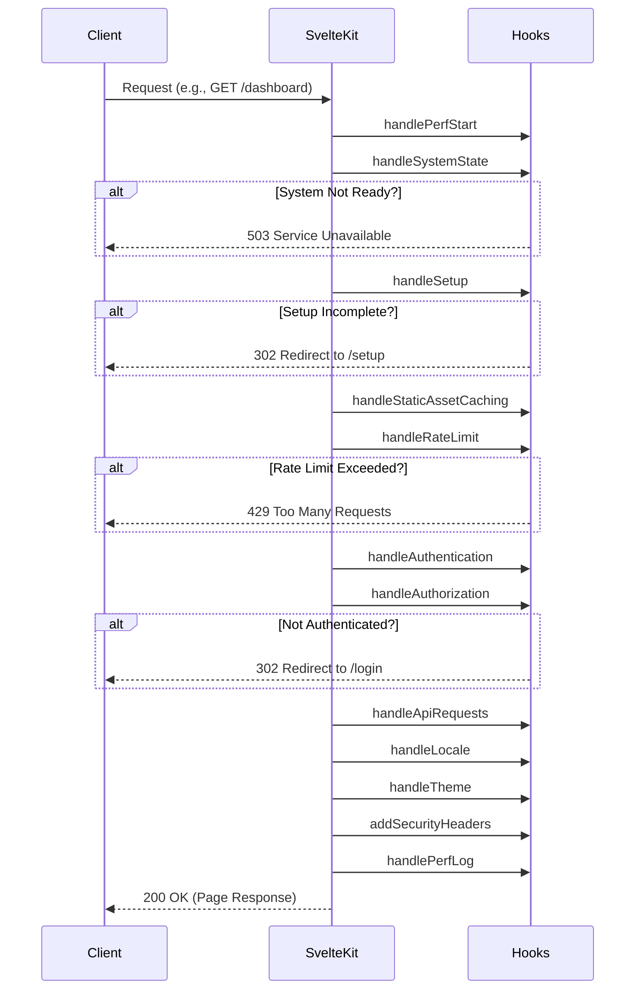

# Server Hooks & Middleware Architecture

SveltyCMS employs a robust, multi-stage middleware pipeline using SvelteKit Server Hooks. This architecture is designed to be predictable, secure, and performant, ensuring that every request is handled efficiently and safely. The entire middleware sequence is orchestrated in `src/hooks.server.ts`.

---

## Design Philosophy

The middleware architecture is built on three core principles:

1.  **Sequential & Predictable**: Hooks run in a simple, defined order for every request. This linear flow makes the request lifecycle easy to understand, debug, and extend.

2.  **Centralized State-Guarding**: The `handleSystemState` hook acts as a single, authoritative gatekeeper at the beginning of the pipeline. It ensures that no requests are processed unless the system is in a `READY` or `DEGRADED` state, preventing entire classes of errors.

3.  **Fail-Fast**: The pipeline is designed to terminate as early as possible. If a critical check fails (like system readiness, setup completion, or authentication), the request is immediately redirected or fails with an appropriate error code, saving system resources.

---

## Interaction with the State Machine

The server hook pipeline is fundamentally integrated with the [System State & Health Architecture](./state-management.mdx). This connection is what makes the system so stable.

### The `handleSystemState` Gatekeeper

The **`handleSystemState`** hook is the second hook to run and is the most critical for system stability. Its job is to consult the state machine before allowing any request to proceed.

1.  **Check State**: On every request, it calls `getSystemState()` to get the current operational state (`IDLE`, `INITIALIZING`, `READY`, `FAILED`, etc.).

2.  **Handle `IDLE` State**: If the state is `IDLE`, it means the server has just started. The hook will `await` the global `dbInitPromise` to ensure the main system initialization completes before proceeding. This resolves any potential race conditions on startup.

3.  **Block or Allow**: It then uses `isSystemReady()` to check if the state is `READY` or `DEGRADED`.
    -   If **true**, the request continues to the next hook.
    -   If **false** (the system is `INITIALIZING` or `FAILED`), the hook immediately terminates the request and returns a **503 Service Unavailable** error.

<Callout type="success">
	**Key Takeaway:** Because of the `handleSystemState` gatekeeper, all subsequent hooks can operate under the assumption that the database, authentication, and other core services are available. This dramatically simplifies their logic and improves overall system robustness.
</Callout>

---

## The Middleware Execution Sequence

Requests are processed through a static sequence of hooks. Each hook has a specific responsibility and either passes the request to the next hook or terminates the request with a redirect or an error.

### Request Flow Diagram

This diagram illustrates the sequential flow of a request through the middleware pipeline.

### Execution Order

The middleware array in `src/hooks.server.ts` defines the precise execution order:

1.  **`handlePerfStart`**: Marks the start time of the request for performance monitoring.
2.  **`handleSystemState`**: The gatekeeper. Blocks requests if the system is `FAILED` or still `INITIALIZING`.
3.  **`handleSetup`**: Checks if the CMS has been installed. If not, redirects all requests to the `/setup` page.
4.  **`handleStaticAssetCaching`**: A performance optimization that serves static assets (CSS, JS, images) with aggressive cache headers and bypasses all further processing.
5.  **`handleRateLimit`**: Applies IP-based rate limiting to prevent abuse and DoS attacks.
6.  **`handleAuthentication`**: Validates the session cookie, resolves the current tenant (if multi-tenancy is enabled), and attaches the `user` object to `event.locals`.
7.  **`handleAuthorization`**: Checks the user's role and permissions. Blocks access to protected routes for unauthenticated users.
8.  **`handleApiRequests`**: A specialized hook that handles caching and role-based permissions for all `/api/*` routes.
9.  **`handleLocale`**: Reads the user's language preferences from cookies and synchronizes them with the application's state.
10. **`handleTheme`**: Reads the user's theme preference from a cookie and injects the correct theme class (`dark` or `light`) for Server-Side Rendering (SSR) to prevent flickering.
11. **`addSecurityHeaders`**: Adds crucial security headers (like CSP, HSTS, etc.) to the final response.
12. **`handlePerfLog`**: Calculates the total request duration from the start time and logs it, providing valuable performance metrics.

---

## Summary of Individual Hooks

This table provides a quick reference for each hook's primary responsibility in the new sequential pipeline.

| Hook File                      | Description                                                                                                |
| ------------------------------ | ---------------------------------------------------------------------------------------------------------- |
| `handlePerfStart.ts`           | Starts a timer to measure request duration.                                                                |
| `handleSystemState.ts`         | **Gatekeeper**: Blocks requests if the system is not in an operational state (`READY` or `DEGRADED`).        |
| `handleSetup.ts`               | Redirects to the `/setup` page if the CMS is not yet installed.                                            |
| `handleStaticAssetCaching.ts`  | Sets cache headers for static files and ends the request early.                                          |
| `handleRateLimit.ts`           | Applies IP-based rate limiting to prevent abuse.                                                           |
| `handleAuthentication.ts`      | Validates the session cookie, handles multi-tenancy, and identifies the user.                            |
| `handleAuthorization.ts`       | Loads user roles and permissions, and protects routes from unauthenticated access.                       |
| `handleApiRequests.ts`         | Manages caching and permissions for all `/api` routes.                                                   |
| `handleLocale.ts`              | Reads language preferences from cookies.                                                                   |
| `handleTheme.ts`               | Injects the correct theme class for SSR to prevent theme flickering.                                       |
| `addSecurityHeaders.ts`        | Adds important security headers like CSP and HSTS to the response.                                     |
| `handlePerfLog.ts`             | Calculates the total request time and logs it.                                                           |

This streamlined, sequential architecture ensures that your SveltyCMS application is stable, performant, and secure by default.
