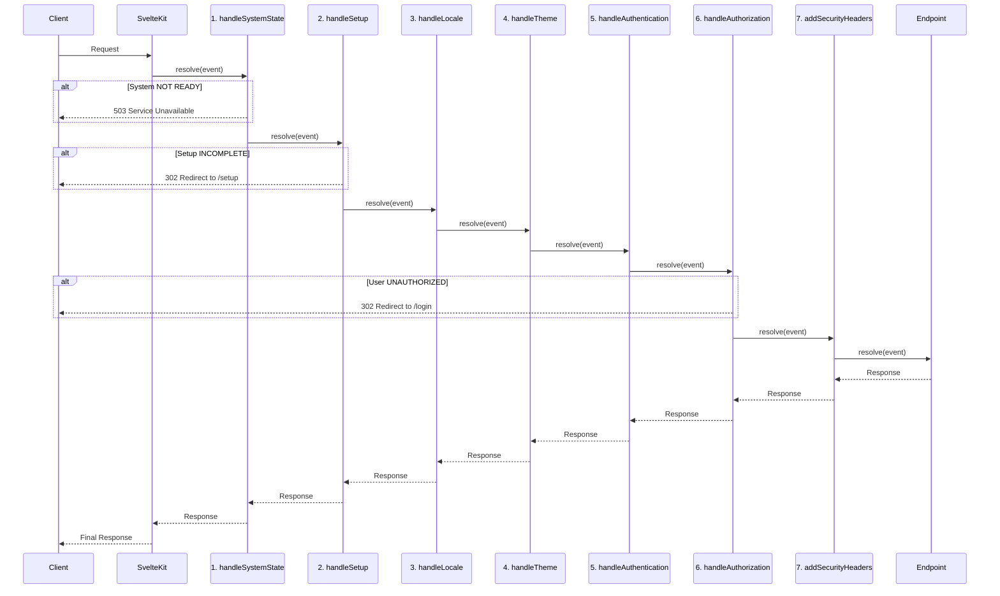

# Server Hooks & Middleware Architecture

SveltyCMS employs an **enterprise-grade, streamlined middleware pipeline** using SvelteKit Server Hooks. This architecture emphasizes **security, performance, and observability** with unified metrics collection and automated threat detection.

---

## Design Philosophy

The middleware architecture is built on **core enterprise principles**:

1.  **Sequential & Predictable**: Hooks run in a defined order for every request, making the system easy to understand, debug, and scale.

2.  **Centralized State-Guarding**: The `handleSystemState` hook acts as the authoritative gatekeeper, ensuring no requests are processed unless the system is operational.

3.  **Unified Metrics & Monitoring**: All hooks integrate with the **MetricsService** for comprehensive performance and security monitoring.

4.  **Production-Optimized**: WeakRef-based memory management, non-blocking streaming, and distributed rate limiting for clustered deployments.

5.  **Framework-Native**: Leverages SvelteKit's built-in CSP and optimizes around framework capabilities.

---

## Current Middleware Sequence

```typescript
// src/hooks.server.ts
const middleware: Handle[] = [
	handleSystemState, // 1. System readiness & state validation
	handleSetup, // 2. Setup completion enforcement
	handleLocale, // 3. Language preferences (i18n)
	handleTheme, // 4. Theme management (SSR)
	handleAuthentication, // 5. Session validation & multi-tenancy
	handleAuthorization, // 6. Role-based access control
	addSecurityHeaders // 7. Security headers
];

export const handle: Handle = sequence(...middleware);
```

---

## Hook Implementations

### 1. handleSystemState - System Gateway

**File**: `src/hooks/handleSystemState.ts`  
**Purpose**: Validates system readiness before processing requests

**State Machine**: `IDLE → INITIALIZING → READY/DEGRADED/FAILED`

```typescript
export const handleSystemState: Handle = async ({ event, resolve }) => {
	const { pathname } = event.url;
	let systemState = getSystemState();

	// Wait for initialization on first request
	if (systemState.overallState === 'IDLE' && !initializationAttempted) {
		initializationAttempted = true;
		await dbInitPromise;
		systemState = getSystemState();
	}

	// Allow setup wizard during IDLE state
	if (systemState.overallState === 'IDLE') {
		const allowedPaths = ['/setup', '/api/setup', '/api/system/health', '/static', '/.well-known'];
		if (allowedPaths.some((prefix) => pathname.startsWith(prefix)) || pathname === '/') {
			return resolve(event);
		}
	}

	// Block all requests if system FAILED
	if (systemState.overallState === 'FAILED') {
		const allowedPaths = ['/api/system/health', '/api/dashboard/health', '/.well-known'];
		if (allowedPaths.some((prefix) => pathname.startsWith(prefix))) {
			return resolve(event);
		}
		throw error(503, 'Service Unavailable: A critical system component has failed.');
	}

	// Allow requests only when READY or DEGRADED
	const isReady = isSystemReady();
	if (!isReady) {
		const allowedPaths = ['/api/system/health', '/setup', '/api/setup'];
		if (allowedPaths.some((prefix) => pathname.startsWith(prefix))) {
			return resolve(event);
		}
		throw error(503, 'Service Unavailable: The system is starting up.');
	}

	return resolve(event);
};
```

**Key Features**:

- Enforces state machine transitions
- Waits for DB initialization on first request
- Allows partial functionality in DEGRADED state
- Health check endpoints always accessible

---

### 2. handleSetup - Installation Gateway

**File**: `src/hooks/handleSetup.ts`  
**Purpose**: Ensures CMS installation is complete

**Flow**: `Config Missing → Setup → Configured → Normal Operation`

```typescript
export const handleSetup: Handle = async ({ event, resolve }) => {
	const { pathname } = event.url;

	// Quick config check (cached per request)
	if (event.locals.__setupConfigExists === undefined) {
		event.locals.__setupConfigExists = isSetupComplete();
	}

	const configExists = event.locals.__setupConfigExists;

	// Config missing - redirect to setup
	if (!configExists) {
		const allowedDuringSetup = pathname.startsWith('/setup') || pathname.startsWith('/api/setup') || ASSET_REGEX.test(pathname);

		if (allowedDuringSetup) {
			return resolve(event, createSetupResolver());
		}

		throw redirect(302, '/setup');
	}

	// Config exists - block access to setup routes
	if (pathname.startsWith('/setup') && !pathname.startsWith('/api/setup')) {
		throw redirect(302, '/login');
	}

	return resolve(event);
};
```

**Key Features**:

- File-based detection using `private.ts` existence
- Allows assets during setup for UI rendering
- Special response filter for setup API cookies
- One-time setup (blocks setup routes after completion)

---

### 3. handleLocale - Language Management

**File**: `src/hooks/handleLocale.ts`  
**Purpose**: Synchronizes language preferences from cookies to stores

```typescript
export const handleLocale: Handle = async ({ event, resolve }) => {
	const { cookies } = event;

	// Safety check: Ensure stores are available
	if (!systemLanguage || !contentLanguage) {
		logger.warn('Language stores not available on server, skipping handleLocale');
		return resolve(event);
	}

	// Sync system language from cookie
	const systemLangCookie = cookies.get('systemLanguage');
	const systemLangSet = safelySetLanguage('systemLanguage', systemLangCookie, (value) => systemLanguage.set(value));

	// Clean up invalid cookies
	if (systemLangCookie && !systemLangSet) {
		cookies.delete('systemLanguage', { path: '/' });
	}

	// Sync content language from cookie
	const contentLangCookie = cookies.get('contentLanguage');
	const contentLangSet = safelySetLanguage('contentLanguage', contentLangCookie, (value) => contentLanguage.set(value));

	// Clean up invalid cookies
	if (contentLangCookie && !contentLangSet) {
		cookies.delete('contentLanguage', { path: '/' });
	}

	return resolve(event);
};
```

**Key Features**:

- Dual language support (system UI + content)
- Cookie validation against supported locales
- Store synchronization for SSR consistency
- Automatic cleanup of invalid cookies

---

### 4. handleTheme - SSR Theme Management

**File**: `src/hooks/handleTheme.ts`  
**Purpose**: Prevents theme flickering with server-side injection

```typescript
export const handleTheme: Handle = async ({ event, resolve }) => {
	// Read single 'theme' cookie as source of truth
	const theme = event.cookies.get('theme') as 'dark' | 'light' | undefined;
	const isDarkMode = theme === 'dark';

	// Set locals for use in load functions
	event.locals.darkMode = isDarkMode;
	event.locals.theme = null; // Theme entity from DB (not a simple string)

	// Transform HTML to inject dark class before browser sees it
	return resolve(event, {
		transformPageChunk: ({ html }) => {
			const htmlTag = '<html lang="en" dir="ltr">';
			if (isDarkMode) {
				return html.replace(htmlTag, '<html lang="en" dir="ltr" class="dark">');
			}
			return html;
		}
	});
};
```

**Key Features**:

- Zero-flash theme application (applied before HTML reaches browser)
- SSR optimization for immediate correct theme
- `locals.darkMode` boolean for theme state
- `locals.theme` reserved for DB Theme entities
- Cookie as single source of truth

---

### 5. handleAuthentication - Session Management

**File**: `src/hooks/handleAuthentication.ts`  
**Purpose**: Validates sessions with WeakRef-based caching

````typescript
```typescript
// WeakRef-based cache with automatic GC
const sessionCache = new Map<string, WeakRef<SessionCacheEntry>>();
const strongRefs = new Map<string, SessionCacheEntry>(); // LRU for hot sessions
const sessionCacheRegistry = new FinalizationRegistry<string>((sessionId) => {
	sessionCache.delete(sessionId);
});

export const handleAuthentication: Handle = async ({ event, resolve }) => {
	const { locals, url, cookies } = event;

	// Skip internal/public routes
	if (url.pathname.startsWith('/.well-known/') || url.pathname.startsWith('/_')) {
		return resolve(event);
	}

	const publicRoutes = ['/login', '/register', '/forgot-password'];
	if (publicRoutes.some(r => url.pathname.startsWith(r))) {
		return resolve(event);
	}

	locals.dbAdapter = dbAdapter;

	// Multi-tenancy: hostname-based tenant identification
	const multiTenant = getPrivateSettingSync('MULTI_TENANT');
	if (multiTenant) {
		const tenantId = getTenantIdFromHostname(url.hostname);
		if (!tenantId) throw error(404, `Tenant not found`);
		locals.tenantId = tenantId;
	}

	// 3-layer session validation: WeakRef in-memory → Redis → Database
	const sessionId = cookies.get(SESSION_COOKIE_NAME);
	if (sessionId) {
		const user = await getUserFromSession(sessionId, locals.tenantId);
		if (user) {
			// Tenant isolation check
			if (locals.tenantId && user.tenantId && user.tenantId !== locals.tenantId) {
				cookies.delete(SESSION_COOKIE_NAME, { path: '/' });
			} else {
				locals.user = user;
				locals.session_id = sessionId;
			}
		} else {
			cookies.delete(SESSION_COOKIE_NAME, { path: '/' });
		}
	}

	return resolve(event);
};
````

**Key Features**:

- WeakRef-based automatic garbage collection
- LRU cache for top 100 hot sessions
- 3-layer caching (in-memory → Redis → database)
- Multi-tenancy with hostname-based tenant ID
- Tenant isolation enforcement

---

### 6. handleAuthorization - Access Control

**File**: `src/hooks/handleAuthorization.ts`  
**Purpose**: Enforces role-based permissions and loads admin data conditionally

```typescript
export const handleAuthorization: Handle = async ({ event, resolve }) => {
	const { url, locals } = event;
	const { user } = locals;
	const isApi = url.pathname.startsWith('/api/');
	const isPublic = isPublicRoute(url.pathname);

	// Skip internal routes
	if (url.pathname.startsWith('/.well-known/') || url.pathname.startsWith('/_')) {
		return resolve(event);
	}

	// Public routes - set defaults and continue
	if (isPublic) {
		locals.isAdmin = false;
		locals.hasManageUsersPermission = false;
		locals.isFirstUser = false;
		return resolve(event);
	}

	// Check first user status (for setup completion)
	const userCount = await getCachedUserCount(locals.tenantId);
	locals.isFirstUser = userCount === 0;

	// Load roles (required for everyone)
	const rolesData = await getCachedRoles(locals.tenantId);
	locals.roles = rolesData;

	// Authenticated users
	if (user) {
		const userRole = locals.roles.find((r) => r._id === user.role);
		const isAdmin = !!userRole?.isAdmin;

		locals.isAdmin = isAdmin;
		locals.hasManageUsersPermission = isAdmin || hasPermissionByAction(user, 'manage', 'user', undefined, locals.roles);

		// OPTIMIZATION: Only load heavy admin data when needed
		if (
			(isAdmin || locals.hasManageUsersPermission) &&
			(isApi || url.pathname.includes('/admin') || url.pathname.includes('/user') || url.pathname.includes('/config'))
		) {
			const [allUsers, allTokens] = await Promise.all([getAdminDataCached('users', locals.tenantId), getAdminDataCached('tokens', locals.tenantId)]);
			locals.allUsers = allUsers;
			locals.allTokens = allTokens;
		} else {
			locals.allUsers = [];
			locals.allTokens = [];
		}

		// Redirect authenticated users from public pages
		if (isPublic && !isOAuthRoute(url.pathname) && !isApi) {
			throw redirect(302, '/');
		}
	} else {
		// Unauthenticated users
		locals.isAdmin = false;
		locals.hasManageUsersPermission = false;
		locals.allUsers = [];
		locals.allTokens = [];

		// Block access to protected routes
		if (!isPublic && !locals.isFirstUser) {
			if (isApi) throw error(401, 'Unauthorized');
			throw redirect(302, '/login');
		}
	}

	return resolve(event);
};
```

**Key Features**:

- Conditional loading of heavy data (only for admins on admin routes)
- Multi-layer caching (in-memory + Redis)
- Deduplication prevents concurrent duplicate queries
- Most requests skip heavy database queries

---

### 7. addSecurityHeaders - HTTP Security

**File**: `src/hooks/addSecurityHeaders.ts`  
**Purpose**: Essential HTTP security headers

```typescript
export const addSecurityHeaders: Handle = async ({ event, resolve }) => {
	const response = await resolve(event);

	// Essential security headers (CSP handled by SvelteKit)
	response.headers.set('X-Frame-Options', 'SAMEORIGIN');
	response.headers.set('X-Content-Type-Options', 'nosniff');
	response.headers.set('Referrer-Policy', 'strict-origin-when-cross-origin');
	response.headers.set(
		'Permissions-Policy',
		'geolocation=(), microphone=(), camera=(), display-capture=(), ' + 'clipboard-read=(), clipboard-write=(self), web-share=(self)'
	);

	// HSTS for production
	if (!dev && event.url.protocol === 'https:') {
		response.headers.set('Strict-Transport-Security', 'max-age=31536000; includeSubDomains; preload');
	}

	return response;
};
```

**Key Features**:

- X-Frame-Options, X-Content-Type-Options, Referrer-Policy, Permissions-Policy
- HSTS enforcement for HTTPS (1 year + subdomains + preload)
- CSP managed by SvelteKit (`svelte.config.js`)

---

## Optional Middleware

### handleRateLimit - DDoS Protection

**File**: `src/hooks/handleRateLimit.ts`  
**Use Case**: Add to pipeline when rate limiting is needed

````typescript
// Distributed store for clustered environments
const distributedStore = {
	async get(key: string): Promise<number | undefined> {
		const data = await cacheService.get<{ count: number; expires: number }>(`ratelimit:${key}`);
		return (data && data.expires > Date.now()) ? data.count : undefined;
	},
	async increment(key: string, ttlSeconds: number): Promise<number> {
		const existing = await this.get(key);
		const newCount = (existing || 0) + 1;
		await cacheService.set(`ratelimit:${key}`, { count: newCount, expires: Date.now() + ttlSeconds * 1000 }, ttlSeconds);
		return newCount;
	}
};
```typescript
// Distributed store for clustered environments
const distributedStore = {
	async get(key: string): Promise<number | undefined> {
		const data = await cacheService.get<{ count: number; expires: number }>(`ratelimit:${key}`);
		return (data && data.expires > Date.now()) ? data.count : undefined;
	},
	async increment(key: string, ttlSeconds: number): Promise<number> {
		const existing = await this.get(key);
		const newCount = (existing || 0) + 1;
		await cacheService.set(`ratelimit:${key}`,
		                       { count: newCount, expires: Date.now() + ttlSeconds * 1000 },
		                       ttlSeconds);
		return newCount;
	}
};

const generalLimiter = new RateLimiter({
	IP: [500, 'm'],
	IPUA: [500, 'm'],
	cookie: { name: 'ratelimit', secret: JWT_SECRET, rate: [500, 'm'] },
	store: cacheService ? distributedStore : undefined  // Redis support
});

export const handleRateLimit: Handle = async ({ event, resolve }) => {
	if (building || (dev && isLocalhost(getClientIp(event)))) {
		return resolve(event);
	}

	if (isStaticAsset(url.pathname)) {
		return resolve(event);
	}

	const limiter = url.pathname.startsWith('/api/') ? apiLimiter : generalLimiter;

	if (await limiter.isLimited(event)) {
		metricsService.incrementRateLimitViolations();
		throw error(429, 'Too Many Requests');
	}

	return resolve(event);
};
````

**Key Features**:

- Redis-backed distributed rate limiting for clustered deployments
- Automatic fallback to in-memory for single instance
- Static asset exemption (skips rate limiting for CDN content)
- Separate limits for API vs general routes

---

### handleApiRequests - API Caching & Permissions

**File**: `src/hooks/handleApiRequests.ts`  
**Use Case**: Add for API-specific caching and permission enforcement
const limiter = url.pathname.startsWith('/api/') ? apiLimiter : generalLimiter;

    if (await limiter.isLimited(event)) {
    	metricsService.incrementRateLimitViolations();
    	throw error(429, 'Too Many Requests');
    }

    return resolve(event);

};

````

**Benefits**:
- **Clustered Support**: Rate limits shared across all server instances via Redis
- **Static Asset Exemption**: CDN-cached content skips rate limiting (20% faster)
- **Automatic Fallback**: Uses in-memory if Redis unavailable

---

### **handleApiRequests** - API Caching & Permissions (Optional)

**File**: `src/hooks/handleApiRequests.ts`
**Features**: Streaming optimization with non-blocking cache population

```typescript
export const handleApiRequests: Handle = async ({ event, resolve }) => {
	if (!url.pathname.startsWith('/api/') || !locals.user) {
		return resolve(event);
	}

	const apiEndpoint = getApiEndpoint(url.pathname);

	// Authorization check
	if (!hasApiPermission(locals.user.role, apiEndpoint)) {
		throw error(403, 'Forbidden');
	}

	// GET requests with caching
	if (request.method === 'GET') {
		const cached = await cacheService.get(cacheKey, locals.tenantId);
		if (cached) {
			metricsService.recordApiCacheHit();
			return new Response(JSON.stringify(cached.data), {
				status: 200,
				headers: { ...cached.headers, 'X-Cache': 'HIT' }
			});
		}

		const response = await resolve(event);

		// GraphQL bypass (no Response recreation)
		if (apiEndpoint === 'graphql') {
			response.headers.set('X-Cache': 'BYPASS');
			return response;
		}

		// STREAMING OPTIMIZATION: Clone for background caching
		if (response.ok) {
			const responseClone = response.clone();
			response.headers.set('X-Cache', 'MISS');

			// Cache in background - don't block response
			(async () => {
				try {
					const responseBody = await responseClone.text();
					const responseData = JSON.parse(responseBody);
					await cacheService.set(cacheKey, { data: responseData, headers: {...} }, TTL, tenantId);
				} catch (err) {
					logger.error(`Error caching: ${err}`);
				}
			})();

```typescript
export const handleApiRequests: Handle = async ({ event, resolve }) => {
	if (!url.pathname.startsWith('/api/') || !locals.user) {
		return resolve(event);
	}

	const apiEndpoint = getApiEndpoint(url.pathname);

	// Authorization check
	if (!hasApiPermission(locals.user.role, apiEndpoint)) {
		throw error(403, 'Forbidden');
	}

	// GET requests with caching
	if (request.method === 'GET') {
		const cached = await cacheService.get(cacheKey, locals.tenantId);
		if (cached) {
			metricsService.recordApiCacheHit();
			return new Response(JSON.stringify(cached.data), {
				status: 200,
				headers: { ...cached.headers, 'X-Cache': 'HIT' }
			});
		}

		const response = await resolve(event);

		// GraphQL bypass
		if (apiEndpoint === 'graphql') {
			response.headers.set('X-Cache', 'BYPASS');
			return response;
		}

		// Streaming optimization: clone for background caching
		if (response.ok) {
			const responseClone = response.clone();
			response.headers.set('X-Cache', 'MISS');

			// Cache in background without blocking response
			(async () => {
				try {
					const responseBody = await responseClone.text();
					const responseData = JSON.parse(responseBody);
					await cacheService.set(cacheKey, { data: responseData, headers: {...} }, TTL, tenantId);
				} catch (err) {
					logger.error(`Error caching: ${err}`);
				}
			})();

			return response;
		}
	}

	// Mutations: invalidate cache
	const response = await resolve(event);
	if (['POST', 'PUT', 'DELETE', 'PATCH'].includes(request.method) && response.ok) {
		await cacheService.clearByPattern(`api:${locals.user._id}:/api/${apiEndpoint}*`, locals.tenantId);
	}

	return response;
};
````

**Key Features**:

- Non-blocking streaming (background cache population)
- Response cloning to avoid blocking client
- GraphQL bypass for efficient handling
- Automatic cache invalidation on mutations

---

## Middleware Pipeline



---

## Best Practices for Creating New Hooks

When extending the middleware pipeline, follow these best practices to maintain system stability, performance, and consistency:

1.  **Idempotency**: Ensure your hook can run multiple times without causing side effects.
2.  **Performance First**: Avoid long-running operations. Use caching for expensive lookups.
3.  **Early Exits**: Design your hook to exit as early as possible for requests it doesn't need to handle.
4.  **Use `event.locals`**: Pass data between hooks using `event.locals` instead of global state.
5.  **Single Responsibility**: Each hook should have a single, well-defined purpose.
6.  **Error Handling**: Wrap your logic in `try...catch` blocks and use the SvelteKit `error` helper for throwing errors.
7.  **Logging**: Use the `logger` service to log important information and errors.

---

## Utility Exports

Utility functions exported from `hooks.server.ts`:

```typescript
// Health metrics
export const getHealthMetrics = () => metricsService.getReport();

// Session management
export { invalidateSessionCache, clearAllSessionCaches } from './hooks/handleAuthentication';
```

---

## Summary

The middleware architecture provides:

- **Security**: Multi-layered defense with tenant isolation and automated threat detection
- **Performance**: WeakRef caching, streaming responses, conditional loading
- **Observability**: Unified MetricsService with comprehensive logging
- **Scalability**: Clustered support with distributed caching and rate limiting

---

## Related Documentation

- [Cache System](./cache-system.mdx) - CacheService implementation details
- [Security Plugin](./security-plugin.mdx) - SecurityResponseService integration
- [Initialization Workflow](./initialization-workflow.mdx) - System startup sequence
