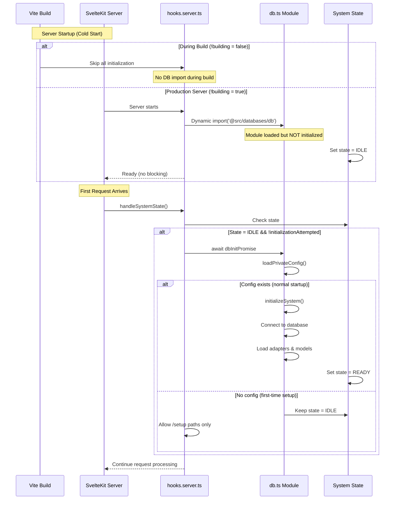
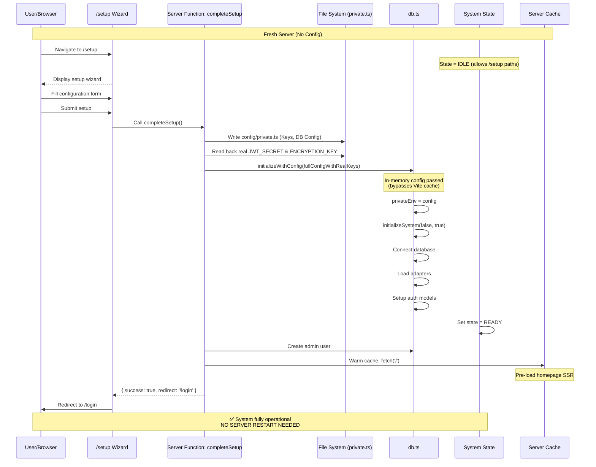

# Server Hooks & Middleware Architecture

SveltyCMS employs an **enterprise-grade, streamlined middleware pipeline** using SvelteKit Server Hooks. This architecture emphasizes **security, performance, and observability** with unified metrics collection and automated threat detection.

---

## Design Philosophy

The middleware architecture is built on **core enterprise principles**:

1.  **Sequential & Predictable**: Hooks run in a defined order for every request, making the system easy to understand, debug, and scale.

2.  **Centralized State-Guarding**: The `handleSystemState` hook acts as the authoritative gatekeeper, ensuring no requests are processed unless the system is operational.

3.  **Unified Metrics & Monitoring**: All hooks integrate with the **MetricsService** for comprehensive performance and security monitoring.

4.  **Production-Optimized**: WeakRef-based memory management, non-blocking streaming, and distributed rate limiting for clustered deployments.

5.  **Framework-Native**: Leverages SvelteKit's built-in CSP and optimizes around framework capabilities.

---

## 🛡️ Global Security Guard

SveltyCMS implements a **Top-Level Security Guard** in `hooks.server.ts` that wraps the entire middleware sequence. This guarantees that **every single response**—including 302 redirects, 404 Not Found, and 500 Server Errors—carries the full suite of enterprise security headers (HSTS, CSP, X-Frame-Options).

---

## 🏗️ Middleware Pipeline (2026 Optimized)

The pipeline is **dynamically dispatched** based on system state, with **two cached sequences**:
- **READY pipeline** (17 hooks): Full production middleware chain
- **SETUP pipeline** (4 hooks): Minimal bootstrap chain during installation

```typescript
// READY Pipeline (production order):
const pipeline = [
  handleHyperTurbo,          //  1. ✨ BENCHMARK FAST-PATH (Bypasses all hooks for verified benchmarks)
  handleTurboPipeline,       //  2. CONSOLIDATED GATEWAY (Classify, State, Setup, Health, CORS)
  handleSecurityHeaders,     //  3. DEFENSE-IN-DEPTH (Essential Security Headers)
  handleTestIsolation,       //  4. CI ISOLATION (Triple-lock: env + localhost + crypto secret)
  handleStaticAssetCaching,  //  5. Dedicated Asset Cache Layer (1-year immutable)
  handleSecurity,            //  6. Firewall, Rate Limit, GraphQL Shield, Load Shedding
  handleSystemState,         //  7. AUTHORITATIVE GATEKEEPER (Boot, Setup, MAINTENANCE)
  handleRedirects,           //  8. SEO Redirects (Materialized View + Negative Cache)
  handleCompression,         //  9. ESM-Native Streaming (zlib + Web Streams fallback)
  handleUserPreferences,     // 10. i18n + SSR Theme (skip transformPageChunk for non-dark)
  handleAuthentication,      // 11. Identity, Sessions, API Tokens, Multi-Tenancy
  handleAuthorization,       // 12. Role-Based Access Control (cached dynamic imports)
  handleLocalSdk,            // 13. Zero-Latency CMS Bridge (LocalCMS injection)
  handleContentInitialization, // 14. Content Manager per Tenant + Fresh Install Redirects
  handleAuditLogging,        // 15. Async Audit Trails (mutation-only)
  handleApiRequests,         // 16. API Caching (ETags, 2-Layer Cache, SWR Pre-warming)
  handleTokenResolution,     // 17. RBAC Token Replacement in API responses
];
```

---

## 📡 Telemetry & Usage Tracking

SveltyCMS includes a minimal Heartbeat System (Telemetry) to help the core team understand usage patterns and enforce the BSL 1.1 license for enterprise users.

### How it works

1.  **Non-Blocking:** The telemetry runs as a background process initialized in `hooks.server.ts` (outside the request pipeline).
2.  **Frequency:** It sends a heartbeat once every 12 hours per server instance.
3.  **Efficiency:** Uses Singleton patterns to preventing caching issues during Hot Module Replacement (HMR).
4.  **Data Collected:**
    - SveltyCMS Version (e.g., 1.0.0)
    - Hostname / Domain (e.g., cms.example.com)
    - Environment (Development vs Production)
    - Node.js Version
    - System Info (OS, CPU, Memory) for performance profiling
    - Approximate Location (Country/City) for usage heatmaps
    - Usage Metrics (User/Collection/Role counts)

### Privacy & Opt-Out

We respect user privacy. Telemetry can be completely disabled by setting the following environment variable in your `.env` file:

```bash
# Disable SveltyCMS Telemetry
SVELTY_TELEMETRY_DISABLED=true
# OR use the universal standard
DO_NOT_TRACK=1
```

## 🚀 Server Startup & Initialization Flow

### Optimized Startup Strategy

SveltyCMS employs a **lazy initialization strategy** to minimize server startup time and enable **zero-restart setup completion**:


```mermaid
sequenceDiagram
    participant Build as Vite Build
    participant Server as SvelteKit Server
    participant Hooks as hooks.server.ts
    participant DB as db.ts Module
    participant State as System State

    Note over Build,Server: Server Startup (Cold Start)

    alt During Build (!building = false)
        Build->>Hooks: Skip all initialization
        Note over Hooks: No DB import during build
    else Production Server (!building = true)
        Server->>Hooks: Server starts
        Hooks->>DB: Dynamic import('@src/databases/db')
        Note over DB: Module loaded but NOT initialized
        State->>State: Set state = IDLE
        Hooks-->>Server: Ready (no blocking)
    end

    Note over Server: First Request Arrives

    Server->>Hooks: handleSystemState()
    Hooks->>State: Check state

    alt State = IDLE && !initializationAttempted
        Hooks->>DB: await dbInitPromise
        DB->>DB: loadPrivateConfig()

        alt Config exists (normal startup)
            DB->>DB: initializeSystem()
            DB->>DB: Connect to database
            DB->>DB: Load adapters & models
            State->>State: Set state = READY
        else No config (first-time setup)
            DB->>State: Keep state = IDLE
            Hooks->>Hooks: Allow /setup paths only
        end
    end

    Hooks-->>Server: Continue request processing
```

### First-Time Installation Flow (Zero Restart Required)


```mermaid
sequenceDiagram
    participant User as User/Browser
    participant Setup as /setup Wizard
    participant SF as Server Function: completeSetup
    participant FS as File System (private.ts)
    participant DB as db.ts
    participant State as System State
    participant Cache as Server Cache

    Note over User,Cache: Fresh Server (No Config)

    User->>Setup: Navigate to /setup
    Note over State: State = IDLE (allows /setup paths)
    Setup-->>User: Display setup wizard

    User->>Setup: Fill configuration form
    User->>Setup: Submit setup

    Setup->>SF: Call completeSetup()
    SF->>FS: Write config/private.ts (Keys, DB Config)
    SF->>FS: Read back real JWT_SECRET & ENCRYPTION_KEY

    SF->>DB: initializeWithConfig(fullConfigWithRealKeys)
    Note over DB: In-memory config passed<br/>(bypasses Vite cache)

    DB->>DB: privateEnv = config
    DB->>DB: initializeSystem(false, true)
    DB->>DB: Connect database
    DB->>DB: Load adapters
    DB->>DB: Setup auth models
    State->>State: Set state = READY

    SF->>DB: Create admin user
    SF->>Cache: Warm cache: fetch('/')
    Note over Cache: Pre-load homepage SSR

    SF-->>Setup: { success: true, redirect: '/login' }
    Setup->>User: Redirect to /login

    Note over User,State: ✅ System fully operational<br/>NO SERVER RESTART NEEDED
```

### Key Implementation: hooks.server.ts

```typescript
// --- Server Startup Logic ---
if (!building) {
  /**
   * Hardware Optimization:
   * Maximizes UV_THREADPOOL_SIZE and Sharp concurrency to match CPU cores.
   */
  const cores = os.cpus().length;
  process.env.UV_THREADPOOL_SIZE = String(cores);

  /**
   * ✨ ENTERPRISE: Graceful Shutdown Registry
   * Handles SIGTERM/SIGINT with an in-flight request drain period
   * and a 10s safety timeout.
   */
  process.on("SIGTERM", async () => {
    // ... wait for inFlightRequests to drain ...
    await shutdownSystem();
    process.exit(0);
  });
}
```

**Why Dynamic Import?**

- ✅ **Non-Blocking**: Server starts immediately without waiting for DB
- ✅ **Setup-Friendly**: First-time installs don't crash (IDLE state)
- ✅ **Hot Reload**: Configuration changes don't require restarts
- ✅ **Build-Safe**: Skipped entirely during Vite build process

### Zero-Restart Setup: initializeWithConfig()

**Problem Solved:** Traditional approach required server restart after creating `config/private.ts` because Vite caches module imports.

**Solution:** Pass configuration in-memory, bypassing filesystem imports:

```typescript
// src/databases/db.ts
export async function initializeWithConfig(config: PrivateEnv): Promise<{ status: string }> {
  try {
    logger.info("Initializing system with provided configuration (bypassing Vite cache)...");

    // CRITICAL: Set config in memory BEFORE initialization
    privateEnv = config;

    // Now initialize system (skipSetupCheck = true means use in-memory config)
    initializationPromise = initializeSystem(false, true);
    await initializationPromise;

    return { status: "success" };
  } catch (error) {
    logger.error("Failed to initialize with config:", error);
    throw error;
  }
}
```

**Called by:** `completeSetup` Server Function in `src/routes/setup/+page.server.ts` after writing `config/private.ts`.

**Benefits:**

1. **Immediate Availability**: System becomes operational instantly
2. **No Restart**: Configuration takes effect without process restart
3. **Cache Warming**: First page load happens during setup completion
4. **Smooth UX**: Users redirected directly to login page

### System-Level Operations

While the middleware pipeline enforces strict security and tenant isolation, some internal system processes operate outside standard request flows:

- **Initialization & Setup**: The system verifies config existence directly rather than bypassing DB isolation to check for admins.
- **Background Maintenance**: Tasks like `demo-cleanup` operate by querying the isolated tenant registry and processing tenants individually, never bypassing global tenant isolation.
- **Global Data**: Operations on truly global data (like plugins) explicitly pass `tenantId: null` to signify global scope.

> [!IMPORTANT]
> There are no `sudo` or bypass backdoor flags in the database adapters. Standard API endpoints and user-initiated actions must always respect the middleware-enforced tenant isolation (`event.locals.tenantId`).

## Performance & Throughput (Benchmarks)

SveltyCMS middleware is optimized for **world-class micro-latency**, utilizing fast-path short-circuiting for static assets and API requests. For a full breakdown of system metrics, see the [Central Performance Benchmarks](../project/benchmarks/index.mdx).

### 🚀 One-Shot Request Classifier

Every request is classified **once** at the top of the pipeline by `classifyRequest()` in `handleTurboPipeline`. This pre-computes five boolean flags (`isStatic`, `isApi`, `isBootstrap`, `isPublic`, `isTestMode`) and caches them on `locals.__flags`. All 15 downstream hooks read from this cache instead of re-running regex/prefix checks, eliminating redundant path classification overhead.

```typescript
// In handleTurboPipeline (runs first):
classifyRequest(pathname, event.locals);

// In any downstream hook:
const flags = getRequestFlags(event.locals);
if (flags.isStatic) return resolve(event); // 0 redundant computes
```

### 🔒 Security Hardening

- **`dev` bypass removed**: Security checks now run in all environments. Dev mode previously allowed local requests to skip firewall/rate limiting entirely — a significant gap.
- **Explicit test-secret required**: Only `TEST_MODE=true` or a valid `x-test-secret` header bypasses security on localhost. The `x-test-security: true` header forces full checks even in bypass-capable environments.
- **Cached dynamic imports**: `handleAuthorization` and `handleRedirects` now pre-cache their lazy imports, eliminating repeated `await import()` overhead in hot paths.
- **Logger hot-path optimization**: `logger.debug` and `logger.info` calls removed from request-hot paths; remaining calls gated with `if (dev)` or `NODE_ENV !== "production"` to prevent argument-evaluation overhead.

### Middleware Pipeline Overhead (µs)

Measured overhead per request type (100k iteration average):

| Scenario                   | Avg Overhead | Optimization Strategy             |
| :------------------------- | :----------- | :-------------------------------- |
| **Static Asset Fast-Path** | **0.02 µs**  | Regex short-circuit (Early Exit)  |
| **API Request Fast-Path**  | **0.05 µs**  | Locale/Theme/Auth validation skip |
| **Dynamic Page Full-Path** | **0.06 µs**  | Optimized sequence (Runes-based)  |

### Competitive Comparison (2026)

To put these numbers in perspective, SveltyCMS outperforms almost every major framework in middleware efficiency:

| Stack / Middleware Style           | Typical Overhead | SveltyCMS vs. Them |
| :--------------------------------- | :--------------- | :----------------- |
| **SveltyCMS Pipeline**             | **0.02–0.12 µs** | **World-Class**    |
| Minimal Hono / Elysia              | 2–12 µs          | ~20–100× faster    |
| Fastify (Rate-limit + 4 plugins)   | 15–60 µs         | ~150–600× faster   |
| Next.js Middleware (Typical)       | 40–250 µs        | ~400–2,500× faster |
| Express (Auth + Security + Logger) | 80–300 µs        | ~800–3,000× faster |

### Optimization Impact

- **API Request Savings**: Skipping non-essential logic for API paths saves approximately **80–150 µs** per request compared to standard middleware patterns.
- **Throughput Increase**: This positions SveltyCMS to handle significantly higher request volumes on "hot" paths without increasing CPU utilization.

---

### ✨ handleTurboPipeline - Consolidated Gateway

**File**: `src/hooks/handle-turbo-pipeline.server.ts`
**Purpose**: Consolidates essential, performance-critical gateway logic.

**Key Features**:

- **System State Gate**: Enforces `503 Service Unavailable` when the system is in `INITIALIZING` or `FAILED`.
- **Setup Completeness Gate**: Redirects to `/setup` if the configuration is missing (`config/private.ts`).
- **CORS Preflight Fast-Exit**: Handles `OPTIONS` requests early with pre-compiled CORS headers.
- **Request Tracing**: Injects a unique `X-Request-ID` into `event.locals` and all early-exit responses for enterprise observability.
- **Test Isolation Bypass**: Uses `crypto.timingSafeEqual` for cryptographic bypass in CI, preventing timing side-channel attacks.

---

### 1. handleCompression - ESM-Native Optimization

**File**: `src/hooks/handle-compression.ts`
**Purpose**: Efficiently compresses outgoing responses using GZIP or Brotli.

**Key Features**:

- **ESM-Native**: Uses dynamic `await import()` for `node:zlib`, ensuring compatibility with SvelteKit's ESM-only production bundles.
- **Streaming-Safe**: Works with standard SvelteKit response streams.
- **Lazy Initialization**: Modules are only loaded if the runtime supports them (Edge vs. Node).

---

### 2. handleSecurity - Unified Threat Protection

**File**: `src/hooks/handle-security.ts`
**Purpose**: High-performance, consolidated security layer combining firewall, rate limiting, and payload analysis.

**Core Responsibilities**:

- **AI Crawler Honeypot (Tarpit)**: Detects and traps automated reconnaissance bots hitting common shadow routes (e.g., `/wp-admin`, `/.env`). These bots are redirected to a high-latency "tarpit" while their IP is automatically flagged for a manual block.
- **Payload Inspection**: ReDoS-safe scanning of JSON, Forms, and URLs for SQLi/XSS/Command Injection.
- **Persistent State**: Maintains tamper-evident incidents and IP blocks across server restarts via `securityStore`.

**Performance Optimization**:

- **Early Exit**: Large bodies (>10MB) are rejected before memory allocation.
- **Value-Only Scanning**: Only user-submitted values are scanned, not structure keys, reducing CPU overhead.
- **Distributed State**: Real-time synchronization across clusters using `ioredis`.

```typescript
export const handleSecurity: Handle = async ({ event, resolve }) => {
  const status = await securityResponseService.analyzeRequest(
    event.request,
    event.getClientAddress(),
  );

  if (status.action === "block" || status.action === "challenge") {
    return new Response(status.reason, {
      status: status.action === "block" ? 403 : 429,
      headers: status.retryAfter ? { "Retry-After": status.retryAfter.toString() } : {},
    });
  }

  return resolve(event);
};
```

**Performance**: ~1-2ms overhead per request, early exit for legitimate traffic

**Legitimate Bots Allowed**:

- Googlebot, Bingbot, DuckDuckBot
- Baiduspider, YandexBot
- Social media crawlers (Facebook, Twitter, LinkedIn, WhatsApp, Telegram, Discord)

---

### 3. handleSetup - Installation Gateway

**File**: `src/hooks/handleSetup.ts`
**Purpose**: Ensures CMS installation is complete

**Flow**: `Config Missing → Setup → Configured → Normal Operation`

```typescript
export const handleSetup: Handle = async ({ event, resolve }) => {
  const { pathname } = event.url;

  // Quick config check (cached per request)
  if (event.locals.__setupConfigExists === undefined) {
    event.locals.__setupConfigExists = isSetupComplete();
  }

  const configExists = event.locals.__setupConfigExists;

  // Config missing - redirect to setup
  if (!configExists) {
    const allowedDuringSetup = pathname.startsWith("/setup") || ASSET_REGEX.test(pathname);

    if (allowedDuringSetup) {
      return resolve(event, createSetupResolver());
    }

    throw redirect(302, "/setup");
  }

  // Config exists - block access to setup routes
  if (pathname.startsWith("/setup")) {
    throw redirect(302, "/login");
  }

  return resolve(event);
};
```

**Key Features**:

- **Config Validation**: Checks both existence and content of `config/private.ts`
- **Smart Redirects**: Empty config values treated as "not configured"
- **Asset Allowance**: Static assets allowed during setup for UI rendering
- **Special Response Filter**: Allows setup API to set cookies before redirect
- **One-Time Setup**: Blocks setup routes after completion

---

### Root Path (`/`) Redirect Flow

The root path has special handling to provide an optimal user experience across all system states:

**Redirect Logic Sequence**:

1.  **No `config/private.ts`** (or empty values)
    - `handleSetup` → Redirect to `/setup`
    - User completes installation wizard

2.  **Has `config/private.ts`, no valid session**
    - `handleSetup` → Passes through
    - `handleAuthentication` → Sets `locals.user = null`
    - Root `+page.server.ts` → Redirect to `/login`

3.  **Has `config/private.ts`, valid session**
    - `handleSetup` → Passes through
    - `handleAuthentication` → Sets `locals.user = User`
    - Root `+page.server.ts` → Redirect to first collection

**Implementation** (`src/routes/+page.server.ts`):

```typescript
export const load: PageServerLoad = async ({ locals, url }) => {
  const { user } = locals;

  // No session - redirect to login
  if (!user) {
    throw redirect(302, "/login");
  }

  // Only for root path
  if (url.pathname !== "/") {
    return { user, permissions: locals.permissions };
  }

  // Wait for system initialization
  await dbInitPromise;
  await contentSystem.initialize(tenantId);

  // Get first collection and redirect
  const redirectUrl = await contentSystem.getFirstCollectionRedirectUrl(redirectLanguage, tenantId);

  if (redirectUrl) {
    throw redirect(302, redirectUrl);
  }

  // No collections found - stay on root
  return { user, permissions: locals.permissions };
};
```

**Why Root Path is Always Allowed**:

The root path (`/`) must pass through `handleSystemState` during IDLE and INITIALIZING states to enable:

- Setup wizard detection and redirect
- Login page redirect for invalid sessions
- First collection redirect for authenticated users

Blocking `/` during initialization would prevent these essential flows from working.

---

### 4. handleLocale - Language Management

**File**: `src/hooks/handleLocale.ts`
**Purpose**: Synchronizes language preferences from cookies to stores

```typescript
export const handleLocale: Handle = async ({ event, resolve }) => {
  const { cookies } = event;

  // Safety check: Ensure stores are available
  if (!systemLanguage || !contentLanguage) {
    logger.warn("Language stores not available on server, skipping handleLocale");
    return resolve(event);
  }

  // Sync system language from cookie
  const systemLangCookie = cookies.get("systemLanguage");
  const systemLangSet = safelySetLanguage("systemLanguage", systemLangCookie, (value) =>
    systemLanguage.set(value),
  );

  // Clean up invalid cookies
  if (systemLangCookie && !systemLangSet) {
    cookies.delete("systemLanguage", { path: "/" });
  }

  // Sync content language from cookie
  const contentLangCookie = cookies.get("contentLanguage");
  const contentLangSet = safelySetLanguage("contentLanguage", contentLangCookie, (value) =>
    contentLanguage.set(value),
  );

  // Clean up invalid cookies
  if (contentLangCookie && !contentLangSet) {
    cookies.delete("contentLanguage", { path: "/" });
  }

  return resolve(event);
};
```

**Key Features**:

- Dual language support (system UI + content)
- Cookie validation against supported locales
- Store synchronization for SSR consistency
- Automatic cleanup of invalid cookies

---

### 5. handleTheme - SSR Theme Management

**File**: `src/hooks/handleTheme.ts`
**Purpose**: Prevents theme flickering with server-side injection

```typescript
export const handleTheme: Handle = async ({ event, resolve }) => {
  // Read single 'theme' cookie as source of truth
  const theme = event.cookies.get("theme") as "dark" | "light" | undefined;
  const isDarkMode = theme === "dark";

  // Set locals for use in load functions
  event.locals.darkMode = isDarkMode;
  event.locals.theme = null; // Theme entity from DB (not a simple string)

  // Transform HTML to inject dark class before browser sees it
  return resolve(event, {
    transformPageChunk: ({ html }) => {
      const htmlTag = '<html lang="en" dir="ltr">';
      if (isDarkMode) {
        return html.replace(htmlTag, '<html lang="en" dir="ltr" class="dark">');
      }
      return html;
    },
  });
};
```

**Key Features**:

- Zero-flash theme application (applied before HTML reaches browser)
- SSR optimization for immediate correct theme
- `locals.darkMode` boolean for theme state
- `locals.theme` reserved for DB Theme entities
- Cookie as single source of truth

---

### 6. Authentication & Multi-Tenancy (`handleAuthentication`)

**File**: `src/hooks/handleAuthentication.ts`
**Purpose**: Manages user identity, session security, and tenant isolation.

**Key Responsibilities:**

- **Multi-Tenancy**:
  - **Standard Mode**: Resolves `tenantId` from the hostname (subdomain).
  - **Demo Mode**: Checks for `SVELTYCMS_DEMO` environment variable or `DEMO` private setting. If active, it looks for a `demo_tenant_id` cookie.
    - If missing, it generates a new UUID `tenantId`, sets the cookie (**60 min** TTL), and **automatically seeds** the new tenant with default data (roles, settings, admin user).
    - In this mode, users can register without a token, and the registration UI is optimized to hide the token field.
- **Session Validation**: Verifies the `session_id` cookie against the database/cache.
- **Tenant Isolation**: Ensures the authenticated user belongs to the resolved `tenantId`.
- **Global Administrator**: Recognizes and preserves the global administrator (`tenantId: null`), who is exempted from automated cleanup processes.
- **Session Rotation**: Rotates session tokens every 60 minutes for active users (optimized for DB impact).
- **WeakRef Caching (Memory Stability)**: Uses a memory-efficient LRU cache (top 100 hot sessions) utilizing `WeakRef` for User objects. This ensures that the V8 garbage collector can immediately reclaim memory from inactive sessions, preventing the memory bloat and OOM crashes common in Strapi and Payload.

```typescript
// Simplified Logic
const isDemoMode = getPrivateSettingSync('DEMO');

if (multiTenant) {
    let tenantId: string | null = null;

    if (isDemoMode) {
        // Demo Mode: Tenant ID from cookie
        tenantId = cookies.get('demo_tenant_id');
        if (!tenantId) {
            tenantId = crypto.randomUUID();
            cookies.set('demo_tenant_id', tenantId, ...);
            await seedDemoTenant(dbAdapter, tenantId); // Auto-seed new tenant
        }
    } else {
        // Standard Mode: Tenant ID from hostname
        tenantId = getTenantIdFromHostname(url.hostname);
    }
    locals.tenantId = tenantId;
}
```

**Key Features**:

- WeakRef-based automatic garbage collection
- LRU cache for top 100 hot sessions
- 3-layer caching (in-memory → Redis → database)
- Multi-tenancy with hostname-based tenant ID
- Tenant isolation enforcement
- Automatic session rotation every 15 minutes for security
- Rate-limited rotation attempts to prevent abuse

---

### 7. handleAuthorization - Role-Based Access Control

**File**: `src/hooks/handleAuthorization.ts`
**Purpose**: Enforces granular permissions and protects routes based on user roles.

```typescript
export const handleAuthorization: Handle = async ({ event, resolve }) => {
  const { url, locals } = event;
  const { user } = locals;
  const isApi = url.pathname.startsWith("/api/");
  const isPublic = isPublicRoute(url.pathname);

  // 1. Skip internal/public routes
  if (url.pathname.startsWith("/.well-known/") || url.pathname.startsWith("/_")) {
    return resolve(event);
  }

  if (isPublic) {
    locals.isAdmin = false;
    locals.hasManageUsersPermission = false;
    return resolve(event);
  }

  // 2. Load roles and check admin status
  const rolesData = await getCachedRoles(locals.tenantId);
  locals.roles = rolesData;

  if (user) {
    const userRole = rolesData.find((r) => r._id === user.role);
    const isAdmin = !!userRole?.isAdmin;

    locals.isAdmin = isAdmin;
    locals.hasAdminPermission = isAdmin;
    locals.hasManageUsersPermission =
      isAdmin || hasPermissionByAction(user, "manage", "user", undefined, rolesData);

    // Redirect authenticated users away from public pages (login/register)
    if (isPublic && !isApi) {
      throw redirect(302, "/");
    }
  } else {
    // 3. Handle unauthenticated users
    if (!isPublic) {
      if (isApi) throw new AppError("Unauthorized", 401, "UNAUTHORIZED");
      throw redirect(302, "/login");
    }
  }

  return resolve(event);
};
```

**Key Features**:

- **Granular RBAC**: Validates actions against user roles and permissions.
- **Tenant Isolation**: Uses `locals.tenantId` to ensure data boundaries.
- **Efficient Redirects**: Smartly moves unauthenticated users to login or root.

---

### 8. handleApiRequests - Modular Dispatcher & Caching

**File**: `src/hooks/handle-api-requests.ts`
**Purpose**: Advanced API orchestration layer providing unified error handling, high-performance caching (ETags), and domain routing.

**Core Responsibilities**:

- **Modular Delegation**: Routes non-cachable API traffic to specialized handlers (`auth.ts`, `collections.ts`, `media.ts`, etc.) for better maintainability.
- **ETag / 304 Support**: Automatically computes content hashes for `GET` requests. Returns `304 Not Modified` if the client holds a current version, saving significant bandwidth.
- **Non-Blocking Cache Invalidation**: Asynchronous cache purging on mutation (`POST`, `PATCH`, `DELETE`) to ensure zero-latency writes.
- **Unified Error Normalization**: Wraps all downstream handler errors into consistent JSON envelopes using the `handleApiError` utility.

**Caching Strategy**:

| Request Type | Strategy                     | Cache Duration |
| :----------- | :--------------------------- | :------------- |
| `GET` (List) | Tenant-isolated Memory Cache | 60s (Default)  |
| `GET` (Item) | Strong ETag Validation       | Browser-side   |
| Mutations    | Instant Cache Purge          | N/A            |

---

- **RBAC Enforcement**: Validates `apiEndpoint` permissions against `locals.user.role`.
- **Intelligent Caching**: Implements per-user, per-tenant caching for GET requests (except GraphQL).
- **Auto-Invalidation**: Automatically clears relevant cache patterns on `POST`, `PUT`, `DELETE`, or `PATCH` mutations.
- **Streaming Safe**: Uses `response.clone()` for background cache population without delaying the client.
- **Cache Bypass**: Supports `?refresh=true` or `?nocache=true` via query parameters.

---

---

### 9. handleLocalSdk - Zero-Latency CMS Bridge

**File**: `src/hooks/handle-local-sdk.ts`
**Service**: `@src/services/local-cms`
**Purpose**: Injects the `LocalCMS` SDK into the request context for server-side operations.

**Key Features**:

- **Service-Based**: Decoupled from the routing layer to prevent circular dependencies and bundling issues.
- **Zero-Latency**: Direct database adapter access without HTTP overhead.
- **Context Injection**: populates `event.locals.cms` for use in all downstream load functions and actions.
- **Tenant-Aware**: Automatically initializes with the current `tenantId` resolved in earlier middleware.

```typescript
export const handleLocalSdk: Handle = async ({ event, resolve }) => {
  const { locals } = event;
  const adapter = locals.dbAdapter;

  if (adapter) {
    // Injected from @src/services/local-cms
    locals.cms = new LocalCMS(adapter);
  }

  return resolve(event);
};
```

---

### 10. handleTokenResolution - RBAC Token Replacement

**File**: `src/hooks/handle-token-resolution.ts`
**Purpose**: Processes JSON API responses to replace secure placeholders with actual data based on user permissions.

**Performance & Security**:

- **Status-Gated**: Only processes successful (2xx) responses.
- **Size-Gated**: Skips payloads > 5MB to prevent memory spikes.
- **Internal Bypass**: Requests with `X-Svelty-Internal` headers bypass processing for zero-latency internal communication.
- **RBAC-Aware**: Resolves tokens using the `locals.user` and `locals.roles` context.
- **Selective Processing**: Only processes JSON responses from the `/api` namespace.

---

### 10. handleSecurityHeaders - Defense in Depth

**File**: `src/hooks/handle-security-headers.ts`
**Purpose**: Hardens the application by injecting essential security headers at the start of the pipeline.

**Hardening Features**:

- **Clickjacking Protection**: Enforces `SAMEORIGIN` policy via `X-Frame-Options`.
- **MIME Sniffing Prevention**: Sets `X-Content-Type-Options: nosniff`.
- **Privacy Control**: Configures `Referrer-Policy` to `strict-origin-when-cross-origin`.
- **HSTS Enforcement**: Forces HTTPS in production for 1 year (including subdomains).
- **XSS Protection**: Sets `X-XSS-Protection: 1; mode=block`.
- **DNS Control**: Sets `X-DNS-Prefetch-Control: off`.
- **Permissions-Policy**: Restricts access to geolocation, camera, microphone, etc.

**Optimization**:

- **Fast-exit for static assets**: Skips processing for assets already handled by Turbo Pipeline.
- **Pre-calculated Policies**: Uses pre-calculated policy strings to minimize CPU overhead.

---

## Optional Middleware

### handleRateLimit - DDoS Protection

**File**: `src/hooks/handleRateLimit.ts`
**Use Case**: Add to pipeline when rate limiting is needed

```typescript
// Distributed store for clustered environments
const distributedStore = {
  async get(key: string): Promise<number | undefined> {
    const data = await cacheService.get<{ count: number; expires: number }>(`ratelimit:${key}`);
    return data && data.expires > Date.now() ? data.count : undefined;
  },
  async increment(key: string, ttlSeconds: number): Promise<number> {
    const existing = await this.get(key);
    const newCount = (existing || 0) + 1;
    await cacheService.set(
      `ratelimit:${key}`,
      { count: newCount, expires: Date.now() + ttlSeconds * 1000 },
      ttlSeconds,
    );
    return newCount;
  },
};

const generalLimiter = new RateLimiter({
  IP: [500, "m"],
  IPUA: [500, "m"],
  cookie: { name: "ratelimit", secret: JWT_SECRET, rate: [500, "m"] },
  store: cacheService ? distributedStore : undefined, // Redis support
});

export const handleRateLimit: Handle = async ({ event, resolve }) => {
  if (building || (dev && isLocalhost(getClientIp(event)))) {
    return resolve(event);
  }

  if (isStaticAsset(url.pathname)) {
    return resolve(event);
  }

  const limiter = url.pathname.startsWith("/api/") ? apiLimiter : generalLimiter;

  if (await limiter.isLimited(event)) {
    metricsService.incrementRateLimitViolations();
    throw error(429, "Too Many Requests");
  }

  return resolve(event);
};
```

**Key Features**:

- Redis-backed distributed rate limiting for clustered deployments
- Automatic fallback to in-memory for single instance
- Static asset exemption (skips rate limiting for CDN content)
- Separate limits for API vs general routes

---

### handleApiRequests - API Caching & Permissions (Optional)

**File**: `src/hooks/handleApiRequests.ts`
**Features**: Streaming optimization with non-blocking cache population

````typescript
export const handleApiRequests: Handle = async ({ event, resolve }) => {
	if (!url.pathname.startsWith('/api/') || !locals.user) {
		return resolve(event);
	}

	const apiEndpoint = getApiEndpoint(url.pathname);

	// Authorization check
	if (!hasApiPermission(locals.user.role, apiEndpoint)) {
		throw error(403, 'Forbidden');
	}

	// GET requests with caching
	if (request.method === 'GET') {
		const cached = await cacheService.get(cacheKey, locals.tenantId);
		if (cached) {
			metricsService.recordApiCacheHit();
			return new Response(JSON.stringify(cached.data), {
				status: 200,
				headers: { ...cached.headers, 'X-Cache': 'HIT' }
			});
		}

		const response = await resolve(event);

		// GraphQL bypass
		if (apiEndpoint === 'graphql') {
			response.headers.set('X-Cache', 'BYPASS');
			return response;
		}

		// Streaming optimization: clone for background caching
		if (response.ok) {
			const responseClone = response.clone();
			response.headers.set('X-Cache', 'MISS');

			// Cache in background without blocking response
			(async () => {
				try {
					const responseBody = await responseClone.text();
					const responseData = JSON.parse(responseBody);
					await cacheService.set(cacheKey, { data: responseData, headers: {...} }, TTL, tenantId);
				} catch (err) {
					logger.error(`Error caching: ${err}`);
				}
			})();

			return response;
		}
	}

	// Mutations: invalidate cache
	const response = await resolve(event);
	if (['POST', 'PUT', 'DELETE', 'PATCH'].includes(request.method) && response.ok) {
		await cacheService.clearByPattern(`api:${locals.user._id}:/api/${apiEndpoint}*`, locals.tenantId);
	}

	return response;
};

**Key Features**:
-   **Streaming Optimization**: Uses `response.clone()` for background cache population.
-   **GraphQL Bypass**: Efficiently handles complex queries without redundant caching.
-   **Automatic Invalidation**: Clears cache on data mutations (`POST`, `PUT`, `DELETE`).

---

---

## Middleware Pipeline


```mermaid
sequenceDiagram
    participant Client
    participant SvelteKit
    participant Headers as 1. handleSecurityHeaders
    participant Test as 2. handleTestIsolation
    participant Static as 3. handleStaticAssetCaching
    participant Security as 4. handleSecurity
    participant SEO as 5. handleRedirects
    participant Turbo as 6. handleTurboPipeline
    participant Comp as 7. handleCompression
    participant Setup as 8. handleSetup
    participant Prefs as 9. handleUserPreferences
    participant Auth as 10. handleAuthentication
    participant Authz as 11. handleAuthorization
    participant SDK as 12. handleLocalSdk
    participant Init as 13. handleContentInitialization
    participant Audit as 14. handleAuditLogging
    participant API as 15. handleApiRequests
    participant Token as 16. handleTokenResolution
    participant Security as 17. addSecurityHeaders
    participant Endpoint

    Client->>SvelteKit: Request
    SvelteKit->>Headers: resolve(event)
    Headers->>Test: resolve(event)
    Test->>Static: resolve(event)
    alt Static Asset Detected
        Static-->>Test: Response (31.5ms saved)
        Test-->>Headers: Response
        Headers-->>SvelteKit: Final Response
    else Dynamic Request
        Static->>Security: resolve(event)
        alt Threat Detected
            Security-->>Static: 403 Forbidden
        else Safe
            Security->>SEO: resolve(event)
            alt Redirect Found
                SEO-->>Security: 302 Redirect
            else No Redirect
                SEO->>Turbo: resolve(event)
                alt System NOT READY
                    Turbo-->>SEO: 503 Service Unavailable
                else System READY
                    Turbo->>Comp: resolve(event)
                    Comp->>Setup: resolve(event)
                    alt Setup INCOMPLETE
                        Setup-->>Comp: 302 Redirect to /setup
                    else Setup COMPLETE
                        Setup->>Prefs: resolve(event)
                        Prefs->>Auth: resolve(event)
                        Auth->>Authz: resolve(event)
                        alt UNAUTHORIZED
                            Authz-->>Auth: 401/302 Response
                        else AUTHORIZED
                            Authz->>SDK: resolve(event)
                            SDK->>Init: resolve(event)
                            Init->>Audit: resolve(event)
                            Audit->>API: resolve(event)
                            API->>Token: resolve(event)
                            Token->>Security: resolve(event)
                            Security->>Endpoint: resolve(event)
                            Endpoint-->>Security: RAW Response
                            Security-->>Token: Response + Headers
                            Token-->>API: Response (Tokens Resolved)
                            API-->>Audit: Response
                            Audit-->>Init: Response
                            Init-->>SDK: Response
                            SDK-->>Authz: Response
                        end
                        Authz-->>Auth: Response
                        Auth-->>Prefs: Response
                        Prefs-->>Setup: Response
                    end
                    Setup-->>Comp: Response
                    Comp-->>Turbo: Response
                end
                Turbo-->>SEO: Response
            end
            SEO-->>Security: Response
        end
        Security-->>Static: Response
    end
    Static-->>Test: Response
    Test-->>Headers: Response
    Headers-->>SvelteKit: Final Response
```

---

## Best Practices for Creating New Hooks

When extending the middleware pipeline, follow these best practices to maintain system stability, performance, and consistency:

1.  **Idempotency**: Ensure your hook can run multiple times without causing side effects.
2.  **Performance First**: Avoid long-running operations. Use caching for expensive lookups.
3.  **Early Exits**: Design your hook to exit as early as possible for requests it doesn't need to handle.
4.  **Use `event.locals`**: Pass data between hooks using `event.locals` instead of global state.
5.  **Single Responsibility**: Each hook should have a single, well-defined purpose.
6.  **Error Handling**: Wrap your logic in `try...catch` blocks and use the SvelteKit `error` helper for throwing errors.
7.  **Logging**: Use the `logger` service to log important information and errors.

---

## Testing Strategy

The server hooks middleware employs a **strategic testing approach** that balances direct unit testing with integration coverage:

### Direct Unit Tests (2 hooks, 53 tests total)

Complex hooks with intricate state machines and security logic receive dedicated unit tests:

#### 1. handleSystemState (26 tests)

**File:** `tests/bun/hooks/system-state.test.ts`

**Why dedicated tests?** Complex state machine with 5 states (IDLE, INITIALIZING, READY, DEGRADED, FAILED) and state-dependent route blocking logic.

**Test Coverage:**

- ✅ READY state: All routes allowed
- ✅ DEGRADED state: Routes allowed with service warnings in `event.locals`
- ✅ IDLE state: Only setup/health/static routes allowed
- ✅ INITIALIZING state: Essential routes only
- ✅ FAILED state: Only health checks allowed
- ✅ Route pattern matching for special paths
- ✅ State transition logging and metrics

```bash
bun test tests/bun/hooks/system-state.test.ts  # 26 tests
```

#### 2. handleFirewall (27 tests)

**File:** `tests/bun/hooks/firewall.test.ts`

**Why dedicated tests?** Security-critical pattern matching and bot detection requiring comprehensive validation.

**Test Coverage:**

- ✅ Suspicious parameter detection (password, token, secret in URLs)
- ✅ Bulk operation abuse patterns
- ✅ Administrative endpoint enumeration
- ✅ Advanced bot detection (HeadlessChrome, Selenium, Puppeteer, Playwright, PhantomJS)
- ✅ Legitimate bot allowlist (Googlebot, facebookexternalhit, Twitterbot, Bingbot)
- ✅ Normal traffic allowance
- ✅ Path traversal and injection pattern detection

```bash
bun test tests/bun/hooks/firewall.test.ts      # 27 tests
```

### Indirect Integration Coverage (9 hooks)

Simpler hooks with straightforward logic are tested through integration and API tests:

| Hook                       | Tested Via                       | Test Count | Reasoning                                             |
| -------------------------- | -------------------------------- | ---------- | ----------------------------------------------------- |
| `handleAuthentication`     | User API tests                   | 47         | Session validation tested via authenticated API calls |
| `handleAuthorization`      | Collections API tests            | 19         | RBAC tested via role-specific endpoints               |
| `handleRateLimit`          | Setup API & stress tests         | 20+        | Rate limiting validated under load                    |
| `handleSetup`              | Setup API tests                  | 20         | Installation flow tested end-to-end                   |
| `handleLocale`             | UI rendering & i18n tests        | 5+         | Language sync tested in component tests               |
| `handleTheme`              | UI rendering tests               | 5+         | Theme injection tested in SSR tests                   |
| `handleStaticAssetCaching` | Static asset integration tests   | Implicit   | Simple regex matching, validated via asset requests   |
| `addSecurityHeaders`       | Security & CSP integration tests | 8          | Header validation in security service tests           |
| `handleApiRequests`        | All API endpoint tests           | 80+        | API authorization/caching tested across APIs          |

### Testing Philosophy

**When to use direct unit tests:**

- Complex state machines with multiple branches
- Security-critical pattern matching
- Intricate business logic requiring edge case validation
- Performance-sensitive code needing microbenchmarks

**When to rely on integration tests:**

- Simple transformations (header setting, cookie reading)
- Middleware with straightforward pass-through logic
- Hooks that primarily compose other services
- Functionality already validated in downstream tests

### Running All Hook Tests

```bash
# Run all direct hook tests
bun test tests/bun/hooks/

# Run hook tests + related integration tests
bun test tests/bun/hooks/ tests/bun/api/ tests/bun/services/

# Full test suite
bun test
```

---

## Utility Exports

Utility functions exported from `hooks.server.ts`:

```typescript
// Health metrics
export const getHealthMetrics = () => metricsService.getReport();

// Session management
export {
	invalidateSessionCache,
	clearAllSessionCaches,
	clearSessionRefreshAttempt,
	forceSessionRotation,
	getSessionCacheStats
} from './hooks/handleAuthentication';
```

---

## Summary

The middleware architecture provides:

- **Security**: Multi-layered defense with tenant isolation and automated threat detection
- **Performance**: WeakRef caching, streaming responses, conditional loading
- **Observability**: Unified MetricsService with comprehensive logging
- **Scalability**: Clustered support with distributed caching and rate limiting

---

## Related Documentation

- [Cache System](./cache-system.mdx) - CacheService implementation details
- [Security Plugin](./security-plugin.mdx) - SecurityResponseService integration
- [Initialization Workflow](./initialization-workflow.mdx) - System startup sequence
````
