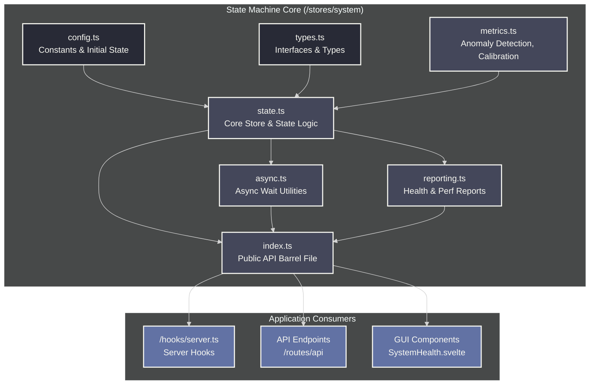

# System State & Health Architecture

SveltyCMS features a modular, intelligent **state machine** that manages system readiness, tracks the health of individual services, and provides detailed performance metrics and anomaly detection.

<Callout type="info">
	This architecture provides production-ready monitoring with automatic calibration, trend detection, and smart timeout calculation—no manual
	configuration needed.
</Callout>

---

## Architecture Overview

The state management system is composed of several focused modules located in `src/stores/system/`. This modular design separates concerns, making the system easier to maintain and extend.

### Architecture Diagram

This diagram illustrates how the different modules of the state system interact with each other and with the rest of the application.



### File Breakdown

| File           | Purpose                                                                                                 |
| -------------- | ------------------------------------------------------------------------------------------------------- |
| `types.ts`     | Defines all the TypeScript interfaces and types (`SystemState`, `ServiceHealth`, etc.).                 |
| `config.ts`    | Contains static configuration, such as baseline performance times and the initial state object.         |
| `state.ts`     | The heart of the machine. It holds the Svelte store and the core functions to update and derive state.  |
| `metrics.ts`   | The "brains." Contains logic for performance tracking, anomaly detection, and self-calibration.         |
| `async.ts`     | Provides asynchronous utilities (`waitForSystemReady`, `waitForServiceHealthy`) for hooks and services. |
| `reporting.ts` | Contains functions that generate structured reports (`getHealthCheckReport`) for the API endpoints.     |
| `index.ts`     | The public interface. It acts as a barrel file, exporting all necessary functions and types.            |

---

## The Self-Optimizing State Machine

The "intelligent" nature of the state machine comes from its ability to learn your server's specific performance profile and optimize its monitoring behavior accordingly. This is not just about tracking metrics; it's about using those metrics to make smarter decisions, which directly impacts server resource management.

### 1. Dynamic Timeouts and Resource Management

Instead of using long, hardcoded timeouts when waiting for a service to start, the system calculates them dynamically.

- **How it Works**: The `getServiceTimeout()` function calculates a timeout based on the service's own performance history (specifically, 3x the running average or 1.5x the historical maximum, whichever is greater).
- **Resource Impact**: This is a direct server resource optimization. A service that is truly stuck or misconfigured will fail faster. This prevents requests from piling up in a waiting state, consuming memory and CPU cycles unnecessarily. The system frees up resources more quickly by not waiting for an arbitrarily long period.

### 2. Adaptive Thresholds

The system doesn't use static values to decide if performance is "good" or "bad." It learns what is normal for your specific hardware and network environment.

- **How it Works**: Every 10 health checks, the `calibrateAnomalyThresholds()` function runs. It adjusts the maximum acceptable startup time and failure tolerance based on the service's recent performance and reliability.
- **Resource Impact**: This self-calibration makes monitoring more efficient. It prevents "alert fatigue" on slower or heavily loaded servers that might otherwise trigger constant false alarms. On high-performance servers, it tightens the thresholds, ensuring that even minor performance regressions—which could be early indicators of resource exhaustion (like a memory leak or CPU bottleneck)—are detected before they become critical.

### 3. Proactive Monitoring

The state machine doesn't just report the current status; it actively looks for negative trends.

- **How it Works**: The system detects if a service's startup time is consistently getting worse (`degrading` trend). Anomaly detection will flag this, as well as low uptime percentages and consecutive failures.
- **Resource Impact**: This acts as an early warning system. A degrading performance trend is often a symptom of an underlying resource issue, such as a database connection pool being exhausted, a memory leak slowly consuming RAM, or increased disk I/O latency. By flagging these trends early, an administrator can investigate and resolve resource contention before it leads to a service failure or a full system outage.

---

## Core Concepts

### System States

The state machine manages five explicit states:

| State          | Description                                             | When It Occurs                      |
| -------------- | ------------------------------------------------------- | ----------------------------------- |
| `IDLE`         | Server started, no initialization begun                 | Initial startup, after shutdown     |
| `INITIALIZING` | System initialization in progress                       | During `initializeSystem()`         |
| `READY`        | All critical services healthy and operational           | Normal running state                |
| `DEGRADED`     | Non-critical service failed, but core CMS is functional | Optional service down (e.g., cache) |
| `FAILED`       | Critical service failed, system not operational         | Database connection failed          |

### Service Health

Each core service reports its health. The overall system state is **automatically derived** from the health of these individual services.

- **Critical Services**: `database`, `auth`. If one of these fails, the whole system enters the `FAILED` state.
- **Non-Critical Services**: `cache`, `contentManager`, `themeManager`. If one of these fails, the system enters the `DEGRADED` state but continues to operate.

---

## API & Usage

All public functions and types should be imported from the main module index.

```typescript
import { isSystemReady, updateServiceHealth, getHealthCheckReport } from '@src/stores/system';
```

### Health Check API

An unauthenticated endpoint for monitoring tools, load balancers, and Kubernetes probes.

- **Endpoint:** `GET /api/system/health`
- **Success Response (`200 OK`):**
  - `overallStatus: "READY"`
  - `overallStatus: "DEGRADED"` (The system is operational but a non-critical service has an issue).
- **Failure Response (`503 Service Unavailable`):**
  - `overallStatus: "FAILED"`
  - `overallStatus: "INITIALIZING"`

### Performance API

An endpoint that provides a detailed performance summary, including bottlenecks and detected anomalies.

- **Endpoint:** `GET /api/system/performance`

### Key Functions for Developers

- **`isSystemReady(): boolean`**: A synchronous check to see if the system is `READY` or `DEGRADED`. Used by the `handleSystemState` hook.
- **`updateServiceHealth(...)`**: Used by services during initialization to report their status (`healthy`, `unhealthy`) to the state machine.
- **`waitForSystemReady(options)`**: An async function that returns a promise, resolving when the system is ready. Useful in scripts or services that run outside the main request lifecycle.

---

## GUI Best Practices

The health monitoring page at `/config/system-health` should present the data from the health check API in a user-friendly manner.

<Callout type="tip" title="User-Friendly Display Tips">
	- **Use Color and Icons**: Represent each state (`READY`, `FAILED`, etc.) with a distinct color (green, red) and icon (check-circle, alert-triangle)
	for at-a-glance understanding. - **Show Reliability**: Display the `reliability` score as a percentage (e.g., "99.8% Uptime"). - **Explain
	`DEGRADED`**: If the status is `DEGRADED`, clearly state which non-critical service is having an issue, but reassure the user that the core CMS is
	still functional. - **Provide Actions**: For `FAILED` or `DEGRADED` states, provide a "Re-initialize System" button for administrators and a link to
	the system logs. - **Human-Readable Messages**: Use the `message` field from the API response to give clear, human-readable status updates for each
	service.
</Callout>
