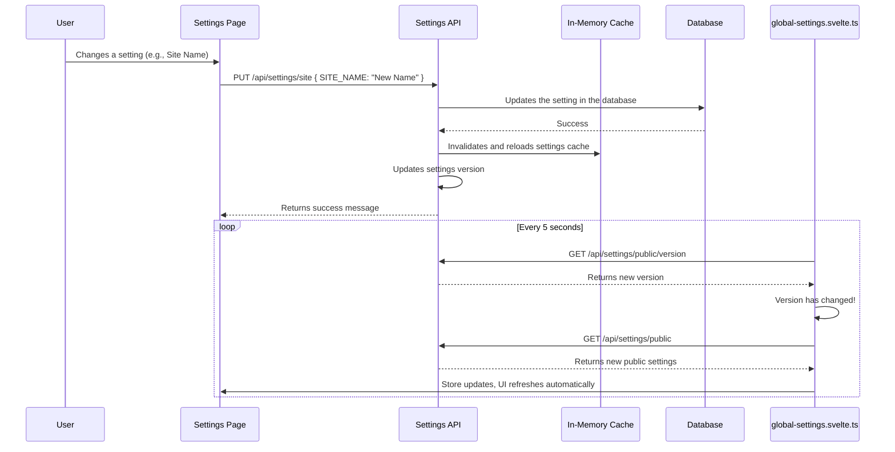

import { Callout } from 'nextra/components';

# System Settings Architecture

This document details the architecture of the SveltyCMS System Settings. The system is designed to be dynamic, performant, and secure, allowing administrators to manage the application's runtime behavior without requiring code deployments.

## Core Principles

1.  **Database as the Source of Truth:** All dynamic system settings are stored in the database. This allows for real-time changes without needing to restart the server.
2.  **In-Memory Cache for Performance:** For maximum performance, all settings are loaded from the database into a server-side in-memory cache at startup. All runtime requests read from this fast cache, avoiding database queries.
3.  **Filesystem for Defaults:**
    - **`/src/routes/setup/seed.ts`**: Defines the initial, default values for all system settings and default roles. This provides a predictable fallback and is used to seed the database during the initial setup.
    - User roles are stored in the `auth_roles` database collection and managed via the Access Management interface.
4.  **Reactive Client-Side Store:** The `src/stores/global-settings.svelte.ts` store holds **public** settings and automatically updates in near real-time using a polling mechanism, ensuring a dynamic UI.

## The Data Flow



### Server-Side

1.  **Server Startup:** The application loads all settings from the database into a fast, in-memory cache.
2.  **Admin Update:** An admin uses the UI to change a setting. The UI sends a `PUT` request to the `/api/settings/[group]` endpoint.
3.  **Database Update:** The API updates the setting in the database.
4.  **Cache Invalidation:** The API calls `invalidateSettingsCache()` and `loadSettingsFromDB()` to immediately refresh the server-side cache with the new value.
5.  **Version Update:** The API calls `updateVersion()` to bump the settings version number. This signals to clients that settings have changed.

### Client-Side (Public Settings)

1.  **Initial Load:** The client-side `global-settings.svelte.ts` store is populated with public settings on initial page load.
2.  **Polling for Versions:** The store polls the `/api/settings/public/version` endpoint every 5 seconds.
3.  **Updating on Change:** If the client detects a new version number, it automatically fetches the complete set of public settings from `/api/settings/public` and updates the store. This makes UI elements that depend on public settings (like the site name) reactive and update in near real-time.

## The User Interface

The main UI for managing settings is located at `/config/systemsetting`. It features:

- A tabbed interface for each settings group.
- A generic component (`generic-settings-group.svelte`) that dynamically renders the fields for any group.
- Real-time validation and unsaved changes indicators.
- A search bar to quickly find settings.

## "Restart Required" Workflow

For critical settings that require a server restart, a clear workflow is implemented to ensure administrators are aware and can take action.

1.  **State Tracking:** When a setting group with `requiresRestart: true` is modified, the server sets a `restartNeeded` flag.
2.  **Client-Side Polling:** The main application layout polls the `/api/system/restart-required` endpoint to check the status of this flag.
3.  **UI Notification:** If a restart is needed, a prominent banner is displayed across the top of the application.
4.  **Admin Action:** For administrators, this banner includes a "Restart Now" button. Clicking this button sends a `POST` request to the secure `/api/system/restart` endpoint.
5.  **Graceful Restart:** This endpoint is designed to integrate with a process manager like `pm2`. It creates a `restart.txt` file in the project root, which can be watched by the process manager to trigger a graceful restart of the application (e.g., `pm2 reload <app_name>`).

## AI Configuration

SveltyCMS integrates with local and remote AI models to power advanced features like automated image tagging and the SveltyAgent assistant. These are configured in the **AI** group in System Settings.

- **`USE_AI_TAGGING`**: Toggle to enable/disable AI-powered image analysis in the Media Gallery.
- **`AI_PROVIDER`**: Select between `ollama` (local, privacy-first) or `openai` (remote).
- **`OLLAMA_URL`**: The URL of your local Ollama instance (default: `http://localhost:11434`).
- **`AI_MODEL_VISION`**: The model used for vision tasks, such as `llava` or `moondream`.

<Callout type="info">
	**Note:** AI features require an active connection to the configured provider. If using Ollama, ensure the server is running and the specified
	vision model is pulled (`ollama pull llava`).
</Callout>

## API Endpoints

- **`GET /api/settings/[group]`**: Retrieves all settings for a specific group.
- **`PUT /api/settings/[group]`**: Updates one or more settings in a group.
- **`DELETE /api/settings/[group]`**: Resets all settings in a group to their default values.
- **`GET /api/settings/public`**: Retrieves all settings marked as `category: 'public'`.
- **`GET /api/settings/public/version`**: Gets the current version timestamp of the settings.
- **`GET /api/system/restart-required`**: Checks if a server restart is needed.
- **`POST /api/system/restart`**: Initiates the graceful restart process.

## Configuration Management

### Language Configuration Warnings

<Callout type="error">
	**CRITICAL: Data Loss Risk When Removing Content Languages** Removing a language from `AVAILABLE_CONTENT_LANGUAGES` after content has been created
	can result in **permanent data loss** for translations in that language.
</Callout>

**The Problem:**

When you remove a language from the configuration (e.g., removing Spanish from `['en', 'de', 'fr', 'es']`), the existing Spanish translations remain in the database but become **inaccessible** through the UI. If content is subsequently edited and saved, the widget system may overwrite the entire multilingual object, **permanently deleting** the Spanish translations.

**Example Scenario:**

```typescript
// Initial configuration
AVAILABLE_CONTENT_LANGUAGES: ['en', 'de', 'fr', 'es']

// Database entry with all translations
{
  title: {
    en: "Hello World",
    de: "Hallo Welt",
    fr: "Bonjour le monde",
    es: "Hola Mundo"  // ← Spanish translation exists
  }
}

// Admin removes 'es' from AVAILABLE_CONTENT_LANGUAGES
AVAILABLE_CONTENT_LANGUAGES: ['en', 'de', 'fr']

// Spanish data still in DB but UI no longer shows it
// User edits the entry in German, clicks Save
// Widget only knows about ['en', 'de', 'fr']

// After save - Spanish translation LOST FOREVER:
{
  title: {
    en: "Hello World",
    de: "Hallo Welt (edited)",
    fr: "Bonjour le monde"
    // ❌ es: "Hola Mundo" - DELETED
  }
}
```

**Data Preservation Strategies:**

1. **Archive Before Removing (Recommended):**

   ```bash
   # Export all content before removing language
   npm run config:export

   # This creates backup with all translations intact
   # File: /config/sync/collections/[collection].json
   ```

2. **Database Backup:**

   ```bash
   # MongoDB
   mongodump --db=sveltycms --out=/backup/before-language-removal

   # PostgreSQL
   pg_dump sveltycms > backup_before_language_removal.sql
   ```

3. **Migration Script (Clean Removal):**

   ```typescript
   // Remove Spanish translations from all entries
   async function removeLanguageTranslations(languageToRemove: string) {
   	const collections = await db.content.nodes.getStructure('flat');

   	for (const collection of collections) {
   		const entries = await db.crud.findMany(collection.id, {});

   		for (const entry of entries) {
   			const updatedEntry = { ...entry };

   			// Remove language key from all translated fields
   			for (const [key, value] of Object.entries(updatedEntry)) {
   				if (typeof value === 'object' && value !== null && languageToRemove in value) {
   					delete value[languageToRemove];
   					updatedEntry[key] = value;
   				}
   			}

   			await db.crud.update(collection.id, entry._id, updatedEntry);
   		}
   	}

   	console.log(`Removed all ${languageToRemove} translations`);
   }

   // Usage:
   await removeLanguageTranslations('es');
   // Now safe to remove 'es' from AVAILABLE_CONTENT_LANGUAGES
   ```

4. **Soft Delete (Keep in DB, Hide from UI):**

   ```typescript
   // Instead of removing from AVAILABLE_CONTENT_LANGUAGES,
   // add HIDDEN_CONTENT_LANGUAGES setting
   {
     AVAILABLE_CONTENT_LANGUAGES: ['en', 'de', 'fr'],
     HIDDEN_CONTENT_LANGUAGES: ['es'],  // ← Kept in DB but hidden
     ARCHIVED_CONTENT_LANGUAGES: ['es']  // ← Mark as archived
   }

   // Widget logic:
   const activeLanguages = AVAILABLE_CONTENT_LANGUAGES.filter(
     lang => !HIDDEN_CONTENT_LANGUAGES.includes(lang)
   );
   ```

**Restoring Lost Translations:**

If translations were accidentally deleted:

1. **From Export Backup:**

   ```bash
   # Restore from most recent export before deletion
   npm run config:import -- --file=/config/sync/backup-YYYY-MM-DD/
   ```

2. **From Database Backup:**

   ```bash
   # MongoDB
   mongorestore --db=sveltycms /backup/before-language-removal/sveltycms

   # PostgreSQL
   psql sveltycms < backup_before_language_removal.sql
   ```

3. **From Version Control:**
   ```bash
   # If exports are version controlled
   git checkout HEAD~5 -- config/sync/collections/*.json
   npm run config:import
   ```

**Best Practice Workflow for Removing Languages:**

1. ✅ **Announce** removal to team (give notice period)
2. ✅ **Export** full configuration: `npm run config:export`
3. ✅ **Backup** database
4. ✅ **Run migration script** to clean translations (optional)
5. ✅ **Remove** language from `AVAILABLE_CONTENT_LANGUAGES`
6. ✅ **Test** on staging environment first
7. ✅ **Monitor** for issues after deployment
8. ✅ **Keep backups** for at least 30 days

<Callout type="info">**Adding languages is always safe** - no existing data is affected. Only **removing** languages poses data loss risks.</Callout>

### Exporting (`config:export`)

When a full configuration export is run, the `ConfigExporter` service queries the `system_preferences` table and saves all non-secret settings to a file like `/config/sync/system/system.settings.json`.

<Callout type="warning">
	**Security:** The export process must be configured to **exclude** secrets like `SMTP_PASSWORD`. The `category: 'private'` property on a setting
	field ensures it is not included in public exports.
</Callout>

### Importing (`config:import`)

When importing configuration to a new environment:

1.  The `ConfigImporter` reads `system.settings.json` and populates the `system_preferences` table with the baseline configuration.
2.  As a final step, the `ConfigImporter` calls `invalidateSettingsCache()`. This forces the application to reload its cache with the newly imported settings, bringing the entire system into a fully consistent state.
