# User Management System Overview

The SveltyCMS user management system is a secure and comprehensive interface for both personal profile management and site-wide administration. It provides a clear separation between a user's own settings and the powerful tools available to administrators for managing all users and registration tokens.

The system includes enterprise-grade audit logging that tracks all security-critical events across the entire CMS platform, ensuring compliance and forensic capabilities.

This document outlines the architecture and key components of the current system.

---

## Core Components

The user management experience is built from several distinct, high-performance Svelte 5 components, each with a specific responsibility.

### 1. User Profile Page (`+page.svelte`)

This is the main view for an authenticated user. It serves three primary functions:

- **Profile Display**: Shows the user's avatar, username, email, role, and unique ID in a two-column layout.
- **Personal Settings**: Allows the user to edit their own profile information (via `modal-edit-form.svelte`) and change their avatar (via `modal-edit-avatar.svelte`).
- **Security Management**: Contains the dedicated component for managing Two-Factor Authentication (2FA) settings.

### 2. Admin Area (`admin-area.svelte`)

This powerful component is conditionally rendered at the bottom of the page for users with the appropriate permissions. It is the central hub for site-wide user and token administration.

- **Functionality**: Provides a unified table interface to view, search, filter, and perform batch actions (delete, block, unblock) on all users or registration tokens in the system.
- **Performance Optimized**: The system has been optimized to remove server-side pre-loading of all users and tokens, improving initial page load performance.

### 3. Two-Factor Authentication (`two-factor-auth.svelte`)

Security is enhanced through an integrated TOTP-based 2FA system. This component is displayed as a distinct card on the user page, allowing users to:

- **Enable 2FA**: Guides the user through a standard setup process involving QR code scanning and verification.
- **Manage Backup Codes**: Generate and view recovery codes for use if their authenticator device is lost.
- **Disable 2FA**: Securely turn off two-factor authentication by providing a valid TOTP code.

### 4. Audit Log System (`auditLogService.ts`)

An enterprise-grade audit logging service tracks all security-critical events across the entire CMS platform:

- **Comprehensive Event Tracking**: Monitors 24 different event types including authentication, user management, token operations, data operations, and security events
- **Severity Classification**: Events are classified as low, medium, high, or critical severity for proper alerting
- **System-Wide Coverage**: Tracks actions across all CMS components, not just user management:
  - **User Actions**: Login attempts, profile changes, role modifications
  - **Content Management**: Collection operations, data exports/imports, content deletion
  - **Token Management**: API token creation, usage, and misuse detection
  - **Security Events**: Unauthorized access attempts, privilege escalation, suspicious activity
- **Database Agnostic**: Uses the SveltyCMS database interface for compatibility across different database systems
- **Performance Optimized**: Minimal overhead with asynchronous logging and automatic cleanup policies

---

## Security Architecture & Data Flow

The system is protected by a multi-layered security model orchestrated by server hooks and dedicated API endpoints, with comprehensive audit logging ensuring full traceability.

### Server Hooks (`hooks.server.ts`)

All requests to the user page or its associated APIs pass through a security pipeline that enforces:

1.  **Rate Limiting**: Prevents brute-force and denial-of-service attacks.
2.  **Authentication**: Verifies the user's session is valid.
3.  **Authorization**: Checks if the user's role has the necessary permissions to access a resource or perform an action.
4.  **Audit Logging**: All security-critical events are automatically logged for compliance and forensic analysis.

### API Endpoints

User management actions are executed via a suite of secure, tenant-aware REST API endpoints. Key endpoints include:

- `/api/user/batch`: Performs bulk actions like deleting, blocking, or unblocking users.
- `/api/user/updateUserAttributes`: Updates a user's profile information.
- `/api/user/saveAvatar`: Handles avatar image uploads.
- `/api/auth/2fa/...`: Manages all two-factor authentication flows.

All API endpoints automatically log relevant audit events when operations are performed.

### Audit Log Visibility & Access

The audit logging system is designed for **system-wide monitoring**, not just user actions:

#### **For Administrators**

- **Security Dashboard**: Access to comprehensive audit statistics, suspicious activity detection, and trend analysis
- **Full Audit Trail**: View all security events across the entire CMS platform including:
  - User authentication and management events
  - Collection and content operations
  - Token management and API usage
  - Security incidents and suspicious activities
- **Advanced Filtering**: Query logs by event type, severity, user, time range, and target resources
- **Export Capabilities**: Download audit reports for compliance and external analysis

#### **For Regular Users**

- **Personal Activity Log**: View their own authentication events, profile changes, and account security activities
- **Security Notifications**: Alerts for suspicious activities on their account (failed logins, unusual access patterns)
- **Limited Scope**: Users can only see audit events directly related to their own account

#### **System Integration**

- **Real-time Monitoring**: High-severity events trigger immediate alerts to administrators
- **Compliance Reporting**: Automated generation of audit reports for regulatory requirements
- **Forensic Analysis**: Detailed event correlation for security incident investigation
- **Performance Monitoring**: Audit system performance metrics and automatic cleanup policies

### Current Data Flow Diagram

The diagram below illustrates the optimized data flow with audit logging integration:

```mermaid
%%{ init: { 'theme': 'neutral' } }%%
graph TD
    subgraph Browser["🖥️ Browser (Client)"]
        A["User navigates to /user page"]
        D["admin-area.svelte loads data on-demand"]
        E["Performs filtering/sorting with API calls"]
        F["Audit Dashboard (Admin only)"]
    end

    subgraph Server["⚡ SvelteKit Server"]
        B["+page.server.ts load()"]
        C["Optimized: No bulk data loading"]
        H["API Endpoints"]
        I["Security Hooks"]
    end

    subgraph Services["🔧 Services"]
        J["AuditLogService"]
        K["Database Interface"]
    end

    subgraph Database["🗄️ Database"]
        L[Users Collection]
        M[Tokens Collection]
        N[AuditLogs Collection]
    end

    %% Navigation flow
    A --> B
    B --> C

    %% Admin area data loading
    D --> H
    E --> H

    %% Audit dashboard access
    F --> H

    %% Security and audit flow
    H --> I
    I --> J

    %% Database operations
    J --> K
    K --> L
    K --> M
    K --> N

    %% Additional audit logging
    H --> J

    %% Styling
    classDef browserStyle fill:#e1f5fe,stroke:#0277bd,stroke-width:2px
    classDef serverStyle fill:#f3e5f5,stroke:#7b1fa2,stroke-width:2px
    classDef serviceStyle fill:#e8f5e8,stroke:#2e7d32,stroke-width:2px
    classDef dbStyle fill:#fff3e0,stroke:#ef6c00,stroke-width:2px

    class A,D,E,F browserStyle
    class B,C,H,I serverStyle
    class J,K serviceStyle
    class L,M,N dbStyle
```



---

## Audit Logging Implementation

The audit logging system provides comprehensive tracking of all security-critical events across the SveltyCMS platform.

### Event Categories

The system tracks 24 different event types organized into key categories:

#### **Authentication Events**

- `USER_LOGIN`, `USER_LOGOUT`, `USER_LOGIN_FAILED`
- `PASSWORD_CHANGE`, `PASSWORD_RESET`
- `TWO_FACTOR_ENABLED`, `TWO_FACTOR_DISABLED`

#### **User Management Events**

- `USER_CREATED`, `USER_UPDATED`, `USER_DELETED`
- `USER_ROLE_CHANGED`, `USER_STATUS_CHANGED`

#### **Token Management Events**

- `TOKEN_CREATED`, `TOKEN_UPDATED`, `TOKEN_DELETED`
- `TOKEN_USED`, `TOKEN_MISUSE`

#### **Data Operations**

- `DATA_EXPORT`, `DATA_IMPORT`, `DATA_DELETION`

#### **Security Events**

- `UNAUTHORIZED_ACCESS`, `PRIVILEGE_ESCALATION`
- `DATA_BREACH_ATTEMPT`, `SUSPICIOUS_ACTIVITY`

### Usage Examples

```typescript
import { logAuditEvent, AuditEventType } from '@src/services/auditLogService';

// Log a successful user login
await logAuditEvent({
	eventType: AuditEventType.USER_LOGIN,
	severity: 'low',
	actorId: user.id,
	actorEmail: user.email,
	action: 'User successfully logged in',
	details: { loginMethod: 'email', userAgent: request.headers['user-agent'] },
	ipAddress: request.ip,
	result: 'success'
});

// Log a failed privilege escalation attempt
await logAuditEvent({
	eventType: AuditEventType.PRIVILEGE_ESCALATION,
	severity: 'critical',
	actorId: user.id,
	actorEmail: user.email,
	action: 'Attempted to access admin-only resource',
	details: { requestedResource: '/admin/users', userRole: user.role },
	ipAddress: request.ip,
	result: 'failure',
	errorDetails: 'Insufficient permissions'
});

// Log a collection data export
await logAuditEvent({
	eventType: AuditEventType.DATA_EXPORT,
	severity: 'medium',
	actorId: user.id,
	actorEmail: user.email,
	targetType: 'collection',
	targetId: collection.id,
	action: `Exported ${collection.name} collection data`,
	details: { format: 'json', recordCount: exportedRecords.length },
	result: 'success'
});
```

### Integration Points

The audit logging system is automatically integrated at key points throughout the CMS:

- **Authentication Hooks**: All login/logout events
- **API Endpoints**: User management, token operations, data operations
- **Collection Operations**: Content creation, updates, deletions
- **Security Middleware**: Unauthorized access attempts, rate limiting violations
- **Administrative Actions**: Role changes, user management, system configuration

---

## Future Enhancements

### Planned Improvements

1. **Real-time Audit Dashboard**: Live monitoring of security events with alerting
2. **Advanced Analytics**: Trend analysis, anomaly detection, and predictive security
3. **Compliance Reports**: Automated generation of audit reports for regulatory requirements
4. **Integration APIs**: Webhook support for external security information and event management (SIEM) systems
5. **Mobile Notifications**: Push notifications for critical security events

### Performance Considerations

The audit logging system is designed for minimal performance impact:

- **Asynchronous Processing**: All audit events are logged asynchronously
- **Batch Operations**: Multiple events can be logged in batches for efficiency
- **Automatic Cleanup**: Configurable retention policies prevent unlimited log growth
- **Database Optimization**: Proper indexing ensures fast querying and aggregation
- **Error Resilience**: Audit logging failures never impact main application functionality

---

## Conclusion

The SveltyCMS user management system provides a robust, secure, and scalable foundation for both personal profile management and enterprise-grade administration. With integrated audit logging, the system ensures comprehensive visibility into all security-critical events while maintaining optimal performance and user experience.

The audit logging system extends far beyond user management, providing system-wide security monitoring for all CMS components including collections, content operations, API usage, and administrative functions.
