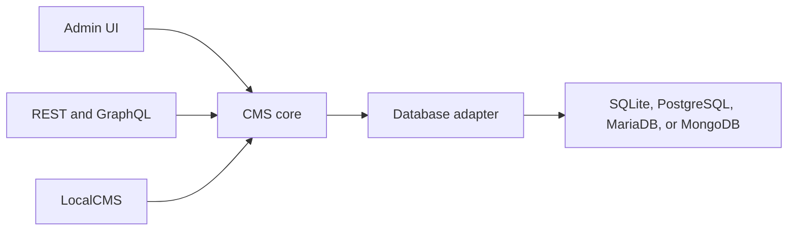

# Concepts

Read this once before the architecture essays. SveltyCMS is a self-hosted CMS: editors work in the admin, websites and apps call an API, and the same content model runs on SQLite, PostgreSQL, MariaDB, or MongoDB.

Six ideas cover the product. Everything else in these docs is a task, a lookup page, or an explanation of the engine.

---

## The six ideas

### 1. A collection is a content type

A collection is the schema: name, fields, validations, and who can read or write it. You create one in the [Collection Builder](../guides/content/collection-builder.mdx) or as a TypeScript module under `config/collections/`. Saving it runs ContentSync, which compiles the module the admin and the API both use.

### 2. An entry is one document

An entry is a single record in a collection — a page, a post, a product. Entries can be drafted, published, localized, and revised. The admin edits entries. The API returns them.

### 3. A widget is a field

Each field is a widget with three parts: a definition (`index.ts`, schema included), an input for the editor, and a display for read-only views. The built-in widgets cover text, rich text, media, relations, and the rest. A custom field is a new widget, not a fork of the admin. Start at [Widget development](../development/widgets/index.mdx).

### 4. A tenant scopes every record

Content, users, and settings are stored with a `tenantId`. Queries do not cross tenants. One install can host more than one site. The isolation rules live in [Multi-tenancy](../reference/architecture/multi-tenancy.mdx).

### 5. Three doors, one core

| Door         | Who uses it                                                      | What to read                                                   |
| :----------- | :--------------------------------------------------------------- | :------------------------------------------------------------- |
| **Admin**    | Editors and administrators                                       | [Guides](../guides/index.mdx)                                  |
| **HTTP**     | A separate frontend (SvelteKit, Astro, Next.js, a mobile app)    | [API reference](../reference/api/index.mdx) — REST and GraphQL |
| **LocalCMS** | Server code inside this app (`+page.server.ts`, hooks, services) | [Local SDK vs HTTP](../development/local-vs-http-api.mdx)      |

LocalCMS calls the core in-process. Server code inside SveltyCMS should use it. External apps use HTTP. Both go through the same permissions and the same adapters.

### 6. The adapter is the database

SQLite, PostgreSQL, MariaDB, and MongoDB are adapters behind one API. Pick SQLite to start. Pick a server database when more than one app instance must share data. Adapter behavior is documented in the [Database reference](../reference/database/index.mdx).

---

## Who you are

| You want to…                             | Start here                                            | Then                                                                                                                                                           |
| :--------------------------------------- | :---------------------------------------------------- | :------------------------------------------------------------------------------------------------------------------------------------------------------------- |
| Publish content                          | [Getting started](../getting-started.mdx)             | [Collection Builder](../guides/content/collection-builder.mdx), [Workflows](../guides/content/workflows.mdx), [Persona paths](../onboarding/persona-paths.mdx) |
| Run the install                          | [Getting started](../getting-started.mdx)             | [Setup wizard](../guides/configuration/setup-wizard.mdx), [Production deployment](../guides/deployment/production-deployment.mdx)                              |
| Feed a website                           | [Use the API](../reference/api/index.mdx)             | [Site starter](../development/site-starter.mdx) if the public site lives in this repo                                                                          |
| Add a field, plugin, or dashboard widget | [Development](../development/index.mdx)               | Widget, plugin, and dashboard guides in that section                                                                                                           |
| Change the engine                        | [Contributing](../contributing/contributing-docs.mdx) | [Architecture](../reference/architecture/index.mdx) — read it for the change you are making, not front to back                                                 |
| Prove a test or a benchmark              | [Tests](../tests/index.mdx)                           | [Benchmarks](../project/benchmarks/index.mdx)                                                                                                                  |

---

## How the docs are split

| Section          | Question it answers                                | Folder                                                         |
| :--------------- | :------------------------------------------------- | :------------------------------------------------------------- |
| **Get started**  | How do I get a running CMS?                        | `docs/getting-started.mdx`, `docs/onboarding/`                 |
| **Concepts**     | What are the pieces?                               | `docs/concepts/` (this page)                                   |
| **Guides**       | How do I complete this task?                       | `docs/guides/`                                                 |
| **Build**        | How do I extend the CMS?                           | `docs/development/`                                            |
| **Reference**    | What is the exact contract?                        | `docs/reference/api/`, `security/`, `database/`, `components/` |
| **Architecture** | Why is the engine built this way?                  | `docs/reference/architecture/`                                 |
| **Contribute**   | How do I change the project, including these docs? | `docs/contributing/`                                           |

Test write-ups (`docs/tests/`) and project records (`docs/project/`: roadmap, achievements, benchmarks, comparison) stay in the repo. They are evidence for contributors. They are not the path a new editor or integrator should walk.

## Next steps

- Install and create the first collection: [Getting started](../getting-started.mdx).
- Follow a role: [Persona paths](../onboarding/persona-paths.mdx).
- Look up an endpoint: [API reference](../reference/api/index.mdx).
- Change the docs themselves: [Contributing to the documentation](../contributing/contributing-docs.mdx).
