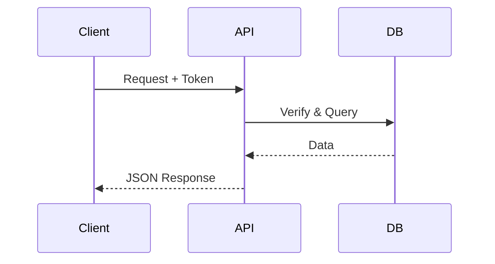
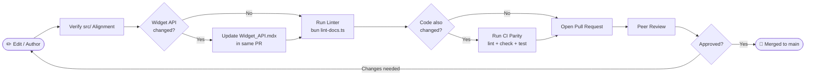

# Documentation Contribution Guide

High-quality documentation is what makes SveltyCMS accessible to everyone — from first-time users to experienced engineers extending the core. This guide serves two audiences and is organized accordingly.

**Jump to your section:**

- 👥 **[For All Contributors](#for-all-contributors)** — Style, tone, and the writing approach that makes our docs excellent.
- 🛠️ **[For Developers & AI Agents](#for-developers--ai-agents)** — Non-negotiable technical rules, canonical locations, frontmatter spec, and PR process.

---

## For All Contributors

You don't need to be a developer to improve SveltyCMS documentation. Typo fixes, clarity improvements, and outdated screenshots are just as valuable as new API references.

### Where to Start

- **Typos & Grammar**: Every fix counts. If you spot it, fix it.
- **Clarity**: If a step confused you, it will confuse others. Rewrite it.
- **Outdated Info**: If the UI looks different from the docs, open an issue or a PR.
- **Missing Examples**: If you solved a problem not covered in the docs, add it.

> [!TIP]
> **Quick Fixes**: For small corrections, you can edit any page directly on GitHub by navigating to the file and clicking the pencil icon. No local setup required.

---

### The "User-First" Writing Approach

When writing or rewriting any section, structure your content in this order:

1. **The Goal** — What is a user (Content Creator, Admin, or Developer) trying to achieve? State it in one sentence.
2. **The Solution** — Clear, step-by-step instructions (screenshots, code snippets) to achieve that goal.
3. **The Mechanics** — _(Optional & Final)_ — Explain the architecture, state machines, or DB-agnostic adapters _after_ the goal is achieved. Never lead with mechanics for high-level guides.

> [!IMPORTANT]
> **Multi-Persona Balance**: Documentation is not just for developers. Every major guide (like Getting Started) must provide distinct paths for **Content Creators** (layout, workflows), **Administrators** (settings, permissions), and **Engineers** (setup, mechanics).
>
> **1:1 Technical Alignment**: Before documenting any function, endpoint, or component, find it in the `src/` directory first. Document the **actual** parameter names and behavior — not what you expect them to be. If the code and the existing docs disagree, the code is correct.

---

### Writing Style

- **Voice**: Professional, direct, and concise. Use American English.
- **Active voice**: "Click Save" not "The Save button should be clicked."
- **Short sentences**: One idea per sentence.
- **Real examples**: Every concept should have a working code snippet or step-by-step scenario.
- **Scannable structure**: Use H2/H3 headings, and end sections with a clear next step or summary.

---

### When to Use a Mermaid Diagram

Use a diagram when the relationship between **three or more components** is not immediately obvious from prose alone. Do not add diagrams for decoration.

**Good candidates**: Authentication flows, middleware pipelines, provisioning sequences, state machines, cache layers.

**Skip the diagram**: For a single API endpoint, a two-step process, or anything a one-sentence description handles clearly.

---

### MDX Formatting Features

#### GitHub-Style Alerts

Use these callouts to surface critical information. Do not overuse them — if everything is important, nothing is.

```markdown
> [!NOTE]
> General information that provides useful context.

> [!TIP]
> A helpful shortcut or best practice.

> [!IMPORTANT]
> An essential requirement the user must not miss.

> [!WARNING]
> A potential pitfall or side effect to be aware of.

> [!CAUTION]
> A high-risk action that may cause data loss or breakage.
```

#### Mermaid Diagrams

````markdown

````

#### Code Blocks

Always specify the language for syntax highlighting:

````markdown
```typescript
// TypeScript example
const result = await db.collections.findOne({ id });
```
````

---

## For Developers & AI Agents

This section contains non-negotiable rules. All PRs are checked against these standards before review.

---

### ⚠️ The Golden Rules

These rules are enforced. A PR that violates them will not be merged.

> 1. **MDX Only, Correct Locations**: All documentation files must be `.mdx`. No `.md` files. Files must be placed in their designated canonical location (see below) — no exceptions.
> 2. **Centralized API Docs**: All API documentation **must** live in `/docs/api/`. API content scattered elsewhere will be rejected.
> 3. **Current Functionality Only**: Document only what exists in the current codebase. Do not document planned features, unmerged branches, or aspirational behavior.
> 4. **Comprehensive Indexing**: Index pages (e.g., `api/index.mdx`) must serve as a complete map. They **must** link to every child document in their category. A partial index that misses sub-pages is considered broken navigation.
> 5. **Assets in `/static/docs/`**: All non-MDX assets (images, SVGs, diagrams) **must** be placed in `/static/docs/` and referenced via absolute paths. No assets in `/docs/` itself.
> 6. **Widget API Sync Rule**: Any change to `src/routes/api/widgets/` or `src/stores/widget-store.svelte.ts` — adding, removing, or renaming an endpoint, or changing a response shape — **must** update `/docs/api/Widget_API.mdx` in the same PR. This means refreshing the `updated` date, updating the status table, and removing any obsolete endpoints. Never leave these out of sync.
> 7. **Thin API Pattern**: All new API routes in `src/routes/api/` must follow the **Thin Wrapper** pattern. Logic should reside in the **Local SDK** (`src/routes/api/cms.ts`) or a dedicated service. The `+server.ts` file should only handle request parsing, calling `locals.cms`, and returning a JSON response.
> 8. **Local SDK Alignment**: When adding or modifying core CMS functionality, ensure it is exposed through the `LocalCMS` class. Documentation for these features must highlight the performance benefits of using the Local SDK over external HTTP calls.

---

### Canonical Documentation Locations

Place files only in these locations. No other locations are permitted.

| Content Type       | Location                                           | Reason                                           |
| :----------------- | :------------------------------------------------- | :----------------------------------------------- |
| **API Reference**  | `/docs/api/`                                       | Single unified surface for all endpoint docs.    |
| **General Guides** | `/docs/guides/`                                    | Central library for feature and workflow guides. |
| **Architecture**   | `/docs/architecture/`                              | Internal mechanics and system design.            |
| **Contributing**   | `/docs/contributing/`                              | Process and standards docs (like this file).     |
| **Widget Docs**    | `src/widgets/core/{widget-name}/{widget-name}.mdx` | Co-located with source for maintainability.      |

#### Canonical Structure Reference

```
SveltyCMS/
├── docs/
│   ├── api/                              # ALL API docs — no exceptions
│   │   ├── index.mdx                     # API overview and auth guide
│   │   ├── Authentication_2FA_API.mdx
│   │   ├── Collection_API.mdx
│   │   ├── Widget_API.mdx                # Must stay in sync with widget store
│   │   ├── Settings_API.mdx
│   │   ├── Media_API.mdx
│   │   └── ...
│   ├── architecture/                     # Internal mechanics
│   ├── guides/                           # Feature guides and tutorials
│   └── contributing/
│       ├── contributing-docs.mdx         # This file
│       ├── code-of-conduct.mdx
│       └── pull-requests.mdx
└── src/
    └── widgets/
        └── core/
            ├── text/
            │   └── text.mdx              # Co-located widget doc
            ├── richText/
            │   └── richText.mdx
            └── ...
```

---

### Frontmatter Specification

Every `.mdx` file must begin with a complete YAML frontmatter block. All fields are required.

| Field         | Type   | Purpose                                                                                                          | Example                                     |
| :------------ | :----- | :--------------------------------------------------------------------------------------------------------------- | :------------------------------------------ |
| `path`        | string | Full path from project root. Used for routing and identification. Must exactly match the file's actual location. | `"docs/api/Collection_API.mdx"`             |
| `title`       | string | Main H1 heading. Shown in navigation, browser tab, and search results.                                           | `"Collection API"`                          |
| `description` | string | One-sentence summary for SEO and link previews.                                                                  | `"CRUD operations for collection entries."` |
| `order`       | number | Position in sidebar navigation relative to siblings. Lower = higher.                                             | `15`                                        |
| `icon`        | string | Material Design Icon with `mdi:` prefix.                                                                         | `"mdi:api"`                                 |
| `author`      | string | GitHub username of the original author.                                                                          | `"your-github-handle"`                      |
| `created`     | string | Creation date in `YYYY-MM-DD` format. Set once, never change.                                                    | `"2025-10-05"`                              |
| `updated`     | string | Date of last meaningful change. Update with every PR that modifies content.                                      | `"2026-03-27"`                              |
| `tags`        | array  | Lowercase kebab-case keywords for search and filtering.                                                          | `["api", "collections", "crud"]`            |

**Correct frontmatter example:**

```yaml
---
path: "docs/api/Collection_API.mdx"
title: "Content & Collections API"
description: "REST API for managing content entries with multi-tenant isolation."
order: 15
icon: "mdi:database"
author: "your-github-handle"
created: "2026-01-10"
updated: "2026-03-27"
tags:
  - "api"
  - "collections"
  - "crud"
  - "rest"
---
```

---

### Asset Management

All non-MDX files (images, screenshots, SVGs) must follow these rules:

- **Location**: `/static/docs/` — mirror the `/docs/` directory structure beneath it.
- **Example**: An image for `/docs/api/Collection_API.mdx` belongs in `/static/docs/api/`.
- **Reference**: Always use absolute paths from the project root.

```markdown

```

**File standards:**

- **Format**: PNG for screenshots, SVG for diagrams and icons.
- **Size**: Keep files under 500KB. Compress screenshots before committing.
- **Naming**: Descriptive kebab-case (e.g., `saml-handshake-flow.svg`).
- **Alt text**: Always required. Describe what the image conveys, not what it looks like.

---

### Pull Request Workflow

Documentation is treated with the same rigor as code. Every contribution passes through the same gates before it reaches `main`.



1. **Branch**: Create a branch with a descriptive name.

   ```bash
   git checkout -b docs/fix-collection-api-filter-params
   ```

2. **Verify source alignment**: If documenting code behavior, open the relevant file in `src/` and confirm every parameter name, return value, and sequence matches what you've written.

3. **Lint**: Run the documentation linter and fix all errors before pushing.

   ```bash
   bun ./tests/lint-docs.ts
   ```

4. **CI parity** _(if code was also changed)_: Run the full check suite.

   ```bash
   bun run lint && bun run check && bun run test
   ```

5. **Update `updated` field**: Change the date in frontmatter to today's date.

6. **Submit PR**: Use a clear title following the convention:

   ```
   docs: add filter operator reference to SCIM API
   docs: fix outdated widget sync steps in troubleshooting
   docs: overhaul getting-started for user-first structure
   ```

7. **AI agent commits**: If an AI agent authored or co-authored the content, include in the commit message:
   ```
   Co-Authored-By: Antigravity <agent@sveltycms.com>
   ```

---

### Pre-Submission Checklist

Before opening a PR, verify every item:

- [ ] File is `.mdx` format — not `.md`
- [ ] File is in its correct canonical location
- [ ] `path` field in frontmatter matches the actual file path exactly
- [ ] All required frontmatter fields are present and correctly typed
- [ ] `updated` field reflects today's date
- [ ] Content documents only current, existing functionality
- [ ] Every parameter name and return value verified against `src/`
- [ ] Code examples are tested and functional
- [ ] Assets are in `/static/docs/` with mirrored directory structure
- [ ] All asset references use absolute paths
- [ ] Alt text provided for every image
- [ ] Tags are lowercase and kebab-case
- [ ] Internal links use correct canonical paths
- [ ] Linter passes: `bun ./docs/lint-docs.ts`
- [ ] **If `src/routes/api/widgets/` or `src/stores/widget-store.svelte.ts` changed**: `Widget_API.mdx` updated in this same PR (status table refreshed, obsolete endpoints removed, `updated` date changed)
- [ ] Rendered correctly in the CMS preview (if available)

---

## Questions and Support

- **Unclear guidelines**: Ask in [GitHub Discussions](https://github.com/SveltyCMS/SveltyCMS/discussions)
- **Documentation bugs**: Open a [GitHub Issue](https://github.com/SveltyCMS/SveltyCMS/issues)
- **PR review help**: Tag a maintainer in your pull request

---

## Related Documents

- [Code of Conduct](../../CODE-OF-CONDUCT.md)
- [Pull Request Guidelines](../../CONTRIBUTING.md)
- [API Documentation](../api/index.mdx)
- [Widget System Guide](../guides/development/widgets/index.mdx)
