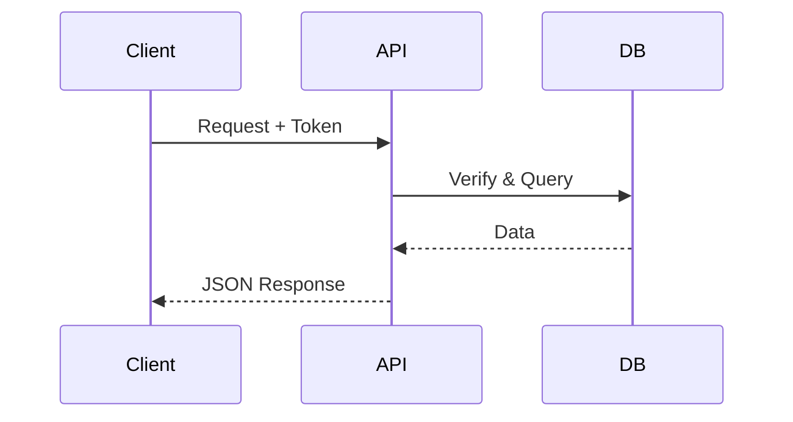
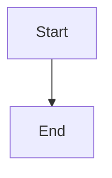
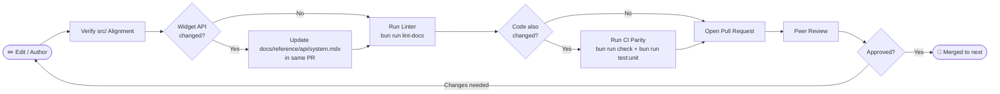

# Documentation Contribution Guide

High-quality documentation is what makes SveltyCMS accessible to everyone — from first-time users to experienced engineers extending the core. This guide serves two audiences.

**Jump to your section:**

- 👥 **[For All Contributors](#for-all-contributors)** — Tone, style, and writing approach.
- 🛠️ \*\*[For Developers and AI Agents](#for-developers) — Golden rules, canonical file tree, frontmatter spec, and PR process.

---

## For All Contributors

You don't need to be a developer to improve SveltyCMS documentation. Typo fixes, clarity improvements, and outdated screenshots are just as valuable as new API references.

### Where to Start

- **Typos & Grammar**: Every fix counts. If you spot it, fix it.
- **Clarity**: If a step confused you, it will confuse others. Rewrite it.
- **Outdated Info**: If the UI or API response differs from the docs, open an issue or a PR.
- **Missing Examples**: If you solved a problem not covered in the docs, add it.
- **Broken Links**: If a relative link leads to a 404, update it.

> [!TIP]
> **Quick Fixes**: For small corrections, edit any page directly on GitHub by navigating to the file and clicking the pencil icon. No local setup required.

---

### The "User-First" Writing Approach

Structure every section in this order:

1. **The Goal** — What is the reader (Content Creator, Admin, or Developer) trying to achieve? State it in one sentence.
2. **The Solution** — Clear, step-by-step instructions (screenshots, code snippets) to achieve that goal.
3. **The Mechanics** — _(Optional & Final)_ — Explain architecture, state machines, or DB-agnostic adapters _after_ the goal is achieved. Never lead with mechanics for end-user guides.

> [!IMPORTANT]
> **Multi-Persona Balance**: Major guides (like Getting Started) must provide distinct paths for **Content Creators** (layout, workflows), **Administrators** (settings, permissions), and **Engineers** (setup, mechanics).
>
> **1:1 Code Alignment**: Before documenting any function, endpoint, or component, open the relevant file in `src/`. Document the **actual** parameter names and behavior — not what you expect them to be. If the code and the existing docs disagree, the code is correct.

---

### 🇪🇺 EU & German Comparative Advertising Compliance

All competitive comparisons in public-facing documentation must comply with **EU Directive 2006/114/EC** and **German UWG §6 (Unfair Competition Act)**:

- **Use Verifiable Sources**: Every competitive claim must cite public, objective sources (competitor documentation, CVE databases, published benchmarks).
- **Date-Stamp Performance Metrics**: Include measurement date, hardware specs, and reproduction commands.
- **Avoid Disparaging Language**: Describe architectural differences neutrally (e.g., "React VDOM reconciliation" vs. "Svelte compile-time reactivity"). Never use terms like "fails to", "broken", or "suffers from".
- **Qualify Absolutes**: Claims like "first", "best", or "only" must be qualified: "to our knowledge" or "based on public documentation as of [Date]".
- **Like-for-Like Comparisons**: Only compare goods meeting the same needs. Note differences (SaaS vs. self-hosted, free vs. enterprise).

---

### Writing Style

- **Voice**: Professional, direct, concise. Use American English.
- **Active voice**: "Click Save" not "The Save button should be clicked."
- **Short sentences**: One idea per sentence.
- **Real examples**: Every concept should have a working code snippet or step-by-step scenario.
- **Scannable structure**: Use H2/H3 headings. End each section with a clear next step or summary.
- **Headings**: Use sentence case for headings ("Getting started with collections" not "Getting Started With Collections").

---

### When to Use a Mermaid Diagram

Use a diagram when the relationship between **three or more components** is not immediately obvious from prose alone. Do not add decoration-only diagrams.

**Good candidates**: Authentication flows, middleware pipelines, provisioning sequences, state machines, cache layers.

**Skip the diagram**: For a single API endpoint, a two-step process, or anything a one-sentence description handles clearly.

---

### MDX Formatting Features

#### GitHub-Style Alerts

Use these callouts sparingly — if everything is important, nothing is.

```markdown
> [!NOTE]
> General information that provides useful context.

> [!TIP]
> A helpful shortcut or best practice.

> [!IMPORTANT]
> An essential requirement the user must not miss.

> [!WARNING]
> A potential pitfall or side effect to be aware of.

> [!CAUTION]
> A high-risk action that may cause data loss or breakage.
```

#### Mermaid Diagrams

Use fenced code blocks with the `mermaid` language tag:

````markdown

````

The renderer supports these diagram types: `graph` (flowchart), `sequenceDiagram`, `classDiagram`, `stateDiagram`, `erDiagram`, `gantt`, `pie`, `gitgraph`, `mindmap`, `timeline`, `quadrantChart`, `xyChart`, `journey`.

> [!WARNING]
> Do **not** include inline HTML elements inside mermaid blocks — they will not render. Do **not** hardcode hex color values; let the theme engine handle coloring automatically.

#### Code Blocks

Always specify the language for syntax highlighting:

````markdown
```typescript
// TypeScript example
const result = await cms.collections.find("posts", { tenantId });
```

```bash
# Shell example
bun run dev
```
````

For code blocks that contain triple backticks, use quadruple backticks as the fence:

`````markdown
````markdown

````
`````

---

## For Developers and AI Agents {#for-developers}

This section contains **non-negotiable rules**. All PRs are checked against these standards before review.

---

### ⚠️ The Golden Rules

These rules are enforced. A PR that violates them will not be merged.

> 1. **MDX Only, Correct Locations**: All documentation files **must** be `.mdx`. No `.md` files. Files must live in their designated canonical location (see the table below) — no exceptions.
>
>    **Exception**: Benchmark reports in `docs/project/benchmarks/` are auto-generated by `scripts/benchmark-matrix/generate-benchmark-reports.ts` using an underscore naming convention (`benchmark_sqlite.mdx`, `benchmark_postgresql_redis.mdx`). This pipeline-driven naming is intentional and exempt from the kebab-case rule. Do not rename these files manually.
>
> 2. **Centralized API Docs**: All API documentation **must** live in `docs/reference/api/`. API content scattered elsewhere will be rejected.
> 3. **Current Functionality Only**: Document only what exists in the current codebase on the `next` branch. Do not document planned features, unmerged branches, or aspirational behavior.
> 4. **Comprehensive Indexing**: Index pages (e.g., `docs/reference/api/index.mdx`) must serve as a complete map. They **must** link to every child document in their category. A partial index is broken navigation.
> 5. **Assets in `static/docs/`**: All non-MDX assets (images, SVGs, diagrams) **must** be placed in `static/docs/` and referenced via absolute project-root paths. No assets in `docs/` itself.
> 6. **Widget API Sync Rule**: Any change to `src/routes/api/[...path]/handlers/system.ts` (the widgets section) or `src/stores/widget-store.svelte.ts` — adding, removing, or renaming a handler, or changing a response shape — **must** update `docs/reference/api/system.mdx` in the same PR. Refresh the `updated` date, update the endpoint table, and remove any obsolete entries.
> 7. **Thin API Handler Pattern**: Handlers in `src/routes/api/[...path]/handlers/` must only parse the request, delegate to `locals.cms` (the Local SDK), and return a JSON response. All data access logic should live in the **Local SDK** (`src/services/sdk/index.ts`) or a dedicated service. Handlers that contain inline business logic will be rejected.
>
>    ```typescript
>    // ✅ Correct — thin handler delegating to Local SDK
>    export async function handleCollectionFind(event: RequestEvent) {
>      const { locals, params } = event;
>      const { id } = params;
>      const entries = await locals.cms.collections.find(id, { tenantId: locals.tenantId });
>      return successResponse(entries);
>    }
>    ```
>
> 8. **Local SDK Performance Emphasis**: When adding or modifying core CMS functionality, ensure it is exposed through the `LocalCMS` class (`src/services/sdk/index.ts`). Documentation for these features must highlight the performance advantage of using the Local SDK (zero HTTP overhead, direct DB adapter access) over external HTTP calls.
> 9. **"Next Steps" Footer Required**: Every guide, tutorial, and architecture page **must** end with a `## Next Steps` or `## Related` section linking to 2-3 relevant pages. This keeps readers flowing through the docs. A page that dead-ends at the last paragraph will be rejected.
> 10. **Frontmatter `updated` Date**: Update the `updated` field in frontmatter with every content change. Stale dates erode trust. The date must be in `YYYY-MM-DD` format.

---

### Canonical Documentation Locations

Place files **only** in these locations. Any other location will be rejected.

| Content Type       | Location                                           | Reason                                        |
| :----------------- | :------------------------------------------------- | :-------------------------------------------- |
| **API Reference**  | `docs/reference/api/`                              | Single unified surface for all endpoint docs. |
| **General Guides** | `docs/guides/`                                     | Feature and workflow guides.                  |
| **Architecture**   | `docs/reference/architecture/`                     | Internal mechanics and system design.         |
| **Contributing**   | `docs/contributing/`                               | Process and standards (like this file).       |
| **Widget Docs**    | `src/widgets/core/{widget-name}/{widget-name}.mdx` | Co-located with source for maintainability.   |

#### Canonical Structure Reference

The full canonical tree as it exists on disk:

```text
SveltyCMS/
├── docs/
│   ├── reference/
│   │   ├── api/                       # ALL API docs — no exceptions
│   │   │   ├── index.mdx              # API overview
│   │   │   ├── auth.mdx               # Authentication, 2FA, SAML, API keys
│   │   │   ├── collections.mdx        # Content collection CRUD
│   │   │   ├── content.mdx            # Content structure, search, GraphQL, SSE
│   │   │   ├── dashboard.mdx          # Dashboard stats, metrics, widgets
│   │   │   ├── graphql.mdx            # GraphQL endpoint reference
│   │   │   ├── graphql-subscriptions.mdx
│   │   │   ├── media.mdx              # Media upload, share, manipulate
│   │   │   ├── media-sharing.mdx      # Token-based media sharing
│   │   │   ├── scim.mdx               # SCIM 2.0 provisioning
│   │   │   ├── setup.mdx              # Setup wizard API
│   │   │   ├── system.mdx             # Settings, widgets, webhooks, AI
│   │   │   ├── tokens.mdx             # Invitation & website tokens
│   │   │   └── utility.mdx            # Cache, trash, marketplace, debug
│   │   │
│   │   ├── architecture/              # Internal mechanics & system design
│   │   │   ├── index.mdx              # Architecture overview
│   │   │   ├── cache-system.mdx
│   │   │   ├── behavioral-learning.mdx
│   │   │   ├── hover-preloading.mdx
│   │   │   ├── state-management.mdx
│   │   │   ├── server-hooks.mdx
│   │   │   ├── media-system.mdx
│   │   │   ├── multi-tenancy.mdx
│   │   │   ├── warming-up.mdx
│   │   │   └── ... (40+ architecture files)
│   │   │
│   │   ├── database/                  # DB adapter implementations
│   │   │   ├── index.mdx
│   │   │   ├── core-infrastructure.mdx
│   │   │   ├── database-methods.mdx
│   │   │   ├── database-resilience.mdx
│   │   │   ├── database-agnostic-verification.mdx
│   │   │   ├── mongodb-implementation.mdx
│   │   │   ├── mariadb-implementation.mdx
│   │   │   ├── postgresql-implementation.mdx
│   │   │   ├── sqlite-implementation.mdx
│   │   │   └── performance-architecture.mdx
│   │   │
│   │   ├── security/                  # Security architecture
│   │   │   ├── index.mdx
│   │   │   ├── authentication-system.mdx
│   │   │   ├── content-security-policy.mdx
│   │   │   ├── field-level-access-control.mdx
│   │   │   ├── incident-response.mdx
│   │   │   ├── login-security.mdx
│   │   │   ├── login-resilience.mdx
│   │   │   ├── multi-tenancy.mdx
│   │   │   ├── quantum-security.mdx
│   │   │   ├── richtext-security.mdx
│   │   │   ├── tested-security-features.mdx
│   │   │   └── widget-security.mdx
│   │   │
│   │   └── components/                # Collection display components
│   │       ├── index.mdx
│   │       ├── entry-list.mdx
│   │       ├── entrylist-multibutton.mdx
│   │       ├── fields.mdx
│   │       ├── schedule-modal.mdx
│   │       ├── revision-diff-modal.mdx
│   │       ├── generative-collection-display.mdx
│   │       ├── table-controller.mdx
│   │       ├── translation-status.mdx
│   │       ├── widget-loader.mdx
│   │       └── workflow-actions.mdx
│   │
│   ├── development/                   # Developer guides
│   │   ├── ai-integration.mdx
│   │   ├── automation-system.mdx
│   │   ├── autonomous-maintenance.mdx
│   │   ├── edge-sdk.mdx
│   │   ├── error-handling.mdx
│   │   ├── local-vs-http-api.mdx
│   │   ├── openapi-spec.mdx
│   │   ├── workflow-engine.mdx
│   │   ├── widgets/
│   │   │   ├── index.mdx
│   │   │   ├── architecture.mdx
│   │   │   ├── development.mdx
│   │   │   ├── widget-system-overview.mdx
│   │   │   ├── widget-development-guide.mdx
│   │   │   └── marketplace.mdx
│   │   └── plugins/
│   │       ├── architecture.mdx
│   │       └── development.mdx
│   │
│   ├── guides/                        # User guides & tutorials
│   │   ├── configuration/
│   │   │   ├── setup-wizard.mdx
│   │   │   ├── system-settings.mdx
│   │   │   ├── access-management.mdx
│   │   │   ├── admin-theme-settings.mdx
│   │   │   ├── email-system.mdx
│   │   │   ├── user-registration.mdx
│   │   │   ├── upgrading.mdx
│   │   │   └── enterprise-monitor.mdx
│   │   ├── content/
│   │   │   ├── collection-builder.mdx
│   │   │   ├── image-editor.mdx
│   │   │   └── smart-importer.mdx
│   │   ├── deployment/
│   │   │   ├── production-deployment.mdx
│   │   │   ├── cloud-storage.mdx
│   │   │   └── scaling-layers.mdx
│   │   ├── legal/
│   │   │   └── gdpr-compliance.mdx
│   │   └── sharing-assets.mdx
│   │
│   ├── contributing/                  # Contribution standards (this folder)
│   │   ├── contributing-docs.mdx      # ← This file
│   │   ├── accessibility.mdx          # WCAG / a11y guidelines
│   │   ├── style-guide-gui.mdx        # Admin UI component patterns
│   │   └── validation-pipeline.mdx    # Git hooks & CI/CD
│   │
│   ├── tests/                         # Test documentation
│   │   ├── index.mdx
│   │   ├── hook-test-coverage.mdx
│   │   ├── e2e-coverage-matrix.mdx
│   │   ├── rbac-testing.mdx
│   │   ├── security-testing.mdx
│   │   ├── store-test-coverage.mdx
│   │   ├── widget-test-coverage.mdx
│   │   └── ... (20+ test doc files)
│   │
│   ├── project/                       # Project management
│   │   ├── admin-theme-plan.mdx
│   │   ├── competitive-comparison.mdx
│   │   ├── roadmap-2026.mdx
│   │   ├── technical-evaluation-2026.mdx
│   │   └── benchmarks/                # Performance benchmark reports
│   │
│   ├── README.mdx                     # Documentation hub
│   ├── getting-started.mdx            # Quick start guide
│   └── troubleshooting.mdx            # Common issues & fixes
│
├── src/
│   ├── widgets/
│   │   ├── core/                      # Built-in core widgets
│   │   │   ├── text/
│   │   │   │   └── text.mdx           # Co-located widget doc
│   │   │   ├── rich-text/
│   │   │   │   └── rich-text.mdx
│   │   │   └── ...                    # Each core widget has co-located .mdx
│   │   └── custom/                    # Custom/plugin widgets
│   │       ├── ai-enrichment/
│   │       │   └── ai-enrichment.mdx
│   │       └── geolocation/
│   │           └── geolocation.mdx
│   └── ...
│
└── static/
    └── docs/                          # Non-MDX assets (mirror docs/ structure)
        └── reference/
            └── api/
                └── ... (screenshots, diagrams)
```

---

### Frontmatter Specification

Every `.mdx` file must begin with a complete YAML frontmatter block. All fields are required.

| Field         | Type   | Purpose                                                                        | Example                                     |
| :------------ | :----- | :----------------------------------------------------------------------------- | :------------------------------------------ |
| `path`        | string | Full path from project root. Used for routing. Must match the file's location. | `"docs/reference/api/collections.mdx"`      |
| `title`       | string | Main H1 heading. Shown in navigation, browser tab, and search results.         | `"Collections API"`                         |
| `description` | string | One-sentence summary for SEO and link previews.                                | `"CRUD operations for collection entries."` |
| `order`       | number | Position in sidebar navigation relative to siblings. Lower = higher.           | `15`                                        |
| `icon`        | string | Material Design Icon with `mdi:` prefix.                                       | `"mdi:database"`                            |
| `author`      | string | GitHub username of the original author.                                        | `"your-github-handle"`                      |
| `created`     | string | Creation date in `YYYY-MM-DD` format. Set once, never change.                  | `"2025-10-05"`                              |
| `updated`     | string | Date of last meaningful change. Update with every PR.                          | `"2026-06-27"`                              |
| `tags`        | array  | Lowercase kebab-case keywords for search and filtering.                        | `["api", "collections", "crud"]`            |

**Correct frontmatter example:**

```yaml
---
path: "docs/reference/api/collections.mdx"
title: "Collections API"
description: "REST API for managing content entries with multi-tenant isolation."
order: 15
icon: "mdi:database"
author: "your-github-handle"
created: "2026-01-10"
updated: "2026-03-27"
tags:
  - "api"
  - "collections"
  - "crud"
  - "rest"
---
```

---

### Asset Management

All non-MDX files (images, screenshots, SVGs) must follow these rules:

- **Location**: `static/docs/` — mirror the `docs/` directory structure beneath it.
  - Example: An image for `docs/reference/api/collections.mdx` belongs in `static/docs/reference/api/`.
- **Reference**: Always use absolute paths. The `static/` prefix is omitted because SvelteKit serves `static/` at the root:
  ```markdown
  
  ```

**File standards:**

| Standard     | Detail                                                                        |
| :----------- | :---------------------------------------------------------------------------- |
| **Format**   | PNG for screenshots, SVG for diagrams and icons.                              |
| **Size**     | Keep files under 500 KB. Compress screenshots before committing.              |
| **Naming**   | Descriptive kebab-case (e.g., `saml-handshake-flow.svg`).                     |
| **Alt text** | Always required. Describe what the image **conveys**, not what it looks like. |

---

### Pull Request Workflow

Documentation is treated with the same rigor as code. Every contribution passes through the same gates before it reaches `next`.



1. **Branch**: Create a branch with a descriptive name:

   ```bash
   git checkout -b docs/fix-collection-api-filter-params
   ```

2. **Verify source alignment**: If documenting code behavior, open the relevant file in `src/` and confirm every parameter name, return value, and sequence matches what you have written.

3. **Lint**: Run the documentation linter and fix all errors before pushing:

   ```bash
   bun run lint-docs
   bun run slop
   ```

4. **Audit & CI parity**: Run the full check suite if code changed alongside docs:

   ```bash
   # Pre-commit checks (staged files, ~2-3s)
   bun run gate:fast

   # Pre-push checks (type check + unit tests, ~15-45s)
   bun run gate

   # Full CI simulation locally
   bun run ci:local

   # Performance audit (if applicable)
   bun run scripts/benchmark-matrix/index.ts --parallel=safe
   ```

5. **Update `updated` field**: Change the date in frontmatter to today's date.

6. **Submit PR**: Use a clear title following the convention:

   ```
   docs: add filter operator reference to SCIM API
   docs: fix outdated widget sync steps in troubleshooting
   docs: overhaul getting-started for user-first structure
   ```

7. **AI agent commits**: Commit messages authored or co-authored by AI agents **must not** include `Co-Authored-By` or AI-attribution tags. All commits should appear as the author's own work for clean enterprise integration.

---

### Pre-Submission Checklist

Before opening a PR, verify every item:

**File & Frontmatter**

- [ ] File is `.mdx` format — not `.md`
- [ ] File is in its correct canonical location
- [ ] `path` field in frontmatter matches the actual file location exactly
- [ ] All required frontmatter fields are present and correctly typed
- [ ] `updated` field reflects today's date
- [ ] Content documents only current, existing functionality (nothing aspirational)

**Technical Accuracy**

- [ ] Every parameter name, endpoint path, and return value verified against `src/`
- [ ] Code examples are tested and functional
- [ ] Import paths in code examples are correct (use `@src/`, `@utils/`, `@services/` aliases)
- [ ] Permission names match actual code (`collections:read`, not `collection:read`)

**Assets & Links**

- [ ] Images are in `static/docs/` with mirrored directory structure
- [ ] All asset references use absolute paths from project root (`/docs/...`)
- [ ] Alt text provided for every image
- [ ] Internal links are correct and resolve to existing files
- [ ] "Next Steps" or "Related" section present at the bottom

**Linting & CI**

- [ ] Tags are lowercase and kebab-case
- [ ] Linter passes: `bun run lint-docs` and `bun run slop`
- [ ] **Test suite passes**: All unit tests are green (`bun run test:unit`)
- [ ] **If `src/stores/widget-store.svelte.ts` or widget handler changed**: `docs/reference/api/system.mdx` updated in this same PR
- [ ] Rendered correctly in the CMS preview (no broken mermaid, no stray formatting)

---

## Questions and Support

- **Unclear guidelines**: Ask in [GitHub Discussions](https://github.com/SveltyCMS/SveltyCMS/discussions)
- **Documentation bugs**: Open a [GitHub Issue](https://github.com/SveltyCMS/SveltyCMS/issues)
- **PR review help**: Tag a maintainer in your pull request

---

## Related Documents

- [Code of Conduct](../../CODE-OF-CONDUCT.md)
- [Contribution Guidelines](../../CONTRIBUTING.md)
- [API Documentation](../reference/api/index.mdx)
- [Admin Style Guide](./style-guide-gui.mdx)
- [Widget Development Guide](../development/widgets/index.mdx)
- [Validation Pipeline](./validation-pipeline.mdx)
