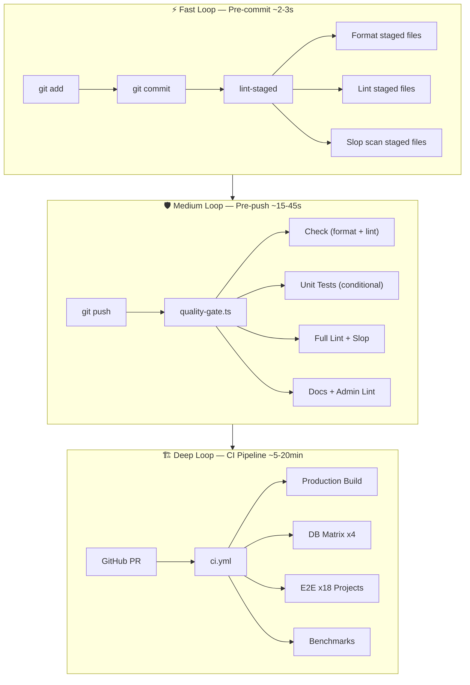
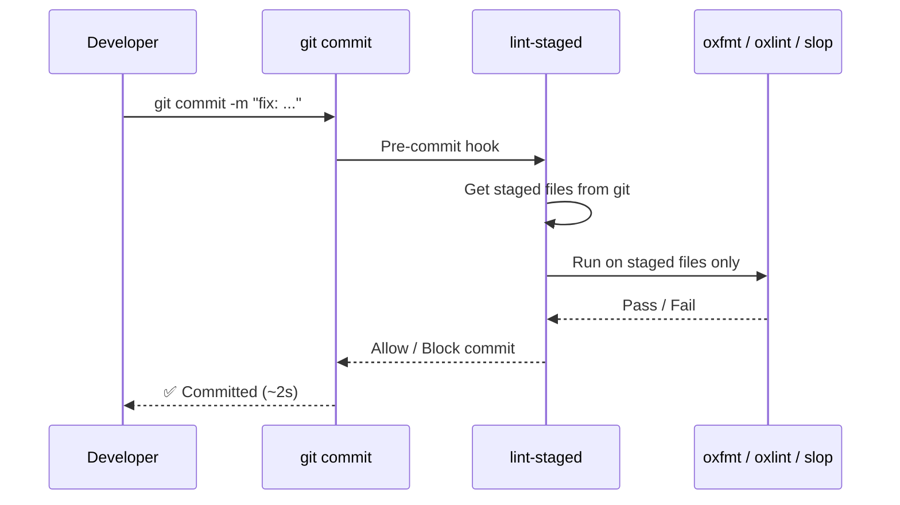
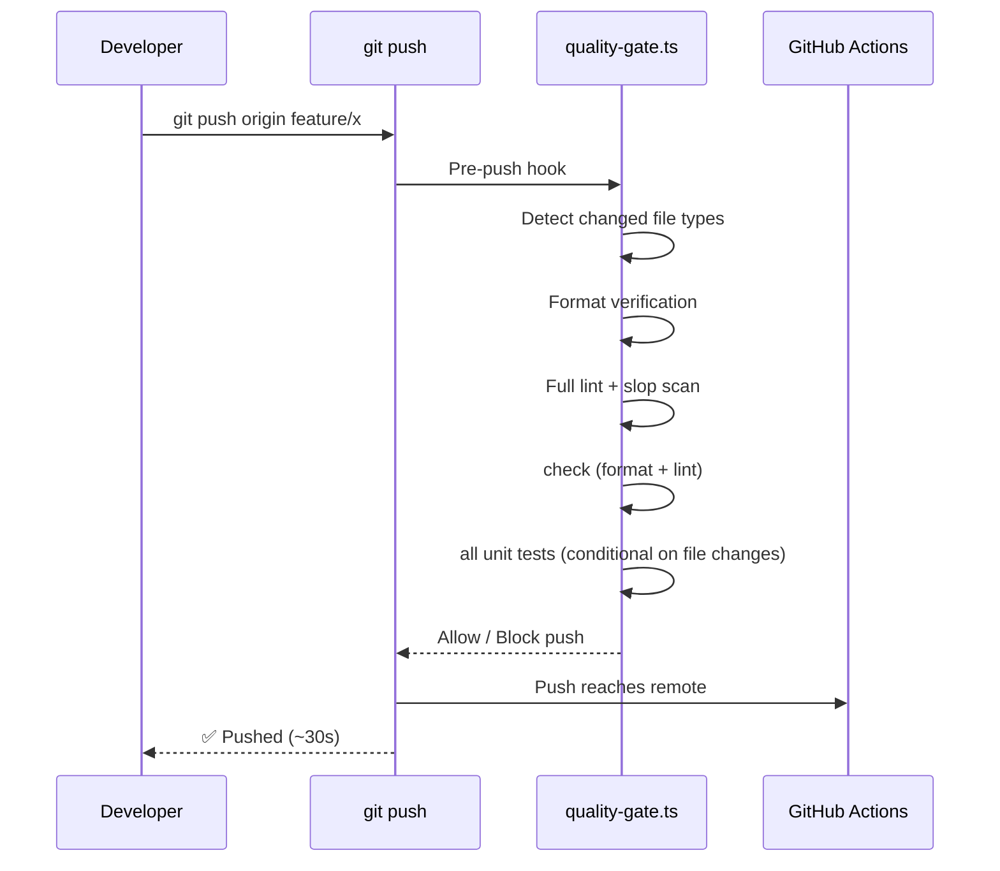
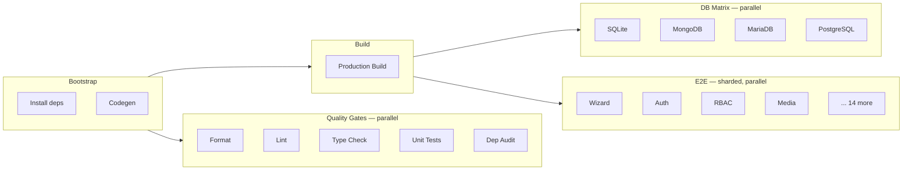
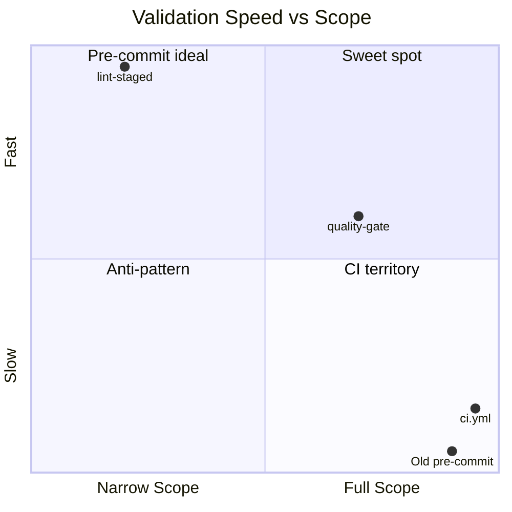

# Validation Pipeline

SveltyCMS uses a **three-tier validation architecture** that balances developer velocity with code safety. Every tier catches a different class of defect at the right stage of the development lifecycle.

## Architecture Overview



## The Three Loops

| Loop       | Trigger      | What Runs                                    | Time     | Skip                     |
| :--------- | :----------- | :------------------------------------------- | :------- | :----------------------- |
| **Fast**   | `git commit` | Format, lint, slop scan — staged files only  | ~2-3s    | Blocked by `git-safe.ts` |
| **Medium** | `git push`   | Type check, unit tests, build — full project | ~1-3min  | Blocked by `git-safe.ts` |
| **Deep**   | GitHub PR    | Build, DB matrix, E2E sharding, benchmarks   | ~5-20min | N/A                      |

## Fast Loop — Pre-commit

When you `git commit`, the pre-commit hook runs `lint-staged` which checks **only your staged files**:



**What runs on staged source files** (`src/**/*.{ts,js,svelte}`):

- `oxfmt` — Format with oxfmt
- `oxlint --deny correctness --deny perf` — Critical lint rules only
- `slop-scanner.ts --strict --files` — Svelte 5 quality, RTL, accessibility, security

**What runs on staged docs** (`docs/**/*.{md,mdx}`):

- `lint-docs.ts` — Documentation compliance, EU advertising law, broken links

**Why staged files only?** Editing one variable name shouldn't trigger a scan of 500+ unrelated files.

## Medium Loop — Pre-push

When you `git push`, the pre-push hook runs `quality-gate.ts` across the **full codebase**:



**What runs:**

- Format verification — ensures tree is clean
- Slop Scanner — full `src/` scan
- Lint — full project lint
- Admin Theme Lint — if admin routes changed
- Docs Lint — if documentation changed
- Production build — `bun run build` with all adapters

**What does NOT run locally** (CI-only):

- ❌ DB integration tests (opt in with `--include-db-tasks`)
- ❌ Benchmarks (opt in with `--include-db-tasks`)
- ❌ E2E tests (Playwright browser automation)

## Deep Loop — CI Pipeline

The GitHub Actions workflow provides **deterministic verification** on Ubuntu Linux runners:



## Manual Commands

| `bun run verify:push` | Run pre-push gate manually with progress dashboard |
| `bun run gate:fast` | Run pre-commit checks manually |
| `bun run scripts/precheck.ts --plan` | Dry-run — see what WOULD run |
| `bun run verify:full` | Run full CI parity (DB matrix + benchmarks) |
| `bun run ci:local` | Simulate the full CI pipeline locally (+ E2E) |
| `bun run test:smart` | Run only tests affected by your git diff |
| `bun run slop` | Run full slop scanner |
| `bun run test:unit` | Run all unit tests |

## Hardened Bypass Prevention

`scripts/git-safe.ts` blocks `--no-verify` on both `commit` and `push`. Bypassing requires invoking the system `git` binary directly — a deliberate act, not muscle memory.

```bash
bun run git commit -m "msg"    # runs pre-commit gate
bun run git push               # runs pre-push gate
```

> [!WARNING]
> `--no-verify` is blocked by project policy. Use `bun run git commit` / `bun run git push`.
> CI will still catch all issues on PR. Never merge a PR that fails CI.

## Why This Architecture?

This follows the same pattern used by **SvelteKit**, **Vite**, **Prisma**, and **Next.js**:



- **SvelteKit** uses `lint-staged` on pre-commit; browser automation tests run only in CI
- **Prisma** does not force developers to spin up Docker containers locally; the DB matrix is CI-only
- **Vite** runs formatting/linting on pre-commit; the massive integration test suite runs concurrently in CI

The key insight: **local machines vary wildly** (Windows/macOS/Linux, different specs), but **CI provides deterministic environments** where parallelized cloud runners handle long-running processes.
