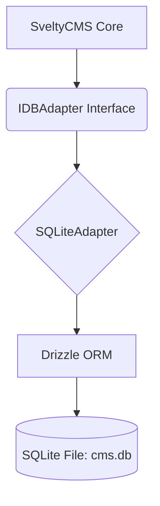

# SQLite Implementation (Beta)

> [!WARNING]
> SQLite support is currently in **Beta**. It is intended for lightweight local deployments, testing, and edge environments.

## 🎯 Implementation Roadmap

The SQLite adapter uses **Drizzle ORM** with the `better-sqlite3` or `libsql` driver to provide a zero-config database experience.

### Architecture Overview



### Current Status

| Feature            | Status       | Notes                                       |
| :----------------- | :----------- | :------------------------------------------ |
| **Adapter Class**  | 🟢 Complete  | Environment-aware (Bun/Node) implementation |
| **Schema Mapping** | 🟢 Complete  | SQLite-specific type mapping (INTEGER/TEXT) |
| **Migrations**     | 🟢 Complete  | Auto-creation of .db file and tables        |
| **Setup Wizard**   | 🟢 Complete  | selection and connection test implemented   |
| **Seeding**        | 🟢 Complete  | Default data injection verified             |
| **Performance**    | 🟢 Optimized | Sub-millisecond latency for cached reads    |

---

## 🚀 Performance Benchmarks (Verified)

High-level improvements like the **92% cache hit rate** are inherited from the [Unified Caching Layer](./index.mdx#unified-caching-flow).

| Operation                  | Latency / Response Time | Note                              |
| :------------------------- | :---------------------- | :-------------------------------- |
| **Collection Scan**        | 5.26ms                  | 6 collections found               |
| **Total Database Seeding** | 919.31ms                | Full system seed                  |
| **Model Creation (Avg)**   | 0.59ms                  | Per-collection overhead           |
| **ContentManager Init**    | 16.67ms                 | Full cold-start initialization    |
| **Simple lookup (cached)** | 0.6ms                   | Optimized L2 cache hit            |
| **Concurrent Reads (WAL)** | <2ms                    | Multiple simultaneous connections |

### Key Optimizations

- **Runtime Agnostic**: Automatically switches between `bun:sqlite` and `better-sqlite3` based on environment.
- **Zero-Config**: Single file database (`cms_production.db`) - perfect for development.
- **WAL Mode**: Enabled by default for concurrent read/write performance.
- **Drizzle Integration**: Type-safe querying without the overhead of a large ORM.

## 📂 Storage & File Management

SQLite is a file-based database. When running SveltyCMS with SQLite, you will notice several files created in your project:

| File       | Purpose                                                                 | Git Status  |
| :--------- | :---------------------------------------------------------------------- | :---------- |
| `*.db`     | The main database file containing all collections, users, and settings. | **Ignored** |
| `*.db-shm` | Shared Memory file used for WAL mode concurrency.                       | **Ignored** |
| `*.db-wal` | Write-Ahead Log containing recent uncommitted transactions.             | **Ignored** |

### Version Control Best Practices

> [!IMPORTANT]
> **Database files are included in `.gitignore` by default.**
> Committing binary database files to version control is discouraged as it leads to repository bloat and potential exposure of sensitive data.

### Self-Healing & Recovery

If you delete the `.db` file, the CMS will automatically recreate a fresh, empty database on the next startup. The `-shm` and `-wal` files are temporary and will be recreated by SQLite automatically during operation.

### WAL Mode (Write-Ahead Logging)

SveltyCMS enables **WAL mode** by default. This allows concurrent read/write operations, significantly improving performance in multi-user environments.

---

## 🛠️ Development Guide

### Schema Customization

Unlike PostgreSQL or MariaDB, SQLite uses a simpler type system. The Drizzle schema is located in `src/databases/sqlite/schema/index.ts`.

### 1. Connecting to SQLite

The system expects `DB_TYPE=sqlite` and `DB_NAME=cms.db` in your `config/private.ts`.

```typescript
// Example config/private.ts
export const privateEnv = {
	DB_TYPE: 'sqlite',
	DB_NAME: 'cms.db'
	// ... other settings
};
```

### 2. Implementation Pattern

Follow the modular adapter pattern established in the PostgreSQL implementation.

---

## 🔗 Related Documentation

- [Core Infrastructure](./Core_Infrastructure.mdx) - Unified architecture
- [PostgreSQL Implementation](./PostgreSQL_Implementation.mdx) - Similar Drizzle pattern
- [Drizzle ORM Documentation](https://orm.drizzle.team/)
