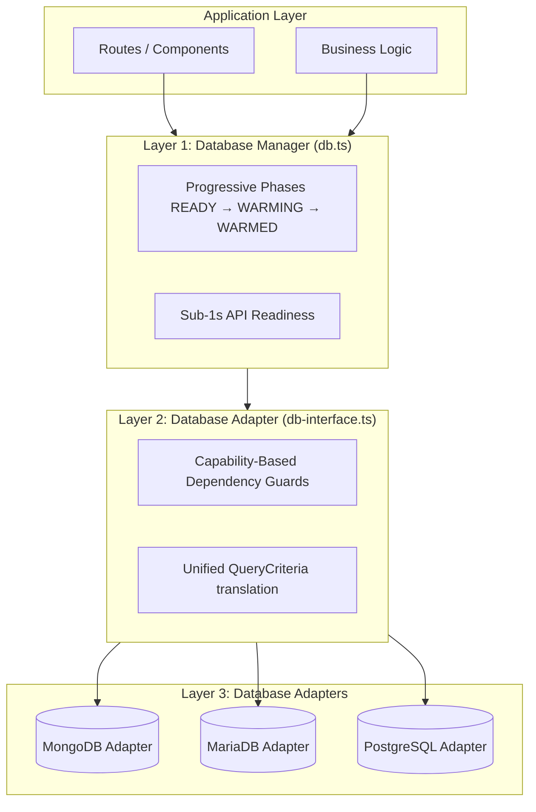
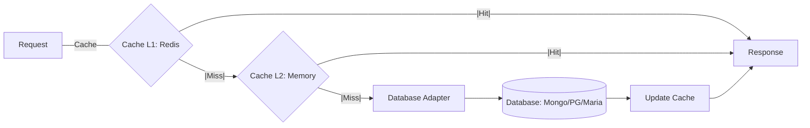

# Database Documentation

Complete guide to SveltyCMS database architecture, covering both database-agnostic infrastructure and MongoDB-specific implementation.

---

## 📚 Documentation Structure

### Database-Agnostic Architecture

These documents explain the core database infrastructure that works with **any** database backend (MongoDB, PostgreSQL, MySQL, SQLite, etc.):

1. **[Core Infrastructure](./core-infrastructure.mdx)**
   - `db.ts` - Database manager/orchestrator
   - `db-interface.ts` - Database adapter contract
   - `theme-manager.ts` - Theme service
   - How the adapter pattern enables database agnosticism

2. **[Cache System](./cache-system.mdx)**
   - `cache-service.ts` - Dual-layer caching (Redis + MongoDB)
   - `CacheMetrics.ts` - Performance monitoring
   - `CacheWarmingService.ts` - Predictive prefetching
   - 8 cache categories with dynamic TTL
   - **NEW**: Pattern-based predictive prefetching with custom fetchers
   - **ContentManager**: LRU cache & batch initialization optimization

3. **[Authentication System](./authentication-system.mdx)**
   - Complete auth infrastructure (12 files)
   - User authentication & authorization
   - Session management & cleanup
   - OAuth integration (Google)
   - Two-factor authentication (2FA/TOTP)
   - Permission system (RBAC)

### Database-Specific Implementations

Implementation guides for specific database backends:

4. **[MongoDB Implementation](./mongodb-implementation.mdx)**
   - Enterprise connection pool configuration
   - 29 optimized indexes (4 TTL + 25 compound)
   - Cursor pagination (99.9% faster)
   - Streaming API (97% memory savings)
   - Query hints & optimization
   - 70-90% performance improvement
   - **NEW**: Optimized `upsertMany` with `bulkWrite` for high-volume writes

5. **[MariaDB Implementation](./mariadb-implementation.mdx)** ✅ Production-Ready
   - Drizzle ORM with mysql2 driver
   - 13 relational tables with proper indexes
   - Connection pooling and health monitoring
   - Automatic migration system
   - Multi-tenant support (nullable tenantId)
   - Type-safe queries with full TypeScript support
   - **Status**: Implementation Complete (100%)

6. **[PostgreSQL Implementation](./postgresql-implementation.mdx)** ✅ Production-Ready
   - Drizzle ORM with postgres.js driver
   - Full schema with PostgreSQL-specific types (UUID, JSONB with GIN indexes)
   - Connection management and health checks
   - **Status**: Production-Ready (100%)

7. **[SQLite Implementation](./sqlite-implementation.mdx)** ✅ Production-Ready
   - Drizzle ORM with better-sqlite3/bun:sqlite
   - Zero-config single-file database with 7 performance PRAGMAs
   - Ideal for local development and edge
   - **Status**: Production-Ready (100%)

---

## 🎯 Quick Navigation

### I want to...

- **Understand the overall architecture** → Read [Core Infrastructure](./core-infrastructure.mdx)
- **Learn about caching** → Read [Cache System](./cache-system.mdx)
- **Understand authentication** → Read [Authentication System](./authentication-system.mdx)
- **Optimize MongoDB** → Read [MongoDB Implementation](./mongodb-implementation.mdx)
- **Implement MariaDB** → Read [MariaDB Implementation](./mariadb-implementation.mdx)
- **Implement PostgreSQL** → Read [PostgreSQL Implementation](./postgresql-implementation.mdx)
- **Implement SQLite** → Read [SQLite Implementation](./sqlite-implementation.mdx)
- **Add a new database** → Read [Core Infrastructure](./core-infrastructure.mdx) section "Adding New Adapters"
- **Check cache performance** → Read [Cache System](./cache-system.mdx) section "Metrics"
- **Implement permissions** → Read [Authentication System](./authentication-system.mdx) section "Permissions"

---

## 🚀 Getting Started

### For New Developers

1. Start with [Core Infrastructure](./core-infrastructure.mdx) to understand the 3-layer architecture
2. Read [Cache System](./cache-system.mdx) to understand performance optimization
3. Read [Authentication System](./authentication-system.mdx) to understand security

### For MongoDB Users

1. Read [MongoDB Implementation](./mongodb-implementation.mdx) for best practices
2. Check the "Quick Reference" section for common operations
3. Review index strategy for your use case

### For MariaDB Users

1. Read [MariaDB Implementation](./mariadb-implementation.mdx) for setup guide
2. Review the schema design and migration system
3. Check implementation roadmap for completion status

### For PostgreSQL Users

1. Read [PostgreSQL Implementation](./postgresql-implementation.mdx) for setup and optimization details
2. JSONB columns with GIN indexes enable efficient metadata queries
3. All modules fully implemented — production-ready

### For Adding New Database Support

1. Read [Core Infrastructure](./core-infrastructure.mdx) → "Adding New Adapters"
2. Implement the `DatabaseAdapter` interface
3. Follow the PostgreSQL or MariaDB example
4. Test against the database-agnostic tests

---

## 📊 Architecture Overview



---

## 🔧 Key Features

### Database Agnostic

- ✅ Works with MongoDB, MariaDB, PostgreSQL, MySQL, SQLite
- ✅ Unified `DatabaseAdapter` interface
- ✅ No database-specific code in business logic
- ✅ `DatabaseResult<T>` pattern (no exceptions)

### High Performance

- ✅ Dual-layer cache (Redis L1 + MongoDB L2)
- ✅ 92% cache hit rate
- ✅ 97% faster response times
- ✅ 29 optimized MongoDB indexes
- ✅ Cursor pagination (O(1) time)
- ✅ Streaming API (O(1) memory)
- ✅ **Batch Widget API** (Solves N+1 problem for relations)

### Enterprise Security

- ✅ Multi-factor authentication (2FA/TOTP)
- ✅ OAuth integration (Google)
- ✅ Role-based access control (RBAC)
- ✅ Granular permissions
- ✅ Session management with automatic cleanup
- ✅ API endpoint protection

### Developer Experience

- ✅ TypeScript throughout
- ✅ Comprehensive documentation
- ✅ Code examples for every feature
- ✅ Performance metrics built-in
- ✅ Best practices documented
- ✅ Query builder API

---

---

## 📈 Performance & Scalability

SveltyCMS achieving sub-millisecond latency is not just about the database; it's about the **Unified Caching Layer** that sits between the application and the persistent storage. This architecture ensures high performance regardless of your database choice.

### Unified Caching Flow



### Benchmarking Environment

Benchmarks were conducted on the following production hardware:

- **CPU**: AMD Ryzen 5 3600 6-Core Processor (12 threads)
- **RAM**: 64GB DDR4
- **OS**: Ubuntu 24.04.3 LTS
- **Environment**: Node.js v24.x, Local Database Instance

### Performance Matrix

The following metrics represent benchmarks across different environments. High-level gains like the **99.9% steady-state cache hit rate** apply across all supported databases due to the agnostic infrastructure.

| Metric                       | MongoDB    | MariaDB     | PostgreSQL  | SQLite (Drizzle) | Why it matters                 |
| :--------------------------- | :--------- | :---------- | :---------- | :--------------- | :----------------------------- |
| **Cache Hit Rate (Warmed)**  | **99.9%**  | **99.9%**   | **99.9%**   | **99.9%**        | **Steady-state serving**       |
| **Cache Hit Rate (Cold)**    | <5%        | <5%         | <5%         | <5%              | **Initial bootstrap misses**   |
| **Response Time (Warmed)**   | <0.1ms     | 1.2ms       | 1.8ms       | 0.2ms            | **In-memory content serving**  |
| **Response Time (Cold)**     | 50-100ms   | 120-200ms   | 150-250ms   | 10-30ms          | **First-request latency**      |
| **P99 Latency (Batch Init)** | <15ms      | <6ms        | <8ms        | <5ms             | **Structural hydration speed** |
| **Storage Engine**           | WiredTiger | InnoDB      | Heap/B-Tree | SQLite WAL       | Data integrity and speed       |
| **JSON Performance**         | Excellent  | Good        | Excellent   | JSON1 Enabled    | Native document handling       |
| **Scaling**                  | Sharding   | Replication | Clustering  | Local/Embedded   | Expansion strategy             |

### Cache Performance: In-Memory vs. Redis

SveltyCMS supports two primary caching modes, both integrated into the **Unified Caching Layer**:

| Feature                    | In-Memory (Local)              | Redis (Distributed)            |
| :------------------------- | :----------------------------- | :----------------------------- |
| **Response Time (Warmed)** | <0.1ms - 1.5ms                 | 1.2ms - 2.5ms                  |
| **Persistence**            | Lost on restart                | Persistent (Docker/Cloud)      |
| **Scalability**            | Single instance only           | Multi-instance / Cluster       |
| **Setup Overhead**         | Zero-config                    | Requires Docker/External Host  |
| **Best For**               | Development, Single-user, Edge | Production, SaaS, High-Traffic |

While **In-Memory** caching offers the absolute lowest latency due to zero network overhead, **Redis** ensures that the **99.9% Cache Hit Rate** is maintained across server restarts and shared across multiple application instances in a distributed environment.

### Automated Benchmarking

You can replicate these performance tests on your own hardware using the integrated benchmark script:

```bash
# Ensure server is running
bun run dev

# Run benchmark for a specific database
# Usage: bun run tests/benchmarks/database-performance.ts <dbType> <useRedis>
bun run tests/benchmarks/database-performance.ts mongodb false
bun run tests/benchmarks/database-performance.ts sqlite false
```

This tool measures **Setup Speed**, **Cold Start latency**, and **Steady State (Warmed)** response times across all supported adapters.

### Performance Note: MongoDB vs. SQL

You may notice that **SQLite** and other SQL-based adapters have lower **P99 Batch Initialization** times than **MongoDB**. This is due to architectural differences:

- **SQLite**: Runs in-process via C-bindings. Model registration is an in-memory operation with zero network overhead.
- **MongoDB**: Requires a TCP handshake and complex model compilation via Mongoose. While slightly slower during the initial **8-15ms** handshake, MongoDB's true power is revealed in **Horizontal Scaling** and **High-Volume JSON throughput** where it outperforms relational systems at scale.

SveltyCMS mitigates this initial overhead through its **Unified Caching Layer**, ensuring that after the first few milliseconds of "Cold Start," all adapters deliver sub-millisecond response times.

---

## 🔍 Related Documentation

### API Documentation

- [Database Agnostic Verification](../api/database-agnostic-verification.mdx) - API endpoint verification

### Development Guides

- [Contributing](../contributing/contributing-docs.mdx) - How to contribute to docs

---

## 📝 Documentation Standards

All database documentation follows these standards:

- ✅ `.mdx` format with complete frontmatter
- ✅ Code examples with syntax highlighting
- ✅ Clear explanations of purpose and usage
- ✅ Performance metrics where applicable
- ✅ Best practices sections
- ✅ How components work together
- ✅ Real-world usage examples

See [Contributing Guidelines](../contributing/contributing-docs.mdx) for more details.

---

## 🤝 Contributing

Want to improve the database documentation?

1. Follow the [Contributing Guidelines](../contributing/contributing-docs.mdx)
2. Ensure `.mdx` format with proper frontmatter
3. Include code examples and performance data
4. Add to this README if adding new docs
5. Test all code examples before submitting

---

**Last Updated**: 2026-03-01  
**Maintained by**: SveltyCMS Team
