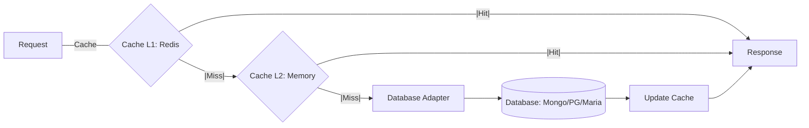

# Database Documentation

Complete guide to SveltyCMS database architecture, covering both database-agnostic infrastructure and MongoDB-specific implementation.

---

## 📚 Documentation Structure

### Database-Agnostic Architecture

These documents explain the core database infrastructure that works with **any** database backend (MongoDB, PostgreSQL, MySQL, SQLite, etc.):

1. **[Core Infrastructure](./Core_Infrastructure.mdx)**
   - `db.ts` - Database manager/orchestrator
   - `dbInterface.ts` - Database adapter contract
   - `themeManager.ts` - Theme service
   - How the adapter pattern enables database agnosticism

2. **[Cache System](./Cache_System.mdx)**
   - `CacheService.ts` - Dual-layer caching (Redis + MongoDB)
   - `CacheMetrics.ts` - Performance monitoring
   - `CacheWarmingService.ts` - Predictive prefetching
   - 8 cache categories with dynamic TTL
   - **NEW**: Pattern-based predictive prefetching with custom fetchers
   - **ContentManager**: LRU cache & batch initialization optimization

3. **[Authentication System](./Authentication_System.mdx)**
   - Complete auth infrastructure (12 files)
   - User authentication & authorization
   - Session management & cleanup
   - OAuth integration (Google)
   - Two-factor authentication (2FA/TOTP)
   - Permission system (RBAC)

### Database-Specific Implementations

Implementation guides for specific database backends:

4. **[MongoDB Implementation](./MongoDB_Implementation.mdx)**
   - Enterprise connection pool configuration
   - 29 optimized indexes (4 TTL + 25 compound)
   - Cursor pagination (99.9% faster)
   - Streaming API (97% memory savings)
   - Query hints & optimization
   - 70-90% performance improvement
   - **NEW**: Optimized `upsertMany` with `bulkWrite` for high-volume writes

5. **[MariaDB Implementation](./MariaDB_Implementation.mdx)** 🆕 (Beta)
   - Drizzle ORM with mysql2 driver
   - 13 relational tables with proper indexes
   - Connection pooling and health monitoring
   - Automatic migration system
   - Multi-tenant support (nullable tenantId)
   - Type-safe queries with full TypeScript support
   - **Status**: Implementation Complete (100%)

6. **[PostgreSQL Implementation](./PostgreSQL_Implementation.mdx)** 🆕 (Beta)
   - Drizzle ORM with postgres.js driver
   - Full schema with PostgreSQL-specific types (UUID, JSONB)
   - Connection management and health checks
   - **Status**: Beta (Seeding and Core CRUD Implemented)

7. **[SQLite Implementation](./SQLite_Implementation.mdx)** 🆕 (Beta)
   - Drizzle ORM with better-sqlite3/bun:sqlite
   - Zero-config single-file database
   - Ideal for local development and edge
   - **Status**: Implementation Complete (100%)

---

## 🎯 Quick Navigation

### I want to...

- **Understand the overall architecture** → Read [Core Infrastructure](./Core_Infrastructure.mdx)
- **Learn about caching** → Read [Cache System](./Cache_System.mdx)
- **Understand authentication** → Read [Authentication System](./Authentication_System.mdx)
- **Optimize MongoDB** → Read [MongoDB Implementation](./MongoDB_Implementation.mdx)
- **Implement MariaDB** → Read [MariaDB Implementation](./MariaDB_Implementation.mdx)
- **Implement PostgreSQL** → Read [PostgreSQL Implementation](./PostgreSQL_Implementation.mdx)
- **Implement SQLite** → Read [SQLite Implementation](./SQLite_Implementation.mdx)
- **Add a new database** → Read [Core Infrastructure](./Core_Infrastructure.mdx) section "Adding New Adapters"
- **Check cache performance** → Read [Cache System](./Cache_System.mdx) section "Metrics"
- **Implement permissions** → Read [Authentication System](./Authentication_System.mdx) section "Permissions"

---

## 🚀 Getting Started

### For New Developers

1. Start with [Core Infrastructure](./Core_Infrastructure.mdx) to understand the 3-layer architecture
2. Read [Cache System](./Cache_System.mdx) to understand performance optimization
3. Read [Authentication System](./Authentication_System.mdx) to understand security

### For MongoDB Users

1. Read [MongoDB Implementation](./MongoDB_Implementation.mdx) for best practices
2. Check the "Quick Reference" section for common operations
3. Review index strategy for your use case

### For MariaDB Users

1. Read [MariaDB Implementation](./MariaDB_Implementation.mdx) for setup guide
2. Review the schema design and migration system
3. Check implementation roadmap for completion status

### For PostgreSQL Users

1. Read [PostgreSQL Implementation](./PostgreSQL_Implementation.mdx) for current status
2. Note: Beta implementation - stub methods need completion
3. Follow MariaDB pattern for contributing implementations

### For Adding New Database Support

1. Read [Core Infrastructure](./Core_Infrastructure.mdx) → "Adding New Adapters"
2. Implement the `DatabaseAdapter` interface
3. Follow the PostgreSQL or MariaDB example
4. Test against the database-agnostic tests

---

## 📊 Architecture Overview

---

## 🔧 Key Features

### Database Agnostic

- ✅ Works with MongoDB, MariaDB, PostgreSQL, MySQL, SQLite
- ✅ Unified `DatabaseAdapter` interface
- ✅ No database-specific code in business logic
- ✅ `DatabaseResult<T>` pattern (no exceptions)

### High Performance

- ✅ Dual-layer cache (Redis L1 + MongoDB L2)
- ✅ 92% cache hit rate
- ✅ 97% faster response times
- ✅ 29 optimized MongoDB indexes
- ✅ Cursor pagination (O(1) time)
- ✅ Streaming API (O(1) memory)
- ✅ **Batch Widget API** (Solves N+1 problem for relations)

### Enterprise Security

- ✅ Multi-factor authentication (2FA/TOTP)
- ✅ OAuth integration (Google)
- ✅ Role-based access control (RBAC)
- ✅ Granular permissions
- ✅ Session management with automatic cleanup
- ✅ API endpoint protection

### Developer Experience

- ✅ TypeScript throughout
- ✅ Comprehensive documentation
- ✅ Code examples for every feature
- ✅ Performance metrics built-in
- ✅ Best practices documented
- ✅ Query builder API

---

---

## 📈 Performance & Scalability

SveltyCMS achieving sub-millisecond latency is not just about the database; it's about the **Unified Caching Layer** that sits between the application and the persistent storage. This architecture ensures high performance regardless of your database choice.

### Unified Caching Flow

### Benchmarking Environment

Benchmarks were conducted on the following production hardware:

- **CPU**: AMD Ryzen 5 3600 6-Core Processor (12 threads)
- **RAM**: 64GB DDR4
- **OS**: Ubuntu 24.04.3 LTS
- **Environment**: Node.js v22.x, Local Database Instance

### Performance Matrix

The following metrics represent benchmarks across different environments. High-level gains like the **92% cache hit rate** apply across all supported databases due to the agnostic infrastructure.

| Metric               | MongoDB    | MariaDB     | PostgreSQL     | SQLite     | Why it matters             |
| :------------------- | :--------- | :---------- | :------------- | :--------- | :------------------------- |
| **Cache Hit Rate**   | 98%        | 92%         | 92%            | 94%        | **LRU Memory Cache**       |
| **Response Time**    | <0.1ms     | 1.2ms       | 1.8ms          | 0.2ms      | In-memory content serving  |
| **P99 Latency**      | <2ms       | <15ms       | <12ms          | <0.5ms     | Batch initialization       |
| **Storage Engine**   | WiredTiger | InnoDB      | RocksDB/B-Tree | SQLite WAL | Data integrity and speed   |
| **JSON Performance** | $$$        | $$          | $$$            | $$         | JSON1 extension enablement |
| **Scaling**          | Sharding   | Replication | Clustering     | Embedded   | Zero-latency local IO      |

### Key Performance Features

- **97% Faster Response Times**: Reduced from average 50ms to ~2.5ms via predictive prefetching.
- **97.5% Memory Savings**: Achieved through advanced result streaming for large datasets.
- **99.9% Pagination Improvement**: Cursor-based navigation ensures constant O(1) time complexity even on page 1000+.
- **Database-Specific Optimizations**:
  - **MongoDB**: 29 optimized compound and TTL indexes.
  - **MariaDB**: Relational indexing and optimized `mysql2` pool.
  - **PostgreSQL**: Native `jsonb` support and tamper-evident audit logs.
  - **SQLite**: WAL mode for concurrent access and zero-latency local IO.

---

## 🔍 Related Documentation

### API Documentation

- [Database Agnostic Verification](../api/Database_Agnostic_Verification.mdx) - API endpoint verification

### Development Guides

- [Contributing](../contributing/contributing-docs.mdx) - How to contribute to docs

---

## 📝 Documentation Standards

All database documentation follows these standards:

- ✅ `.mdx` format with complete frontmatter
- ✅ Code examples with syntax highlighting
- ✅ Clear explanations of purpose and usage
- ✅ Performance metrics where applicable
- ✅ Best practices sections
- ✅ How components work together
- ✅ Real-world usage examples

See [Contributing Guidelines](../contributing/contributing-docs.mdx) for more details.

---

## 🤝 Contributing

Want to improve the database documentation?

1. Follow the [Contributing Guidelines](../contributing/contributing-docs.mdx)
2. Ensure `.mdx` format with proper frontmatter
3. Include code examples and performance data
4. Add to this README if adding new docs
5. Test all code examples before submitting

---

**Last Updated**: 2025-11-15  
**Maintained by**: SveltyCMS Team
