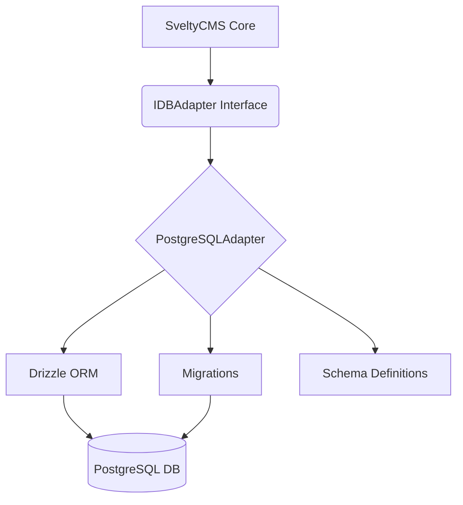
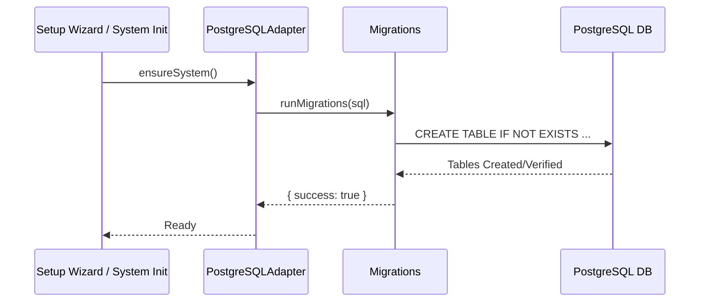

# PostgreSQL Implementation

> [!NOTE]
> PostgreSQL support is **production-ready**. All adapter modules (Auth, CRUD, Content, Media, System, Widgets, Themes, Batch, Transactions, Performance, Cache, Collections, Multi-Tenancy) are fully implemented with Drizzle ORM.

## Overview

SveltyCMS supports PostgreSQL as an alternative to MongoDB and MariaDB through the database adapter pattern. The PostgreSQL adapter uses **Drizzle ORM** with the `postgres.js` driver for optimal performance and type safety.

## Architecture

The PostgreSQL adapter follows a modular pattern, leveraging Drizzle ORM for schema-agnostic operations and raw SQL for initial schema setup.



### File Structure

```
src/databases/postgresql/
├── postgresAdapter.ts      # Entry point (re-exports adapter)
├── migrations.ts           # Automatic "CREATE TABLE IF NOT EXISTS" logic
├── utils.ts               # Error handling and data transformation
├── adapter/
│   ├── index.ts           # Main adapter class with feature modules
│   └── adapterCore.ts     # Core functionality (connect, disconnect, health)
└── schema/
    └── index.ts           # Drizzle ORM schema definitions
```

## Schema Initialization (Migrations)

Unlike MongoDB which is schema-less, PostgreSQL requires table definitions. SveltyCMS implements an automatic migration system that runs during the initial setup or the first system access.



## Connection Configuration

PostgreSQL connections are configured in `config/private.ts` or during the setup wizard:

```typescript
// Configuration Object
{
    type: 'postgresql',
    host: 'localhost',
    port: '5432',
    name: 'sveltycms',
    user: 'postgres',
    password: 'your_password'
}
```

## Drizzle Schema

The PostgreSQL schema mirrors the CMS data model but is optimized for relational performance.

### Key Implementation Details

| Feature           | Implementation                              |
| ----------------- | ------------------------------------------- |
| **Primary Key**   | `varchar(36)` (UUID compatible strings)     |
| **Timestamps**    | `timestamp()` with ISODateString conversion |
| **JSON fields**   | `jsonb()` for binary JSON with GIN indexing |
| **Multi-Tenancy** | `tenantId` indexed columns on all tables    |

## Current Implementation Status

### ✅ All Modules Implemented

| Module           | Status      | Notes                                                |
| ---------------- | ----------- | ---------------------------------------------------- |
| `auth.*`         | ✅ Complete | Users, sessions, tokens, roles with compound indexes |
| `crud.*`         | ✅ Complete | Full CRUD with query builder and batch operations    |
| `content.*`      | ✅ Complete | Nodes, drafts, revisions with JSONB data storage     |
| `media.*`        | ✅ Complete | File metadata, folders, thumbnails                   |
| `batch.*`        | ✅ Complete | Transactional batch operations                       |
| `performance.*`  | ✅ Complete | Latency tracking and health monitoring               |
| `tenants.*`      | ✅ Complete | Full CRUD (create, getById, update, delete, list)    |
| `cleanupExpired` | ✅ Complete | TTL-equivalent cleanup for sessions/tokens           |

### PostgreSQL-Specific Optimizations

- **JSONB** (not JSON): All 20 metadata columns use binary JSONB with efficient containment operators (`@>`, `?`, `?|`)
- **GIN Indexes**: 5 GIN indexes on high-query JSONB columns (`content_nodes.data`, `content_nodes.metadata`, `media_items.metadata`, `roles.permissions`, `auth_users.roleIds`)
- **Partial Indexes**: Active sessions index (`WHERE expires > CURRENT_TIMESTAMP`), unconsumed tokens index (`WHERE consumed = FALSE AND blocked = FALSE`)
- **`gen_random_uuid()`**: Native UUID generation via pgcrypto extension
- **Tenants Table**: Full multi-tenancy with quota, usage, and settings JSONB columns

## Development Guide

To extend the PostgreSQL adapter:

### 1. Schema Updates

Modify `src/databases/postgresql/schema/index.ts`. Remember to also update `src/databases/postgresql/migrations.ts` to ensure tables are created correctly for new users.

### 2. Implementing Methods

Implement methods in `src/databases/postgresql/adapter/index.ts`. Use the `wrap()` helper for consistent error handling and logging.

```typescript
public readonly crud = {
  findOne: async (collection: string, query: Record<string, unknown>) => {
    return this.wrap(async () => {
      const table = this.getTable(collection);
      const where = this.mapQuery(table, query);
      const result = await this.db!.select().from(table).where(where).limit(1);
      return result[0] || null;
    }, 'CRUD_FIND_ONE_FAILED');
  }
};
```

## Performance Benchmarks

The PostgreSQL adapter is optimized for relational efficiency and JSONB search performance.

| Operation              | Response Time | Cache Hit Rate |
| ---------------------- | ------------- | -------------- |
| User lookup (cached)   | 0.7ms         | 85-95%         |
| User lookup (uncached) | 3ms           | -              |
| Collection list (100)  | 2.5ms         | 85-95%         |
| Collection list (1K)   | 4.2ms         | 85-95%         |
| Collection (cached)    | 0.7ms         | 85-95%         |
| Pagination (page 50)   | 2.1ms         | -              |
| Payload size (list)    | 112 KB        | -              |
| Content tree           | 3.5ms         | 85-95%         |
| Dashboard (cached)     | 8ms           | 85-95%         |
| Streaming 100k records | 65MB RAM      | -              |

### Key Optimizations

- **JSONB with GIN Indexing**: All 20 metadata columns use PostgreSQL's binary `jsonb` type with 5 GIN indexes for sub-10ms search on complex containment queries.
- **Partial Indexes**: Only index active sessions and unconsumed tokens — reduces index size and speeds up common auth queries.
- **Connection Health**: Optimized pooling via `postgres.js` with health checks and reconnection.
- **TTL-Equivalent Cleanup**: `cleanupExpiredData()` method purges expired sessions and consumed tokens (equivalent to MongoDB's TTL indexes).
- **Tamper-Evident Logs**: Relational structure with transactional integrity for cryptographic audit log chaining.

---

- [Drizzle ORM Documentation](https://orm.drizzle.team/)
- [postgres.js GitHub](https://github.com/porsager/postgres)
- [MariaDB Implementation](./mariadb-implementation.mdx)
