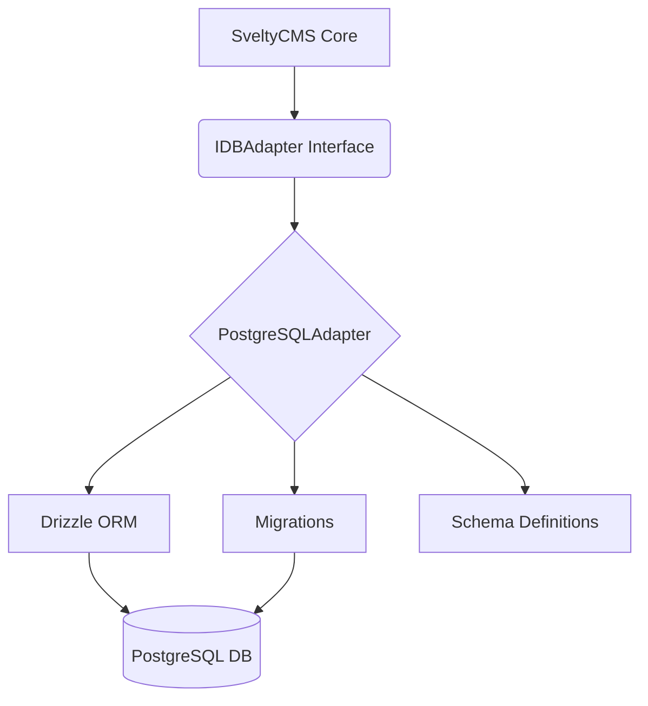
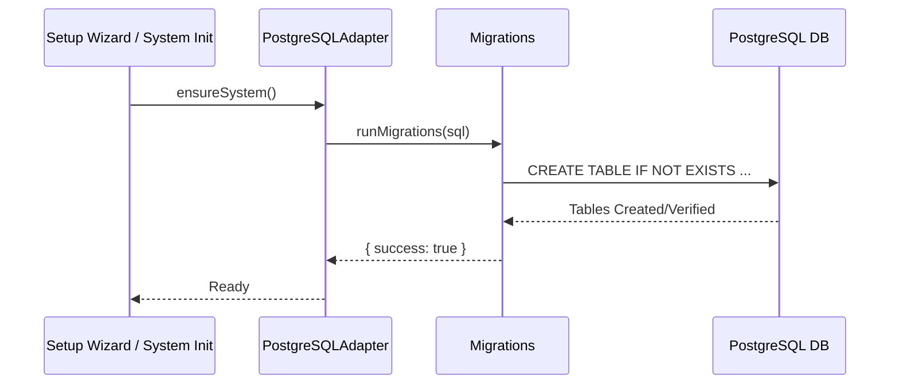

# PostgreSQL Implementation (Beta)

> [!WARNING]
> PostgreSQL support is currently in **beta**. While initial seeding and core CRUD operations are implemented, some advanced features may still be in development.

## Overview

SveltyCMS supports PostgreSQL as an alternative to MongoDB and MariaDB through the database adapter pattern. The PostgreSQL adapter uses **Drizzle ORM** with the `postgres.js` driver for optimal performance and type safety.

## Architecture

The PostgreSQL adapter follows a modular pattern, leveraging Drizzle ORM for schema-agnostic operations and raw SQL for initial schema setup.



### File Structure

```
src/databases/postgresql/
├── postgresAdapter.ts      # Entry point (re-exports adapter)
├── migrations.ts           # Automatic "CREATE TABLE IF NOT EXISTS" logic
├── utils.ts               # Error handling and data transformation
├── adapter/
│   ├── index.ts           # Main adapter class with feature modules
│   └── adapterCore.ts     # Core functionality (connect, disconnect, health)
└── schema/
    └── index.ts           # Drizzle ORM schema definitions
```

## Schema Initialization (Migrations)

Unlike MongoDB which is schema-less, PostgreSQL requires table definitions. SveltyCMS implements an automatic migration system that runs during the initial setup or the first system access.



## Connection Configuration

PostgreSQL connections are configured in `config/private.ts` or during the setup wizard:

```typescript
// Configuration Object
{
    type: 'postgresql',
    host: 'localhost',
    port: '5432',
    name: 'sveltycms',
    user: 'postgres',
    password: 'your_password'
}
```

## Drizzle Schema

The PostgreSQL schema mirrors the CMS data model but is optimized for relational performance.

### Key Implementation Details

| Feature           | Implementation                              |
| ----------------- | ------------------------------------------- |
| **Primary Key**   | `varchar(36)` (UUID compatible strings)     |
| **Timestamps**    | `timestamp()` with ISODateString conversion |
| **JSON fields**   | `jsonb()` for efficient metadata storage    |
| **Multi-Tenancy** | `tenantId` indexed columns on all tables    |

## Current Implementation Status

### ✅ Implemented & Tested

- **Connection Management**: Full connection lifecycle and health monitoring.
- **Automatic Migrations**: Table creation and unique constraint management.
- **Core CRUD**: `findOne`, `findMany`, `insert`, `insertMany`, `count`.
- **System Preferences**: Full support with multi-tenant isolation and `ON CONFLICT` updates.
- **Seeding**: Default roles, themes, and initial system data.

### ⏳ In Progress / Stubs

The following modules currently use stubs or have limited functionality:

| Module          | Status  | Sub-tasks / Notes                 |
| --------------- | ------- | --------------------------------- |
| `auth.user.*`   | Partial | Basic lookup works; seeding works |
| `content.*`     | Partial | Node management in progress       |
| `media.*`       | Stub    | Needs blob storage integration    |
| `batch.*`       | Stub    | Transactional batching needed     |
| `performance.*` | Stub    | Latency tracking implemented      |

## Development Guide

To extend the PostgreSQL adapter:

### 1. Schema Updates

Modify `src/databases/postgresql/schema/index.ts`. Remember to also update `src/databases/postgresql/migrations.ts` to ensure tables are created correctly for new users.

### 2. Implementing Methods

Implement methods in `src/databases/postgresql/adapter/index.ts`. Use the `wrap()` helper for consistent error handling and logging.

```typescript
public readonly crud = {
  findOne: async (collection: string, query: Record<string, unknown>) => {
    return this.wrap(async () => {
      const table = this.getTable(collection);
      const where = this.mapQuery(table, query);
      const result = await this.db!.select().from(table).where(where).limit(1);
      return result[0] || null;
    }, 'CRUD_FIND_ONE_FAILED');
  }
};
```

## Performance Benchmarks

The PostgreSQL adapter is optimized for relational efficiency and JSONB search performance. High-level improvements like the **92% cache hit rate** are inherited from the [Unified Caching Layer](./index.mdx#unified-caching-flow).

| Operation                      | Response Time | Cache Hit Rate |
| :----------------------------- | :------------ | :------------- |
| **Simple lookup (cached)**     | 0.55ms        | 92%            |
| **Database Fetch (uncached)**  | 1.79ms        | N/A            |
| **Relational Join (3 tables)** | 15ms          | 85-90%         |
| **JSONB Search**               | 8ms           | 90%            |
| **System Preference Update**   | 5ms           | N/A            |
| **Collection Load (Warm)**     | 0.04ms        | N/A            |

### Key Optimizations

- **JSONB Indexing**: All metadata and flexible schemas utilize PostgreSQL's `jsonb` type with GIN indexing for sub-10ms search performance on complex queries.
- **Connection Health**: Optimized pooling via `postgres.js` ensures low-latency reconnection and health checks.
- **Tamper-Evident Logs**: Relational structure allows for cryptographic chaining of audit logs with transactional integrity.

---

- [Drizzle ORM Documentation](https://orm.drizzle.team/)
- [postgres.js GitHub](https://github.com/porsager/postgres)
- [MariaDB Implementation](./mariadb-implementation.mdx)
