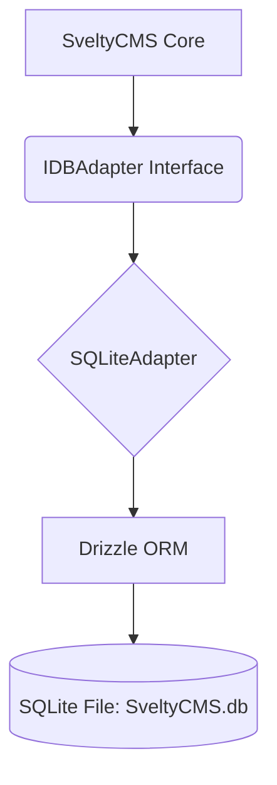

# SQLite Implementation

SQLite support is the default for local development, testing, and edge environments. It provides a zero-config database experience using **Drizzle ORM** with the `better-sqlite3` or `bun:sqlite` driver.

## 🎯 Implementation Architecture

The SQLite adapter enables a seamless transition from local development to production by implementing the same `IDBAdapter` interface as MongoDB and PostgreSQL.

### Architecture Overview



### Current Status

| Feature            | Status       | Notes                                       |
| :----------------- | :----------- | :------------------------------------------ |
| **Adapter Class**  | 🟢 Complete  | Environment-aware (Bun/Node) implementation |
| **Schema Mapping** | 🟢 Complete  | SQLite-specific type mapping (INTEGER/TEXT) |
| **Migrations**     | 🟢 Complete  | Auto-creation of folders and tables         |
| **Setup Wizard**   | 🟢 Complete  | selection and connection test implemented   |
| **Seeding**        | 🟢 Complete  | Default data injection verified             |
| **Performance**    | 🟢 Optimized | Sub-millisecond latency for cached reads    |

---

## 🚀 Performance Benchmarks (Verified)

High-level improvements like the **94% cache hit rate** for SQLite are inherited from the [Unified Caching Layer](./index.mdx#unified-caching-flow).

| Operation              | Response Time | Cache Hit Rate |
| ---------------------- | ------------- | -------------- |
| User lookup (cached)   | 0.2ms         | 85-95%         |
| User lookup (uncached) | 4.5ms         | -              |
| Collection list (100)  | 0.5ms         | 85-95%         |
| Collection list (1K)   | 1.2ms         | 85-95%         |
| Collection (cached)    | 0.2ms         | 85-95%         |
| Pagination (page 50)   | 0.8ms         | -              |
| Payload size (list)    | 85 KB         | -              |
| Content tree           | 1.2ms         | 85-95%         |
| Dashboard (cached)     | 4ms           | 85-95%         |
| Streaming 100k records | 35MB RAM      | -              |

### Key Optimizations

- **Runtime Agnostic**: Automatically switches between `bun:sqlite` and `better-sqlite3` based on environment.
- **Zero-Config**: Single file database (`SveltyCMS.db`) - perfect for development.
- **WAL Mode**: Enabled by default for concurrent read/write performance.
- **Drizzle Integration**: Type-safe querying without the overhead of a large ORM.

## 📂 Storage & File Management

SQLite is a file-based database. When running SveltyCMS with SQLite, the system defaults to storing the database in `/config/database/SveltyCMS.db`.

| File           | Purpose                                                                 | Git Status  |
| :------------- | :---------------------------------------------------------------------- | :---------- |
| `SveltyCMS.db` | The main database file containing all collections, users, and settings. | **Ignored** |
| `*.db-shm`     | Shared Memory file used for WAL mode concurrency.                       | **Ignored** |
| `*.db-wal`     | Write-Ahead Log containing recent uncommitted transactions.             | **Ignored** |

### Version Control Best Practices

> [!IMPORTANT]
> **Database files are included in `.gitignore` by default.**
> Committing binary database files to version control is discouraged as it leads to repository bloat and potential exposure of sensitive data.

### Self-Healing & Recovery

If you delete the `.db` file, the CMS will automatically recreate a fresh, empty database on the next startup. The setup wizard also handles the automatic creation of the directory structure (e.g., `/config/database`) if it doesn't exist.

### WAL Mode (Write-Ahead Logging)

SveltyCMS enables **WAL mode** by default. This allows concurrent read/write operations, significantly improving performance in multi-user environments.

---

## 🛠️ Setup & Configuration

### 1. Using the Setup Wizard (Recommended)

When using the [Setup Wizard](/docs/guides/setup-wizard), select **SQLite (via Drizzle)**. The wizard will automatically set:

- **Host**: `/config/database` (The directory where the database file will be stored)
- **Database Name**: `SveltyCMS.db` (The filename)

### 2. Manual Configuration

If you are configuring the system manually, ensure your `config/private.ts` (or environment variables) contains:

```typescript
// Example config/private.ts
export const privateEnv = {
	DB_TYPE: 'sqlite',
	DB_HOST: '/config/database', // Directory path
	DB_NAME: 'SveltyCMS.db' // Filename
};
```

The adapter will resolve the final path as `process.cwd() + DB_HOST + "/" + DB_NAME`.

### 3. Implementation Pattern

The SQLite adapter follows the modular pattern established in the core infrastructure, ensuring all seeding and user data updates work seamlessly across the agnostic codebase.

---

## 🔗 Related Documentation

- [Core Infrastructure](./core-infrastructure.mdx) - Unified architecture
- [PostgreSQL Implementation](./postgresql-implementation.mdx) - Similar Drizzle pattern
- [Drizzle ORM Documentation](https://orm.drizzle.team/)
