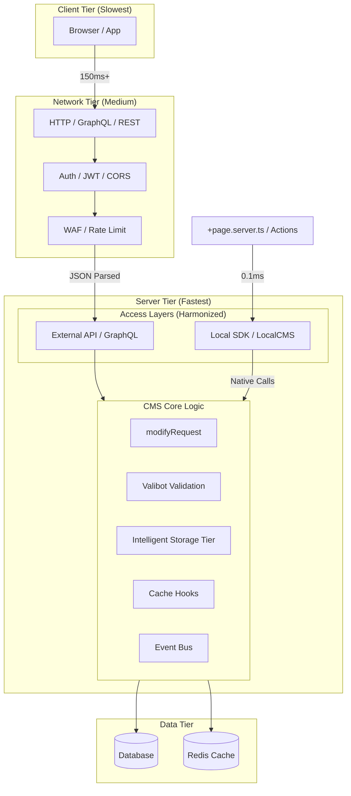

# Local SDK vs HTTP/GraphQL API

Both access patterns are derived from a single, **unified OpenAPI 3.1.0 contract**, ensuring 1:1 parity and maximum flexibility for any setup:

- **External HTTP / GraphQL API** — The secure, public-facing interface with the full middleware stack (auth, rate limiting, CORS, etc.). Now featuring **automated population** and real-time subscriptions.
- **Internal Local SDK** — A zero-overhead, server-side-only API for maximum performance in your SvelteKit backend code.

**Recommendation**: In all server-side code (`+page.server.ts`, actions, hooks, etc.), **prefer the Local SDK** unless you have a specific reason to test the full HTTP stack.



---

## When to Use Which

| Context                                 | Recommended                                            | Latency    | Reason                                                         |
| :-------------------------------------- | :----------------------------------------------------- | :--------- | :------------------------------------------------------------- |
| **Client-side** (`.svelte`, `+page.ts`) | **HTTP / [GraphQL API](../reference/api/graphql.mdx)** | 50–150 ms  | Browser environment; requires auth, CORS, and network.         |
| **Server-side** (`.server.ts`, actions) | **Local SDK**                                          | **0–5 ms** | Direct function calls; zero serialization or network overhead. |
| **Mobile / External App**               | **GraphQL**                                            | 80–300+ ms | Optimized data fetching with nested population.                |
| **Plugins / Background Jobs**           | **Local SDK**                                          | **0–5 ms** | Full access to core logic and security context.                |

> [!TIP]
> **Rule of thumb**: If your code runs server-side (files ending in `.server.ts` or inside `+server.ts` routes), use the Local SDK.
> Use **GraphQL** for external integrations that require complex nested data in a single request.

---

## Why the Local SDK Exists

The Local SDK (`src/services/sdk/index.ts` — the `LocalCMS` class) is a high-performance facade that:

1. **Eliminates overhead**: No network stack, JSON parsing, or serialization.
2. **Bypasses external security**: Safely skips WAF and rate-limiting because it runs with server privileges.
3. **Calls Core Logic**: Executes the exact same `modifyRequest` pipeline as the HTTP layer.
4. **Maintains Consistency**: Automatically triggers cache invalidation and real-time events (SSE).
5. **Unified Context**: Respects the same tenant isolation and permissions as the external API.

## Example: Local SDK Structure

The `cms` (LocalCMS) object provides a unified, typed interface to all system capabilities:

```typescript
// Content Management
await cms.collections.find("posts", { limit: 10 });
await cms.collections.create("posts", { title: "New" });
await cms.media.list({ folderId: "uploads" });

// Identity & Access
await cms.auth.listUsers({ tenantId });
await cms.websiteTokens.create({
  name: "API Key",
  permissions: ["content:read"],
  user,
  tenantId,
});

// System & Infrastructure
await cms.system.settings.getAll();
await cms.system.getHealth();
await cms.widgets.list();

// Collection Builder organizational tree (gui-save, manifest, SSE)
await cms.contentStructure.saveGuiStructure(
  [{ type: "move", node: { path: "/collection/posts", parentId: "cat-1" } }],
  { tenantId },
);

// Direct adapter access (escape hatch)
const raw = await cms.db.crud.findMany("posts", {}, { tenantId });
```

## Example: Data Loading in `+page.server.ts`

```typescript
import { LocalCMS } from "@src/services/sdk";
import { getDb } from "@src/databases/db";
import type { PageServerLoad } from "./$types";

export const load: PageServerLoad = async ({ locals }) => {
  const cms = new LocalCMS(getDb()!);
  const posts = await cms.collections.find("posts", {
    limit: 10,
    tenantId: locals.tenantId,
  });
  return { posts };
};
```

## Example: Bulk Operations

```typescript
// Collections namespace supports bulkCreate, bulkUpdate, bulkDelete
const result = await cms.collections.bulkCreate("products", largeDataArray, {
  tenantId,
});
```

---

## Technical Details

### Local SDK Guarantees

- Widget/request modification pipeline (`modifyRequest`) runs identically to HTTP requests.
- Cache hooks, invalidation, and version bumping happen automatically.
- Real-time updates (SSE / WebSocket) are triggered for connected clients.
- Multi-tenancy, user context, and permissions are applied consistently.
- **Media Intelligent Storage**: Shared deduplication and loop protection logic for all uploads via `cms.media.upload()`.
- **Bulk operations**: `cms.collections.bulkCreate()`, `bulkUpdate()`, `bulkDelete()` for high-throughput tasks.
- **Direct adapter access**: `cms.db` provides escape-hatch access to the raw `IDBAdapter` when the SDK namespace doesn't cover a needed operation.

### When You Might Still Use HTTP from Server Code

- Calling a completely external microservice or third-party API.
- Deliberately exercising the full external middleware (e.g., for testing or logging).
- Cross-origin or cross-instance communication.

---

## Best Practices

1. **Default to Local SDK** in every `.server.ts` file, server actions, and hooks.
2. **Avoid `fetch('/api/...')`** inside server code — it adds unnecessary latency and stack depth.
3. **Instantiate via `new LocalCMS(adapter)`** from `@src/services/sdk` for clean, typed access. The instance is lightweight and safe to create per-request.
4. **Use `cms.db`** when you need raw adapter access — e.g., `cms.db.system.websiteTokens.getByToken()`.

```

---

## Related

- [API Reference](./index.mdx)
- [Getting Started](../getting-started.mdx)
```
